# Session 19: Cloud & Terraform in Action

An end-to-end AWS infrastructure project built with Terraform, following the suggested architecture **VPC → Subnet → Security Group → EC2 → S3**. It adds an Internet Gateway, a route table, an IAM role, and an nginx website that the EC2 instance downloads from S3 at boot.

> **Run against LocalStack, not real AWS.** I don't have an AWS account, so `plan`/`apply`/`destroy` ran against **LocalStack Community 4.9.2** (a local AWS API emulator in Docker), using `tflocal` and `awslocal`. The Terraform code is standard AWS code. With an account you run the same commands with `terraform` / `aws`.
>
> What LocalStack can and can't show: VPC, subnet, IGW, route table, security group, IAM, S3 and the EC2 *API objects* are all really created and queryable. EC2 is **emulated**, though: no VM boots, the "public IP" is fake, and the user-data script (nginx) never runs. So the website itself can't be opened. On real AWS, `website_url` would serve the page from `templates/index.html.tftpl`.
>
> As in Session 18, the AWS provider is pinned to `~> 5.0`, because provider v6 needs an S3 Control API that LocalStack Community doesn't implement.

All screenshots in [`screenshots/`](screenshots/) are real terminal captures.

## Architecture

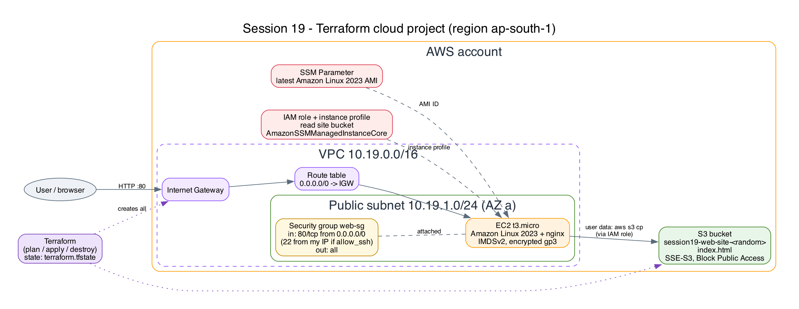

Source: [docs/architecture.dot](docs/architecture.dot) (Graphviz).

```text
Terraform
    |
    ├── VPC 10.19.0.0/16 ─── Internet Gateway
    |      └── Public subnet 10.19.1.0/24 (AZ a) ── route table 0.0.0.0/0 → IGW
    |
    ├── Security Group: 80/tcp from anywhere (22 only from my IP, off by default)
    |
    ├── EC2 t3.micro (Amazon Linux 2023, IMDSv2, encrypted gp3)
    |      └── user data: install nginx, download index.html from S3
    |
    ├── IAM role + instance profile: read the site bucket + SSM Session Manager
    |
    └── S3 bucket (private, SSE-S3) with index.html
```

## Files

| File | Contents |
|---|---|
| [versions.tf](versions.tf) | `terraform {}` block: required Terraform version and **providers** (aws, random, http) |
| [providers.tf](providers.tf) | AWS **provider** config: region + `default_tags` on every resource |
| [variables.tf](variables.tf) | **Variables**: region, project, owner, CIDRs, instance type, `allow_ssh` |
| [terraform.tfvars](terraform.tfvars) | Variable values (no secrets) |
| [data.tf](data.tf) | **Data sources**: AZs, latest AL2023 AMI from SSM Parameter Store, my public IP |
| [network.tf](network.tf) | **Resources**: VPC, IGW, subnet, route table + association, security group + rules |
| [storage.tf](storage.tf) | S3 bucket, public access block, encryption, `index.html` object |
| [iam.tf](iam.tf) | IAM role, inline S3 read policy, SSM policy attachment, instance profile |
| [compute.tf](compute.tf) | EC2 instance with user data and an explicit `depends_on` |
| [outputs.tf](outputs.tf) | **Outputs**: IDs, public IP, website URL, bucket, SSM connect command |
| [templates/](templates/) | `user-data.sh.tftpl`, `index.html.tftpl` (rendered with `templatefile()`) |

## Terraform concepts demonstrated

| Concept | Where |
|---|---|
| **Providers** | `aws` (with `default_tags`), `random` (unique bucket suffix), `http` (detect my IP) |
| **Variables** | typed variables with defaults, values in `terraform.tfvars`, `count = var.allow_ssh ? 1 : 0` |
| **Resources** | 18 resources across networking, storage, IAM and compute |
| **Data sources** | `aws_availability_zones`, `aws_ssm_parameter` (AMI), `aws_iam_policy_document`, `http` |
| **Outputs** | 8 outputs, including the computed `website_url` |
| **Dependencies** | *Implicit*: `aws_subnet.public` → `aws_vpc.main.id`; `aws_instance.web` → subnet, SG, instance profile, AMI. *Explicit*: `depends_on = [aws_s3_object.index, aws_route_table_association.public, aws_iam_role_policy.read_site]`, because the instance needs the page in S3, a route to the internet and S3 permission *before* user data runs, and nothing in its arguments references those. |
| **State** | `terraform.tfstate` records every resource and its attributes. `terraform state list/show` reads it; `destroy` uses it to know what to delete |
| **Functions / templates** | `templatefile()`, `chomp()`, string interpolation |

Security choices: no SSH port by default (SSM Session Manager instead), IMDSv2 required, encrypted root volume, private S3 bucket with encryption, an IAM role scoped to one bucket, and no credentials anywhere in the code.

---

## Workflow and screenshots

### Files and configuration

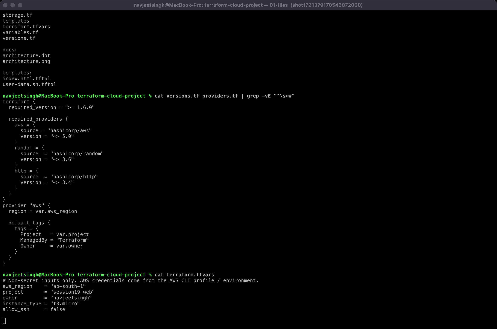

### `terraform init`

Installs `hashicorp/aws` v5.100.0, `random` and `http`, and creates `.terraform.lock.hcl`:

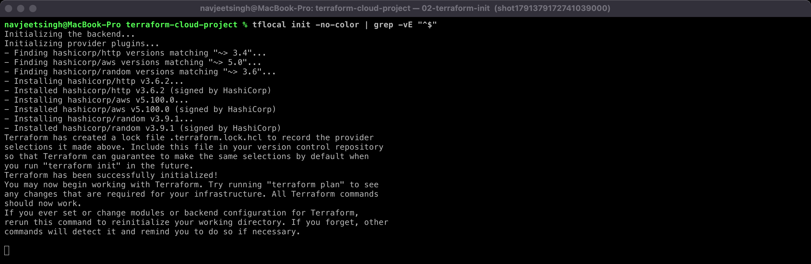

### `terraform fmt` + `terraform validate`

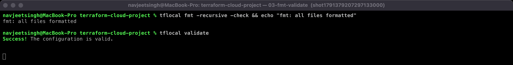

### `terraform plan`

**18 to add**. The data sources are read during the plan (`will be read`):

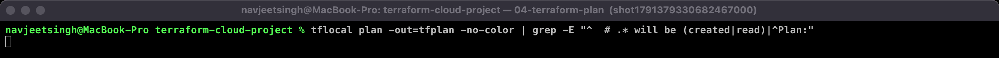

### `terraform apply`

Terraform creates resources in parallel where it can and in dependency order where it must: VPC → IGW / subnet / SG → route table → association → … → EC2 last. **Apply complete! Resources: 18 added.**

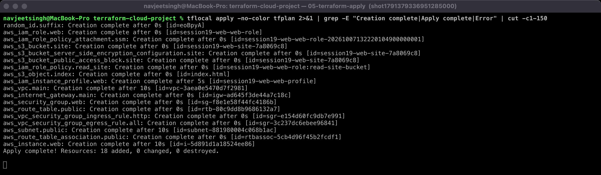

### Outputs

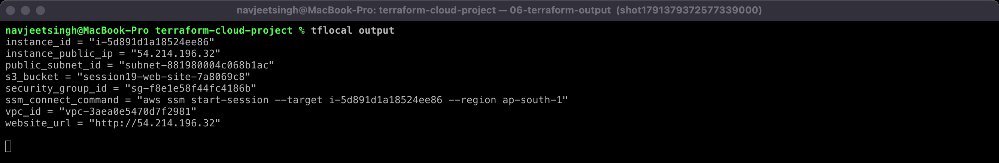

### Terraform state

`state list` shows all 18 managed resources plus the data sources. `state show` displays the EC2 instance's attributes (AMI from SSM, `t3.micro`, subnet, SG, instance profile, IPs), and `terraform.tfstate` records serial, version and resource count:

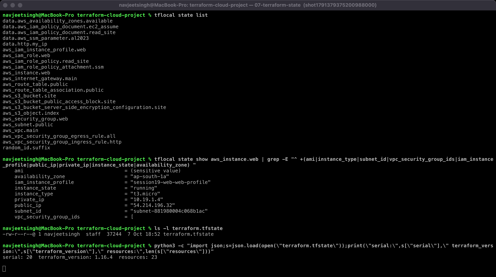

### The AWS resources (verified with the AWS CLI)

VPC `10.19.0.0/16`, subnet `10.19.1.0/24` in `ap-south-1a` with public IPs on launch, IGW `attached`, route table with `0.0.0.0/0 → igw-…`, and a security group allowing only `tcp/80`:

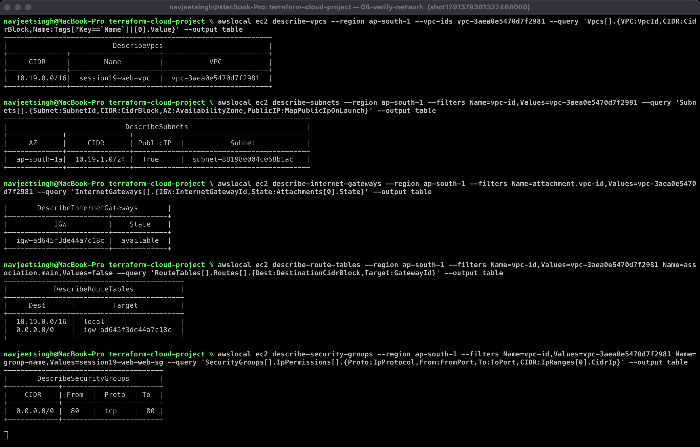

EC2 `t3.micro` `running` with private IP `10.19.1.4` and the instance profile; the S3 bucket containing `index.html`; the IAM role with `AmazonSSMManagedInstanceCore` + the `ReadSiteBucket` inline policy:

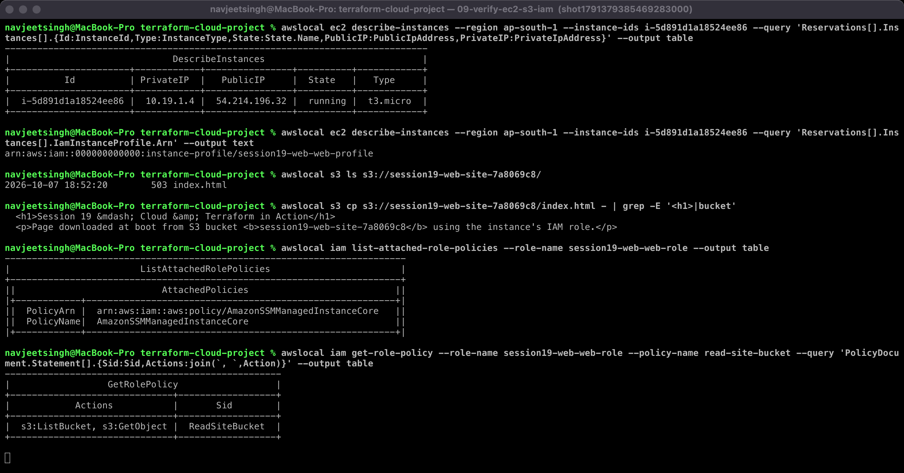

### Dependencies (`terraform graph`)

`terraform graph` exports the dependency graph that Terraform uses to order operations. Filtered to resources and data sources, it has 27 edges. For example, `aws_instance.web` depends on the instance profile, the role policy, the route table association, the S3 object, the security group and the AMI parameter:

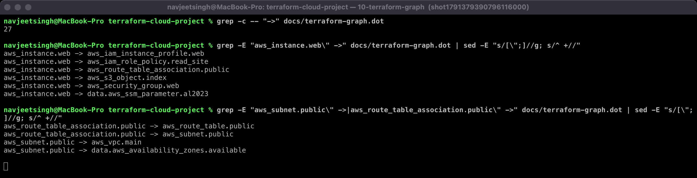

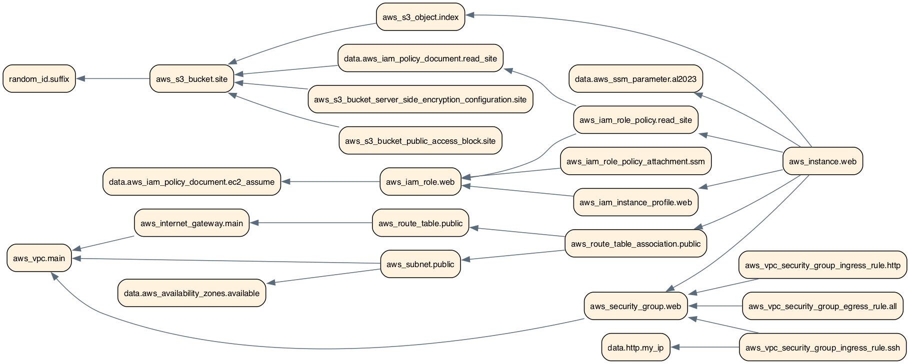

### `terraform destroy`

Everything is deleted in reverse dependency order (instance first, VPC last). **Destroy complete! Resources: 18 destroyed**, nothing left in state, and no tagged VPCs or running instances remain:

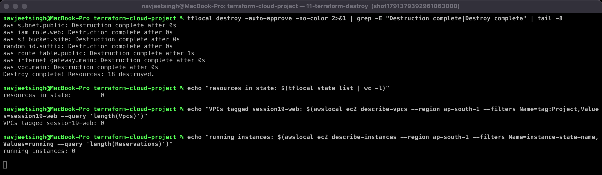

## Commands

```bash
docker run -d --name localstack -p 4566:4566 -e SERVICES=s3,s3control,ec2,iam,sts,ssm localstack/localstack:4.9
pip install terraform-local awscli-local awscli

tflocal init
tflocal fmt -recursive
tflocal validate
tflocal plan -out=tfplan
tflocal apply tfplan
tflocal output
tflocal state list
tflocal graph | dot -Tpng > graph.png
tflocal destroy -auto-approve
```

On real AWS: replace `tflocal` with `terraform`, configure credentials with `aws configure`, and open `terraform output -raw website_url` in a browser.
