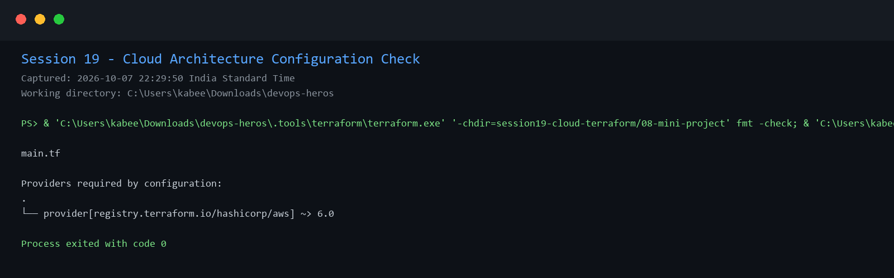

# Session 19: Cloud and Terraform in Action

## Homework project

The end-to-end Terraform project is in `08-mini-project/` and models:

```text
VPC -> public subnet -> route table + internet gateway -> security group -> EC2 web server
                                                               |
                                                               -> encrypted, versioned S3 bucket
```

It uses input variables, AWS provider configuration, resource dependencies, outputs, and tags. The EC2 AMI is resolved from the public AWS Systems Manager parameter for Amazon Linux 2023. The S3 bucket enables versioning, SSE-S3 encryption, and all public-access blocks.

## Evidence



`terraform fmt -check` and `terraform providers` were run locally. No `terraform plan`, `apply`, or `destroy` was run because this workspace has no AWS credentials or approved cloud account target.

## Safe workflow

```bash
cd 08-mini-project
terraform init
terraform plan
terraform apply
# verify outputs
terraform destroy
```