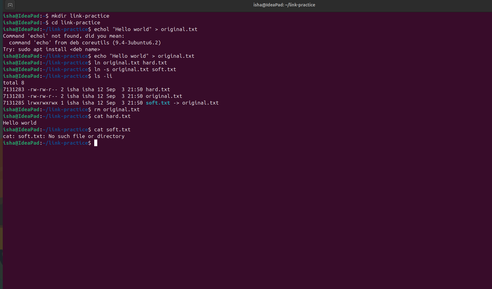

# Task 1: Soft Link & Hard Link

## 1. Hard Link

A **hard link** is another directory entry that points to the **same inode** as the original file.

Both the original file and the hard link refer to the same underlying data.

### Create a Hard Link

```bash
ln original.txt hard.txt
```

### Check the Inodes

```bash
ls -li
```

Example:

```text
12345 -rw-r--r-- 2 user user 15 Sep 3  original.txt
12345 -rw-r--r-- 2 user user 15 Sep 3  hard.txt
```

Notice that both files have the **same inode number**.

### Delete a Hard Link

```bash
rm hard.txt
```

Deleting the hard link does not delete the original file.

Even if the original filename is deleted, the hard link can still access the data:

```bash
rm original.txt
cat hard.txt
```

The data is still available through `hard.txt`.

---

## 2. Soft Link

A **soft link**, also called a **symbolic link**, is a separate file that points to the **path of another file**.

It works similarly to a shortcut.

### Create a Soft Link

```bash
ln -s original.txt soft.txt
```

### Check the Soft Link

```bash
ls -l
```

Example:

```text
original.txt
soft.txt -> original.txt
```

### Delete a Soft Link

```bash
rm soft.txt
```

Deleting the soft link does not delete the original file.

However, if the original file is deleted:

```bash
rm original.txt
```

the soft link becomes a **broken/dangling link**.

---

## 3. Hard Link vs Soft Link

| Feature                             | Hard Link          | Soft Link             |
| ----------------------------------- | ------------------ | --------------------- |
| Command                             | `ln original hard` | `ln -s original soft` |
| Points to                           | Inode              | File path             |
| Same inode as original              | Yes                | No                    |
| Survives original filename deletion | Yes                | No                    |
| Can become broken                   | No                 | Yes                   |
| Can cross filesystems               | No                 | Yes                   |
| Can normally link directories       | No                 | Yes                   |
| Works like a shortcut               | No                 | Yes                   |

---

## 4. Practical Demonstration

### Step 1: Create a directory

```bash
mkdir link-practice
cd link-practice
```

### Step 2: Create an original file

```bash
echo "Hello Linux" > original.txt
```

### Step 3: Create a hard link

```bash
ln original.txt hard.txt
```

### Step 4: Create a soft link

```bash
ln -s original.txt soft.txt
```

### Step 5: Check the links

```bash
ls -li
```

You should observe:

* `original.txt` and `hard.txt` have the same inode number.
* `soft.txt` has a different inode number.
* `soft.txt` displays `-> original.txt`.

### Step 6: Read all files

```bash
cat original.txt
cat hard.txt
cat soft.txt
```

All three should initially display:

```text
Hello Linux
```

### Step 7: Delete the original file

```bash
rm original.txt
```

Now test:

```bash
cat hard.txt
```

The hard link still works.

But:

```bash
cat soft.txt
```

will fail because the file pointed to by the symbolic link no longer exists.

---

## 5. Key Concept: Inode

An **inode** is a data structure used by Linux to store information about a file, such as:

* File permissions
* Owner
* File size
* Timestamps
* Location of the file's data

A filename itself is essentially a directory entry that maps a name to an inode.

### Hard Link

```text
original.txt ──┐
               ├──> Same Inode ──> File Data
hard.txt ──────┘
```

### Soft Link

```text
soft.txt ──> Path: original.txt ──> Inode ──> File Data
```

This is the fundamental reason hard links and soft links behave differently when the original file is deleted.

---

## 6. Important Commands

### Create hard link

```bash
ln original.txt hard.txt
```

### Create soft link

```bash
ln -s original.txt soft.txt
```

### View inode numbers

```bash
ls -li
```

### View symbolic link target

```bash
ls -l
```

### Delete a link

```bash
rm link_name
```

---

## 7. Interview Questions

### Q1. What is a hard link?

A hard link is another directory entry that points to the same inode as the original file.

### Q2. What is a soft link?

A soft link is a separate file that stores a reference to the path of another file.

### Q3. What happens when the original file of a hard link is deleted?

The hard link continues to work because it points directly to the same inode. The data is removed only when there are no remaining hard links referencing that inode.

### Q4. What happens when the target of a soft link is deleted?

The symbolic link becomes a broken or dangling link because its target path no longer exists.

### Q5. How do you create a hard link?

```bash
ln original.txt hard.txt
```

### Q6. How do you create a soft link?

```bash
ln -s original.txt soft.txt
```

### Q7. How can you check whether two files have the same inode?

```bash
ls -li
```

If they have the same inode number, they are hard links to the same file data.

---

