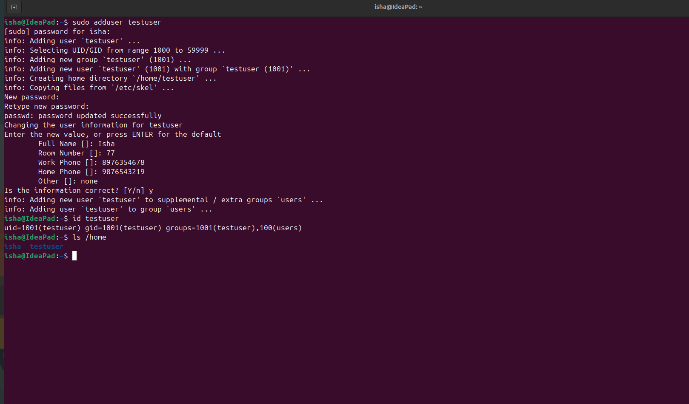

# Task 2: `adduser` vs `useradd`


## 1. What is User Management?

Linux is a multi-user operating system. Each user account has its own:

* Username
* User ID (UID)
* Home directory
* Login shell
* Password
* Group memberships
* Permissions

Linux provides commands such as `adduser` and `useradd` to create user accounts.

---

# 2. `useradd`

`useradd` is a **low-level command** used to create a new user account.

### Basic Syntax

```bash
useradd [options] username
```

### Example

```bash
sudo useradd testuser
```

This creates the user account `testuser`.

However, depending on the system configuration and options used, additional setup may be required.

For example, to create a home directory and specify the Bash shell:

```bash
sudo useradd -m -s /bin/bash testuser
```

Here:

```text
-m             Create the user's home directory
-s /bin/bash   Set Bash as the user's login shell
```

A password can then be created using:

```bash
sudo passwd testuser
```

---

# 3. `adduser`

`adduser` is a **higher-level, more user-friendly utility** commonly used on Debian and Ubuntu systems.

### Basic Syntax

```bash
sudo adduser username
```

### Example

```bash
sudo adduser testuser
```

It interactively asks for information such as:

```text
New password:
Retype new password:
Full Name:
Room Number:
Work Phone:
Home Phone:
Other:
```

It also handles common account setup tasks such as creating the user's home directory and setting the password.

---

# 4. Difference Between `adduser` and `useradd`

| Feature             | `adduser`                              | `useradd`                                    |
| ------------------- | -------------------------------------- | -------------------------------------------- |
| Type                | High-level utility                     | Low-level utility                            |
| Ease of use         | Easy and interactive                   | More manual                                  |
| Home directory      | Usually handled automatically          | Use `-m`                                     |
| Password setup      | Interactive                            | Usually separate                             |
| Shell configuration | Handles common defaults                | Can be specified with `-s`                   |
| Common usage        | Interactive user creation              | Scripts/automation and precise configuration |
| Ubuntu/Debian       | Commonly preferred for interactive use | Available                                    |
| Portability         | More distribution-specific             | More widely available                        |

---

# 5. Which Command Should Be Used on Ubuntu?

For **interactive user creation on Ubuntu**, `adduser` is generally preferred because it provides a more convenient and guided process.

Example:

```bash
sudo adduser testuser
```

For scripting, automation, or situations where precise control over account creation is required, `useradd` can be more appropriate.

---

# 6. Practical Demonstration

## Step 1: Create a Test User

Use the recommended command on Ubuntu:

```bash
sudo adduser testuser
```

Enter a password when prompted.

You can leave optional information blank by pressing `Enter`.

At the final confirmation prompt, enter:

```text
Y
```

---

## Step 2: Verify the User

Check whether the user exists:

```bash
id testuser
```

Example:

```text
uid=1001(testuser) gid=1001(testuser) groups=1001(testuser)
```

The exact UID/GID values may be different on your system.

---

## Step 3: Check the Home Directory

Run:

```bash
ls -ld /home/testuser
```

You should see that the user's home directory exists.

You can also check:

```bash
ls /home
```

Expected output will contain:

```text
testuser
```

---

## Step 4: Check User Information

You can use:

```bash
getent passwd testuser
```

---

