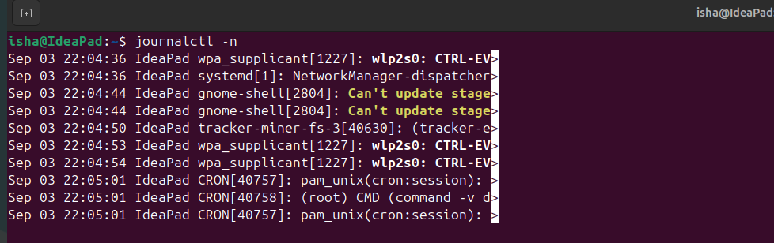
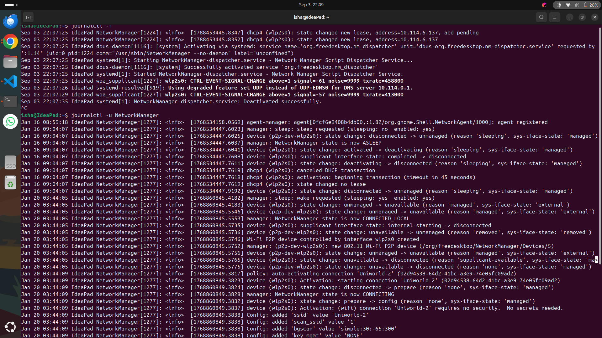
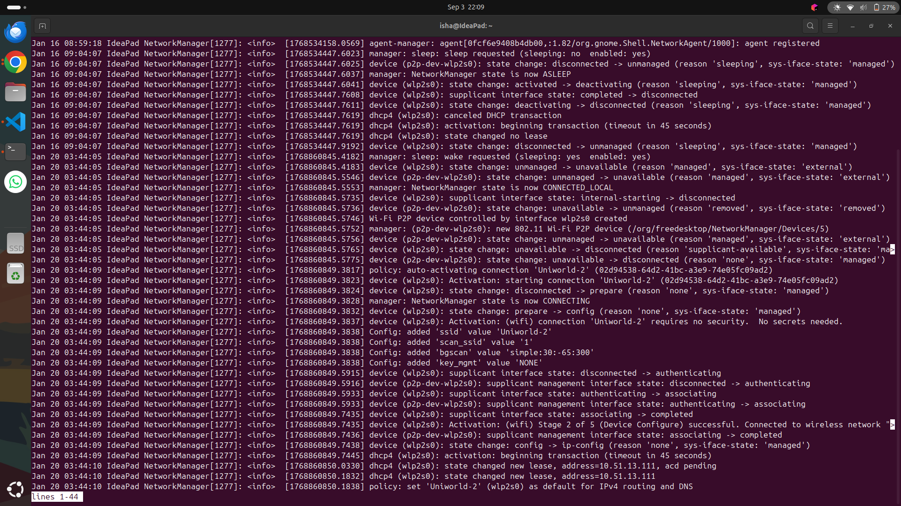
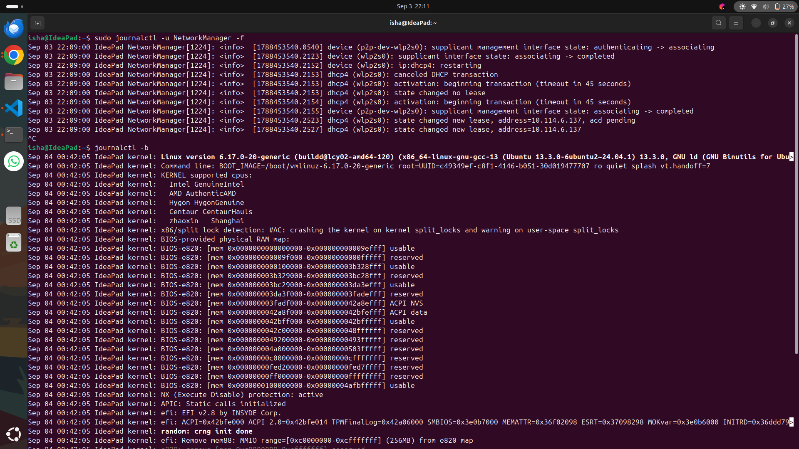
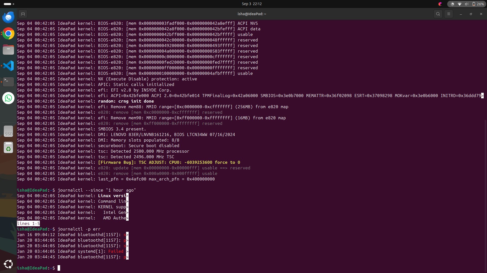

# Task 3: `journalctl`

# 1. What is `journalctl`?

`journalctl` is a Linux command used to **view and analyze logs collected by `systemd-journald`**.

Linux services and system components generate logs that can help us understand:

* System errors
* Service failures
* Boot problems
* Authentication events
* Application errors
* Hardware or system issues
* Service activity

The `journalctl` command allows us to search and filter these logs.

### Basic Syntax

```bash
journalctl
```

---

# 2. View All Logs

To display the available journal logs:

```bash
journalctl
```

This may produce a large amount of output.

For easier viewing, you can use:

```bash
journalctl | less
```

Press:

```text
q
```

to exit `less`.

---

# 3. View Recent Logs

To view the most recent log entries:

```bash
journalctl -n
```

By default, this shows the latest entries.

To view a specific number of entries:

```bash
journalctl -n 20
```

This displays the last 20 log entries.

For example:

```bash
journalctl -n 50
```

displays the last 50 entries.

---



# 4. Follow Logs in Real Time

The `-f` option allows you to continuously monitor new log entries.

```bash
journalctl -f
```

This is useful when troubleshooting a running application or service.

New log messages will appear as they are generated.

Press:

```text
Ctrl + C
```

to stop following the logs.

---

# 5. View Logs for a Specific Service

One of the most useful features of `journalctl` is viewing logs belonging to a particular systemd service.

### Syntax

```bash
journalctl -u SERVICE_NAME
```

The `-u` option means **unit**.

---




# 6. Follow a Service's Logs

To monitor a service in real time:

```bash
sudo journalctl -u ssh -f
```

This is particularly useful when troubleshooting services.

For example, if you restart the service in another terminal:

```bash
sudo systemctl restart ssh
```

you can observe the resulting log entries using:

```bash
sudo journalctl -u ssh -f
```

---


# 7. View Logs Since the Current Boot

The `-b` option displays logs from the current system boot.

```bash
journalctl -b
```

This is useful for investigating problems that occurred during startup.

### Previous Boot

To view logs from the previous boot:

```bash
journalctl -b -1
```

You can list available boots using:

```bash
journalctl --list-boots
```

---




9. Filter Logs by Time

You can use --since to view logs starting from a specific time.

Last hour
journalctl --since "1 hour ago"
Since a specific date/time
journalctl --since "2026-09-03 20:00:00"

You can also specify an ending time:

journalctl --since "20:00" --until "21:00"

This is useful when you know approximately when a problem occurred.

---

# 10. View Error Logs

To display error-level messages:

```bash
journalctl -p err
```

You can combine this with `-n`:

```bash
journalctl -p err -n 20
```

This shows the most recent error messages.


