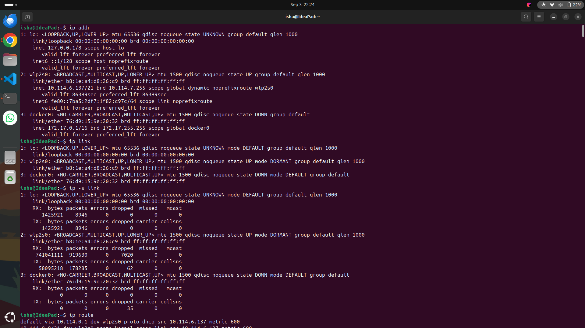
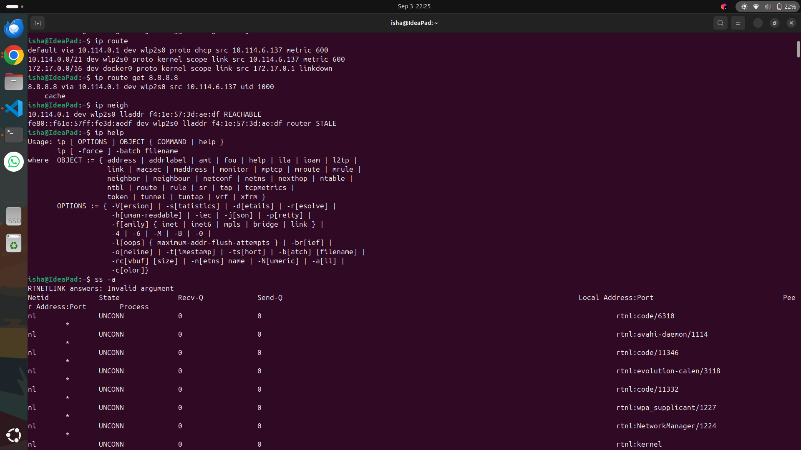
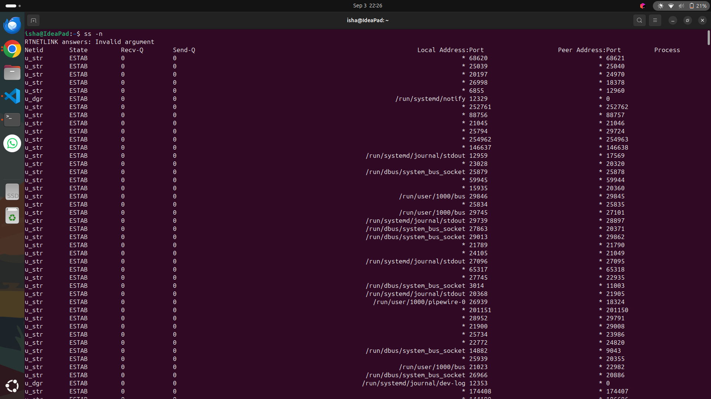
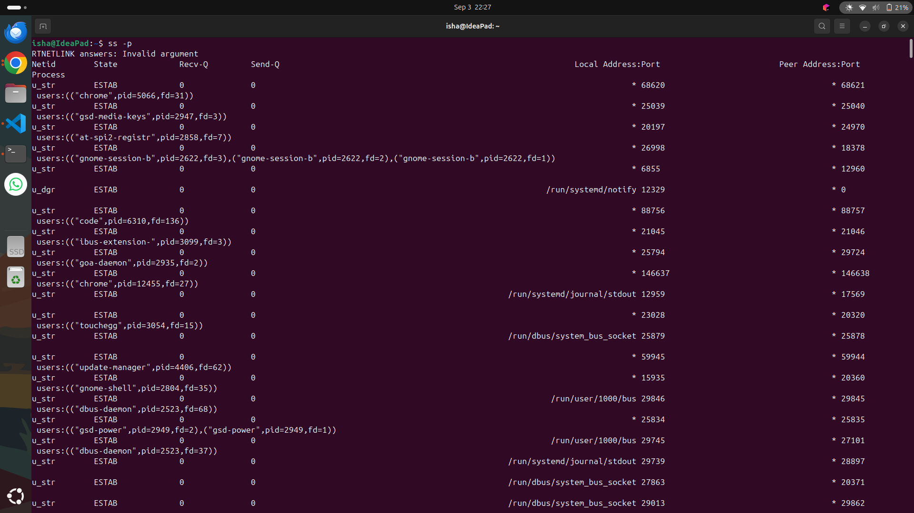
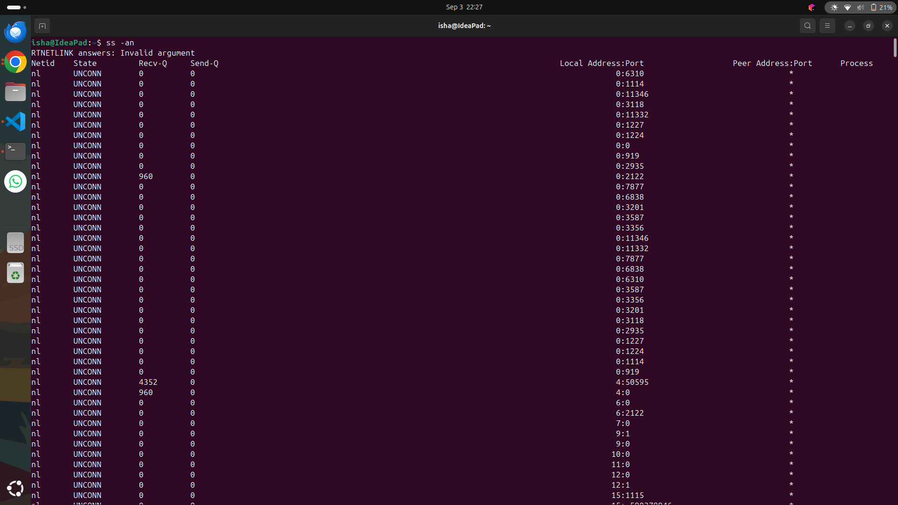
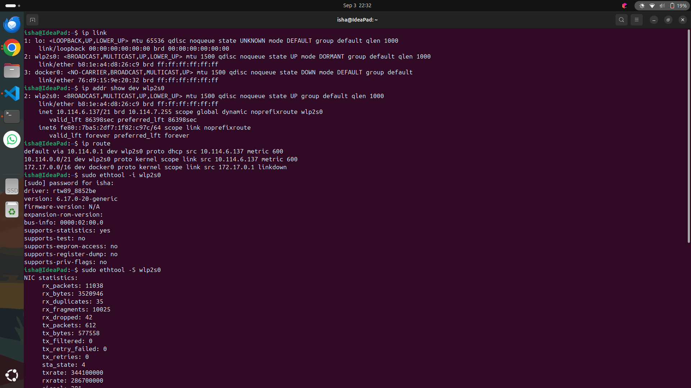
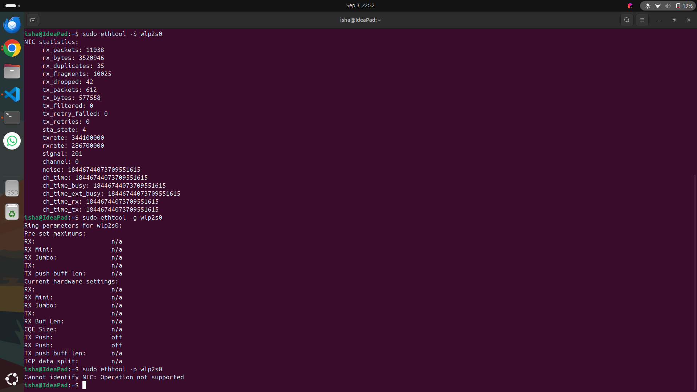
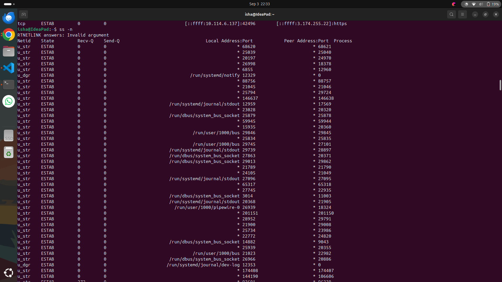
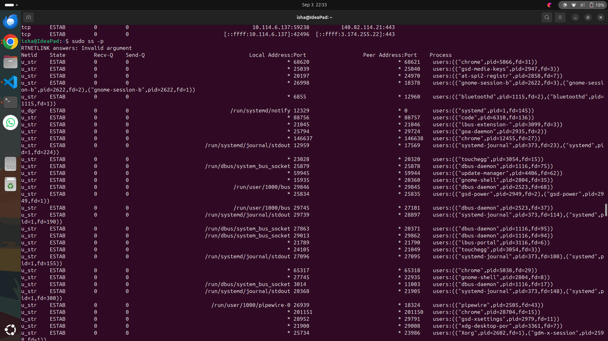

Linux Networking Command Practice

Overview

This task focuses on practicing essential Linux networking commands using the ip command and related networking utilities. The commands are used to inspect network interfaces, IP addresses, routing tables, neighbour/ARP information, sockets, and network hardware.

Objectives
Learn how to view IP addresses and network interfaces.
Understand basic routing information.
View the neighbour/ARP table.
Inspect network interface statistics.
Practice using ss to view network sockets.
Learn basic arping and ethtool commands.
Understand modern iproute2 commands compared with older net-tools commands.
Commands Practiced
IP Addresses and Interfaces
ip addr
ip link
ip -s link
ip addr show dev <interface>
ip link show dev <interface>
Routing
ip route
ip route get 8.8.8.8
Neighbour / ARP
ip neigh
ip neigh show dev <interface>
Multicast
ip maddr
ip maddr show dev <interface>
Socket Information
ss -a
ss -e
ss -o
ss -n
ss -p
ss -an
sudo ss -anp
Network Hardware
sudo ethtool -i <interface>
sudo ethtool -g <interface>
sudo ethtool -S <interface>
ARP Testing
arping -I <interface> <IP-address>

The above commands cover the main query and networking utilities listed in the provided cheat sheet.

Old vs Modern Commands

The cheat sheet also provides modern alternatives to commonly used net-tools commands:

Older Command	Modern Command
ifconfig -a	ip addr
route	ip route
arp -a	ip neigh
netstat	ss
ifconfig eth0 up	ip link set eth0 up
ifconfig eth0 down	ip link set eth0 down

Important Note

Commands such as ip addr add, ip addr del, ip link set ... down, and route modification commands can change the system's network configuration. They should only be executed when the interface and network settings are understood.