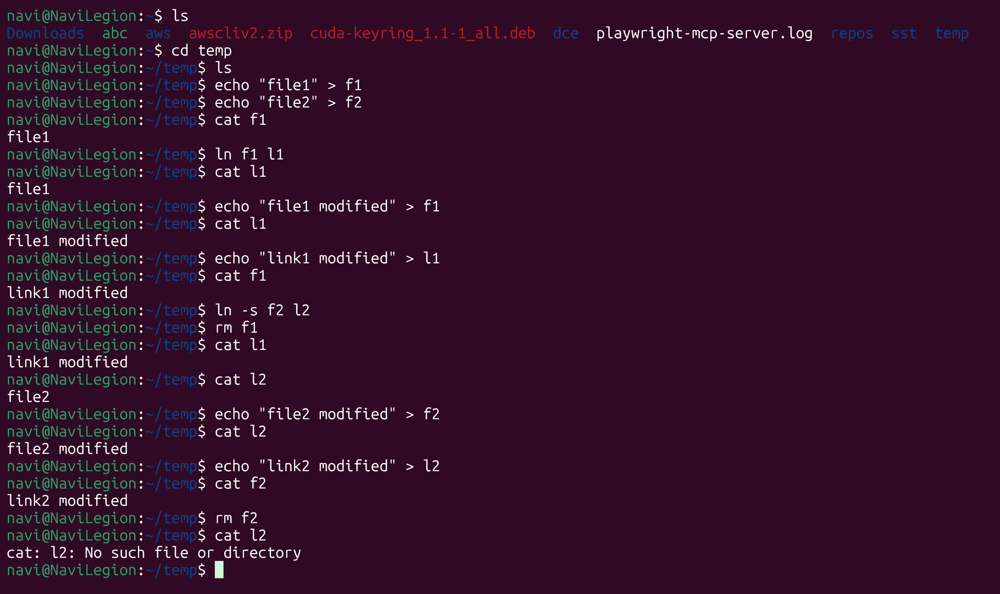
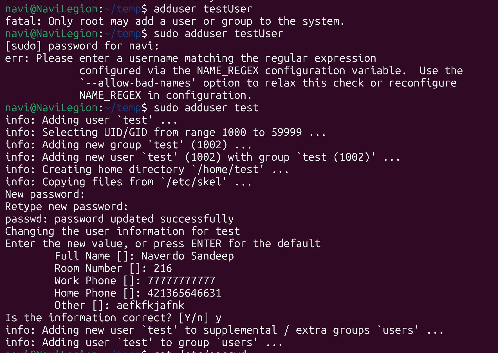
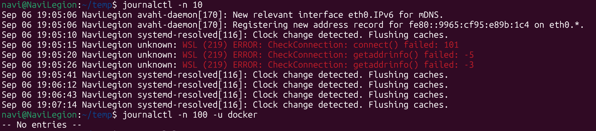
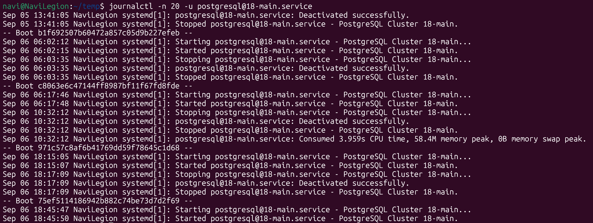

# Linux Homework Tasks

## Task 1: Soft Link & Hard Link

- #### Learn the difference between soft links and hard links.
  
    Suppose we have a file a.txt. Internally in linux a.txt points to an inode say x which then points to the physical location on disk.  
  
    When we create a hard link of a.txt as b.txt then b.txt also points to the same inode. Hence if we modify a.txt then it will also reflect in b.txt but if we delete a.txt then b.txt will still exist as the inode still exists.  
  
    When we create a soft link of a.txt as b.txt then b.txt points to a.txt (like a pointer in cpp). Hence modifying a.txt will reflect in b.txt as well but deleting a.txt will make b.txt a dangling file and trying to open it will produce an error `No such file or directory`

- #### Learn the commands to create both.

    Hard link: ln file1 file2
    Soft link: ln -s file1 file2

- #### Practice creating and deleting soft and hard links.
  
  

## Task 2: adduser vs useradd

- #### Learn the difference between adduser and useradd.

    useradd is the default commmand in the linux kernel to add a user. It doesnt create a home directory by default nor does it add any other user information.  

    adduser is an updated command especially on debian based distros that opens an interactive shell that asks all user information. This allows to add a user in a more user friendly way. It sets up the home directory, password, adds user to group, takes name, email, phone number etc and copies default configuration files to that user

- #### Understand which command is preferred on Ubuntu/Linux and why

    On ubuntu adduser is preferred as it provides a more complete user setup. However while shell scripting it may be preffered to use the useradd command to get more specific and non intrusive output

- #### Create a test user using the recommended command

    

## Task 3: journalctl

- #### Learn what journalctl is used for

    Journalctl is used to view system logs

- #### Learn how to view system and service logs using journalctl

    `journalctl` opens all system logs
    Flags: `-u service` shows logs for that specific service.  
        `f` follows logs in real time.  
        `-b` Shows only logss from current boot.  
        `-p` Shows sys errors.  
        `-n count` shows last n entries.
        `_PID=ID` shows logs for a specific program id.  

- #### Practice checking logs for a specific service

    
    

## Task 4: Linux Command Cheat Sheet

- Review the Linux command cheat sheet.
- Practice the important commands covered in the cheat sheet.
- Understand the purpose and basic usage of each command.

DONE