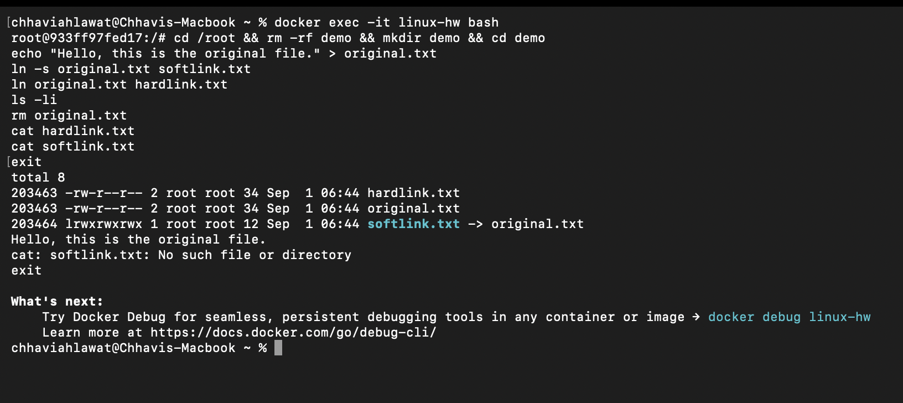
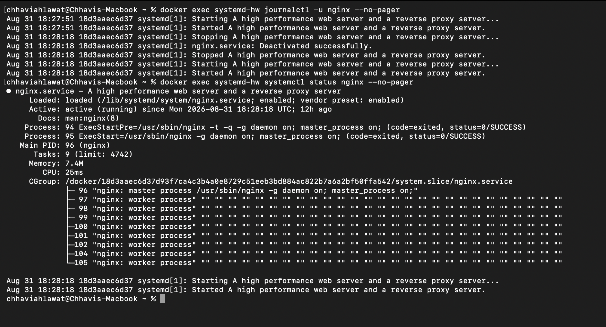

# Session 2 — Linux Fundamentals (Homework)

**Name:** Chhavi Ahlawat
**Enrollment Number:** 24BCS10201
**Email:** chhavi.24bcs10201@sst.scaler.com

All commands below were executed on **Ubuntu 22.04** and the output shown is the real
output captured from the terminal.

---

## Table of Contents
1. [Task 1 — Soft Link & Hard Link](#task-1--soft-link--hard-link)
2. [Task 2 — `adduser` vs `useradd`](#task-2--adduser-vs-useradd)
3. [Task 3 — `journalctl`](#task-3--journalctl)
4. [Task 4 — Linux Command Cheat Sheet](#task-4--linux-command-cheat-sheet)
5. [Interview Questions & Answers](#interview-questions--answers)

---

# Task 1 — Soft Link & Hard Link

## What is a link?

Every file on Linux is really two things:

- an **inode** — the actual metadata + pointer to the data blocks on disk
- a **name** in a directory that points to that inode

A "link" is just another *name* pointing at data. There are two kinds.

| | **Hard Link** | **Soft Link (Symbolic Link)** |
|---|---|---|
| Command | `ln original.txt hardlink.txt` | `ln -s original.txt softlink.txt` |
| What it points to | The **inode** (the data itself) | The **path/name** of the original file |
| Inode number | **Same** as the original | **Different** from the original |
| Delete the original | Link still works — data survives | Link **breaks** (dangling link) |
| Across filesystems/partitions | ❌ Not allowed | ✅ Allowed |
| Link to a directory | ❌ Not allowed (normal users) | ✅ Allowed |
| File size | Same as original | Size of the stored path string |
| `ls -l` first character | `-` (normal file) | `l` (link) |
| Analogy | A second front door to the same house | A signpost saying "the house is that way" |

---

## Commands and real output

### 1. Create the original file

```bash
echo "Hello, this is the original file." > original.txt
cat original.txt
```

```
Hello, this is the original file.
```

### 2. Create a SOFT link

```bash
ln -s original.txt softlink.txt
```

### 3. Create a HARD link

```bash
ln original.txt hardlink.txt
```

### 4. List with `ls -li` (the `-i` flag shows the inode number)

```bash
ls -li
```

```
total 8
31650 -rw-r--r-- 2 root root 34 Aug 31 18:25 hardlink.txt
31650 -rw-r--r-- 2 root root 34 Aug 31 18:25 original.txt
31652 lrwxrwxrwx 1 root root 12 Aug 31 18:25 softlink.txt -> original.txt
```

**Read this output carefully — it proves everything:**

- `original.txt` and `hardlink.txt` both show inode **31650** → they are the *same file*.
- `softlink.txt` shows inode **31652** → it is a *different file* on disk.
- The link count column shows **2** for the hard-linked pair and **1** for the soft link.
- The soft link's permissions start with **`l`** and `ls` prints the arrow `-> original.txt`.
- The soft link is only **12 bytes** — exactly the length of the string `original.txt`.

### 5. Compare with `stat`

```bash
stat -c "%n -> inode %i, links %h, size %s bytes" original.txt hardlink.txt softlink.txt
```

```
original.txt -> inode 31650, links 2, size 34 bytes
hardlink.txt -> inode 31650, links 2, size 34 bytes
softlink.txt -> inode 31652, links 1, size 12 bytes
```

### 6. Edit through the hard link — the original changes too

```bash
echo "Line added through hardlink." >> hardlink.txt
cat original.txt
```

```
Hello, this is the original file.
Line added through hardlink.
```

They are literally the same data, so writing through either name is the same write.

### 7. Now DELETE the original file

```bash
rm original.txt
ls -li
```

```
total 4
31650 -rw-r--r-- 1 root root 63 Aug 31 18:26 hardlink.txt
31652 lrwxrwxrwx 1 root root 12 Aug 31 18:25 softlink.txt -> original.txt
```

Notice the hard link's link count dropped from `2` to `1`.

### 8. Read the HARD link after deleting the original — still works ✅

```bash
cat hardlink.txt
```

```
Hello, this is the original file.
Line added through hardlink.
```

The data is still there. `rm` only removed *one name*; the inode had another name pointing
at it, so the data was never freed.

### 9. Read the SOFT link after deleting the original — broken ❌

```bash
cat softlink.txt
```

```
cat: softlink.txt: No such file or directory
```

The soft link still points at the *path* `original.txt`, but nothing is at that path
anymore. This is called a **dangling** or **broken** symlink.

### 10. Deleting links

```bash
rm softlink.txt hardlink.txt
ls -la
```

```
total 8
drwxr-xr-x 2 root root 4096 Aug 31 18:26 .
drwx------ 1 root root 4096 Aug 31 18:25 ..
```

### 📸 Screenshot — the full link demo in the terminal



Read the inode column (the first one) in the screenshot:

- `hardlink.txt` and `original.txt` both show inode **`203463`** — the *same* file
- `softlink.txt` shows inode **`203464`** and the `-> original.txt` arrow
- the link count is **`2`** for the hard-linked pair, **`1`** for the symlink
- after `rm original.txt`: `cat hardlink.txt` prints the text, `cat softlink.txt` fails with
  `No such file or directory`

> The inode numbers here (`203463`/`203464`) differ from the ones earlier in this document
> because they were captured in a separate run. **Inode numbers are assigned by the
> filesystem per file, so they are different every time you recreate the files** — what
> matters is that the hard link *shares* the original's inode and the soft link does not.

> **Important:** `rm` on a link removes **the link**, never the file it points to.
> Do **not** use `rm softlink.txt/` with a trailing slash — that tries to follow the link.
> To remove a symlink pointing at a directory, always use `rm mylink` (no trailing slash),
> or `unlink mylink`.

---

# Task 2 — `adduser` vs `useradd`

## The difference

| | `useradd` | `adduser` |
|---|---|---|
| Type | **Low-level binary** (`/usr/sbin/useradd`) | **High-level Perl script** that wraps `useradd` |
| Origin | Part of the `shadow-utils` package — exists on **every** Linux distro | Debian/Ubuntu-specific friendly front-end |
| Interactive? | No — silent, needs many flags | **Yes** — asks for password, full name, phone, etc. |
| Home directory | **Not created** unless you pass `-m` | Created automatically |
| Copies `/etc/skel` | Only with `-m` | Yes, automatically |
| Default shell | `/bin/sh` (from `/etc/default/useradd`) | `/bin/bash` (from `/etc/adduser.conf`) |
| Sets a password | No — you must run `passwd` after | Yes — prompts for one |
| Creates a user group | Depends on config | Yes, a matching group |
| Best for | **Scripts and automation** (predictable, non-interactive) | **Humans at a terminal** |
| Counterpart for deletion | `userdel` | `deluser` |

### Which one is preferred on Ubuntu, and why?

👉 **`adduser` is the recommended command on Ubuntu/Debian.**

Because it:
1. Creates the **home directory** automatically and populates it from `/etc/skel`
   (giving the user a working `.bashrc`, `.profile`, etc.).
2. **Prompts for a password**, so the account isn't left in a locked/passwordless state.
3. Sets a sensible **default shell** (`/bin/bash` instead of `/bin/sh`).
4. Creates a matching **user group**.
5. Reads its defaults from **`/etc/adduser.conf`**, so all users on the machine are
   created consistently.

In other words `adduser` does the whole job in one step, whereas `useradd` gives you a
half-configured account unless you remember every flag.

> ⚠️ **But for shell scripts / Dockerfiles / Ansible, prefer `useradd -m`.** It's POSIX-ish,
> non-interactive, and exists on RHEL/CentOS/Alpine too, where `adduser` either doesn't
> exist or behaves completely differently (on Alpine it's a BusyBox applet with different flags).

---

## Commands and real output

### Where do the two commands live?

```bash
which adduser useradd
```

```
/usr/sbin/adduser
/usr/sbin/useradd
```

### `useradd` — the low-level command

```bash
useradd testuser1
grep testuser1 /etc/passwd
ls -ld /home/testuser1
```

```
testuser1:x:1000:1000::/home/testuser1:/bin/sh
ls: cannot access '/home/testuser1': No such file or directory
  -> NO home directory was created
```

Notice: `/etc/passwd` *says* the home is `/home/testuser1`, but the directory
**was never actually created**. The shell also defaulted to `/bin/sh`.

### `adduser` — the recommended command on Ubuntu ✅

```bash
adduser testuser2
```

(Run non-interactively here so the output is capturable:
`adduser --gecos "Test User" --disabled-password testuser2`)

```
Adding user `testuser2' ...
Adding new group `testuser2' (1001) ...
Adding new user `testuser2' (1001) with group `testuser2' ...
Creating home directory `/home/testuser2' ...
Copying files from `/etc/skel' ...
```

Interactively, `adduser testuser2` then continues with:

```
New password:
Retype new password:
passwd: password updated successfully
Changing the user information for testuser2
Enter the new value, or press ENTER for the default
        Full Name []:
        Room Number []:
        Work Phone []:
        Home Phone []:
        Other []:
Is the information correct? [Y/n]
```

### Compare the two users side by side

```bash
grep -E "testuser1|testuser2" /etc/passwd
```

```
testuser1:x:1000:1000::/home/testuser1:/bin/sh
testuser2:x:1001:1001:Test User,,,:/home/testuser2:/bin/bash
```

Differences visible in one line each:
- `testuser1` has **no GECOS** (full name) field; `testuser2` has `Test User,,,`
- `testuser1` got **`/bin/sh`**; `testuser2` got **`/bin/bash`**

```bash
ls -ld /home/*
```

```
drwxr-x--- 2 testuser2 testuser2 4096 Aug 31 18:26 /home/testuser2
```

Only `testuser2` has a home directory.

```bash
ls -la /home/testuser2
```

```
total 20
drwxr-x--- 2 testuser2 testuser2 4096 Aug 31 18:26 .
drwxr-xr-x 1 root      root      4096 Aug 31 18:26 ..
-rw-r--r-- 1 testuser2 testuser2  220 Aug 31 18:26 .bash_logout
-rw-r--r-- 1 testuser2 testuser2 3771 Aug 31 18:26 .bashrc
-rw-r--r-- 1 testuser2 testuser2  807 Aug 31 18:26 .profile
```

Those three dotfiles were copied from **`/etc/skel`** automatically. `useradd` did none of this.

```bash
id testuser1
id testuser2
```

```
uid=1000(testuser1) gid=1000(testuser1) groups=1000(testuser1)
uid=1001(testuser2) gid=1001(testuser2) groups=1001(testuser2)
```

### Setting a password

```bash
passwd testuser2                              # interactive
echo "testuser2:StudentPass123" | chpasswd    # non-interactive (scripts)
```

```
password set OK
```

### Deleting the test users

```bash
deluser --remove-home testuser2   # Debian/Ubuntu way
userdel -r testuser1              # portable way (-r removes home + mail spool)
```

```
Both test users removed successfully.
```

### The equivalent of `adduser` using only `useradd`

To get the same result with the low-level command you'd need:

```bash
useradd -m -s /bin/bash -c "Test User" -U testuser3
passwd testuser3
```

| Flag | Meaning |
|---|---|
| `-m` | create the home directory and copy `/etc/skel` |
| `-s /bin/bash` | set the login shell |
| `-c "Test User"` | set the comment/GECOS (full name) field |
| `-U` | create a group with the same name as the user |
| `-G sudo,docker` | add to extra groups |
| `-d /opt/app` | use a custom home directory path |
| `-r` | create a **system** account (no aging, low UID) |

That single `adduser testuser2` replaces all of this.

---

# Task 3 — `journalctl`

## What is `journalctl` used for?

`journalctl` is the tool for reading the **systemd journal** — the centralised, binary,
indexed log database that `systemd-journald` collects on every modern Linux system.

Before systemd, logs were scattered plain-text files under `/var/log/` (`syslog`,
`auth.log`, `dmesg`, per-application logs...), each with its own format. `journald`
collects **all** of it into one place:

- kernel messages (what `dmesg` shows)
- systemd's own messages about starting/stopping units
- stdout and stderr of every service
- traditional syslog messages
- audit records

Because the journal is **structured** (each entry has fields like `_PID`, `_UID`,
`PRIORITY`, `_SYSTEMD_UNIT`), you can filter precisely instead of grepping text.

Journal files live in `/var/log/journal/` (persistent) or `/run/log/journal/` (RAM only,
lost on reboot).

---

## Most useful `journalctl` options

| Command | What it does |
|---|---|
| `journalctl` | Show the entire journal (oldest first, in a pager) |
| `journalctl -e` | Jump to the **end** (newest entries) |
| `journalctl -r` | **Reverse** — newest first |
| `journalctl -n 50` | Last **50** entries |
| `journalctl -f` | **Follow** live, like `tail -f` |
| `journalctl -u nginx` | Only logs from the **`nginx`** unit ⭐ |
| `journalctl -u nginx -f` | Live-tail one service ⭐ |
| `journalctl -b` | Logs from the **current boot** |
| `journalctl -b -1` | Logs from the **previous** boot (great for crash debugging) |
| `journalctl --list-boots` | List all recorded boots |
| `journalctl -k` | **Kernel** messages only (same as `dmesg`) |
| `journalctl -p err` | Only priority **error** and worse |
| `journalctl -p warning..err` | A priority range |
| `journalctl --since "1 hour ago"` | Time filter (also `"2026-08-31 10:00"`, `yesterday`, `today`) |
| `journalctl --until "10:30"` | Upper time bound |
| `journalctl _PID=1234` | Filter by a structured field |
| `journalctl /usr/sbin/sshd` | Filter by executable path |
| `journalctl -o json-pretty` | Structured output (for scripts/log shipping) |
| `journalctl --no-pager` | Print straight to stdout (essential in scripts) |
| `journalctl --disk-usage` | How much space the journal is using |
| `journalctl --vacuum-size=200M` | Shrink the journal to 200 MB |
| `journalctl --vacuum-time=7d` | Delete entries older than 7 days |

**Priority levels** (`-p`): `0 emerg`, `1 alert`, `2 crit`, `3 err`, `4 warning`,
`5 notice`, `6 info`, `7 debug`.

---

## Commands and real output

### 1. `journalctl` — the whole system journal

```bash
journalctl --no-pager | head -12
```

```
Aug 31 18:27:51 18d3aaec6d37 kernel: Booting Linux on physical CPU 0x0000000000 [0x610f0000]
Aug 31 18:27:51 18d3aaec6d37 kernel: Linux version 7.0.12-linuxkit (root@buildkitsandbox) (gcc (Alpine 15.2.0) 15.2.0, GNU ld (GNU Binutils) 2.45.1) #1 SMP PREEMPT Wed Aug 12 20:18:49 UTC 2026 ()
Aug 31 18:27:51 18d3aaec6d37 kernel: OF: reserved mem: Reserved memory: No reserved-memory node in the DT
Aug 31 18:27:51 18d3aaec6d37 kernel: psci: probing for conduit method from DT.
Aug 31 18:27:51 18d3aaec6d37 kernel: psci: PSCIv1.1 detected in firmware.
Aug 31 18:27:51 18d3aaec6d37 kernel: psci: Using standard PSCI v0.2 function IDs
Aug 31 18:27:51 18d3aaec6d37 kernel: psci: Trusted OS migration not required
Aug 31 18:27:51 18d3aaec6d37 kernel: psci: SMC Calling Convention v1.1
Aug 31 18:27:51 18d3aaec6d37 kernel: Zone ranges:
Aug 31 18:27:51 18d3aaec6d37 kernel:   DMA      [mem 0x0000000070000000-0x00000000ffffffff]
Aug 31 18:27:51 18d3aaec6d37 kernel:   DMA32    empty
Aug 31 18:27:51 18d3aaec6d37 kernel:   Normal   [mem 0x0000000100000000-0x000000016fffffff]
```

Each line is: `timestamp | hostname | process[PID]: message`.

### 2. `journalctl -n 10` — the last 10 entries

```bash
journalctl --no-pager -n 10
```

```
Aug 31 18:27:51 18d3aaec6d37 networkd-dispatcher[43]:   File "/usr/bin/networkd-dispatcher", line 348, in handle_state
Aug 31 18:27:51 18d3aaec6d37 networkd-dispatcher[43]:     raise UnknownState(operational_state)
Aug 31 18:27:51 18d3aaec6d37 networkd-dispatcher[43]: UnknownState: n/a
Aug 31 18:27:51 18d3aaec6d37 systemd[1]: Started Dispatcher daemon for systemd-networkd.
Aug 31 18:27:51 18d3aaec6d37 systemd[1]: Reached target Multi-User System.
Aug 31 18:27:51 18d3aaec6d37 systemd[1]: Reached target Graphical Interface.
Aug 31 18:27:51 18d3aaec6d37 systemd[1]: Starting Record Runlevel Change in UTMP...
Aug 31 18:27:51 18d3aaec6d37 systemd[1]: systemd-update-utmp-runlevel.service: Deactivated successfully.
Aug 31 18:27:51 18d3aaec6d37 systemd[1]: Finished Record Runlevel Change in UTMP.
Aug 31 18:27:51 18d3aaec6d37 systemd[1]: Startup finished in 175ms.
```

### 3. `journalctl -b` — logs from the current boot only

```bash
journalctl --no-pager -b | head -8
```

```
Aug 31 18:27:51 18d3aaec6d37 kernel: Booting Linux on physical CPU 0x0000000000 [0x610f0000]
Aug 31 18:27:51 18d3aaec6d37 kernel: Linux version 7.0.12-linuxkit (root@buildkitsandbox) ...
Aug 31 18:27:51 18d3aaec6d37 kernel: OF: reserved mem: Reserved memory: No reserved-memory node in the DT
Aug 31 18:27:51 18d3aaec6d37 kernel: psci: probing for conduit method from DT.
Aug 31 18:27:51 18d3aaec6d37 kernel: psci: PSCIv1.1 detected in firmware.
Aug 31 18:27:51 18d3aaec6d37 kernel: psci: Using standard PSCI v0.2 function IDs
Aug 31 18:27:51 18d3aaec6d37 kernel: psci: Trusted OS migration not required
Aug 31 18:27:51 18d3aaec6d37 kernel: psci: SMC Calling Convention v1.1
```

---

## ⭐ Checking logs for a SPECIFIC service

This is the single most useful thing `journalctl` does. Using **nginx** as the example service:

### Restart the service and check its status

```bash
systemctl restart nginx
systemctl status nginx --no-pager
```

```
● nginx.service - A high performance web server and a reverse proxy server
     Loaded: loaded (/lib/systemd/system/nginx.service; enabled; vendor preset: enabled)
     Active: active (running) since Mon 2026-08-31 18:28:18 UTC; 2s ago
       Docs: man:nginx(8)
    Process: 94 ExecStartPre=/usr/sbin/nginx -t -q -g daemon on; master_process on; (code=exited, status=0/SUCCESS)
    Process: 95 ExecStart=/usr/sbin/nginx -g daemon on; master_process on; (code=exited, status=0/SUCCESS)
   Main PID: 96 (nginx)
      Tasks: 9 (limit: 4742)
     Memory: 8.0M
        CPU: 24ms
     CGroup: /system.slice/nginx.service
             ├─ 96 "nginx: master process /usr/sbin/nginx -g daemon on; master_process on;"
             ├─ 97 "nginx: worker process"
             ├─ 98 "nginx: worker process"
             └─ 99 "nginx: worker process"

Aug 31 18:28:18 18d3aaec6d37 systemd[1]: Starting A high performance web server and a reverse proxy server...
Aug 31 18:28:18 18d3aaec6d37 systemd[1]: Started A high performance web server and a reverse proxy server.
```

`systemctl status` only shows the **last ~10 lines** of the log. For the full history you need `journalctl`.

### `journalctl -u nginx` — the full log for that one service

```bash
journalctl -u nginx --no-pager
```

```
Aug 31 18:27:51 18d3aaec6d37 systemd[1]: Starting A high performance web server and a reverse proxy server...
Aug 31 18:27:51 18d3aaec6d37 systemd[1]: Started A high performance web server and a reverse proxy server.
Aug 31 18:28:18 18d3aaec6d37 systemd[1]: Stopping A high performance web server and a reverse proxy server...
Aug 31 18:28:18 18d3aaec6d37 systemd[1]: nginx.service: Deactivated successfully.
Aug 31 18:28:18 18d3aaec6d37 systemd[1]: Stopped A high performance web server and a reverse proxy server.
Aug 31 18:28:18 18d3aaec6d37 systemd[1]: Starting A high performance web server and a reverse proxy server...
Aug 31 18:28:18 18d3aaec6d37 systemd[1]: Started A high performance web server and a reverse proxy server.
```

You can read the entire lifecycle here: first start → stop → deactivate → start again.
That's exactly the `systemctl restart` I ran, visible as two separate events.

### `--since` — filter that service by time

```bash
journalctl --since "10 minutes ago" -u nginx --no-pager
```

```
Aug 31 18:27:51 18d3aaec6d37 systemd[1]: Starting A high performance web server and a reverse proxy server...
Aug 31 18:27:51 18d3aaec6d37 systemd[1]: Started A high performance web server and a reverse proxy server.
Aug 31 18:28:18 18d3aaec6d37 systemd[1]: Stopping A high performance web server and a reverse proxy server...
Aug 31 18:28:18 18d3aaec6d37 systemd[1]: nginx.service: Deactivated successfully.
Aug 31 18:28:18 18d3aaec6d37 systemd[1]: Stopped A high performance web server and a reverse proxy server.
Aug 31 18:28:18 18d3aaec6d37 systemd[1]: Starting A high performance web server and a reverse proxy server...
Aug 31 18:28:18 18d3aaec6d37 systemd[1]: Started A high performance web server and a reverse proxy server.
```

### `-o short-iso` — change the timestamp format

```bash
journalctl -u nginx -n 3 -o short-iso --no-pager
```

```
2026-08-31T18:28:18+0000 18d3aaec6d37 systemd[1]: Stopped A high performance web server and a reverse proxy server.
2026-08-31T18:28:18+0000 18d3aaec6d37 systemd[1]: Starting A high performance web server and a reverse proxy server...
2026-08-31T18:28:18+0000 18d3aaec6d37 systemd[1]: Started A high performance web server and a reverse proxy server.
```

### `-p err` — only errors

```bash
journalctl --no-pager -p err
```

```
-- No entries --
```

Nothing logged at error priority — the system is healthy. On a broken machine this is the
**first command to run**.

### `-k` — kernel messages only

```bash
journalctl --no-pager -k | head -5
```

```
Aug 31 18:27:51 18d3aaec6d37 kernel: Booting Linux on physical CPU 0x0000000000 [0x610f0000]
Aug 31 18:27:51 18d3aaec6d37 kernel: Linux version 7.0.12-linuxkit (root@buildkitsandbox) ...
Aug 31 18:27:51 18d3aaec6d37 kernel: OF: reserved mem: Reserved memory: No reserved-memory node in the DT
Aug 31 18:27:51 18d3aaec6d37 kernel: psci: probing for conduit method from DT.
Aug 31 18:27:51 18d3aaec6d37 kernel: psci: PSCIv1.1 detected in firmware.
```

### `--disk-usage` — how big is the journal?

```bash
journalctl --disk-usage
```

```
Archived and active journals take up 8.0M in the file system.
```

### `-o json-pretty` — the structured entry behind one log line

```bash
journalctl --no-pager -u nginx -o json-pretty -n 1
```

```json
{
	"__MONOTONIC_TIMESTAMP" : "187369997",
	"UNIT" : "nginx.service",
	"_COMM" : "systemd",
	"_BOOT_ID" : "7f5d447ebfca4bb09ebdae617b3c0830",
	"SYSLOG_IDENTIFIER" : "systemd",
	"_CMDLINE" : "/sbin/init",
	"_SOURCE_REALTIME_TIMESTAMP" : "1788200898331130",
	"PRIORITY" : "6",
	"_TRANSPORT" : "journal",
	"TID" : "1",
	"CODE_FILE" : "src/core/job.c",
	"JOB_RESULT" : "done",
	"MESSAGE" : "Started A high performance web server and a reverse proxy server."
}
```

**This is the key insight about journald.** A log line isn't just text — it's a record with
fields. `PRIORITY: 6` is *info*, `UNIT` is which service, `_BOOT_ID` is which boot,
`_CMDLINE` is what the process was running. That's why `journalctl -u nginx -p err -b`
can filter so precisely where `grep` on a text file could not.

### 📸 Screenshot — `journalctl -u nginx` and `systemctl status nginx`



The screenshot shows both commands run against the systemd container:

- **`journalctl -u nginx --no-pager`** — the full lifecycle of the service: started →
  stopping → deactivated → stopped → starting → started. That's the `systemctl restart`
  captured as two distinct events.
- **`systemctl status nginx --no-pager`** — `Active: active (running)`, `Main PID: 96`,
  the full **CGroup** tree with the nginx master process and its 8 workers, and the last
  few journal lines appended at the bottom.

---

# Task 4 — Linux Command Cheat Sheet

Every command below was run and the output is real.

## Navigation & system info

### `pwd` — print working directory
```bash
pwd
```
```
/root/cheat
```

### `whoami` — which user am I?
```bash
whoami
```
```
root
```

### `hostname` — the machine's name
```bash
hostname
```
```
933ff97fed17
```

### `uname -a` — kernel and architecture
```bash
uname -a
```
```
Linux 933ff97fed17 7.0.12-linuxkit #1 SMP PREEMPT Wed Aug 12 20:18:49 UTC 2026 aarch64 aarch64 aarch64 GNU/Linux
```

### `date` — current date and time
```bash
date
```
```
Mon Aug 31 18:30:49 UTC 2026
```

---

## Files & directories

### `mkdir -p` — create nested directories in one shot
```bash
mkdir -p project/src
ls -R
```
```
.:
project

./project:
src

./project/src:
```
`-p` means "create parent directories as needed, and don't error if it already exists".

### `touch` — create empty files (or update a timestamp)
```bash
touch notes.txt project/src/main.c
ls -l
```
```
total 4
-rw-r--r-- 1 root root    0 Aug 31 18:30 notes.txt
drwxr-xr-x 3 root root 4096 Aug 31 18:30 project
```
Note the size is `0` — `touch` creates an *empty* file.

### `echo` + `>` — write into a file
```bash
echo "DevOps Homework by Chhavi" > notes.txt
cat notes.txt
```
```
DevOps Homework by Chhavi
```
`>` **overwrites**, `>>` **appends**.

### `cp` — copy
```bash
cp notes.txt notes-backup.txt
ls
```
```
notes-backup.txt
notes.txt
project
```
Use `cp -r` for directories.

### `mv` — move **and** rename (same command)
```bash
mv notes-backup.txt backup.txt
ls
```
```
backup.txt
notes.txt
project
```

### `rm` — remove
```bash
rm backup.txt
ls
```
```
notes.txt
project
```
`rm -r` for directories, `rm -f` to force. **`rm -rf` has no undo — always check `pwd` first.**

---

## Viewing & searching file contents

Working file:
```
alpha
bravo
charlie
delta
echo
foxtrot
golf
hotel
india
juliet
```

### `cat` — dump the whole file
```bash
cat words.txt
```
```
alpha
bravo
charlie
delta
echo
foxtrot
golf
hotel
india
juliet
```

### `head` / `tail` — first / last N lines
```bash
head -3 words.txt
```
```
alpha
bravo
charlie
```
```bash
tail -3 words.txt
```
```
hotel
india
juliet
```
`tail -f logfile` follows a file live — the classic way to watch logs.

### `wc` — word / line / byte count
```bash
wc -l words.txt   # lines
wc -w words.txt   # words
wc -c words.txt   # bytes
```
```
10 words.txt
10 words.txt
63 words.txt
```

### `grep` — search inside files
```bash
grep "o" words.txt
```
```
bravo
echo
foxtrot
golf
hotel
```
```bash
grep -c "o" words.txt      # count matching lines
```
```
5
```
```bash
grep -n "delta" words.txt  # show the line number
```
```
4:delta
```
Other essentials: `grep -i` (ignore case), `grep -r` (recursive through directories),
`grep -v` (invert — show non-matching lines).

### `sort` — sort lines
```bash
sort -r words.txt | head -4
```
```
juliet
india
hotel
golf
```

### `find` — locate files by name/type/size/time
```bash
find /root/cheat -name "*.txt"
```
```
/root/cheat/words.txt
/root/cheat/notes.txt
```

### Pipes `|` — chain commands together
```bash
ls /etc | wc -l
```
```
77
```
`ls` produces a list, `|` feeds it to `wc -l` which counts it. This composability is the
whole philosophy of Unix.

---

## Permissions & ownership

### `chmod` — change permissions
```bash
echo "echo hello" > run.sh
ls -l run.sh
```
```
-rw-r--r-- 1 root root 11 Aug 31 18:31 run.sh
```
```bash
chmod +x run.sh
ls -l run.sh
```
```
-rwxr-xr-x 1 root root 11 Aug 31 18:31 run.sh
```
```bash
chmod 644 run.sh
ls -l run.sh
```
```
-rw-r--r-- 1 root root 11 Aug 31 18:31 run.sh
```

**Reading `-rwxr-xr-x`:**

| Position | `-` | `rwx` | `r-x` | `r-x` |
|---|---|---|---|---|
| Meaning | file type | **owner** | **group** | **others** |

**Numeric mode:** `r=4`, `w=2`, `x=1`, added together per role.

| Mode | Meaning | Typical use |
|---|---|---|
| `755` | `rwxr-xr-x` | scripts, directories |
| `644` | `rw-r--r--` | normal files |
| `600` | `rw-------` | secrets, SSH private keys |
| `777` | `rwxrwxrwx` | ⚠️ everyone can write — almost always wrong |

### `chown` — change owner
```bash
chown demo:demo run.sh
ls -l run.sh
```
```
-rw-r--r-- 1 demo demo 11 Aug 31 18:31 run.sh
```
Format is `chown user:group file`. Add `-R` for recursive.

---

## Disk, memory, and processes

### `df -h` — disk free (human-readable)
```bash
df -h | head -5
```
```
Filesystem      Size  Used Avail Use% Mounted on
overlay         224G  2.8G  210G   2% /
tmpfs            64M     0   64M   0% /dev
shm              64M     0   64M   0% /dev/shm
/dev/vda1       224G  2.8G  210G   2% /etc/hosts
```
The **`Use%`** column is what you check when a server says "disk full".

### `du -sh` — how big is this directory?
```bash
du -sh /root/cheat
```
```
24K	/root/cheat
```
`-s` = summary (don't list every file), `-h` = human-readable.
`du -sh * | sort -h` is the go-to command for finding what's eating disk space.

### `free -h` — memory usage
```bash
free -h
```
```
               total        used        free      shared  buff/cache   available
Mem:           3.8Gi       451Mi       2.5Gi       0.0Ki       906Mi       3.2Gi
Swap:          1.0Gi          0B       1.0Gi
```
Look at **`available`**, not `free` — Linux deliberately uses spare RAM as disk cache
(`buff/cache`) and hands it back the moment an application needs it.

### `ps aux` — snapshot of running processes
```bash
ps aux | head -5
```
```
USER         PID %CPU %MEM    VSZ   RSS TTY      STAT START   TIME COMMAND
root           1  0.0  0.0   4020  3312 pts/0    Ss+  18:25   0:00 bash
root         396  0.0  0.0   3888  2800 ?        Ss   18:31   0:00 bash -c ...
root         422  0.0  0.0   6456  2468 ?        R    18:31   0:00 ps aux
root         423  0.0  0.0   2248  1000 ?        S    18:31   0:00 head -5
```
- `a` = all users, `u` = user-friendly format, `x` = include processes with no terminal
- **`RSS`** is the real physical memory in KB — the number that actually matters
- `ps aux | grep nginx` is the everyday way to check if something is running

### `top` — live process monitor
```bash
top -b -n 1 | head -8
```
```
top - 18:31:09 up 5 min,  0 users,  load average: 0.03, 0.08, 0.03
Tasks:   4 total,   1 running,   3 sleeping,   0 stopped,   0 zombie
%Cpu(s):  0.0 us,  0.0 sy,  0.0 ni,100.0 id,  0.0 wa,  0.0 hi,  0.0 si,  0.0 st
MiB Mem :   3916.4 total,   2558.5 free,    451.8 used,    906.1 buff/cache
MiB Swap:   1024.0 total,   1024.0 free,      0.0 used.   3313.8 avail Mem

    PID USER      PR  NI    VIRT    RES    SHR S  %CPU  %MEM     TIME+ COMMAND
      1 root      20   0    4020   3312   2836 S   0.0   0.1   0:00.01 bash
```
`-b` = batch mode, `-n 1` = one iteration (needed to capture output to a file).
Interactively, press `q` to quit, `M` to sort by memory, `P` to sort by CPU.

**`load average: 0.03, 0.08, 0.03`** = average number of runnable processes over the
last 1, 5, and 15 minutes. Roughly: if it stays above your CPU core count, the machine is overloaded.

---

## Quick reference — everything in one table

| Command | Purpose |
|---|---|
| `pwd` | Print working directory |
| `cd /path` · `cd ..` · `cd ~` | Change directory / up one / home |
| `ls -l` · `ls -la` · `ls -lh` · `ls -li` | Long / include hidden / human sizes / show inode |
| `mkdir -p a/b/c` | Create nested directories |
| `rmdir` | Remove an **empty** directory |
| `touch file` | Create empty file / update timestamp |
| `cat` · `less` · `head` · `tail -f` | View file / page it / first lines / follow live |
| `cp -r src dst` | Copy (recursively) |
| `mv old new` | Move or rename |
| `rm -rf dir` | Remove recursively and forcibly ⚠️ |
| `ln -s target link` | Create a **soft** link |
| `ln target link` | Create a **hard** link |
| `find . -name "*.log"` | Find files by pattern |
| `grep -rn "text" .` | Recursive search with line numbers |
| `wc -l` | Count lines |
| `sort` · `uniq -c` | Sort / count unique occurrences |
| `chmod 755 file` | Change permissions |
| `chown user:group file` | Change ownership |
| `df -h` · `du -sh *` | Disk free / directory sizes |
| `free -h` | Memory usage |
| `ps aux` · `top` · `htop` | Process list / live monitor |
| `kill -9 PID` · `pkill name` | Force-kill a process / kill by name |
| `whoami` · `id` · `groups` | Current user / UID+GID / group membership |
| `adduser name` · `useradd -m name` | Create a user (interactive / scripted) |
| `passwd name` | Set a password |
| `sudo command` | Run as root |
| `uname -a` · `hostname` · `uptime` | System info / hostname / how long up |
| `systemctl status\|start\|stop\|restart svc` | Manage a service |
| `journalctl -u svc -f` | Follow one service's logs |
| `tar -czf a.tar.gz dir/` · `tar -xzf a.tar.gz` | Create / extract a gzip archive |
| `curl -I url` · `wget url` | HTTP headers / download a file |
| `history` · `!!` · `Ctrl+R` | Command history / repeat last / search history |
| `man command` · `command --help` | Read the manual / quick help |
| `>` · `>>` · `2>` · `|` | Overwrite / append / redirect stderr / pipe |

---

# Interview Questions & Answers

### Q1. What is the difference between a soft link and a hard link?
A **hard link** is a second directory entry pointing at the *same inode* — it *is* the
file, just with another name. A **soft link** is a separate small file whose contents are
the *path* to another file.

Consequences: hard links share the inode number and keep the data alive after the original
name is deleted; soft links have their own inode and break when the target disappears.
Hard links can't cross filesystems or point at directories; soft links can do both.

### Q2. How do you create each one?
```bash
ln -s original.txt softlink.txt   # soft / symbolic
ln    original.txt hardlink.txt   # hard
```
Remember it as: **`-s` = symbolic**. Without `-s` you get a hard link.

### Q3. How can you tell them apart just by looking?
```bash
ls -li
```
Same inode number in column 1 → hard link. A leading `l` in the permissions and an
`-> target` arrow → soft link.

### Q4. What happens to each link if I delete the original file?
- **Hard link:** keeps working. The inode's link count just drops by one; the data is only
  freed when the count reaches zero.
- **Soft link:** becomes a *dangling link*. `cat` fails with
  `No such file or directory` even though the link file still exists.

### Q5. Why can't a hard link cross filesystems?
Inode numbers are only unique **within one filesystem**. A hard link is just an inode
number in a directory entry, so it has no way to name an inode on a different filesystem.
A soft link stores a path string, which is filesystem-independent — so it can.

### Q6. Why can't you hard-link a directory?
It would allow cycles in the directory tree (a directory reachable from inside itself),
which would break `find`, `du`, `rm -r` and any tree traversal, with no way to detect the
loop. The kernel forbids it. `.` and `..` are the only directory hard links, and they're
created by the kernel itself.

### Q7. `adduser` vs `useradd` — which do you use and when?
`useradd` is the low-level binary present on every distro; `adduser` is a friendly Perl
wrapper on Debian/Ubuntu. **Interactively on Ubuntu, use `adduser`** — it creates the home
directory, copies `/etc/skel`, sets `/bin/bash`, creates a group and prompts for a password.
**In scripts and Dockerfiles, use `useradd -m`** — it's non-interactive and portable to
RHEL/Alpine, where `adduser` may not exist or behaves differently.

### Q8. You ran `useradd bob` and Bob can't log in. Why?
Two likely reasons: (1) no password was set, so the account is locked — fix with
`passwd bob`; (2) no home directory was created because `-m` was omitted, so his shell
starts in a directory that doesn't exist. Check with `grep bob /etc/passwd` and
`ls -ld /home/bob`.

### Q9. What is `journalctl` and how is it different from reading `/var/log`?
`journalctl` queries the **systemd journal**, a structured binary log database written by
`systemd-journald`. Unlike plain text in `/var/log`, every entry carries indexed metadata
fields (unit, PID, UID, priority, boot ID), so you can filter precisely — `-u nginx`,
`-p err`, `-b -1`, `--since` — instead of grepping and hoping. It also unifies kernel
messages, systemd events and every service's stdout/stderr into one stream.

### Q10. A service won't start. Which commands do you run?
```bash
systemctl status myservice          # is it failed? what was the exit code?
journalctl -u myservice -n 50       # the last 50 log lines for that unit
journalctl -u myservice -b          # everything since this boot
journalctl -p err -b                # any system-wide errors
journalctl -u myservice -f          # follow live while retrying the start
```

### Q11. The disk is full. How do you find what's using it?
```bash
df -h                       # which filesystem is full
du -sh /* 2>/dev/null | sort -h    # biggest top-level directories
du -sh /var/log/*  | sort -h       # drill down
journalctl --disk-usage            # is the journal the culprit?
journalctl --vacuum-size=200M      # shrink it if so
```

### Q12. What do `755` and `644` mean?
Permissions are three digits — owner, group, others — where `r=4`, `w=2`, `x=1`.
`755` = `rwxr-xr-x`: the owner can read/write/execute, everyone else can read and execute.
Used for scripts and directories. `644` = `rw-r--r--`: the owner can read and write,
everyone else reads only. Used for normal files. Directories need `x` to be *entered*, which
is why they get `755` and not `644`.
