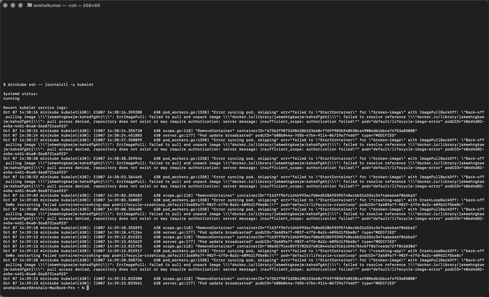

# Session 2 - Linux Fundamentals

I completed the four Linux exercises from the homework list. I used a temporary Ubuntu container for the user-management commands because my main machine is a Mac and I did not want to create test accounts on it.

## Soft link and hard link

The files from this test are in [`links-demo/`](links-demo/). I created both links with:

```bash
echo "This is the original file content." > original.txt
ln original.txt hardlink.txt
ln -s original.txt softlink.txt
ls -li
```

The important part of my output was:

```text
51425425 -rw-r--r--@ 2 anshalkumar staff 35 Sep 3 22:57 hardlink.txt
51425425 -rw-r--r--@ 2 anshalkumar staff 35 Sep 3 22:57 original.txt
51425428 lrwxr-xr-x@ 1 anshalkumar staff 12 Sep 3 22:57 softlink.txt -> original.txt
```

The hard link and original file had the same inode. The symbolic link had a different inode and stored the path to the original file. After I deleted `original.txt`, the hard link still contained the data, while the symbolic link became broken. This was the clearest practical difference between them.

| Check | Hard link | Symbolic link |
|---|---|---|
| Command | `ln target link` | `ln -s target link` |
| Inode | Same as the target | Different inode |
| Can cross filesystems | No | Yes |
| Works after target is deleted | Yes | No |

## `adduser` and `useradd`

I ran this part inside `ubuntu:22.04`. Plain `useradd` created an account but did not create its home directory:

```text
testuser1:x:1000:1000::/home/testuser1:/bin/sh
ls: cannot access '/home/testuser1': No such file or directory
```

Using explicit options fixed that:

```bash
useradd -m -s /bin/bash testuser1b
```

I also tried Ubuntu's higher-level command:

```bash
adduser --disabled-password --gecos "" testuser2
```

`adduser` created the home directory, copied `/etc/skel`, created a matching group, and selected Bash. My conclusion is that `adduser` is more convenient for manually creating a user on Ubuntu. `useradd` is more suitable in scripts when I want every option to be explicit.

## `journalctl`

`journalctl` reads logs stored by systemd. macOS does not use systemd, so I used the Linux node created by Minikube. That node runs systemd and gave me real `kubelet` and `containerd` service logs.

```bash
minikube ssh -- systemctl is-system-running
minikube ssh -- journalctl -u kubelet --no-pager -n 35
minikube ssh -- journalctl -u containerd --no-pager -n 20
```

The screenshot below is from that live run. It shows systemd reporting `running` and recent kubelet messages, including real pod startup failures that were useful during Kubernetes troubleshooting.



## Commands I practiced

I reviewed the supplied cheat sheets and practiced these commands on my machine:

```bash
pwd
whoami
uname -a
ls -la
df -h
du -sh .
ps aux
top -l 1
grep
find
chmod
```

The supplied reference PDFs are [`basic-linux.pdf`](basic-linux.pdf), [`ad-linux.pdf`](ad-linux.pdf), and [`Linux Networking Cheat Sheet.pdf`](Linux%20Networking%20Cheat%20Sheet.pdf).
