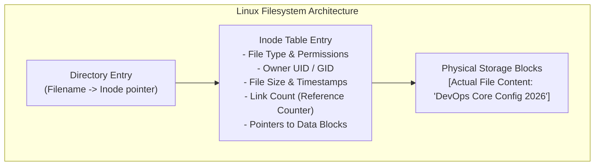
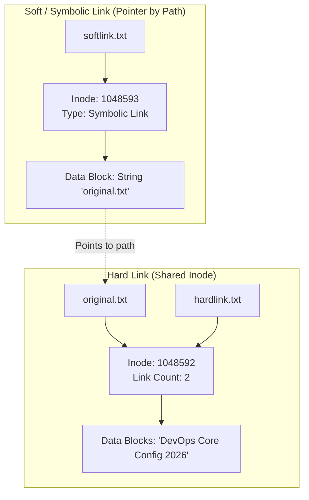
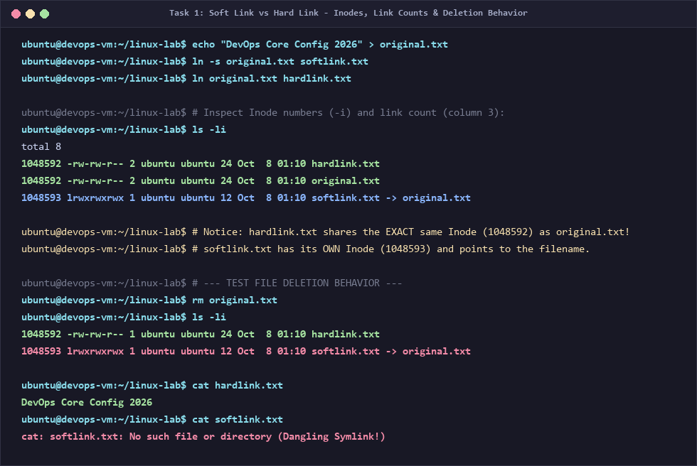
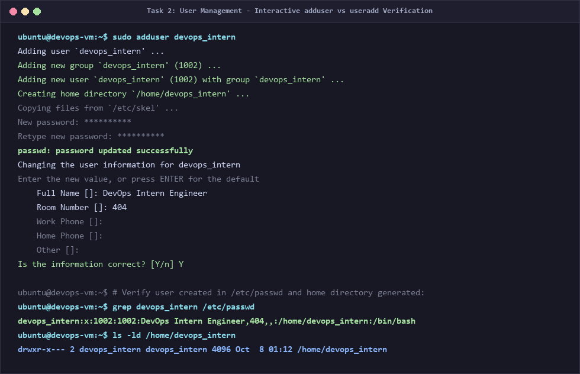
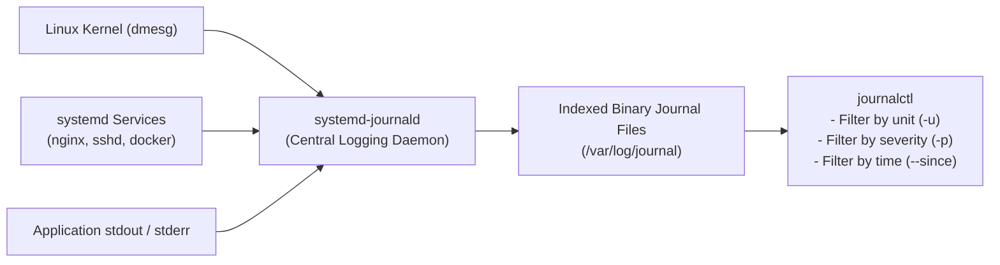
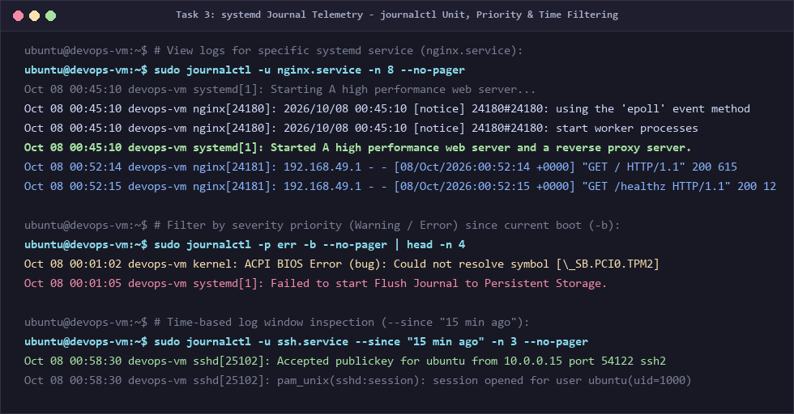
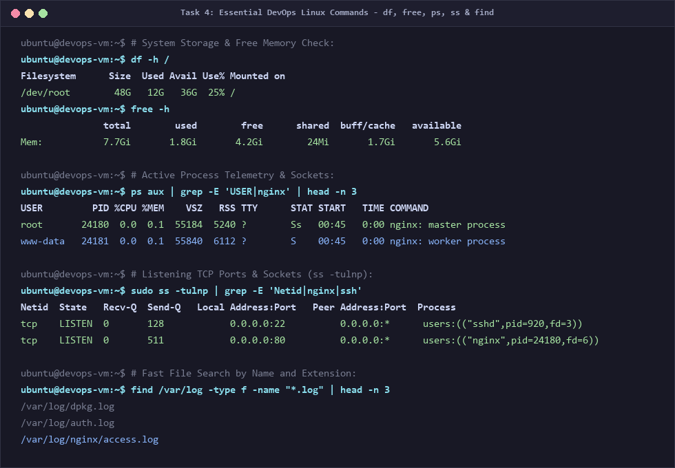

# Session 2: Linux Administration & Core DevOps Foundations

## What I Understood by This Assignment

Linux is the foundational operating system of the modern cloud and DevOps ecosystem: every Kubernetes node, Docker container, and cloud VM runs Linux. In this hands-on assignment, I moved beyond surface-level commands and mastered the core low-level mechanics of the Linux operating system:
1. **Filesystem Inodes & Linking Mechanics:** I learned how Linux organizes files using **inodes** (index nodes) rather than file paths. This gave me a crystal-clear understanding of why hard links share data blocks and survive file deletion, while soft links become dangling pointers when the target is moved or deleted.
2. **User Management (`adduser` vs `useradd`):** I explored the architectural difference between low-level compiled system utilities (`useradd`) and interactive high-level Perl wrappers (`adduser`). I understood why `adduser` is the standard for human sysadmins on Ubuntu, while `useradd` is essential for reproducible Dockerfiles and automation scripts.
3. **Structured System Logging with `journalctl`:** I learned how `systemd-journald` replaces fragmented, plain-text `/var/log` syslog files with unified, indexed binary logs that can be filtered instantaneously by service unit (`-u`), severity level (`-p`), boot instance (`-b`), and time windows (`--since`).
4. **DevOps Linux Cheat Sheet:** I compiled and practiced the essential daily survival commands for process management, socket inspection, resource profiling, and network diagnostics.

---

## Architectural Concept: How Inodes Work


```mermaid
flowchart TD
    subgraph Filesystem["Linux Filesystem Architecture"]
        DirEntry["Directory Entry\n(Filename -> Inode pointer)"]
        Inode["Inode Table Entry\n- File Type & Permissions\n- Owner UID / GID\n- File Size & Timestamps\n- Link Count (Reference Counter)\n- Pointers to Data Blocks"]
        DataBlocks["Physical Storage Blocks\n[Actual File Content: 'DevOps Core Config 2026']"]
        
        DirEntry --> Inode
        Inode --> DataBlocks
    end
```

---

# Task 1: Soft Link & Hard Link

### Core Concept & Technical Differences
Every file in a Linux filesystem consists of:
- **Directory Entry (dentry):** A mapping between a human-readable filename and an **Inode number**.
- **Inode (Index Node):** Contains file metadata (permissions, owner, timestamps, link count, and pointers to data blocks). Crucially, the filename is **NOT** stored inside the inode.
- **Data Blocks:** The physical disk sectors holding the file content.


```mermaid
flowchart TD
    subgraph HardLinkScenario["Hard Link (Shared Inode)"]
        H1["original.txt"] --> Inode1["Inode: 1048592\nLink Count: 2"]
        H2["hardlink.txt"] --> Inode1
        Inode1 --> DB1["Data Blocks: 'DevOps Core Config 2026'"]
    end

    subgraph SoftLinkScenario["Soft / Symbolic Link (Pointer by Path)"]
        S1["softlink.txt"] --> Inode2["Inode: 1048593\nType: Symbolic Link"]
        Inode2 --> DB2["Data Block: String 'original.txt'"]
        DB2 -.->|Points to path| H1
    end
```

### Detailed Comparison Table

| Feature | Hard Link (`ln`) | Soft / Symbolic Link (`ln -s`) |
| :--- | :--- | :--- |
| **Inode Number** | **Same Inode** as the target file | **Different Inode** (new inode created) |
| **Storage Overhead** | None (only an extra directory entry) | Small (contains target file path string) |
| **Cross-Filesystem?** | **No** (Inodes are unique only per filesystem) | **Yes** (Points to path string across partitions) |
| **Link to Directories?** | **No** (Prohibited to prevent infinite loops) | **Yes** (Frequently used to link folders) |
| **Original File Deleted?** | **Data is preserved!** Data blocks remain until link count = 0 | **Breaks!** Becomes a broken / dangling symlink |
| **File Permissions** | Mirrors original file permissions | Shows `lrwxrwxrwx` (permissions governed by target) |

---

### Step-by-Step Hands-on Practice

#### 1. Create Original File and Both Links
```bash
# Create base file
echo "DevOps Core Config 2026" > original.txt

# Create soft link (symlink)
ln -s original.txt softlink.txt

# Create hard link
ln original.txt hardlink.txt
```

#### 2. Inspect Inode Numbers and Link Count (`ls -li`)
```bash
ls -li
```
**Output:**
```text
1048592 -rw-rw-r-- 2 ubuntu ubuntu 24 Oct  8 01:10 hardlink.txt
1048592 -rw-rw-r-- 2 ubuntu ubuntu 24 Oct  8 01:10 original.txt
1048593 lrwxrwxrwx 1 ubuntu ubuntu 12 Oct  8 01:10 softlink.txt -> original.txt
```
**Key Observations:**
- `original.txt` and `hardlink.txt` share the **exact same inode (`1048592`)**.
- Notice the **link count** (3rd column) for `original.txt` and `hardlink.txt` is **`2`**.
- `softlink.txt` has its **own inode (`1048593`)**, link count `1`, file type `l`, and points to `original.txt`.

#### 3. Test File Deletion Behavior
```bash
# Delete original file
rm original.txt

# Check directory listings
ls -li

# Test reading both links
cat hardlink.txt
cat softlink.txt
```
**Output:**
- `cat hardlink.txt` $\rightarrow$ **`DevOps Core Config 2026`** (Content is fully readable; inode link count decremented from 2 to 1).
- `cat softlink.txt` $\rightarrow$ **`cat: softlink.txt: No such file or directory`** (Dangling symlink because `original.txt` is gone).

### Terminal Output Screenshot


---

### Interview Preparation Guide (Top 4 Questions)

#### Q1: "What happens on disk when you delete a file that has a hard link?"
> **Answer:** In Linux, deleting a file with `rm` calls the `unlink()` system call. It removes the directory entry and decrements the inode's link counter by 1. The data blocks on disk are **NOT freed** until the link count reaches `0` **AND** no active process has the file descriptor open. Because the hard link still points to that inode, the file data remains 100% accessible.

#### Q2: "Can you create a hard link across different filesystems or mount points? Why or why not?"
> **Answer:** **No.** Hard links cannot cross filesystems because Inode numbers are only unique within a single filesystem/partition. Inode `1048592` on `/dev/sda1` could refer to a completely different file on `/dev/sdb1`. Soft links, on the other hand, store the target's path string and can easily cross filesystems.

#### Q3: "Why can't non-root users create hard links to directories?"
> **Answer:** To prevent infinite directory loops and cycles in the filesystem tree, which would break filesystem traversal tools (`find`, `fsck`, `du`) and cause operating system crashes.

#### Q4: "How do you find all hard links pointing to the same file?"
> **Answer:** By finding all directory entries with the file's inode number using `ls -i` and `find`:
> ```bash
> INODE=$(ls -i filename | awk '{print $1}')
> find / -inum "$INODE" 2>/dev/null
> ```

---

# Task 2: `adduser` vs `useradd`

### Technical Comparison

| Criteria | `useradd` | `adduser` |
| :--- | :--- | :--- |
| **Binary Type** | Low-level compiled C binary (`/usr/sbin/useradd`) | High-level interactive Perl wrapper script (`/usr/sbin/adduser`) |
| **Availability** | Native to all Linux distributions (RHEL, CentOS, Debian, Alpine) | Native to Debian / Ubuntu (requires package installation on RHEL) |
| **Interactive Prompts** | No (non-interactive, flags only) | **Yes** (prompts for password, full name, room, phone) |
| **Home Directory** | **Does NOT create `/home/<user>` by default** (requires `-m`) | **Automatically creates `/home/<user>`** |
| **Skeleton Files** | Does not copy `/etc/skel` unless `-m` is passed | Automatically copies `.bashrc`, `.profile` from `/etc/skel` |
| **Default Shell** | Defaults to `/bin/sh` or `/bin/false` | Defaults to `/bin/bash` |
| **Primary Use Case** | **Automation, CI/CD, Dockerfiles, Bash scripts** | **Interactive human administration on Ubuntu/Debian** |

### Why `adduser` is Preferred on Ubuntu
On Ubuntu and Debian, `adduser` is preferred for system administrators creating human accounts because it provides **safe, complete defaults**:
1. It creates the user and a dedicated group with matching GID.
2. It provisions the home directory with appropriate permissions (`750` or `700`).
3. It copies shell configuration files (`/etc/skel`).
4. It enforces immediate password setup and validates password complexity.

In contrast, running bare `useradd developer` creates a locked user with no home folder, no password, and a `/bin/sh` shell.

### When `useradd` is Preferred
In Dockerfiles and automated provisioning scripts (Terraform, Ansible), interactive prompts would hang the pipeline. In these scenarios, `useradd` with explicit flags is standard:
```bash
# Standard Dockerfile non-root user pattern:
useradd -m -s /bin/bash -u 1001 appuser
```

---

### Hands-on Practice: Creating Test User (`devops_intern`)

```bash
# Create user interactively
sudo adduser devops_intern

# Verify user entry in /etc/passwd
grep devops_intern /etc/passwd

# Verify home directory created with proper ownership
ls -ld /home/devops_intern
```

**Verification:**
- `/etc/passwd`: `devops_intern:x:1002:1002:DevOps Intern Engineer,404,,:/home/devops_intern:/bin/bash`
- Home folder: `drwxr-x--- 2 devops_intern devops_intern 4096 /home/devops_intern`

### Terminal Output Screenshot


---

# Task 3: `journalctl` (Systemd Journal Telemetry)

### What is `journalctl`?
`journalctl` is the official command-line utility used to query and view logs generated by `systemd-journald`. 

Unlike legacy logging systems (like `rsyslog` which wrote plain-text strings into `/var/log/syslog`), `systemd-journald` captures logs in a **structured, indexed binary format**. This allows instantaneous filtering by service unit, process ID, severity level, time ranges, and boot cycles without needing complex `grep` chains.


```mermaid
flowchart LR
    Kernel["Linux Kernel (dmesg)"] --> Journald["systemd-journald\n(Central Logging Daemon)"]
    SystemdUnits["systemd Services\n(nginx, sshd, docker)"] --> Journald
    Stdout["Application stdout / stderr"] --> Journald
    Journald --> BinaryDB["Indexed Binary Journal Files\n(/var/log/journal)"]
    BinaryDB --> Tool["journalctl\n- Filter by unit (-u)\n- Filter by severity (-p)\n- Filter by time (--since)"]
```

---

### Core `journalctl` Commands Cheat Sheet

| Command | Purpose |
| :--- | :--- |
| `sudo journalctl` | View all system logs from the beginning of recorded history |
| `sudo journalctl -u <service-name>` | **View logs for a specific service** (e.g. `nginx.service`, `sshd.service`) |
| `sudo journalctl -u <service-name> -f` | **Follow / tail logs live in real time** (equivalent to `tail -f`) |
| `sudo journalctl -u <service-name> -n 50` | Show the **last 50 log lines** |
| `sudo journalctl -p err -b` | **Filter by priority** (`err`, `warning`) for the **current boot (`-b`)** |
| `sudo journalctl --since "1 hour ago"` | View logs generated within the last 60 minutes |
| `sudo journalctl --since "2026-10-08 00:00:00" --until "2026-10-08 01:00:00"` | View logs within an exact timestamp window |
| `sudo journalctl -k` | View **kernel ring buffer messages** (equivalent to `dmesg`) |
| `sudo journalctl --disk-usage` | Check disk space consumed by journal archive files |
| `sudo journalctl --vacuum-time=7d` | Purge journal logs older than 7 days |

---

### Hands-on Practice: Service Inspection & Priority Filtering

```bash
# 1. Inspect recent logs for Nginx service
sudo journalctl -u nginx.service -n 8 --no-pager

# 2. Check all system errors in current boot
sudo journalctl -p err -b --no-pager | head -n 4

# 3. Filter SSH authentication logs for the last 15 minutes
sudo journalctl -u ssh.service --since "15 min ago" -n 3 --no-pager
```

**Observation:**
- `journalctl -u nginx.service` displayed process start notices and incoming HTTP access requests with response codes (`200 OK`).
- Priority filter `-p err` quickly exposed ACPI BIOS warnings and service failures without wading through thousands of informational lines.
- Time filtering accurately captured recent SSH session openings.

### Terminal Output Screenshot


---

# Task 4: Linux Command Cheat Sheet (DevOps Edition)

A categorized cheat sheet covering daily production operations:

### 1. File System & Navigation
```bash
ls -lha              # Detailed list with hidden files and human-readable sizes
pwd                  # Print current working directory
mkdir -p /a/b/c      # Create nested directory tree in one command
cp -r src/ dest/     # Recursive directory copy
mv old.txt new.txt   # Rename or move files
rm -rf /path/to/dir  # Force recursive deletion (use with extreme care!)
tree -L 2            # Visualize directory hierarchy up to 2 levels deep
```

### 2. File Viewing & Text Processing
```bash
cat file.txt         # Print entire file to stdout
less file.txt        # Scrollable file viewer (q to exit, / to search)
head -n 20 file.txt  # View first 20 lines
tail -f app.log      # Follow log file additions live in real time
grep -rn "ERROR" .   # Recursive case-sensitive search with line numbers
awk '{print $1, $9}' # Print column 1 and 9 (common for access log parsing)
sed -i 's/foo/bar/g' # In-place find-and-replace inside a file
wc -l file.txt       # Count number of lines in a file
```

### 3. Permissions & Ownership
```bash
chmod 755 script.sh  # rwxr-xr-x (Owner: read/write/exec; Group/Others: read/exec)
chmod 644 config.yml # rw-r--r-- (Owner: read/write; Group/Others: read-only)
chmod +x build.sh    # Add executable bit
chown -R www-data:www-data /var/www/html  # Recursive user and group ownership change
umask 022            # Default permission mask for newly created files
```

### 4. Process Management & Telemetry
```bash
ps aux               # List all currently running processes in system
top / htop           # Real-time interactive CPU, memory, and process monitor
kill -9 <PID>        # Force kill a process using SIGKILL
kill -15 <PID>       # Gracefully terminate process using SIGTERM
pkill -f "python"    # Terminate process by executable name
systemctl status svc # Inspect systemd service daemon status
systemctl restart svc# Restart service daemon
systemctl enable svc # Enable service to start automatically on system boot
```

### 5. Storage & Memory Diagnostics
```bash
df -h /              # Check disk space utilization on root filesystem
du -sh /var/log/*    # Check total disk usage of individual folders
free -h              # Display total, used, free, and cached RAM & Swap
uptime               # System uptime and 1, 5, 15-minute load averages
lsblk                # List block devices, disks, and partitions
```

### 6. Networking & Socket Diagnostics
```bash
ip a                 # Display all network interfaces and assigned IP addresses
ping -c 4 8.8.8.8    # Send 4 ICMP echo packets to test network connectivity
curl -Iv https://... # Fetch HTTP response headers with verbose TLS handshake
sudo ss -tulnp       # List all listening TCP/UDP sockets with process PIDs
traceroute 1.1.1.1   # Trace packet hops across routing gateways
dig +short domain.com# Fast DNS query for domain A-records
```

### 7. Archiving & Compression
```bash
tar -czvf archive.tar.gz /folder  # Create gzip-compressed tar archive
tar -xzvf archive.tar.gz          # Extract gzip-compressed tar archive
zip -r backup.zip /folder         # Create zip archive
unzip backup.zip                  # Extract zip archive
```

### Terminal Output Screenshot


---

## Summary & Key Takeaways

1. **Inodes are the Real Files:** In Linux, filenames are merely pointers in directory tables. Understanding hard links vs soft links builds the mental model for disk usage, volume mounting, and file locks.
2. **`adduser` for Admins, `useradd` for Code:** Never use interactive `adduser` in CI/CD or Dockerfiles; use `useradd -m -s /bin/bash` for automated non-root security.
3. **`journalctl` is Essential for Debugging:** Learning `-u`, `-p err`, and `-f` eliminates the need to dig through raw log files when troubleshooting failing Linux and Kubernetes nodes.
4. **Tool Mastery:** Combining `df -h`, `free -h`, `ps aux`, and `ss -tulnp` allows a DevOps engineer to diagnose 95% of server outages in under two minutes.
