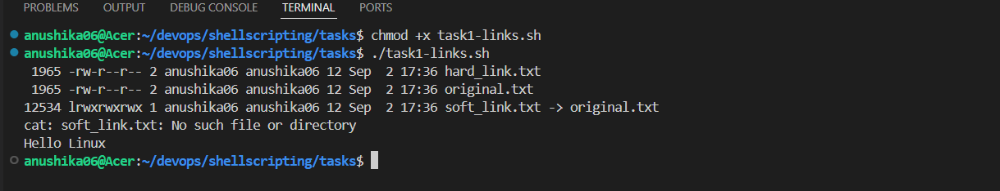
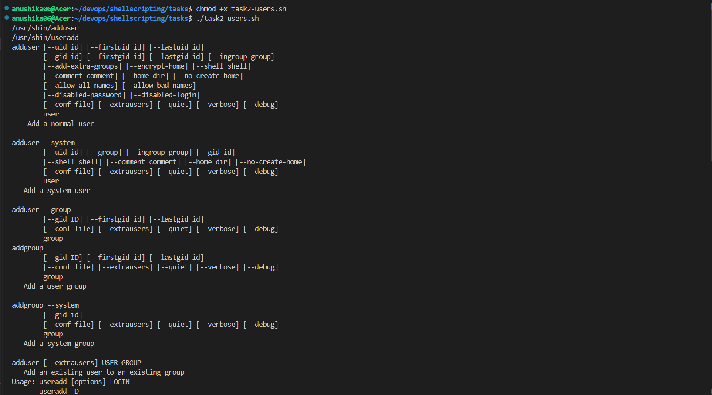
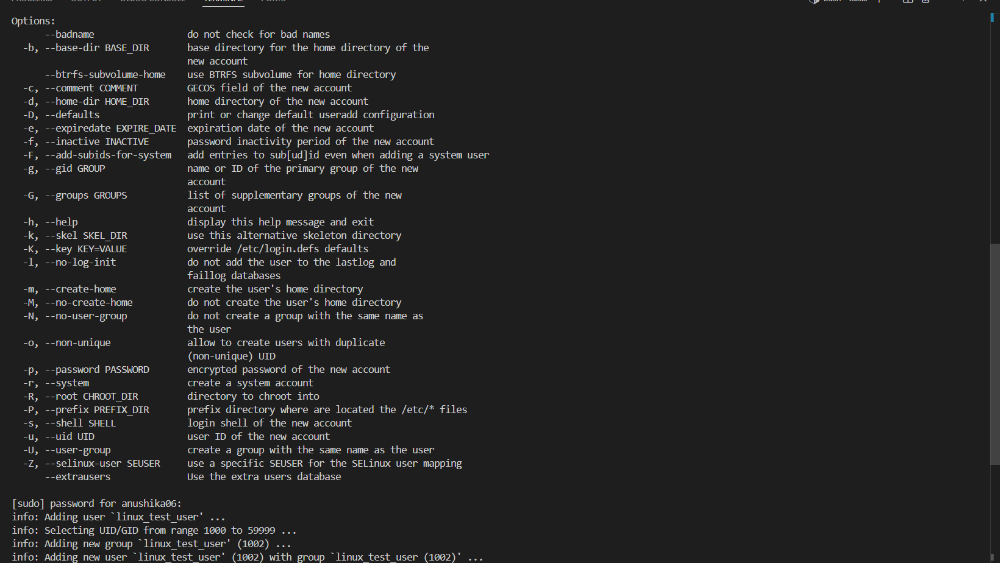
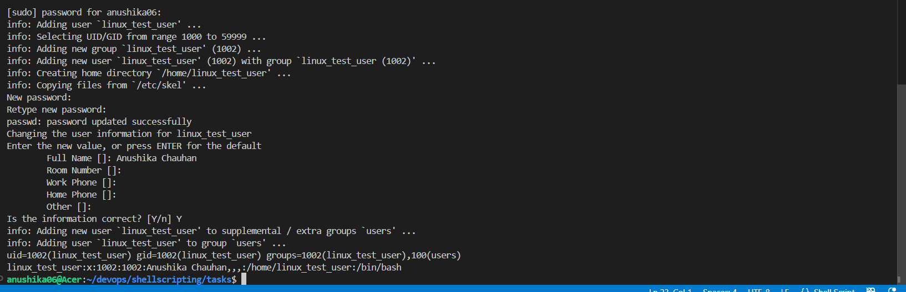
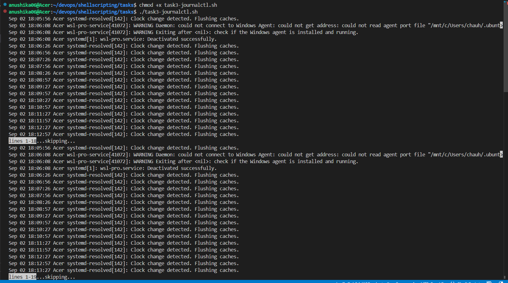

# Linux Homework Tasks

## Task 1: Soft Link & Hard Link

- Learn the difference between soft links and hard links.
- Learn the commands to create both.
- Practice creating and deleting soft and hard links.
- Prepare for this as an interview question.

## Task 2: adduser vs useradd

- Learn the difference between adduser and useradd.
- Understand which command is preferred on Ubuntu/Linux and why.
- Create a test user using the recommended command.

## Task 3: journalctl

- Learn what journalctl is used for.
- Learn how to view system and service logs using journalctl.
- Practice checking logs for a specific service.

## Task 4: Linux Command Cheat Sheet

- Review the Linux command cheat sheet.
- Practice the important commands covered in the cheat sheet.
- Understand the purpose and basic usage of each command.

# Solutions

## Task 1 Output

## Task 2 Output

### Command Choice: adduser vs useradd
I chose adduser for creating the test user because it is a more user-friendly, interactive command and is generally preferred for user creation on Ubuntu/Debian. useradd is a lower-level command commonly used for more controlled or non-interactive user creation.

## Task 3 Output

