# 09 - Monitoring Stack (Task 1: Monitoring demo)

## Goal

Run a small monitoring stack on a laptop with Docker Compose and use it to show the six
signals Task 1 asks for:

| Signal | Where it comes from | Section |
|---|---|---|
| Metrics | `/metrics` on the app, scraped by Prometheus | [Metrics](#1-metrics) |
| Logs | The app's JSON logs on stdout (`docker compose logs`) | [Logs](#2-logs) |
| Alerts | Prometheus rules, then Alertmanager, then a webhook | [Alerts](#3-alerts) |
| CPU utilization | `process_cpu_seconds_total` for the app, `node_cpu_seconds_total` for the host | [CPU](#4-cpu-utilization) |
| Memory utilization | `process_resident_memory_bytes` for the app, `node_memory_*` for the host | [Memory](#5-memory-utilization) |
| Application health | `/health`, the Docker `HEALTHCHECK`, and `up{job="demo-app"}` | [App health](#6-application-health) |

Every alert is shown going through all of its states: **inactive, then pending, then firing,
then resolved**. Each one also produces a notification that you can see.

---

## Architecture

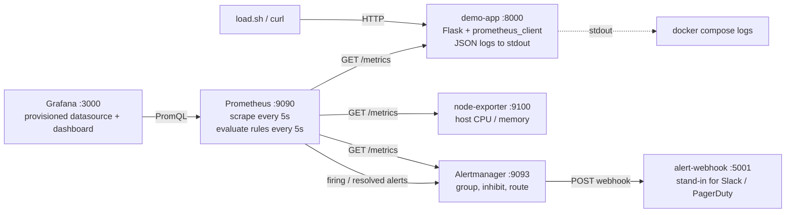

ASCII version:

```text
            curl / load.sh
                  |
                  v
   +-----------------------------+   stdout (JSON)   docker compose logs demo-app
   | demo-app :8000              |------------------>
   | /health /metrics /work ...  |
   +-----------------------------+
                  ^ scrape 5s
   +-----------------------------+   scrape   +-------------------+
   | Prometheus :9090            |----------->| node-exporter     |  host CPU / RAM
   | alert-rules.yml (7 rules)   |            +-------------------+
   +-----------------------------+
        |  alerts           ^ PromQL
        v                   |
   +-----------------+   +-----------------+
   | Alertmanager    |   | Grafana :3000   |  datasource + dashboard come from files
   | :9093           |   +-----------------+
   +-----------------+
        | webhook (firing + resolved)
        v
   +-----------------+
   | alert-webhook   |  prints [NOTIFY] lines
   +-----------------+
```

## File layout

```text
09-monitoring-stack/
├── docker-compose.yml               # 6 services, each with a memory limit
├── app/
│   ├── app.py                       # demo app: /, /health, /metrics, /work, /error, /memory
│   ├── Dockerfile                   # python:3.12-slim, non-root, HEALTHCHECK on /health
│   └── requirements.txt             # flask, prometheus-client
├── prometheus/
│   ├── prometheus.yml               # scrape jobs + alertmanager target + rule_files
│   └── alert-rules.yml              # 7 alert rules (app + host)
├── alertmanager/alertmanager.yml    # route -> webhook, send_resolved, inhibit rule
├── webhook/receiver.py              # prints each notification as a [NOTIFY] line
├── grafana/
│   ├── provisioning/datasources/prometheus.yml
│   ├── provisioning/dashboards/dashboards.yml
│   └── dashboards/demo-app-dashboard.json   # 13 panels
├── scripts/
│   ├── load.sh            # traffic: normal | errors | cpu | memory | all
│   ├── promql.py          # run an instant PromQL query and print a table (stdlib only)
│   ├── alerts.py          # alert state in Prometheus and in Alertmanager
│   ├── watch_alert.sh     # poll one alert every 5s until it fires (or clears)
│   ├── grafana-check.sh   # check Grafana provisioning through its HTTP API
│   └── grafana_query.py   # run the dashboard's stat queries through Grafana
└── screenshots/           # 09-01 ... 09-16
```

### The demo app

| Endpoint | What it does |
|---|---|
| `/` | hello / info |
| `/health` | `{"status":"UP", "uptime_seconds":..., "memory_held_mb":...}` |
| `/metrics` | Prometheus text format |
| `/work?ms=200` | busy-loops for N ms, which uses real CPU |
| `/error` | logs an ERROR and returns HTTP 500 |
| `/memory?mb=50` / `/memory/release` | holds N MB (simulates a leak) / frees it |

Metrics the app exposes: `http_requests_total{method,endpoint,status}` (counter),
`http_request_duration_seconds{endpoint}` (histogram), `http_requests_in_progress` (gauge),
`app_start_time_seconds`, `app_memory_held_megabytes`, `app_info{version}`. It also exposes
the standard `process_*` metrics (CPU seconds, RSS, open FDs) that `prometheus_client` adds.

---

## How to run

```bash
cd session20-monitoring-observability-gitops/09-monitoring-stack
docker compose up -d --build

# generate some traffic (25% of the calls hit /error)
scripts/load.sh all 120 &
```

| UI | URL | Login |
|---|---|---|
| Demo app | http://localhost:8000/health | - |
| Prometheus | http://localhost:9090 (Alerts tab, Status > Targets) | - |
| Alertmanager | http://localhost:9093 | - |
| Grafana | http://localhost:3000/d/s20-demo-app | admin / admin |

```text
$ docker compose up -d --build 2>&1 | grep -E 'Built|Started' | sort -u
 Container s20-alert-webhook Started
 Container s20-alertmanager Started
 Container s20-demo-app Started
 Container s20-grafana Started
 Container s20-node-exporter Started
 Container s20-prometheus Started
 Image s20-demo-app:1.0.0 Built
$ docker compose ps ...
NAME                IMAGE                       STATUS                    PORTS
s20-alert-webhook   python:3.12-slim            Up 16 seconds
s20-alertmanager    prom/alertmanager:v0.28.1   Up 10 seconds             0.0.0.0:9093
s20-demo-app        s20-demo-app:1.0.0          Up 12 seconds (healthy)   0.0.0.0:8000
s20-grafana         grafana/grafana:12.1.1      Up 7 seconds              0.0.0.0:3000
s20-node-exporter   prom/node-exporter:v1.9.1   Up 14 seconds             9100/tcp
s20-prometheus      prom/prometheus:v3.5.0      Up 9 seconds              0.0.0.0:9090
```

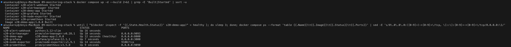

Prometheus is healthy, all 4 targets are `up`, and all 7 rules load with `health=ok`.
Two rules are already `pending` because the load generator is running (25% errors), and
the other minikube clusters on the same Docker VM keep the host CPU busy:

```text
JOB            ENDPOINT                            HEALTH  LAST SCRAPE
alertmanager   http://alertmanager:9093/metrics    up      109.9 ms
demo-app       http://demo-app:8000/metrics        up      42.5 ms
node-exporter  http://node-exporter:9100/metrics   up      280.6 ms
prometheus     http://localhost:9090/metrics       up      174.9 ms

demo-app.rules   DemoAppDown      health=ok   state=inactive
demo-app.rules   HighErrorRate    health=ok   state=pending
demo-app.rules   HighLatencyP95   health=ok   state=inactive
demo-app.rules   HighCPUUsage     health=ok   state=inactive
demo-app.rules   HighMemoryUsage  health=ok   state=inactive
host.rules       HostHighCPU      health=ok   state=pending
host.rules       HostHighMemory   health=ok   state=inactive
```

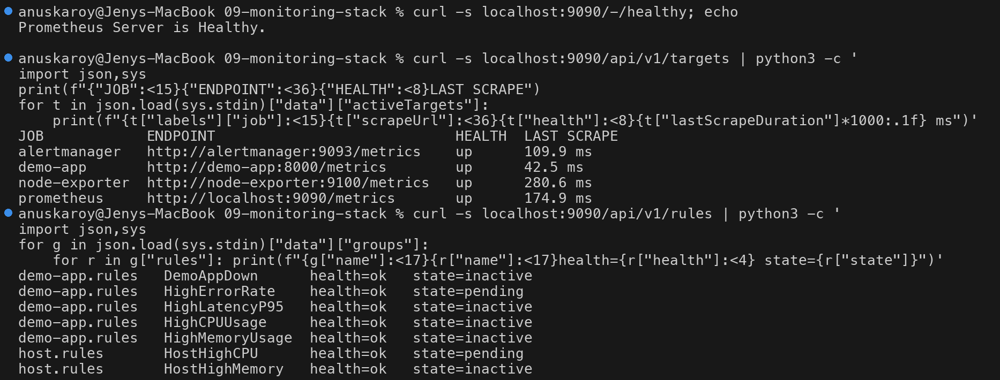

---

## 1. Metrics

Look at the raw exposition format that Prometheus scrapes:

```bash
curl -s localhost:8000/metrics | grep -E '^# (HELP|TYPE) http_requests_total|^http_requests_total'
```

```text
# HELP http_requests_total Total HTTP requests
# TYPE http_requests_total counter
http_requests_total{endpoint="/health",method="GET",status="200"} 77.0
http_requests_total{endpoint="/",method="GET",status="200"} 72.0
http_requests_total{endpoint="/work",method="GET",status="200"} 72.0
http_requests_total{endpoint="/error",method="GET",status="500"} 72.0

http_request_duration_seconds_bucket{endpoint="/work",le="0.1"} 0.0
http_request_duration_seconds_bucket{endpoint="/work",le="0.25"} 72.0
...
http_request_duration_seconds_count{endpoint="/work"} 72.0
http_request_duration_seconds_sum{endpoint="/work"} 11.038751711996156

process_resident_memory_bytes 2.1000192e+07
process_cpu_seconds_total 16.38
```

The `/work` calls take 150 ms each, so every one of them lands in the `le="0.25"` bucket and
none in `le="0.1"`.

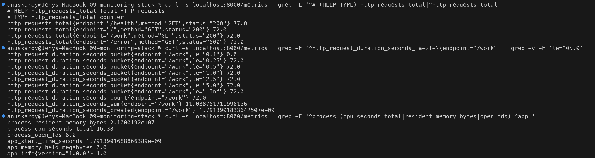

Use PromQL to turn the counters into rates. These are the "golden signals" of traffic,
errors and latency:

```text
$ scripts/promql.py 'sum by (endpoint,status) (rate(http_requests_total{job="demo-app"}[1m]))'
{endpoint="/health", status="200"}                           1.8268
{endpoint="/", status="200"}                                 1.7706
{endpoint="/work", status="200"}                             1.6922
{endpoint="/error", status="500"}                            1.6922
$ scripts/promql.py 'sum(rate(http_requests_total{job="demo-app",status=~"5.."}[1m])) / sum(rate(http_requests_total{job="demo-app"}[1m]))'
{}                                                           0.2425
$ scripts/promql.py 'histogram_quantile(0.95, sum by (le,endpoint) (rate(http_request_duration_seconds_bucket{job="demo-app"}[1m])))'
{endpoint="/"}                                               0.0049
{endpoint="/work"}                                           0.2425
{endpoint="/error"}                                          0.0048
{endpoint="/health"}                                         0.0049
```

The error rate is 24%, which matches the load mix (1 out of every 4 calls is `/error`).

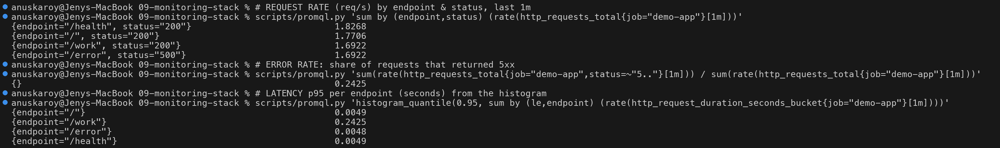

---

## 2. Logs

The app writes **one JSON object per line** to stdout. Docker collects these lines, so
`docker compose logs` is the log pipeline here. In production a collector (Loki/Promtail,
Fluent Bit, CloudWatch agent) would ship the same lines. Access logs get their level from
the status code: 5xx is ERROR, 4xx is WARN, everything else is INFO.

```text
$ docker compose logs demo-app --no-log-prefix --tail 6
{"ts": "2026-10-07T16:23:54.713+00:00", "level": "WARN", "service": "demo-app", "msg": "request", "method": "GET", "path": "/nope", "status": 404, "duration_ms": 185.86, "client": "192.168.65.1"}
{"ts": "2026-10-07T16:23:54.719+00:00", "level": "INFO", "service": "demo-app", "msg": "request", "method": "GET", "path": "/", "status": 200, "duration_ms": 0.4, "client": "192.168.65.1"}
{"ts": "2026-10-07T16:23:54.769+00:00", "level": "INFO", "service": "demo-app", "msg": "request", "method": "GET", "path": "/health", "status": 200, "duration_ms": 2.59, "client": "192.168.65.1"}
{"ts": "2026-10-07T16:23:55.003+00:00", "level": "INFO", "service": "demo-app", "msg": "request", "method": "GET", "path": "/work?ms=150", "status": 200, "duration_ms": 164.6, "client": "192.168.65.1"}
{"ts": "2026-10-07T16:23:55.040+00:00", "level": "ERROR", "service": "demo-app", "msg": "simulated failure", "error": "database connection refused"}
{"ts": "2026-10-07T16:23:55.042+00:00", "level": "ERROR", "service": "demo-app", "msg": "request", "method": "GET", "path": "/error", "status": 500, "duration_ms": 1.3, "client": "192.168.65.1"}
$ docker compose logs demo-app --no-log-prefix | grep -c '"level": "ERROR"'
248
```

Because the logs are structured, you can aggregate them like data. Here they are counted
by (level, path, status):

```text
INFO  /health   200  132
INFO  /         200  126
INFO  /work     200  125
ERROR -         -    125     <- the "simulated failure" application log line
ERROR /error    500  125     <- the access log line for the same request
INFO  -         -    1       <- "starting" line
WARN  /nope     404  1
```

The 125 `/error` 500s in the logs match the `http_requests_total{status="500"}` metric. Metrics
tell you **how many**, and logs tell you **which request and why** (`database connection refused`).

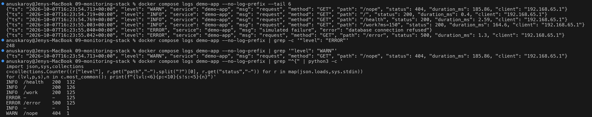

---

## 3. Alerts

### Pipeline

```text
Prometheus evaluates the rules every 5s
  expr true        -> PENDING  (waits for the "for:" duration)
  still true       -> FIRING   -> sent to Alertmanager
Alertmanager       -> group_by alertname, waits group_wait 5s -> POST to the webhook
expr false again   -> RESOLVED -> Alertmanager sends a "resolved" notification (send_resolved: true)
```

Validate both configs before relying on them:

```text
$ docker compose exec prometheus promtool check config /etc/prometheus/prometheus.yml
  SUCCESS: 1 rule files found
 SUCCESS: /etc/prometheus/prometheus.yml is valid prometheus config file syntax
Checking /etc/prometheus/alert-rules.yml
  SUCCESS: 7 rules found
$ docker compose exec alertmanager amtool check-config /etc/alertmanager/alertmanager.yml
Checking '/etc/alertmanager/alertmanager.yml'  SUCCESS
 - global config
 - route
 - 1 inhibit rules
 - 1 receivers
 - 0 templates
```

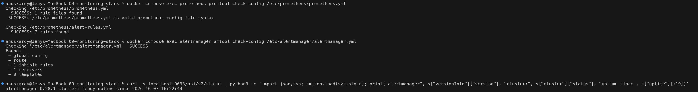

### Alert rules explained (`prometheus/alert-rules.yml`)

| Alert | Expression (short) | for | Severity | What it means |
|---|---|---|---|---|
| `DemoAppDown` | `up{job="demo-app"} == 0` | 15s | critical | Prometheus cannot scrape the app (crashed, stopped, or not reachable on the network) |
| `HighErrorRate` | 5xx rate / total rate `> 0.10` over 1m | 30s | warning | More than 10% of requests are failing |
| `HighLatencyP95` | `histogram_quantile(0.95, ...) > 0.5` | 30s | warning | p95 latency is above 500 ms |
| `HighCPUUsage` | `rate(process_cpu_seconds_total[30s]) > 0.5` | 20s | warning | The app process uses more than half of one core |
| `HighMemoryUsage` | `process_resident_memory_bytes > 150 MiB` | 15s | warning | RSS has grown, which points to a leak |
| `HostHighCPU` | `100*(1-avg(rate(node_cpu_seconds_total{mode="idle"}[1m]))) > 80` | 1m | warning | The Docker VM's CPU is saturated |
| `HostHighMemory` | `100*(1-MemAvailable/MemTotal) > 90` | 1m | warning | The Docker VM is nearly out of RAM |

Notes:

- `for:` stops a single bad scrape from paging someone. The durations are short (15 to 30s)
  only so that the classroom demo is fast. Real values are usually 2 to 10 minutes.
- Annotations use templates: `{{ $value | humanizePercentage }}` and `humanize1024`, so the
  notification text includes the measured value.
- **Inhibition** (`alertmanager.yml`): while `DemoAppDown` is firing, `HighErrorRate` and
  `HighLatencyP95` are muted. When the app is down, those two alerts are only symptoms of the
  same outage.

### Demo A: HighErrorRate (traffic with 25% errors)

```text
$ scripts/promql.py '<5xx ratio>'
{}                                                           0.2476
$ scripts/alerts.py
== Prometheus /api/v1/alerts (1 active)
  HighErrorRate    FIRING   since 16:23:13Z  demo-app 5xx error rate is 24.76%
== Alertmanager /api/v2/alerts (1 received)
  HighErrorRate    active      severity=warning  receivers=webhook  startsAt=16:23:43Z
$ docker compose logs alert-webhook --no-log-prefix | grep HighErrorRate | tail -3
[NOTIFY] status=FIRING   alert=HighErrorRate severity=warning instance=- summary="demo-app 5xx error rate is 24.05%"
```

`activeAt` (16:23:13, when it went pending) and `startsAt` (16:23:43, when it fired) are
exactly the 30s `for:` apart.

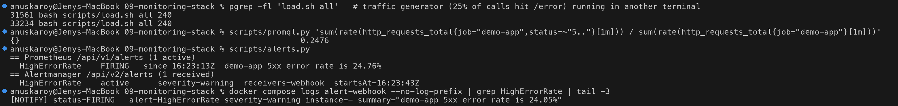

The CPU, memory and app-down alerts are demonstrated in the next three sections. All of
them resolve in [Demo: recovery](#demo-recovery-everything-resolves).

---

## 4. CPU utilization

Two levels are measured:

- **App process**: `rate(process_cpu_seconds_total[1m])` gives the number of cores in use
  (1.0 = one full core).
- **Host / Docker VM**: from node-exporter, `100 * (1 - avg(rate(node_cpu_seconds_total{mode="idle"}[1m])))`,
  which can also be broken down by mode.

```text
$ scripts/promql.py 'rate(process_cpu_seconds_total{job="demo-app"}[1m])' job
{job="demo-app"}                                             0.328
$ scripts/promql.py '100 * (1 - avg(rate(node_cpu_seconds_total{mode="idle"}[1m])))'
{}                                                           74.6443
$ scripts/promql.py 'round(100 * sum by (mode) (rate(node_cpu_seconds_total{mode=~"user|system|iowait|idle"}[1m])) / scalar(count(node_cpu_seconds_total{mode="idle"})), 0.1)' mode
{mode="idle"}                                                25.4
{mode="iowait"}                                              3.6
{mode="system"}                                              15.6
{mode="user"}                                                41.4
```

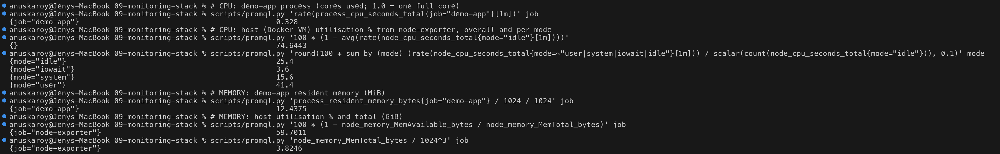

Compare with what Docker itself reports for each container (the cgroup view):

```text
NAME                CPU %     MEM USAGE / LIMIT   MEM %     PIDS
s20-alert-webhook   0.07%     10.61MiB / 64MiB    16.57%    1
s20-alertmanager    11.30%    34.25MiB / 128MiB   26.76%    13
s20-demo-app        39.25%    15.48MiB / 384MiB   4.03%     2
s20-grafana         6.82%     56.92MiB / 448MiB   12.71%    19
s20-node-exporter   0.00%     9.223MiB / 64MiB    14.41%    5
s20-prometheus      34.98%    46.67MiB / 384MiB   12.15%    13
```

`docker stats` shows the demo-app at about 39% CPU, and Prometheus measures 0.33 cores.
These agree: both are about one third of a core.

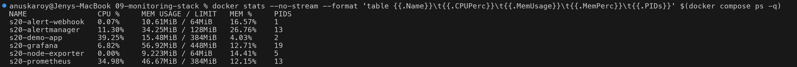

### Demo B: HighCPUUsage

```bash
scripts/load.sh cpu 90 &          # 2 parallel /work?ms=400 calls in a loop
scripts/watch_alert.sh HighCPUUsage
```

```text
21:54:30  HighCPUUsage  INACTIVE
21:54:35  HighCPUUsage  INACTIVE
21:54:41  HighCPUUsage  INACTIVE
21:54:46  HighCPUUsage  PENDING  demo-app CPU is 56.23% of one core
21:54:51  HighCPUUsage  PENDING  demo-app CPU is 61.97% of one core
21:54:57  HighCPUUsage  PENDING  demo-app CPU is 63.72% of one core
21:55:03  HighCPUUsage  PENDING  demo-app CPU is 61.72% of one core
21:55:08  HighCPUUsage  FIRING  demo-app CPU is 63.31% of one core
$ scripts/promql.py 'rate(process_cpu_seconds_total{job="demo-app"}[30s])' job
{job="demo-app"}                                             0.6304
$ docker compose logs alert-webhook --no-log-prefix | grep HighCPUUsage | tail -1
[NOTIFY] status=FIRING   alert=HighCPUUsage severity=warning instance=demo-app:8000 summary="demo-app CPU is 63.31% of one core"
```

The `watch_alert.sh` timestamps are local time (IST, UTC+5:30). The `...Z` timestamps
from the APIs are UTC.

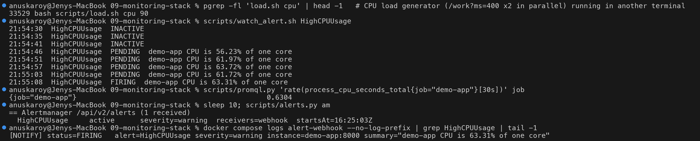

---

## 5. Memory utilization

- **App process**: `process_resident_memory_bytes` (RSS). The dashboard also shows
  `app_memory_held_megabytes`, the amount the app has deliberately "leaked".
- **Host / Docker VM**: `100 * (1 - node_memory_MemAvailable_bytes / node_memory_MemTotal_bytes)`.

```text
$ scripts/promql.py 'process_resident_memory_bytes{job="demo-app"} / 1024 / 1024' job
{job="demo-app"}                                             12.4375
$ scripts/promql.py '100 * (1 - node_memory_MemAvailable_bytes / node_memory_MemTotal_bytes)' job
{job="node-exporter"}                                        59.7011
$ scripts/promql.py 'node_memory_MemTotal_bytes / 1024^3' job
{job="node-exporter"}                                        3.8246
```

(Screenshots: [09-06](screenshots/09-06-cpu-memory-promql.png) for PromQL and
[09-07](screenshots/09-07-docker-stats.png) for `docker stats`, both shown above.)

### Demo C: HighMemoryUsage (simulated leak)

```text
$ curl -s 'localhost:8000/memory?mb=200'
{"held_mb":200}
$ scripts/watch_alert.sh HighMemoryUsage
22:09:20  HighMemoryUsage  PENDING  demo-app RSS memory is 229.8MiB
22:09:26  HighMemoryUsage  PENDING  demo-app RSS memory is 229.8MiB
22:09:31  HighMemoryUsage  PENDING  demo-app RSS memory is 229.8MiB
22:09:36  HighMemoryUsage  FIRING  demo-app RSS memory is 229.8MiB
$ scripts/alerts.py am
== Alertmanager /api/v2/alerts (1 received)
  HighMemoryUsage  active      severity=warning  receivers=webhook  startsAt=16:39:33Z
[NOTIFY] status=FIRING   alert=HighMemoryUsage severity=warning instance=demo-app:8000 summary="demo-app RSS memory is 229.8MiB"
```

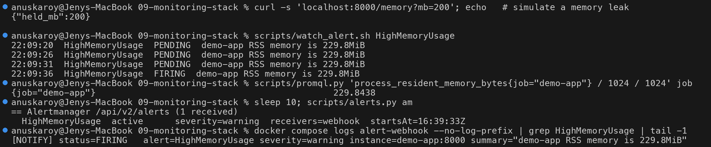

> **Gotcha found during the demo: swap hides RSS.** On a small Docker VM that is under
> pressure (here, three minikube clusters were sharing it), the kernel swapped the idle
> "leaked" pages out within a few seconds. RSS then dropped from 207 MiB to under 150 MiB and
> the alert went back to inactive. The fix in `docker-compose.yml` is
> `memswap_limit: 384m` (equal to `mem_limit`), which disables swap for the app container.
> In real systems, also alert on the container's cgroup memory
> (`container_memory_working_set_bytes` from cAdvisor/kubelet), not only on RSS.
> Free the memory again with `curl localhost:8000/memory/release`.

---

## 6. Application health

Application health is checked in three independent ways:

1. **Health endpoint**: the app reports on itself.
2. **Docker `HEALTHCHECK`** (in the Dockerfile): every 15s Docker calls `/health` and marks the
   container `healthy`/`unhealthy`. Kubernetes liveness and readiness probes work the same way.
3. **`up` metric**: Prometheus records `up=1` for every successful scrape and `up=0` when a
   scrape fails. This is the black-box check that the `DemoAppDown` alert is based on.

```text
$ curl -s localhost:8000/health | python3 -m json.tool
{
    "memory_held_mb": 0,
    "service": "demo-app",
    "status": "UP",
    "uptime_seconds": 40.9,
    "version": "1.0.0"
}
$ curl -s -o /dev/null -w 'HTTP %{http_code} in %{time_total}s\n' localhost:8000/health
HTTP 200 in 0.006335s
$ docker inspect s20-demo-app --format 'docker HEALTHCHECK status: {{.State.Health.Status}}'
docker HEALTHCHECK status: healthy
$ scripts/promql.py 'up' job
{job="alertmanager"}                                         1
{job="demo-app"}                                             1
{job="prometheus"}                                           1
{job="node-exporter"}                                        1
```

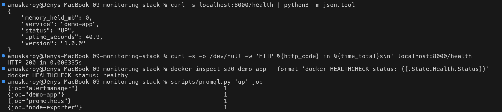

### Demo D: DemoAppDown (stop the app)

```text
$ docker compose stop demo-app
 Container s20-demo-app Stopped
$ scripts/watch_alert.sh DemoAppDown
22:11:56  DemoAppDown  INACTIVE
22:12:01  DemoAppDown  PENDING  demo-app is DOWN (demo-app:8000)
22:12:06  DemoAppDown  PENDING  demo-app is DOWN (demo-app:8000)
22:12:11  DemoAppDown  PENDING  demo-app is DOWN (demo-app:8000)
22:12:16  DemoAppDown  FIRING  demo-app is DOWN (demo-app:8000)
$ scripts/promql.py 'up{job="demo-app"}' job
{job="demo-app"}                                             0
$ scripts/alerts.py am
== Alertmanager /api/v2/alerts (1 received)
  DemoAppDown      active      severity=critical  receivers=webhook  startsAt=16:42:13Z
[NOTIFY] status=FIRING   alert=DemoAppDown severity=critical instance=demo-app:8000 summary="demo-app is DOWN (demo-app:8000)"
```

The `HighMemoryUsage` alert from Demo C was still firing just before the stop. It disappears
by itself, because once the target is gone its `process_*` series go stale.

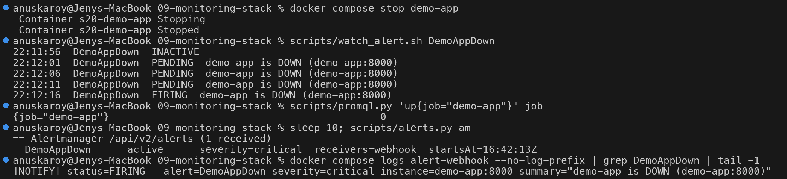

### Demo: recovery (everything resolves)

```text
$ curl -s -m 3 localhost:8000/health || echo "health check FAILED (curl exit $?)"
health check FAILED (curl exit 7)
$ docker compose start demo-app
$ until curl -sf localhost:8000/health; do sleep 2; done; echo
{"memory_held_mb":0,"service":"demo-app","status":"UP","uptime_seconds":0.4,"version":"1.0.0"}
$ scripts/watch_alert.sh DemoAppDown cleared
22:12:37  DemoAppDown  INACTIVE
$ # last RESOLVED notification per alert received by the webhook
[NOTIFY] status=RESOLVED alert=DemoAppDown severity=critical instance=demo-app:8000 summary="demo-app is DOWN (demo-app:8000)"
[NOTIFY] status=RESOLVED alert=HighCPUUsage severity=warning instance=demo-app:8000 summary="demo-app CPU is 57.24% of one core"
[NOTIFY] status=RESOLVED alert=HighErrorRate severity=warning instance=- summary="demo-app 5xx error rate is 13.13%"
[NOTIFY] status=RESOLVED alert=HighLatencyP95 severity=warning instance=- summary="demo-app p95 latency is 5s"
[NOTIFY] status=RESOLVED alert=HighMemoryUsage severity=warning instance=demo-app:8000 summary="demo-app RSS memory is 234.4MiB"
[NOTIFY] status=RESOLVED alert=HostHighCPU severity=warning instance=- summary="Host CPU usage is 99.8%"
$ scripts/alerts.py
== Prometheus /api/v1/alerts (0 active)
== Alertmanager /api/v2/alerts (0 received)
```

A resolved notification shows the **last value seen while the alert was firing**, so
"error rate is 13.13%" means the alert was still above 10% when it was last evaluated.
`HighLatencyP95` and `HostHighCPU` were not triggered on purpose. They fired for a short time
while another minikube cluster was being created on the same Docker VM. The host CPU reached
99.8%, and the app's p95 latency jumped while its process was starved of CPU. Those are real
alerts and they caught a real noisy neighbour.

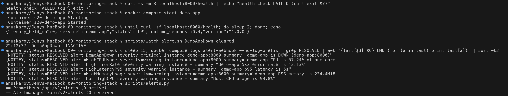

---

## Grafana

Grafana is **provisioned from files**, so nothing needs to be clicked:

- `grafana/provisioning/datasources/prometheus.yml` creates the `Prometheus` datasource
  (uid `prometheus`, `http://prometheus:9090`, default, `timeInterval: 5s` to match the scrape
  interval).
- `grafana/provisioning/dashboards/dashboards.yml` loads every JSON file in
  `/var/lib/grafana/dashboards` into the folder **Session 20** (`disableDeletion: true`).
- `grafana/dashboards/demo-app-dashboard.json` defines the dashboard `s20-demo-app` with 13 panels:
  six stats (App health, Uptime, Request rate, Error rate, Host CPU %, Host memory %), six time series
  (app CPU, app RSS + held MB, req/s by endpoint & status, latency p50/p95, host CPU %,
  host memory %) and a table of firing alerts (`ALERTS{alertstate="firing"}`).

Open http://localhost:3000/d/s20-demo-app (admin/admin). To check it without a browser:

```text
$ scripts/grafana-check.sh
== health
 database: ok  version: 12.1.1
== datasources
 Prometheus (prometheus) uid=prometheus url=http://prometheus:9090 default=True
== datasource health
  OK - Successfully queried the Prometheus API.
== dashboards
 [Session 20] Session 20 - Demo App Monitoring  /d/s20-demo-app/session-20-demo-app-monitoring
== panels in s20-demo-app
   1. stat       App health (up)
   ...
  13. table      Firing alerts
```

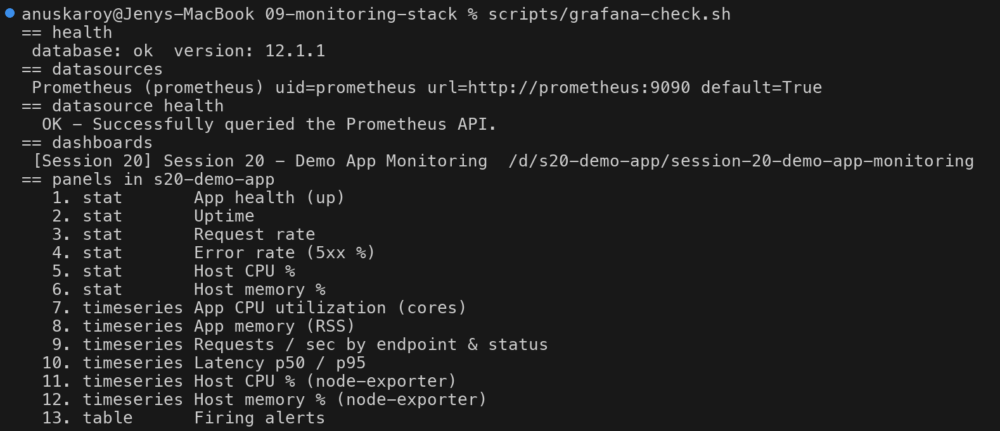

`scripts/grafana_query.py` sends the dashboard's own stat-panel queries through Grafana's
`/api/ds/query`. That is the same path a panel takes (Grafana, then the datasource, then
Prometheus):

```text
PANEL                        VALUE   HTTP status per query
App health (up)               1.00   200
Uptime                       64.81   200
Request rate                  7.13   200
Error rate (5xx %)           24.78   200
Host CPU %                   35.50   200
Host memory %                63.11   200
```

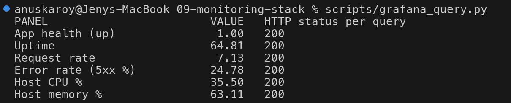

---

## PromQL cheat sheet

| Question | PromQL |
|---|---|
| Is it up? | `up{job="demo-app"}` |
| Requests / sec | `sum(rate(http_requests_total{job="demo-app"}[1m]))` |
| ...by endpoint & status | `sum by (endpoint,status) (rate(http_requests_total[1m]))` |
| Error ratio | `sum(rate(http_requests_total{status=~"5.."}[1m])) / sum(rate(http_requests_total[1m]))` |
| p95 latency | `histogram_quantile(0.95, sum by (le) (rate(http_request_duration_seconds_bucket[1m])))` |
| Average latency | `rate(http_request_duration_seconds_sum[1m]) / rate(http_request_duration_seconds_count[1m])` |
| App CPU (cores) | `rate(process_cpu_seconds_total{job="demo-app"}[1m])` |
| App memory (MiB) | `process_resident_memory_bytes{job="demo-app"} / 1024 / 1024` |
| Host CPU % | `100 * (1 - avg(rate(node_cpu_seconds_total{mode="idle"}[1m])))` |
| Host memory % | `100 * (1 - node_memory_MemAvailable_bytes / node_memory_MemTotal_bytes)` |
| App uptime (s) | `time() - app_start_time_seconds` |
| What's firing? | `ALERTS{alertstate="firing"}` |
| Top 3 endpoints by traffic | `topk(3, sum by (endpoint) (rate(http_requests_total[5m])))` |

Rules of thumb: always apply `rate()` to a **counter** before you sum it. Never `rate()` a
**gauge**. Keep `le` in the `by (...)` clause when you aggregate histogram buckets.

## Troubleshooting notes

- If a target shows `down` in Prometheus, run `docker compose ps` and then
  `curl localhost:8000/metrics`. Inside the compose network the targets are the service names
  (`demo-app:8000`), not `localhost`.
- To reload rules after editing `alert-rules.yml`, run `curl -X POST localhost:9090/-/reload`
  (enabled by `--web.enable-lifecycle`).
- If you get no notification although the alert is FIRING, check `scripts/alerts.py am`,
  `docker compose logs alertmanager` and the inhibit rule.
- On a heavily loaded laptop the Prometheus API can be slow, so the helper scripts use a
  30s HTTP timeout.

## Cleanup

```bash
curl -s localhost:8000/memory/release   # if a leak demo is still holding memory
docker compose down --rmi local         # stop everything, remove the built demo-app image
# also remove the pulled images:
docker image rm prom/prometheus:v3.5.0 prom/alertmanager:v0.28.1 prom/node-exporter:v1.9.1 grafana/grafana:12.1.1 python:3.12-slim
```

The stack uses no named volumes (Prometheus keeps 1 day of data inside its container), so
`down` leaves nothing behind.
