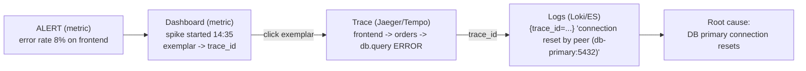
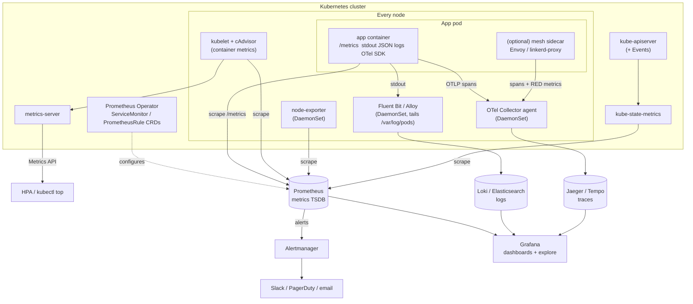

# 10 - Observability: Metrics, Logs & Traces (Task 2)

> Goal: understand the **three pillars of observability** - what each one is,
> why observability is required, which tools are used, and how all of this
> works on **Kubernetes**. Ends with a **real, runnable distributed-tracing demo**
> (the pillar that the Prometheus/Grafana demos do not cover).

Contents

1. [Monitoring vs Observability](#1-monitoring-vs-observability)
2. [The three pillars](#2-the-three-pillars)
   - [Metrics](#21-metrics) - [Logs](#22-logs) - [Traces](#23-traces)
   - [Side-by-side comparison](#24-side-by-side)
3. [Correlating the pillars](#3-correlating-the-pillars)
4. [Why observability is required](#4-why-observability-is-required)
5. [Common tools](#5-common-tools)
6. [Kubernetes observability](#6-kubernetes-observability)
7. [Hands-on demos in this repo](#7-hands-on-demos-in-this-repo)
8. [Quick revision / interview questions](#8-quick-revision)

---

## 1. Monitoring vs Observability

| | Monitoring | Observability |
|---|---|---|
| Question it answers | "**Is** the system healthy?" | "**Why** is the system behaving like this?" |
| Works for | **Known** failure modes (known-unknowns) - you decided in advance what to watch | **Unknown** failure modes (unknown-unknowns) - you ask *new* questions without shipping new code |
| Typical output | Dashboards, threshold alerts (`error_rate > 5%`) | Ad-hoc queries, drill-down from a symptom to a root cause |
| Data | Mostly pre-aggregated metrics | Metrics **+** logs **+** traces (+ profiles, events) with rich context |
| Relationship | Monitoring is something you **do** | Observability is a **property** of the system (how well its outputs explain its internal state) |

The term comes from control theory: a system is *observable* if you can infer
its internal state from its external outputs. In software, those outputs are
**telemetry** - metrics, logs and traces.

```text
Monitoring:     "p99 latency is 2.3s - ALERT"            (WHAT is wrong)
Observability:  "p99 is 2.3s only for /checkout, only on  (WHY it is wrong)
                 pods on node-7, only since v1.4.2, and
                 95% of that time is a db.query span on
                 the `orders` table"
```

You still need monitoring - observability *includes* it. Alerts tell you
**something** is broken; observability lets you find **what and why** quickly.

---

## 2. The three pillars

```text
                 ┌────────────── one user request ──────────────┐
                 │                                              │
   METRICS  ──►  counter++ , histogram.observe(0.21s)           │  "how much / how often?"
   LOGS     ──►  {"level":"ERROR","msg":"db query failed",...}  │  "what exactly happened?"
   TRACES   ──►  frontend → orders → db.query  (span tree)      │  "where did the time / error go?"
                 └──────────────────────────────────────────────┘
```

### 2.1 Metrics

**Definition** - numeric measurements, sampled or aggregated **over time**,
identified by a name and a set of key/value **labels**. Stored in a time-series
database (TSDB) such as Prometheus.

**Data shape** - this is the real Prometheus *exposition format* (captured from
our tracing-demo `frontend` at `/metrics`; `# HELP`/`# TYPE` lines and
`_created` series filtered out):

```text
frontend_orders_total{status="error"} 5.0
frontend_orders_total{status="ok"} 6.0
frontend_order_duration_seconds_bucket{le="0.05"} 0.0
frontend_order_duration_seconds_bucket{le="0.1"} 1.0
frontend_order_duration_seconds_bucket{le="0.25"} 8.0
frontend_order_duration_seconds_bucket{le="0.5"} 8.0
frontend_order_duration_seconds_bucket{le="1.0"} 10.0
frontend_order_duration_seconds_bucket{le="2.5"} 11.0
frontend_order_duration_seconds_bucket{le="5.0"} 11.0
frontend_order_duration_seconds_bucket{le="+Inf"} 11.0
frontend_order_duration_seconds_count 11.0
frontend_order_duration_seconds_sum 4.063602583999909
```

Each unique `name + label set` is one **time series**; Prometheus scrapes it
every N seconds and stores `(timestamp, value)` samples.

Metric types (Prometheus): **Counter** (only goes up: requests, errors),
**Gauge** (up and down: memory, queue length), **Histogram** (bucketed
distribution -> percentiles with `histogram_quantile`), **Summary**
(client-side quantiles).

**Questions it answers**

- How many requests per second? What is the error rate? What is p95/p99 latency?
- Is CPU / memory / disk trending towards a limit? (capacity planning)
- Did the error rate change after the 14:05 deploy?
- Should I page someone right now? (alerting)

**Pros**

- Very cheap per data point, fixed cost regardless of traffic (1 req/s and
  10 000 req/s cost the same: one counter).
- Fast to query over long time ranges -> dashboards, trends, SLOs.
- The natural source for **alerting** (PromQL + Alertmanager).

**Limits**

- Aggregated -> you lose the individual event. A metric tells you "3% of
  requests failed", not *which* request or *why*.
- Only answers questions you thought about when you chose the metric + labels.

**Cardinality / cost**

- Cost = number of **active time series** = product of label values.
  `http_requests_total{method, route, status}` with 5 x 50 x 10 = 2 500 series - fine.
- Add `user_id` (1M users) -> 2.5 **billion** series -> Prometheus OOMs.
- Rule: **never** put unbounded values (user id, email, request id, full URL,
  trace id) in metric labels. Put them in logs / traces instead.

---

### 2.2 Logs

**Definition** - timestamped, immutable records of **discrete events**, emitted
by applications, the OS, Kubernetes, load balancers, etc.

**Data shape** - prefer **structured (JSON) logs** over free text so they can be
filtered and joined. Real line from our tracing demo (`orders` service):

```json
{"ts": "2026-10-07T14:54:47", "level": "ERROR", "service": "orders",
 "msg": "db query failed", "trace_id": "778ce3cde940beb906a19a6004443a14",
 "span_id": "7850b6cd67f5ee58", "item": "fail",
 "error": "connection reset by peer (db-primary:5432)"}
```

Compare with an unstructured line - readable by a human, hard for a machine:

```text
2026-10-07 14:54:47 ERROR orders: db query failed for item fail (connection reset)
```

**Questions it answers**

- *What exactly* happened for this request / user / order id?
- What was the exception message and stack trace?
- Who did what and when? (audit, security)
- What did the app print right before it crashed? (`kubectl logs --previous`)

**Pros**

- Highest detail; any field, any value (high cardinality is fine).
- Every app already produces them; easy to start with.
- Essential for debugging, auditing, security forensics.

**Limits**

- **Volume and cost**: logs grow linearly with traffic (10x traffic = 10x logs).
  Ingest + index + retention is often the biggest observability bill.
- Hard to see the *big picture* or trends without aggregating them into metrics.
- A single log line does not tell you about the *other* services the request
  touched -> you need a shared `trace_id` to stitch them together.

**Cost notes**

- Use log **levels** and sample/drop noisy DEBUG logs in production.
- Loki indexes only labels (cheap) and greps content; Elasticsearch indexes
  every field (powerful, expensive). Keep Loki labels **low-cardinality**
  (`namespace`, `app`, `level`) - put ids inside the log line, not in labels.
- Set **retention** (e.g. 7-30 days hot, archive to S3 after).

---

### 2.3 Traces

**Definition** - a **trace** records the end-to-end journey of **one request**
through a distributed system. It is a tree of **spans**. A span is one timed
unit of work (an HTTP handler, an outgoing call, a DB query) with:

| Field | Meaning |
|---|---|
| `trace_id` | Same for every span in the request (128-bit) |
| `span_id` / `parent_span_id` | Builds the parent -> child tree |
| `name` / operation | e.g. `GET /order`, `db.query` |
| start time + duration | Where the time went |
| attributes (tags) | `http.status_code=500`, `db.system=postgresql` ... |
| status / events | `ERROR` + exception message & stack |
| `service.name` (resource) | Which service emitted it |

The context (`trace_id` + parent `span_id`) is **propagated** between services
in a header - the W3C standard is:

```text
traceparent: 00-778ce3cde940beb906a19a6004443a14-0ba3fb418deec38a-01
             ver  trace-id (16 bytes)              parent-span-id    sampled
```

**Data shape** - a real trace from our demo, printed with
[`tracing-demo/scripts/show-trace.py`](tracing-demo/scripts/show-trace.py) from the
Jaeger API (error case):

```text
trace_id=778ce3cde940beb906a19a6004443a14  spans=6  services=frontend,orders  total=196.9 ms
SERVICE    OPERATION                  DURATION    START+  SPAN_ID          PARENT           STATUS
frontend   GET /order                 196.9 ms     0.0ms  a59be29984fdf31d -                ERROR
frontend     └─ build-order-request     0.1 ms    36.4ms  2260d6cfa9d289b4 a59be29984fdf31d ok
frontend     └─ POST                  132.6 ms    63.5ms  0ba3fb418deec38a a59be29984fdf31d ERROR
orders         └─ POST /orders         71.6 ms   120.7ms  7850b6cd67f5ee58 0ba3fb418deec38a ERROR
orders           └─ validate-order      5.1 ms   130.1ms  f0ad28c8019a640d 7850b6cd67f5ee58 ok
orders           └─ db.query           54.3 ms   135.3ms  c5d4eac80476618c 7850b6cd67f5ee58 ERROR  (DBError: connection reset by peer (db-primary:5432))
```

(Operation column trimmed for width; same data as screenshot `10-06`.)

Read it top-down: the user hit `frontend`, which called `orders`, whose
`db.query` child span failed - the root cause is visible in one view, across
two processes/containers.

**Questions it answers**

- Which service / which call is making this request slow? (critical path)
- Where did this error **originate** (vs. where it was merely propagated)?
- What does the real call graph / service dependency map look like?
- Are we doing N+1 queries, sequential calls that could be parallel, retries?

**Pros**

- The only pillar that shows **causality across service boundaries**.
- Perfect for latency analysis in microservices.
- Auto-instrumentation (OpenTelemetry) gives you a lot with little code.

**Limits**

- Requires **instrumentation** + context propagation in *every* hop; one
  un-instrumented proxy breaks the chain.
- Volume is high (many spans per request) -> **sampling** is usually needed:
  - *head sampling* - decide at the start (e.g. keep 10%) - cheap, may miss rare errors;
  - *tail sampling* - decide after the trace finishes (keep all errors + slow
    traces) - better, done in the OpenTelemetry Collector, needs memory.
- Not great for long-term trends (use metrics for that).

---

### 2.4 Side by side

| | Metrics | Logs | Traces |
|---|---|---|---|
| Unit | Number in a time series | Event record | Request (tree of spans) |
| Answers | *Is* something wrong? How much? | *What* happened exactly? | *Where* / in which hop? |
| Cardinality tolerance | Low (labels must be bounded) | High | High (attributes) |
| Cost driver | # of active series | Bytes ingested / indexed | # spans (sampling rate) |
| Retention | Months/years (cheap, downsampled) | Days/weeks | Days |
| Typical tools | Prometheus, Mimir, Thanos | Loki, Elasticsearch | Jaeger, Tempo, Zipkin |
| Best for | Alerts, dashboards, SLOs | Debugging, audit | Latency, dependencies, root cause in microservices |

> Newer "signals" often added to the list: **events** (K8s events, deploys),
> **profiles** (continuous profiling - Pyroscope / Parca) - sometimes called
> the 4th pillar.

---

## 3. Correlating the pillars

The real power comes from **jumping between** pillars for the same request.
The glue is shared context: `trace_id`, `service`, `pod`, `namespace`, time.



Techniques:

1. **trace_id in every log line** - the logging formatter reads the current
   span context and adds `trace_id` / `span_id` (our demo does exactly this).
   In Grafana, a *derived field* on Loki turns that id into a link to Tempo/Jaeger.
2. **Exemplars** - a histogram sample in Prometheus can carry a sample
   `trace_id` (OpenMetrics syntax: `..._bucket{le="1"} 10 # {trace_id="ae4c..."} 1.21`;
   our demo does not emit exemplars - shown for illustration). Grafana
   shows them as dots on the latency graph -> click -> open the trace.
3. **Span metrics** - generate RED metrics *from* traces (OTel Collector
   `spanmetrics` connector, Tempo metrics-generator).
4. **Common resource attributes** - same `service.name`, `k8s.pod.name`,
   `k8s.namespace.name` on metrics, logs and traces (OTel `k8sattributes`
   processor adds them automatically).

Demonstrated for real in
[tracing-demo](tracing-demo/README.md):
the same `trace_id` appears in the HTTP response, in the `frontend` and
`orders` JSON logs, and in Jaeger.

---

## 4. Why observability is required

**1. Microservices & distributed systems.** One click on "Buy" may touch a
gateway, 6 services, 2 databases, a queue and a third-party API, running in
hundreds of short-lived pods. No single log file contains the story and you
cannot SSH into a pod that was rescheduled 5 minutes ago.

**2. Distributed failures are partial and emergent.** Things fail in
combination: a slow dependency + retries + a too-small connection pool ->
cascading timeouts. The symptom (frontend 502) appears far from the cause
(DB lock). Traces + correlated logs connect symptom to cause.

**3. Unknown-unknowns.** Dashboards cover failures you have seen before.
New failures (a bad deploy only on ARM nodes, one tenant with huge payloads)
need *ad-hoc questions* over rich, high-cardinality data.

**4. MTTD and MTTR.**

| Metric | Meaning | How observability helps |
|---|---|---|
| **MTTD** - Mean Time To Detect | Problem starts -> someone knows | Good metrics + SLO-based alerts |
| **MTTR** - Mean Time To Resolve/Recover | Detect -> fixed | Traces + logs pinpoint the root cause instead of guessing |

Downtime cost is roughly `incidents x (MTTD + MTTR) x cost/minute`, so cutting
MTTR from 2 hours to 10 minutes is a direct business win.

**5. SLIs, SLOs and error budgets** - the language between engineering and the business.

- **SLI** (indicator) - a measured ratio, e.g.
  `good requests / total requests` where good = HTTP < 500 **and** latency < 300 ms.
  ```promql
  sum(rate(http_requests_total{code!~"5.."}[5m])) / sum(rate(http_requests_total[5m]))
  ```
- **SLO** (objective) - target for the SLI over a window: *99.9% over 30 days*.
- **SLA** (agreement) - contractual promise to customers, with penalties (looser than the SLO).
- **Error budget** = `100% - SLO` = 0.1% of 30 days ≈ **43 minutes** of allowed
  "badness". Budget left -> ship features fast; budget burned -> freeze risky
  releases and invest in reliability. Alert on **burn rate**, not raw thresholds.

**6. Where to look first - the standard methods**

| Method | For | Signals |
|---|---|---|
| **Four Golden Signals** (Google SRE) | Any user-facing service | **Latency**, **Traffic**, **Errors**, **Saturation** |
| **RED** (Tom Wilkie) | Request-driven services / microservices | **Rate**, **Errors**, **Duration** |
| **USE** (Brendan Gregg) | Resources: CPU, memory, disk, network, pools | **Utilization**, **Saturation**, **Errors** |

Example: RED for `frontend` -> `rate(frontend_orders_total[5m])`, error ratio
on `status="error"`, `histogram_quantile(0.95, rate(frontend_order_duration_seconds_bucket[5m]))`.
USE for a node -> CPU utilization, load average/run-queue (saturation), NIC errors.

**7. Other reasons** - capacity planning & cost (right-sizing requests/limits),
safe deployments (compare canary vs stable), security & audit (logs),
and understanding real user behaviour.

---

## 5. Common tools

| Tool | Pillar(s) | Purpose |
|---|---|---|
| **Prometheus** | Metrics | Pull-based scraping, TSDB, PromQL, alert rules. CNCF graduated, the K8s default |
| **Alertmanager** | Metrics -> alerts | Dedup, group, silence, route alerts to Slack/PagerDuty/email/webhook |
| **Grafana** | All (visualisation) | Dashboards over Prometheus, Loki, Tempo, Jaeger, ES, CloudWatch...; also Grafana Alerting |
| **Thanos / Cortex / Mimir / VictoriaMetrics** | Metrics | Long-term, HA, multi-cluster Prometheus storage |
| **node-exporter** | Metrics | Host (node) CPU, memory, disk, network metrics |
| **Loki** | Logs | "Prometheus for logs" - indexes labels only, cheap; queried with LogQL |
| **ELK / EFK** (Elasticsearch + Logstash/Fluentd + Kibana) | Logs (+ APM) | Full-text indexed log search and analytics |
| **Fluent Bit / Fluentd** | Logs (shipping) | Node agents that tail container logs, parse, enrich with K8s metadata, forward |
| **Promtail / Grafana Alloy / Vector / Filebeat** | Logs (shipping) | Alternative log collectors (Promtail -> Loki, now replaced by Alloy) |
| **Jaeger** | Traces | Distributed tracing backend + UI (CNCF graduated, originally Uber). Used in our demo |
| **Grafana Tempo** | Traces | Cheap trace storage on object storage (S3/GCS), TraceQL, integrates with Loki/Prometheus |
| **Zipkin** | Traces | The original open-source tracer (Twitter), B3 propagation headers |
| **OpenTelemetry (OTel)** | All three | **Vendor-neutral standard**: APIs/SDKs, auto-instrumentation, OTLP protocol and the **Collector** (receive -> process -> export). Instrument once, send anywhere |
| **Pyroscope / Parca** | Profiles | Continuous profiling (the "4th pillar") |
| **Datadog** | All (SaaS) | Commercial full-stack: infra, APM, logs, RUM, security |
| **New Relic / Dynatrace / Splunk Observability / Honeycomb** | All (SaaS) | Commercial APM / observability platforms |
| **AWS CloudWatch (+ X-Ray)** | Metrics, logs (+ traces) | AWS native; Azure Monitor / App Insights and Google Cloud Operations are the equivalents |
| **Sentry** | Errors (+ traces) | Exception tracking with stack traces and releases |

Typical open-source "LGTM" stack: **L**oki (logs) + **G**rafana + **T**empo
(traces) + **M**imir/Prometheus (metrics), with OpenTelemetry for collection.

---

## 6. Kubernetes observability

Kubernetes adds layers that each need watching: **cluster** (control plane,
nodes), **workloads** (pods, deployments), **containers**, and the
**applications** inside them - all of which are ephemeral.

### 6.1 Metrics in Kubernetes

| Component | What it provides | Notes |
|---|---|---|
| **cAdvisor** (inside every kubelet) | Per-container CPU, memory, network, filesystem usage | Scraped at `/metrics/cadvisor` on the kubelet. `container_cpu_usage_seconds_total`, `container_memory_working_set_bytes` |
| **metrics-server** | Short-term CPU/memory in the **Metrics API** (`metrics.k8s.io`) | Powers `kubectl top` and the **HPA**. In-memory, *not* for dashboards/history |
| **kube-state-metrics** | State of K8s **objects** from the API server | `kube_pod_status_phase`, `kube_deployment_status_replicas_available`, `kube_pod_container_status_restarts_total` - "how many replicas are ready?" not "how much CPU?" |
| **node-exporter** (DaemonSet) | Host-level metrics of each node | CPU, memory, disk, filesystem, network |
| **Control-plane endpoints** | apiserver, etcd, scheduler, controller-manager, CoreDNS metrics | Request latency of the API server, etcd health |
| **Application `/metrics`** | Your business/RED metrics | Instrumented with Prometheus client / OTel |

```bash
minikube addons enable metrics-server     # or install the chart
kubectl top nodes
kubectl top pods -A --sort-by=memory
```

**kube-prometheus-stack** (Helm chart) bundles Prometheus **Operator**,
Prometheus, Alertmanager, Grafana, node-exporter, kube-state-metrics and
ready-made dashboards + alert rules. The Operator adds CRDs so monitoring
config is declarative (and GitOps-friendly):

```yaml
apiVersion: monitoring.coreos.com/v1
kind: ServiceMonitor            # "scrape every Service with label app=orders"
metadata:
  name: orders
  labels: { release: kube-prometheus-stack }   # so Prometheus picks it up
spec:
  selector:
    matchLabels: { app: orders }
  endpoints:
    - port: http
      path: /metrics
      interval: 15s
```

Other CRDs: `PodMonitor`, `PrometheusRule` (alert/recording rules),
`AlertmanagerConfig`.

### 6.2 Logs in Kubernetes

- Containers write to **stdout/stderr**; the container runtime stores them on
  the node under `/var/log/pods/<ns>_<pod>_<uid>/<container>/N.log`
  (symlinked from `/var/log/containers/`). The kubelet rotates them.
- `kubectl logs` reads those files - fine for one pod, but logs are **lost when
  the pod/node is gone**:
  ```bash
  kubectl logs deploy/orders -f                 # follow
  kubectl logs pod/orders-xyz --previous        # crashed container
  kubectl logs -l app=orders --all-containers --since=10m
  ```
- Production pattern = **node-level agent as a DaemonSet** (Fluent Bit,
  Promtail/Alloy, Vector, Filebeat) mounts `/var/log`, tails all container
  logs, adds K8s metadata (namespace, pod, labels) and ships them to
  **Loki** or **Elasticsearch/OpenSearch** (or CloudWatch etc.).
- Alternatives: sidecar container per pod (for apps that only write to
  files), or the app pushes directly via OTLP.

### 6.3 Kubernetes events & probes

- **Events** explain *why* the cluster did something - scheduling failures,
  image pull errors, OOMKilled, failed probes, HPA scaling. They are kept only
  ~1 hour, so export them (kube-events-exporter, OTel `k8sobjects` receiver,
  Grafana Alloy) if you want history.
  ```bash
  kubectl get events -A --sort-by=.lastTimestamp
  kubectl describe pod orders-xyz      # Events section at the bottom
  ```
- **Probes** are the kubelet's own health checks and feed back into the
  observability picture: **liveness** (restart if dead -> restart count
  metric), **readiness** (remove from Service endpoints), **startup** (protect
  slow starters). Failing probes show up as events and in
  `kube_pod_container_status_restarts_total`.

### 6.4 Traces in Kubernetes

- Apps are instrumented with **OpenTelemetry** SDKs (manual) or
  **auto-instrumentation**: the **OpenTelemetry Operator** injects agents into
  Java/Python/Node/.NET/Go pods via an annotation:
  ```yaml
  metadata:
    annotations:
      instrumentation.opentelemetry.io/inject-python: "true"
  ```
- Spans are sent (OTLP) to an **OpenTelemetry Collector** deployed as:
  - **DaemonSet / agent** (one per node, low latency, adds `k8sattributes`),
  - **sidecar** (one per pod, injected by the operator),
  - **Deployment / gateway** (central: tail sampling, batching, export).
- The Collector exports to **Jaeger**, **Tempo**, or a vendor (Datadog, etc.).
- **Service mesh** (Istio, Linkerd) - the Envoy/linkerd2-proxy sidecars emit
  RED metrics and spans for every hop **without code changes**, plus mTLS and
  a service graph (Kiali). The app must still forward the trace headers for
  spans to join into one trace.
- **eBPF** tools (Cilium Hubble, Pixie, Grafana Beyla) can observe traffic at
  kernel level with zero instrumentation.

### 6.5 Architecture



### 6.6 A practical K8s checklist

- [ ] metrics-server installed (HPA, `kubectl top`)
- [ ] kube-prometheus-stack (Prometheus + Alertmanager + Grafana + kube-state-metrics + node-exporter)
- [ ] Every app exposes `/metrics` (RED) and has a `ServiceMonitor`
- [ ] JSON logs to stdout with `trace_id`; Fluent Bit/Alloy DaemonSet -> Loki/ES
- [ ] OpenTelemetry SDK or Operator auto-instrumentation -> OTel Collector -> Jaeger/Tempo
- [ ] Liveness/readiness/startup probes + resource requests/limits on every container
- [ ] SLOs defined, burn-rate alerts routed through Alertmanager
- [ ] Dashboards & alert rules stored in Git (GitOps - see 05-07 / Argo CD)

---

## 7. Hands-on demos in this repo

| Pillar | Demo | What it shows |
|---|---|---|
| Metrics + alerts | [`../09-monitoring-stack`](../09-monitoring-stack) | docker-compose Prometheus (9090), Alertmanager (9093), Grafana (3000), demo app (8000), node-exporter |
| Metrics / logs / alerts on K8s | [`../11-k8s-monitoring`](../11-k8s-monitoring) | Monitoring on the `session20` minikube cluster |
| GitOps | [`../12-gitops-argocd-demo`](../12-gitops-argocd-demo) | Argo CD syncing manifests from Git |
| **Traces** (+ log & metric correlation) | [**`tracing-demo/`**](tracing-demo/README.md) | Jaeger + two OpenTelemetry-instrumented Python services; multi-span distributed traces, slow & error traces, `trace_id` in logs |

### Tracing demo - highlights (real output)

`frontend` (host :8081) -> HTTP + `traceparent` -> `orders` -> `db.query`
(simulated). Both services export spans with OTLP to Jaeger (:16686).

Containers up:


Services discovered by Jaeger and recent traces (from Jaeger's HTTP API):


A slow request - the span tree shows the time is spent in `orders -> db.query`:


An error trace - the error originates in `db.query` and propagates up:


Log <-> trace correlation - the same `trace_id` in both services' logs:


All three pillars for one request:


Full walkthrough and all screenshots: [tracing-demo/README.md](tracing-demo/README.md).

---

## 8. Quick revision

- **Monitoring** = is it broken (known problems). **Observability** = why (unknown problems).
- **Metrics** - cheap numbers over time; alerts & trends; keep labels low-cardinality.
- **Logs** - detailed events; structured JSON; expensive at volume; include `trace_id`.
- **Traces** - one request across services as a span tree; propagated via `traceparent`; sample.
- Correlate with `trace_id`, exemplars, shared resource attributes.
- Golden signals (latency, traffic, errors, saturation); RED for services; USE for resources.
- SLI -> SLO -> error budget -> burn-rate alerts; aim to reduce MTTD and MTTR.
- K8s: metrics-server (`kubectl top`, HPA) vs kube-state-metrics (object state) vs
  cAdvisor (container usage) vs node-exporter (host); kube-prometheus-stack +
  ServiceMonitor; DaemonSet log agents -> Loki/ES; OTel Operator + Collector -> Jaeger/Tempo.

Interview-style questions:

1. Why shouldn't you put `user_id` in a Prometheus label? -> cardinality explosion.
2. Difference between metrics-server and kube-state-metrics? -> resource *usage* (Metrics API) vs object *state*.
3. How does a trace cross a service boundary? -> context propagation in HTTP headers (`traceparent`).
4. Head vs tail sampling? -> decide at start (cheap) vs after completion (keeps errors/slow traces).
5. How do you jump from a log line to a trace? -> `trace_id` in the log + Grafana derived field / Jaeger search.
6. What is an error budget? -> `1 - SLO`; the amount of unreliability you may "spend".
