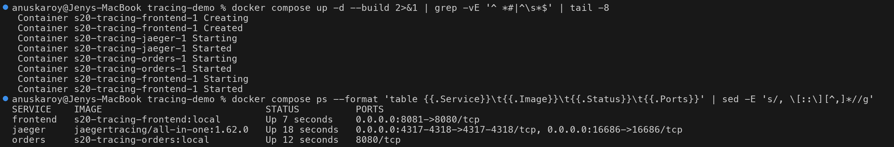
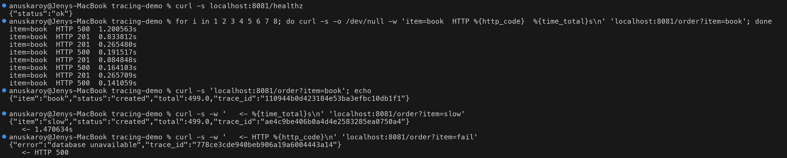
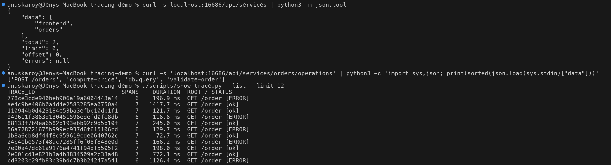
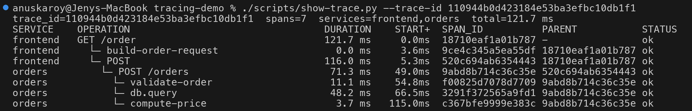
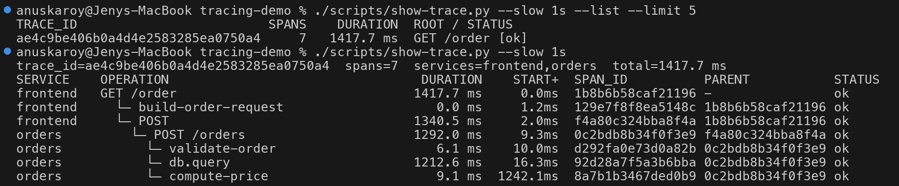
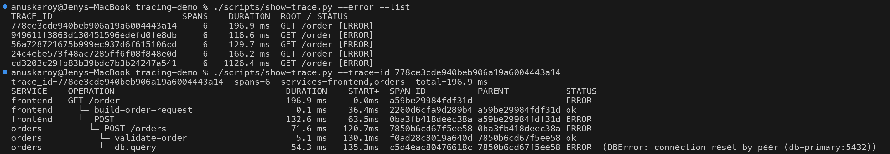
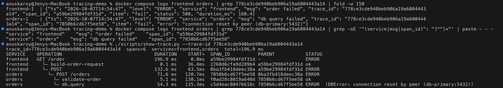
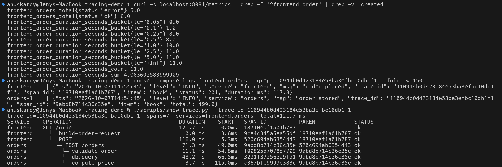
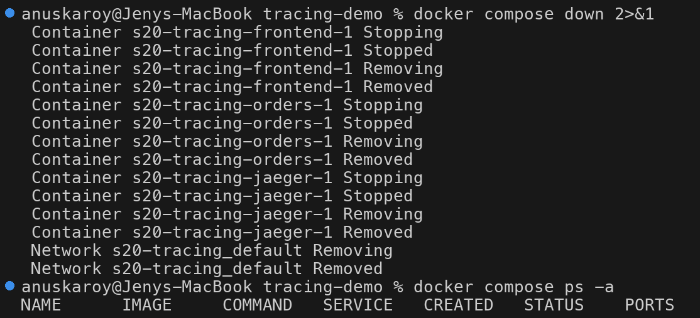

# Tracing demo - the 3rd pillar (Jaeger + OpenTelemetry)

A small, real, runnable **distributed tracing** setup: two Python (Flask)
microservices instrumented with **OpenTelemetry**, sending spans over **OTLP**
to **Jaeger all-in-one**. One HTTP request produces **one trace with 6-7 spans
across 2 services**. Every log line carries the `trace_id`, and `frontend`
also exposes Prometheus metrics, so you can see **all three pillars for the
same request**.

```text
 curl :8081/order?item=book
        │
        ▼
 ┌─────────────┐   HTTP POST /orders     ┌──────────────┐
 │  frontend   │ ──────────────────────► │    orders    │
 │ (Flask)     │  traceparent: 00-<trace_id>-<span_id>-01
 │ /metrics    │                         │ validate-order
 └──────┬──────┘                         │ db.query  (sleep; slow / error)
        │ OTLP/HTTP :4318                │ compute-price
        ▼                                └──────┬───────┘
 ┌──────────────────────────────┐               │ OTLP/HTTP :4318
 │ Jaeger all-in-one 1.62.0     │ ◄─────────────┘
 │ UI + query API :16686        │
 └──────────────────────────────┘
```

## Files

| File | Purpose |
|---|---|
| `docker-compose.yml` | Jaeger (16686, 4317, 4318), `orders` (internal 8080), `frontend` (host **8081**). Memory limits keep it light (~85 MB used in total) |
| `frontend/app.py` | `GET /order?item=` -> calls `orders`; OTel Flask + `requests` auto-instrumentation, one manual span, JSON logs with `trace_id`, Prometheus counter + histogram on `/metrics` |
| `orders/app.py` | `POST /orders` with child spans `validate-order`, `db.query` (CLIENT span, `db.*` attributes), `compute-price` |
| `frontend/Dockerfile`, `orders/Dockerfile` | `python:3.12-slim` based images, built locally |
| `scripts/show-trace.py` | Stdlib-only helper: queries Jaeger's HTTP API and prints a trace as an indented span tree (service, operation, duration, start offset, span id, parent, status) |

Behaviour knobs in `orders`:

| Request | What happens |
|---|---|
| `?item=book` (anything) | normal: `db.query` sleeps 20-80 ms |
| `?item=slow` | `db.query` sleeps **1.2 s** (simulated missing index / lock wait) |
| `?item=fail` | `db.query` raises `DBError` -> span status ERROR + exception event -> HTTP 500 |
| `ERROR_RATE=0.1` (compose env) | ~10% of *any* request fails randomly ("occasional" production errors) |

## How the instrumentation works

1. Each service creates a `TracerProvider` with `service.name` and a
   `BatchSpanProcessor(OTLPSpanExporter())`. The exporter endpoint comes from
   `OTEL_EXPORTER_OTLP_ENDPOINT=http://jaeger:4318` (OTLP over HTTP).
2. `FlaskInstrumentor` creates a SERVER span for each incoming request
   (`GET /order`, `POST /orders`), `RequestsInstrumentor` creates a CLIENT
   span (`POST`) for the outgoing call **and injects the W3C `traceparent`
   header**, which the `orders` Flask instrumentation extracts - that is how
   both services end up in the same trace.
3. Business steps are manual spans: `tracer.start_as_current_span("db.query")`.
   Errors call `span.record_exception()` + `span.set_status(ERROR)`.
4. A custom `logging.Formatter` reads `trace.get_current_span().get_span_context()`
   and adds `trace_id` / `span_id` to every JSON log line -> **log <-> trace correlation**.
5. `/metrics` and `/health*` are excluded from tracing (something on the host
   was polling `GET /health` and producing noise traces during the demo).

## Run it

```bash
cd session20-monitoring-observability-gitops/10-observability/tracing-demo
docker compose up -d --build
curl -s 'localhost:8081/order?item=book'
curl -s 'localhost:8081/order?item=slow'
curl -s 'localhost:8081/order?item=fail'

./scripts/show-trace.py --services          # services known to Jaeger
./scripts/show-trace.py --list --limit 10   # recent traces (one line each)
./scripts/show-trace.py --slow 1s           # newest successful trace > 1s
./scripts/show-trace.py --error             # newest trace containing an error
./scripts/show-trace.py --trace-id <id>     # any trace by id
docker compose logs frontend orders | grep <trace_id>

open http://localhost:16686                 # Jaeger UI: Search -> Service=frontend
docker compose down
```

Requires only Docker (Compose v2) and `python3` on the host (the helper uses
the standard library only). The Jaeger image is multi-arch, tested on Apple
Silicon (arm64).

## Real output

All screenshots below were produced by actually running the commands (the
command is shown on the prompt line). Note: durations are inflated because the
laptop was also running a minikube cluster and a Prometheus/Grafana stack at
the same time - which nicely illustrates why latency must be measured per hop.

### 1. Start the stack



### 2. Send requests

8 normal requests (some hit the random 10% error -> HTTP 500), then one
normal, one slow and one failing request. The response includes the `trace_id`.



### 3. Jaeger knows both services and all 11 traces

`/api/services`, `/api/services/orders/operations` and `/api/traces?service=frontend`
(via `show-trace.py --list`):



### 4. A normal trace - 7 spans across 2 services



```text
trace_id=110944b0d423184e53ba3efbc10db1f1  spans=7  services=frontend,orders  total=121.7 ms
SERVICE    OPERATION                                 DURATION    START+  SPAN_ID          PARENT           STATUS
frontend   GET /order                                121.7 ms     0.0ms  18710eaf1a01b787 -                ok
frontend     └─ build-order-request                    0.0 ms     3.6ms  9ce4c345a5ea55df 18710eaf1a01b787 ok
frontend     └─ POST                                 116.0 ms     5.3ms  520c694ab6354443 18710eaf1a01b787 ok
orders         └─ POST /orders                        71.3 ms    49.0ms  9abd8b714c36c35e 520c694ab6354443 ok
orders           └─ validate-order                    11.1 ms    54.8ms  f00825d7078d7709 9abd8b714c36c35e ok
orders           └─ db.query                          48.2 ms    66.5ms  3291f372565a9fd1 9abd8b714c36c35e ok
orders           └─ compute-price                      3.7 ms   115.0ms  c367bfe9999e383c 9abd8b714c36c35e ok
```

Note how the `orders` root span `POST /orders` has the `frontend` CLIENT span
`POST` (`520c694ab6354443`) as its **parent** - that link was carried in the
`traceparent` header.

### 5. A slow trace - where did 1.4 s go?

`--slow 1s` uses Jaeger's `minDuration` filter. The tree shows instantly that
1212 ms of the 1418 ms is `orders -> db.query`, not the frontend or the network:



```text
trace_id=ae4c9be406b0a4d4e2583285ea0750a4  spans=7  services=frontend,orders  total=1417.7 ms
frontend   GET /order                               1417.7 ms     0.0ms  1b8b6b58caf21196 -                ok
frontend     └─ POST                                1340.5 ms     2.0ms  f4a80c324bba8f4a 1b8b6b58caf21196 ok
orders         └─ POST /orders                      1292.0 ms     9.3ms  0c2bdb8b34f0f3e9 f4a80c324bba8f4a ok
orders           └─ db.query                        1212.6 ms    16.3ms  92d28a7f5a3b6bba 0c2bdb8b34f0f3e9 ok
```
(excerpt)

### 6. An error trace - where did the 500 come from?

The error is visible on every ancestor span, but the tree shows it
**originates** in `db.query` (the exception message is a span event /
status description). `compute-price` never ran, so the trace has 6 spans.



### 7. Log <-> trace correlation (same trace_id)

`grep` the `trace_id` from the error trace in the container logs: one line
from each service. Even the `span_id`s match spans in the trace:
`a59be29984fdf31d` = frontend `GET /order`, `7850b6cd67f5ee58` = orders `POST /orders`.



```text
frontend-1  | {"ts": "2026-10-07T14:54:47", "level": "ERROR", "service": "frontend", "msg": "order failed", "trace_id": "778ce3cde940beb906a19a6004443a14", "span_id": "a59be29984fdf31d", "item": "fail", "status": 500, "duration_ms": 160.4}
orders-1    | {"ts": "2026-10-07T14:54:47", "level": "ERROR", "service": "orders", "msg": "db query failed", "trace_id": "778ce3cde940beb906a19a6004443a14", "span_id": "7850b6cd67f5ee58", "item": "fail", "error": "connection reset by peer (db-primary:5432)"}
```

In a real stack the logs go to Loki/Elasticsearch and Grafana turns the
`trace_id` field into a clickable link to Jaeger/Tempo.

### 8. Three pillars for one request

For request `110944b0...`:
**metrics** (`frontend_orders_total`, latency histogram - aggregated, it is
one of the 11 counted requests), **logs** (two JSON lines with its
`trace_id`), **trace** (the 7-span tree).



Metrics say *how many* failed (5 of 11) and *how slow* (8 of 11 under 250 ms);
logs say *what* happened; the trace says *where*.

### 9. Clean up



## Going further

- Replace Jaeger with **Grafana Tempo** and add **Loki** -> click from a log line to its trace in Grafana.
- Put an **OpenTelemetry Collector** between the apps and Jaeger for tail sampling (keep all errors + slow traces).
- On Kubernetes: the OTel **Operator** can auto-instrument pods with an annotation
  (`instrumentation.opentelemetry.io/inject-python: "true"`) - see the main
  [observability README](../README.md#64-traces-in-kubernetes).
