# 11 - Kubernetes Monitoring (Task 1 on Kubernetes)

## Goal

Section 09 showed the Task 1 signals with Docker Compose and Prometheus. This section shows the
same six signals using only the tools that come with Kubernetes: `kubectl`, metrics-server,
probes, events and the HPA. All of it runs on a small single-node minikube cluster.

| Signal | Kubernetes source | Section |
|---|---|---|
| CPU utilization | `kubectl top nodes/pods` (metrics-server), compared with requests/limits | [1](#1-metrics-cpu--memory-utilization) |
| Memory utilization | `kubectl top` working-set memory, compared with requests/limits | [1](#1-metrics-cpu--memory-utilization) |
| Logs | `kubectl logs` (`--tail`, `-l`, `--prefix`, `--timestamps`, `--previous`) | [2](#2-logs) |
| Application health | liveness and readiness probes, pod conditions, Service endpoints | [3](#3-application-health-liveness--readiness-probes) |
| Alert-like signals | `kubectl get events --field-selector type=Warning` | [4](#4-events-as-alert-signals) |
| Alerts | `scripts/check-alerts.sh`: threshold rules on top of `kubectl top` | [5](#5-alerts-threshold-script) |
| Automated reaction | HorizontalPodAutoscaler scaling on a CPU threshold | [6](#6-automated-reaction-hpa) |

The busybox log generator is the same one used in `../02-metrics-logs-traces/k8s-demo`. Here it
runs in its own namespace and has resource requests and limits.

---

## Files

```text
11-k8s-monitoring/
├── manifests/
│   ├── 00-namespace.yaml       # namespace monitoring-demo
│   ├── 01-log-demo.yaml        # busybox: prints "Request received"/"Health check OK" every 10s
│   ├── 02-web-app.yaml         # nginx x2 + Service; livenessProbe /healthz, readinessProbe /ready
│   ├── 03-cpu-burner.yaml      # busy loop, CPU limit 250m, used to make the alert fire
│   ├── 04-web-hpa.yaml         # HPA: web 2..4 replicas at 50% CPU of the request
│   └── 05-load-generator.yaml  # wget loop against the web Service, used to drive the HPA
├── scripts/
│   └── check-alerts.sh         # "alert rule": ALERT when a pod is over a CPU (m) / memory (Mi) threshold
└── screenshots/                # 11-01 ... 11-11
```

Design notes:

* All workloads are deliberately tiny: requests of 10–50m CPU and 8–32Mi memory, and limits of at most 250m and 64Mi.
* The nginx start command writes two files, `/usr/share/nginx/html/healthz` and `/usr/share/nginx/html/ready`. The liveness probe checks the first and the readiness probe checks the second. Deleting either file with `kubectl exec` breaks that one probe on purpose.
* The probes use `timeoutSeconds: 3`. The default is 1s, and with that value the busy demo node made even the healthy pods time out (see [Problems seen](#problems-seen-during-the-run)).

---

## Setup

```bash
# Dedicated minikube profile; Docker driver; arm64 images only (busybox, nginx:alpine)
minikube start -p session20 --driver=docker --cpus=2 --memory=1800 --nodes=1
minikube -p session20 addons enable metrics-server

# Every command uses an explicit context, so other clusters are never affected
kubectl --context session20 apply -f manifests/00-namespace.yaml -f manifests/01-log-demo.yaml \
  -f manifests/02-web-app.yaml -f manifests/03-cpu-burner.yaml
kubectl --context session20 -n monitoring-demo wait --for=condition=Ready pod --all --timeout=120s
```

The screenshot was taken on a second `apply`, so the output says "unchanged". The first apply
printed `namespace/monitoring-demo created`, `deployment.apps/web created` and so on.

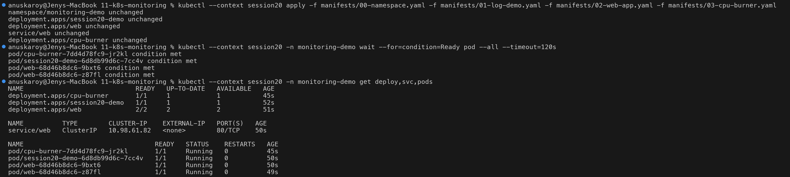

---

## 1. Metrics: CPU & memory utilization

metrics-server reads the kubelet's cAdvisor stats about every 15s and serves them through the
`metrics.k8s.io` API. `kubectl top` reads from that API.

```bash
kubectl --context session20 get apiservice v1beta1.metrics.k8s.io
kubectl --context session20 top nodes
kubectl --context session20 top pods -n monitoring-demo
kubectl --context session20 top pods -n monitoring-demo --containers --sort-by=cpu
```

```text
NAME        CPU(cores)   CPU(%)   MEMORY(bytes)   MEMORY(%)
session20   2002m        25%      1125Mi          28%

NAME                              CPU(cores)   MEMORY(bytes)
cpu-burner-7dd4d78fc9-jr2kl       180m         0Mi
session20-demo-6d8db99d6c-7cc4v   1m           0Mi
web-68d46b8dc6-9bxt6              2m           7Mi
web-68d46b8dc6-z87fl              3m           7Mi
```

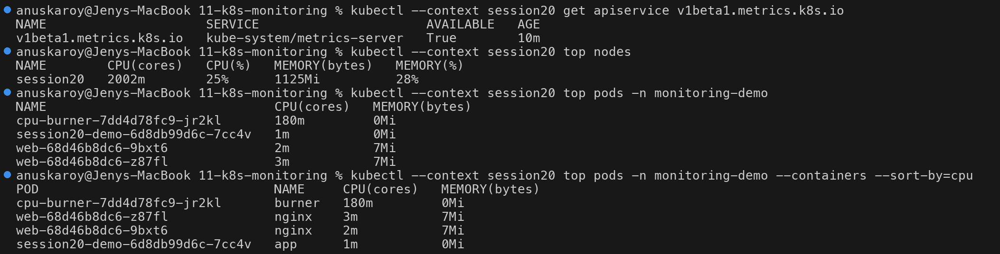

Notes:

* With the Docker driver, the node reports the whole Docker Desktop VM (8 vCPU, about 3.9 GiB). For that reason `CPU(%)` and `MEMORY(%)` are percentages of the VM, not of `--cpus=2 --memory=1800`. Most of the 2002m comes from the control plane and Argo CD, which was starting on the same cluster at the time.
* `CPU(cores)` is millicores; `250m` is a quarter of a core. Memory is the working set, which is what the OOM killer looks at.

### Requests/limits vs. actual usage

```bash
kubectl --context session20 -n monitoring-demo get pods -o custom-columns='POD:.metadata.name,CPU_REQ:...,CPU_LIM:...,MEM_REQ:...,MEM_LIM:...'
kubectl --context session20 top pods -n monitoring-demo --sort-by=cpu
kubectl --context session20 describe node session20 | grep -A 12 'Allocated resources'
```

```text
POD                               CPU_REQ   CPU_LIM   MEM_REQ   MEM_LIM
cpu-burner-7dd4d78fc9-jr2kl       50m       250m      8Mi       16Mi
web-68d46b8dc6-9bxt6              20m       200m      32Mi      64Mi
...
cpu-burner-7dd4d78fc9-jr2kl       180m      <- 3.6x its request; capped (throttled) by the 250m limit
```

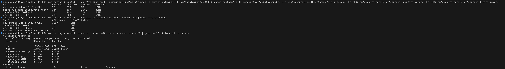

How to read this:

* **Requests** are what the scheduler reserves for the pod; "Allocated resources" on the node is the sum of all requests.
* **Limits** are enforced at runtime. A pod that goes over its **CPU** limit is throttled. A pod that goes over its **memory** limit is OOMKilled, which shows up as `Reason: OOMKilled` and an increased restart count.
* If usage stays far above the request (cpu-burner), the request is too low. If usage stays far below it (web), the request wastes capacity. Comparing usage against requests like this is the basis of right-sizing, and it is also what the HPA's "% utilization" is measured against.

---

## 2. Logs

Kubernetes saves each container's stdout and stderr on the node. `kubectl logs` streams them
from the kubelet.

```bash
kubectl --context session20 -n monitoring-demo logs deploy/session20-demo --tail=6
kubectl --context session20 -n monitoring-demo logs deploy/session20-demo --tail=2 --timestamps
kubectl --context session20 -n monitoring-demo logs -l app=web --tail=3 --prefix   # all pods of a label
kubectl --context session20 -n monitoring-demo logs deploy/cpu-burner
```

```text
2026-10-07T16:28:13.748032591Z Request received
2026-10-07T16:28:13.748159257Z Health check OK
[pod/web-68d46b8dc6-9bxt6/nginx] 10.244.0.1 - - [07/Oct/2026:16:28:12 +0000] "GET /healthz HTTP/1.1" 200 3 "-" "kube-probe/1.37" "-"
```

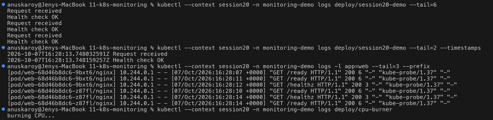

The nginx access log shows the kubelet itself (`kube-probe/1.37`) calling `/healthz` and `/ready`
every 5 seconds. The probes are ordinary HTTP requests.

The `--previous` flag (shown in section 3) prints the logs of the **last terminated** container.
This is how you find out why a container crashed or was restarted.

---

## 3. Application health: liveness & readiness probes

| Probe | Question it answers | What Kubernetes does on failure |
|---|---|---|
| `livenessProbe` GET `/healthz` | "Is the process stuck or broken?" | **Restarts** the container after `failureThreshold` (3 × 5s) |
| `readinessProbe` GET `/ready` | "Can it serve traffic right now?" | Marks the pod **NotReady** and **removes it from Service endpoints**. No restart. |

### 3a. Break liveness: the container is restarted

```bash
kubectl --context session20 -n monitoring-demo exec web-98f559cb-5k52g -- rm /usr/share/nginx/html/healthz
```

```text
NAME                 READY   STATUS    RESTARTS     AGE
web-98f559cb-5k52g   0/1     Running   1 (4s ago)   92s
web-98f559cb-t5mbt   1/1     Running   0            6m56s
...
Normal    Killing     pod/web-98f559cb-5k52g   Container nginx failed liveness probe, will be restarted
```

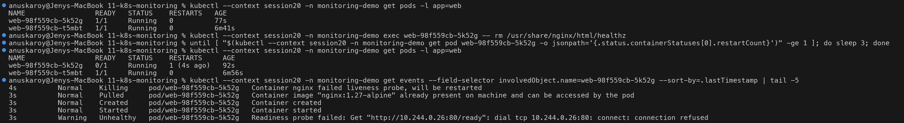

```bash
kubectl ... get events --field-selector involvedObject.name=web-98f559cb-5k52g,type=Warning
kubectl ... logs web-98f559cb-5k52g --previous | grep 'GET /healthz' | tail -4
```

```text
Warning   Unhealthy   pod/web-98f559cb-5k52g   Liveness probe failed: HTTP probe failed with statuscode: 404
...
open() "/usr/share/nginx/html/healthz" failed (2: No such file or directory) ... "GET /healthz HTTP/1.1"
10.244.0.1 - - [07/Oct/2026:16:41:46 +0000] "GET /healthz HTTP/1.1" 404 153 "-" "kube-probe/1.37" "-"
```

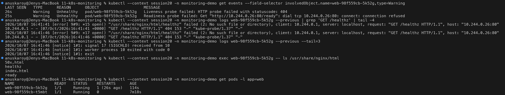

The pod repairs itself. The restart runs the start command again, which recreates `healthz`, so
the pod returns to `1/1 Running` with `RESTARTS 1`. The restart count is the signal to watch: a
count that keeps rising is what turns into `CrashLoopBackOff`.

### 3b. Break readiness: the pod is taken out of the load balancer

```bash
kubectl --context session20 -n monitoring-demo exec web-98f559cb-t5mbt -- rm /usr/share/nginx/html/ready
kubectl --context session20 -n monitoring-demo wait --for=condition=Ready=false pod/web-98f559cb-t5mbt
kubectl --context session20 -n monitoring-demo get endpointslices -l kubernetes.io/service-name=web -o jsonpath=...
```

```text
# before                                       # after
10.244.0.16  pod=web-98f559cb-t5mbt  ready=true   ->  ready=false
10.244.0.26  pod=web-98f559cb-5k52g  ready=true   ->  ready=true
NAME                 READY   RESTARTS
web-98f559cb-t5mbt   false   0          <- NOT restarted, only taken out of rotation
Warning   Unhealthy   pod/web-98f559cb-t5mbt   Readiness probe failed: HTTP probe failed with statuscode: 404
```

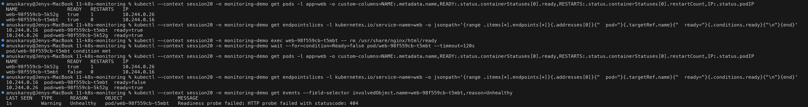

### 3c. `kubectl describe` conditions and recovery

```bash
kubectl ... describe pod web-98f559cb-t5mbt | grep -E -A7 '^Conditions:'
kubectl ... exec web-98f559cb-t5mbt -- sh -c 'echo ready > /usr/share/nginx/html/ready'   # fix
kubectl ... wait --for=condition=Ready pod/web-98f559cb-t5mbt
```

```text
Ready                       False   ->   True
ContainersReady             False   ->   True
    Liveness:     http-get http://:80/healthz delay=5s timeout=3s period=5s successThreshold=1 failureThreshold=3
    Readiness:    http-get http://:80/ready delay=2s timeout=3s period=5s successThreshold=1 failureThreshold=2
10.244.0.16  pod=web-98f559cb-t5mbt  ready=true     <- back in the Service
```

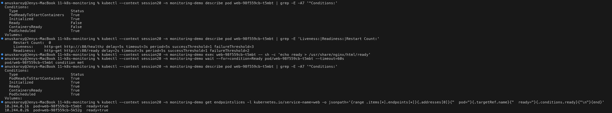

---

## 4. Events as alert signals

Events are Kubernetes' own record of things that happened. `type=Warning` events are the ones
worth alerting on, for example `Unhealthy`, `BackOff`, `OOMKilling`, `FailedScheduling` and
`FailedMount`.

```bash
kubectl --context session20 -n monitoring-demo get events --field-selector type=Warning --sort-by=.lastTimestamp
kubectl --context session20 -n monitoring-demo get events --field-selector type=Warning \
  -o jsonpath='{range .items[*]}{.reason}{"\n"}{end}' | sort | uniq -c | sort -rn
```

```text
  16 Unhealthy
   3 NodeNotReady
   2 FailedMount
   1 FailedScheduling
```

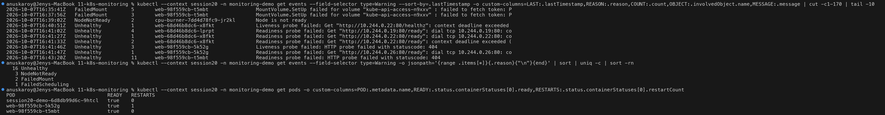

Only some of these warnings came from the probes that were broken on purpose. The rest are
**real incidents**. The Docker VM was shared with two other clusters and a Compose stack, and it
ran out of memory (load average above 100, swapping). The node briefly went `NotReady`, the
taint manager evicted the pods, and the replacements reported `FailedScheduling` (untolerated
taint) and `FailedMount` (API server unreachable). These are the signals you want to alert on
in production. Note that events are kept for only about 1 hour by default, so production setups
export them to a log store or Prometheus (for example with kube-events-exporter or
event-exporter).

---

## 5. Alerts: threshold script

`scripts/check-alerts.sh [namespace] [cpu_threshold_m] [mem_threshold_Mi]` (defaults:
`monitoring-demo 100 100`, context `$KUBE_CONTEXT`, default `session20`) acts as a minimal alert
rule. It reads `kubectl top pods`, compares each pod against the CPU and memory thresholds
independently, and prints `ALERT [HighCPU]` / `ALERT [HighMemory]` or `OK`, followed by a count
of firing alerts.

```text
$ ./scripts/check-alerts.sh
Checking pods in 'monitoring-demo' (CPU > 100m or MEM > 100Mi)
ALERT  [HighCPU]    pod=cpu-burner-7dd4d78fc9-bsbpj cpu=235m threshold=100m
OK                  pod=session20-demo-6d8db99d6c-9htcl cpu=1m mem=0Mi
OK                  pod=web-98f559cb-5k52g cpu=2m mem=7Mi
OK                  pod=web-98f559cb-t5mbt cpu=4m mem=6Mi
----
1 alert(s) firing

$ ./scripts/check-alerts.sh monitoring-demo 100 5      # low memory threshold -> memory alerts too
ALERT  [HighCPU]    pod=cpu-burner-7dd4d78fc9-bsbpj cpu=235m threshold=100m
ALERT  [HighMemory] pod=web-98f559cb-5k52g mem=7Mi threshold=5Mi
ALERT  [HighMemory] pod=web-98f559cb-t5mbt mem=6Mi threshold=5Mi
----
3 alert(s) firing
```

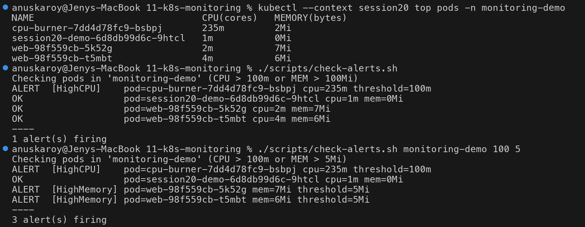

---

## 6. Automated reaction: HPA

An alert tells a person that something crossed a threshold. The HPA responds to a crossed
threshold by itself. The `web` HPA targets 50% of the CPU request (20m), so it adds replicas
once the average usage per pod goes above about 10m.

```bash
kubectl --context session20 apply -f manifests/04-web-hpa.yaml
kubectl --context session20 apply -f manifests/05-load-generator.yaml
kubectl --context session20 -n monitoring-demo get hpa web -w
```

Output of the recorded watch:

```text
EVENT      NAME   REFERENCE        TARGETS        MINPODS   MAXPODS   REPLICAS   AGE
ADDED      web    Deployment/web   cpu: 15%/50%   2         4         2          24s
MODIFIED   web    Deployment/web   cpu: 17%/50%   2         4         2          36s
MODIFIED   web    Deployment/web   cpu: 45%/50%   2         4         2          100s
MODIFIED   web    Deployment/web   cpu: 60%/50%   2         4         2          2m39s
MODIFIED   web    Deployment/web   cpu: 60%/50%   2         4         3          2m54s
```

```text
Normal  SuccessfulRescale  61s  horizontal-pod-autoscaler  New size: 3; reason: cpu resource utilization (percentage of request) above target
```

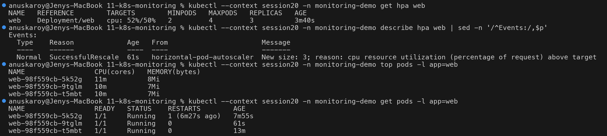

To stop the load, run `kubectl --context session20 -n monitoring-demo delete pod load-generator`.
The HPA scales back down to 2 replicas after its default 5-minute scale-down stabilization
window.

---

## How this maps to production tooling

| This demo | Production equivalent |
|---|---|
| metrics-server + `kubectl top` (current values only, held in memory, no history) | **Prometheus** (kube-prometheus-stack) scrapes kubelet/cAdvisor, kube-state-metrics and node-exporter, stores time series, and supports PromQL such as `rate(container_cpu_usage_seconds_total[5m])` |
| Requests/limits seen with `describe` / custom-columns | kube-state-metrics `kube_pod_container_resource_requests/limits`, Grafana "Compute Resources" dashboards, VPA recommendations |
| `kubectl logs` (node-local; lost when the pod is deleted) | Log agent DaemonSet (Fluent Bit / Promtail / Vector), sending to **Loki** / Elasticsearch / CloudWatch |
| `kubectl get events --field-selector type=Warning` | event-exporter → logs/metrics; alert rules on `kube_pod_container_status_restarts_total`, `KubePodCrashLooping`, `KubePodNotReady` |
| Liveness/readiness probes | The same probes, plus alerts on `kube_pod_status_ready{condition="false"}`, blackbox-exporter for external checks, SLO burn-rate alerts |
| `check-alerts.sh` (run by hand, no `for:` duration, no routing) | **PrometheusRule** (`expr` + `for: 5m`), then **Alertmanager** (grouping, silences, inhibition), then Slack/PagerDuty, as in section 09 |
| HPA on CPU from metrics-server | HPA on CPU/memory, or custom/external metrics through prometheus-adapter or KEDA |

metrics-server exists to feed autoscaling and `kubectl top`. It is not a monitoring system: it
keeps no history, has no query language and does not alert. For anything beyond "what is using
CPU right now", use Prometheus and Alertmanager.

---

## Problems seen during the run

* **Image pulls failed** at first. In-node DNS lookups for `auth.docker.io` returned `server misbehaving`, and kindnet (the CNI) went into `ImagePullBackOff`, which left the node `NotReady`. Pulling the images by hand on the node fixed it: `minikube -p session20 ssh -- sudo crictl pull <image>`.
* **Probe timeouts and node evictions** happened because the shared Docker VM was memory-starved. The probes were changed from the default `timeoutSeconds: 1` to `3`, and cpu-burner was scaled to 0 during the probe demos (`kubectl scale deploy/cpu-burner --replicas=0`) and back to 1 for the alert demo.

---

## Cleanup

```bash
kubectl --context session20 delete namespace monitoring-demo
# when completely done with the cluster:
minikube delete -p session20
```
