# 12 - GitOps with Argo CD: Hands-on Demo (Task 3)

This is a full GitOps demo that I ran end to end on a local minikube cluster. **Git is the only way the app gets changed.** Argo CD watches a Git repository and keeps the `session20` namespace identical to it. It scales the app when a commit changes `replicas`, undoes manual `kubectl` changes (self-heal), deletes objects that are removed from Git (prune), and follows a `git revert` (rollback).

Every screenshot in `screenshots/` comes from a real command run during the demo. None of the output was edited.

| Item | Value |
|------|-------|
| Cluster | minikube profile `session20` (1 node, 1800 MB, docker driver, arm64, Kubernetes v1.37.0) |
| Argo CD | `stable` install.yaml → `quay.io/argoproj/argocd:v3.5.4` |
| Git source | local repo `gitops-demo` served by `git daemon` → `git://host.minikube.internal/gitops-demo` |
| App | `nginx:1.27-alpine` Deployment + ClusterIP Service in namespace `session20` |

```
12-gitops-argocd-demo/
├── README.md                    ← this file
├── argocd-application.yaml      ← the Argo CD Application (applied ONCE with kubectl)
├── watch-heal.sh                ← tiny helper: prints Deployment + Argo status whenever it changes
├── gitops-repo/app/             ← copy of the Git source-of-truth manifests (final state)
│   ├── deployment.yaml
│   └── service.yaml
└── screenshots/12-01 … 12-15
```

---

## Part A: Concepts

### 1. What is GitOps?

GitOps is an operating model for running infrastructure and applications:

1. The **desired state** of the whole system is written down **declaratively**: Kubernetes YAML, Helm or Kustomize.
2. That declaration is stored in **Git**, which is versioned and immutable, and changes to it are reviewed.
3. An **automated agent inside the cluster**, such as Argo CD or Flux, **pulls** the desired state and **continuously reconciles** the cluster towards it.

You make every change with a commit or pull request. Nobody runs `kubectl apply` against production. Git becomes the deployment interface: its log is the audit trail, a pull request review is the change approval, and `git revert` is the rollback.

### 2. Git as the single source of truth

| Question | Answered by |
|----------|-------------|
| What *should* be running? | The manifests at `HEAD` of the tracked branch/path |
| Who changed it, when, why? | `git log`, commit author, PR discussion |
| What exactly changed? | `git diff` |
| How do I undo it? | `git revert <sha>` and the cluster follows |
| Is the cluster correct? | Argo CD's `Synced` / `OutOfSync` status (Git vs live diff) |

Git holds the **desired** state and the cluster holds the **actual** state. If they differ, Git wins. In the demo, a manual `kubectl scale` was reverted within seconds (screenshot 12-07).

### 3. Declarative configuration

*Imperative* means "run these steps", for example `kubectl scale --replicas=3`. *Declarative* means "this is the end result I want", for example `replicas: 3` in a YAML file. Declarative files are idempotent: applying them twice gives the same result. They can be compared against the live state and read by a person. That comparison is what makes automatic reconciliation possible.

### 4. Continuous reconciliation (observe → diff → act)

```
          ┌──────────────────────────────────────────────┐
          │                                              │
          ▼                                              │
   ┌─────────────┐     ┌─────────────┐     ┌─────────────┴─┐
   │  OBSERVE    │ ──▶ │    DIFF     │ ──▶ │     ACT       │
   │ git HEAD +  │     │ desired vs  │     │ apply / prune │
   │ live objects│     │ live state  │     │ (auto-sync)   │
   └─────────────┘     └─────────────┘     └───────────────┘
   every timeout.reconciliation (default 120s; 30s in this demo),
   on the argocd.argoproj.io/refresh annotation, or on a Git webhook
```

* **Observe**: the repo-server fetches Git and renders the manifests. The application-controller watches the live objects through the Kubernetes API.
* **Diff**: the controller compares the two and sets `status.sync.status` to `Synced` or `OutOfSync`.
* **Act**: when `syncPolicy.automated` is set, it applies the difference. With `prune: true` it also deletes extra objects. With `selfHeal: true` it reverts drift even when Git has not changed.

### 5. GitOps workflow: push model vs pull model

```
PUSH model (classic CI/CD)                     PULL model (GitOps / Argo CD)
──────────────────────────                     ─────────────────────────────
dev ─▶ git push ─▶ CI pipeline                 dev ─▶ git push / PR merge ─▶ Git repo
                     │ needs cluster creds                                     ▲
                     ▼ kubectl apply / helm                                    │ poll / webhook
                 Kubernetes                    Kubernetes ◀── apply ── Argo CD (runs IN the cluster)
  - credentials live outside the cluster         - no cluster credentials leave the cluster
  - drift is not detected after the push         - drift detected + self-healed continuously
  - rollback = re-run an old pipeline            - rollback = git revert
```

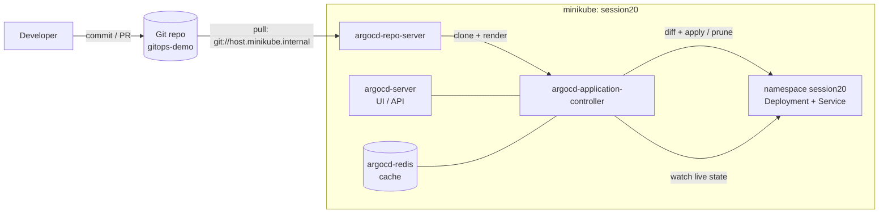

### 6. Kubernetes + GitOps: Argo CD building blocks

| Component | Role | Running in this demo? |
|-----------|------|-----------------------|
| `argocd-application-controller` (StatefulSet) | The reconciliation loop: compares Git with the live state, syncs, checks health | yes |
| `argocd-repo-server` | Clones Git and renders the manifests (plain YAML, Helm, Kustomize) | yes |
| `argocd-server` | UI, gRPC/REST API and CLI endpoint | yes |
| `argocd-redis` | Cache for rendered manifests and the app state | yes |
| `argocd-dex-server` | SSO (OIDC/GitHub/LDAP login) | **scaled to 0** |
| `argocd-notifications-controller` | Slack/e-mail notifications | **scaled to 0** |
| `argocd-applicationset-controller` | Generates many Applications from templates | **scaled to 0** |

**Why three components are scaled to 0:** the Docker Desktop VM has about 3.9 GB of memory, which is shared with other minikube profiles and the Session 20 monitoring stack. The `session20` node only has 1800 MB. Dex, notifications and ApplicationSet play no part in Git → cluster reconciliation. The demo uses the built-in `admin` user, no notifications, and one hand-written Application. Scaling them to 0 saves memory and CPU on a heavily loaded node. Everything that GitOps itself needs keeps running.

**CRDs:** `Application` (what to deploy, from where, to where, and how to sync), `AppProject` (RBAC and allowed repos/destinations; we use `default`) and `ApplicationSet`.

**The Application** (`argocd-application.yaml`):

```yaml
apiVersion: argoproj.io/v1alpha1
kind: Application
metadata:
  name: session20-app
  namespace: argocd
spec:
  project: default
  source:
    repoURL: git://host.minikube.internal/gitops-demo   # GitHub: https://github.com/<you>/gitops-demo.git
    targetRevision: main
    path: app
  destination:
    server: https://kubernetes.default.svc
    namespace: session20
  syncPolicy:
    automated:
      prune: true      # delete cluster objects whose manifest was removed from Git
      selfHeal: true   # revert manual drift (kubectl edit/scale/delete)
    syncOptions:
      - CreateNamespace=true
```

**Status fields**

* **Sync status** compares Git with the live state:
  * `Synced`: the live state matches Git.
  * `OutOfSync`: the live state differs from Git.
  * `Unknown`: Argo CD could not compare them.
* **Health status** comes from per-kind health checks:
  * `Healthy`
  * `Progressing`: for example, a Deployment that is still rolling out.
  * `Degraded`
  * `Suspended`
  * `Missing`: the object does not exist in the cluster.
* `status.sync.revision` is the Git commit SHA that was last synced.
* `status.operationState` is the last sync operation: its phase, message and per-resource result (`pruned`, `unchanged`, ...).
* `status.history` lists every deployment with its revision. You can roll back to an entry with `argocd app rollback`, but the GitOps way is a `git revert`.

---

## Part B: The demo, step by step

### Step 0. Cluster, Argo CD install, and faster reconciliation

```bash
# cluster (started by the monitoring part of S20)
minikube start -p session20 --nodes 1 --memory 1800 --driver docker

# Argo CD (server-side apply: the CRDs are too big for the last-applied annotation)
curl -sSLo install.yaml https://raw.githubusercontent.com/argoproj/argo-cd/stable/manifests/install.yaml
kubectl --context session20 create namespace argocd
kubectl --context session20 apply -n argocd --server-side --force-conflicts -f install.yaml

# trim optional components (memory, see above)
kubectl --context session20 -n argocd scale deploy \
  argocd-dex-server argocd-notifications-controller argocd-applicationset-controller --replicas=0

# reconcile every 30s instead of the default 120s (+ jitter)
kubectl --context session20 -n argocd patch cm argocd-cm --type merge \
  -p '{"data":{"timeout.reconciliation":"30s"}}'
kubectl --context session20 -n argocd rollout restart deploy argocd-repo-server
kubectl --context session20 -n argocd rollout restart sts argocd-application-controller
```

`timeout.reconciliation` is read when the process starts, so the repo-server and application-controller must be restarted after it changes. To make Argo CD re-read Git immediately, without waiting for the next poll, add the hard or normal refresh annotation:

```bash
kubectl -n argocd annotate app session20-app argocd.argoproj.io/refresh=normal --overwrite
```

I used this in Step 6. In production you would configure a Git webhook to `argocd-server` instead.

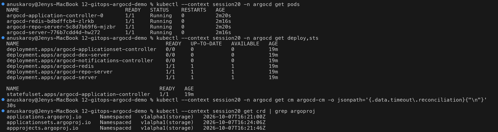

```
NAME                                  READY   STATUS    RESTARTS   AGE
argocd-application-controller-0       1/1     Running   0          2m20s
argocd-redis-bdbdffcb4-zlrkb          1/1     Running   0          2m16s
argocd-repo-server-5c8d7b69f6-mjzbr   1/1     Running   0          2m20s
argocd-server-776b7cdd4d-hw272        1/1     Running   0          2m16s
...
deployment.apps/argocd-dex-server                  0/0     0            0           19m
$ kubectl ... get cm argocd-cm -o jsonpath='{.data.timeout\.reconciliation}'
30s
```

### Step 1. The Git source of truth (local repo, served with `git daemon`)

I did not push to GitHub. Instead I created a local repo called `gitops-demo` and served it read-only over the git protocol from the Mac:

```bash
mkdir gitops-demo && cd gitops-demo && git init -b main
mkdir app   # deployment.yaml + service.yaml (see gitops-repo/app/)
git add . && git commit -m "Initial GitOps app: nginx deployment (2 replicas) + service"

# from the PARENT directory of gitops-demo:
git daemon --reuseaddr --export-all --base-path="$PWD" --port=9418 &
```

Inside minikube, `host.minikube.internal` resolves to the host, so the repo URL is `git://host.minikube.internal/gitops-demo`. I checked that it is reachable **from the argocd-repo-server pod**, because that pod is the one that clones the repo:

```bash
kubectl -n argocd exec deploy/argocd-repo-server -c argocd-repo-server -- \
  git ls-remote git://host.minikube.internal/gitops-demo
```

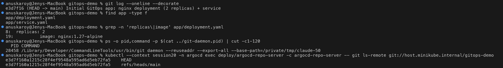

The manifests use small resource requests (`10m` CPU, `16Mi` memory, limits `100m`/`64Mi`) and start at `replicas: 2`.

### Step 2. Register the app with Argo CD (the only kubectl apply)

```bash
kubectl --context session20 apply -f argocd-application.yaml
```

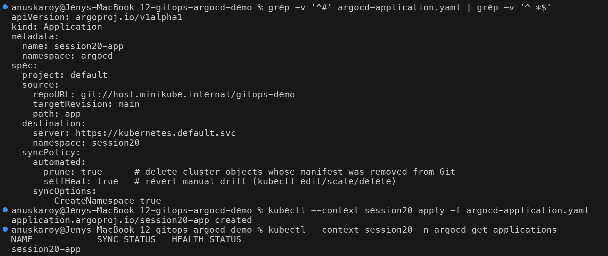

### Step 3. Synced + Healthy, and the synced revision equals git HEAD

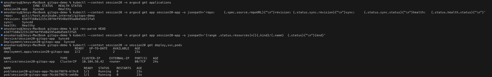

```
NAME            SYNC STATUS   HEALTH STATUS
session20-app   Synced        Healthy
repo:     git://host.minikube.internal/gitops-demo
revision: e3d7f160a1215c28f4ef9548a595ad6d5eb72fa5
$ git rev-parse HEAD
e3d7f160a1215c28f4ef9548a595ad6d5eb72fa5
...
deployment.apps/session20-gitops-app   2/2     2            2           23s
```

`CreateNamespace=true` created the `session20` namespace. The Deployment and Service were created by Argo CD, not by me.

### Step 4. A GitOps change: scale 2 → 3 with a commit

```bash
sed -i '' 's/replicas: 2/replicas: 3/' app/deployment.yaml
git diff
git commit -am 'Scale session20-gitops-app to 3 replicas'
```

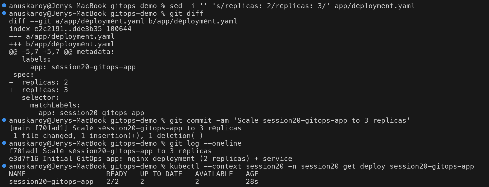

Right after the commit the cluster still showed `2/2`. Argo CD picked up the new commit **4 seconds later**: the next 30s reconciliation cycle happened to be close. The synced revision changed to `f701ad1`, and the Deployment scaled to 3:

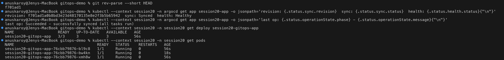

```
revision: f701ad1a0b8bd3e23d48170135e8e2f3b5b65942  sync: Synced  health: Healthy
last op: Succeeded - successfully synced (all tasks run)
session20-gitops-app   3/3     3            3           56s
```

### Step 5a. Self-heal: a manual `kubectl scale` is reverted

`watch-heal.sh` prints the Deployment and Argo CD status each time either of them changes.

```bash
kubectl --context session20 -n session20 scale deploy session20-gitops-app --replicas=1
./watch-heal.sh
```

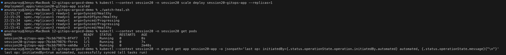

```
22:15:27  spec.replicas=1 ready=1  argo=Synced/Healthy
22:15:29  spec.replicas=1 ready=1  argo=OutOfSync/Healthy     <- drift detected
22:15:34  spec.replicas=3 ready=1  argo=Synced/Progressing    <- Argo re-applied Git (3)
22:15:41  spec.replicas=3 ready=3  argo=Synced/Healthy
last op: initiatedBy=true automated, successfully synced (all tasks run)
```

The drift was undone **about 7 seconds** after the manual change. The live state comes from the controller's watch, so drift is noticed almost immediately. In an earlier attempt, made right after another sync, self-heal took about 45 seconds. That delay is caused by Argo CD's self-heal back-off between consecutive automated syncs.

### Step 5b. Self-heal: a deleted Deployment is recreated

```bash
kubectl --context session20 -n session20 delete deploy session20-gitops-app
./watch-heal.sh
```

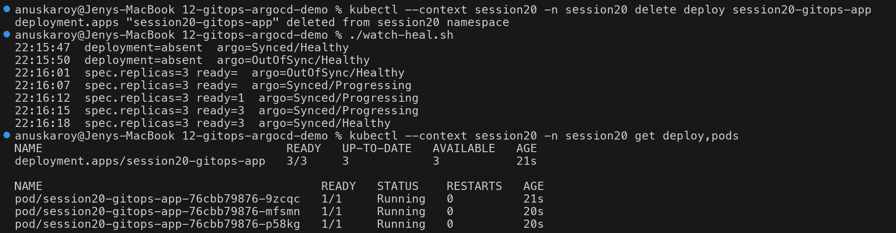

```
22:15:47  deployment=absent  argo=Synced/Healthy
22:15:50  deployment=absent  argo=OutOfSync/Healthy
22:16:01  spec.replicas=3 ready=  argo=OutOfSync/Healthy
22:16:07  spec.replicas=3 ready=  argo=Synced/Progressing
22:16:18  spec.replicas=3 ready=3  argo=Synced/Healthy
```

### Step 6. Prune: an object removed from Git is removed from the cluster

First I added a ConfigMap to Git (`app/configmap.yaml`) and committed it. Argo CD created it about 22 seconds later:

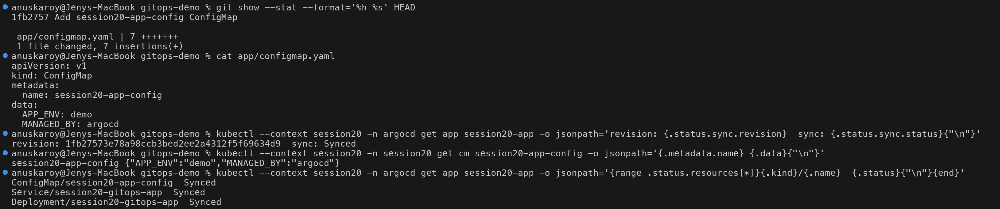

Then I ran `git rm app/configmap.yaml` and committed. Within 44 seconds the next sync **pruned** the ConfigMap:

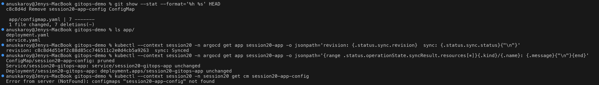

```
ConfigMap/session20-app-config: pruned
Service/session20-gitops-app: service/session20-gitops-app unchanged
Deployment/session20-gitops-app: deployment.apps/session20-gitops-app unchanged
$ kubectl --context session20 -n session20 get cm session20-app-config
Error from server (NotFound): configmaps "session20-app-config" not found
```

Without `prune: true`, Argo CD would only mark the ConfigMap as `OutOfSync` and leave it running.

### Step 7. Rollback the GitOps way: `git revert`

```bash
git revert --no-edit f701ad1          # undo "scale to 3"
kubectl -n argocd annotate app session20-app argocd.argoproj.io/refresh=normal --overwrite
```

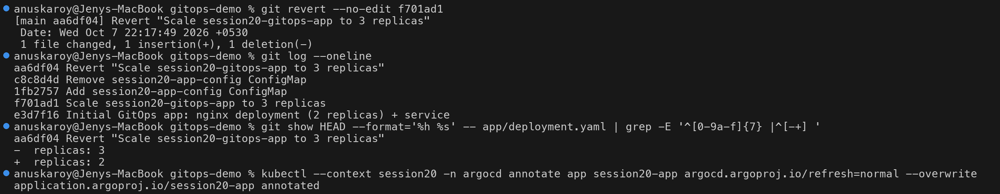

The refresh annotation made Argo CD fetch Git straight away, and the cluster was back at 2 replicas in about 4 seconds:

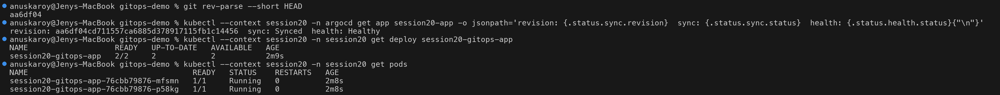

```
revision: aa6df04cd711557ca6885d378917115fb1c14456  sync: Synced  health: Healthy
session20-gitops-app   2/2     2            2           2m9s
```

The rollback is itself a commit, so Git history records it like any other change. Nothing is rewritten.

### Step 8. Reach the app

```bash
kubectl --context session20 -n session20 port-forward svc/session20-gitops-app 8088:80 &
curl -sI http://localhost:8088
```

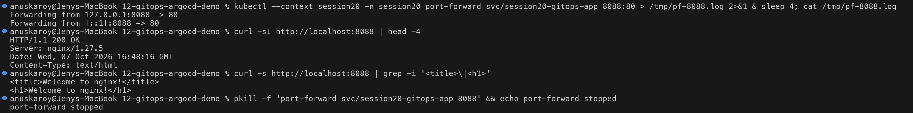

```
HTTP/1.1 200 OK
Server: nginx/1.27.5
<title>Welcome to nginx!</title>
```

### Step 9. Application history vs Git log

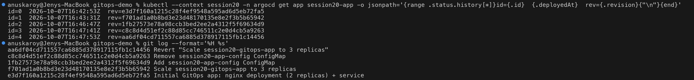

```
id=0  2026-10-07T16:42:53Z  rev=e3d7f16…   Initial (2 replicas)
id=1  2026-10-07T16:43:31Z  rev=f701ad1…   Scale to 3
id=2  2026-10-07T16:46:47Z  rev=1fb2757…   Add ConfigMap
id=3  2026-10-07T16:47:41Z  rev=c8c8d4d…   Remove ConfigMap (prune)
id=4  2026-10-07T16:47:53Z  rev=aa6df04…   Revert scale (rollback)
```

There is exactly one history entry per Git commit, and they appear in the same order as `git log`. The self-heal syncs in Step 5 re-applied an existing revision, so they did not add new history entries.

---

## Using a real GitHub repo instead of `git daemon`

1. Create a repo on GitHub, for example `gitops-demo`. Copy `gitops-repo/app/*` into it and push to `main`.
2. In `argocd-application.yaml`, set
   `repoURL: https://github.com/<you>/gitops-demo.git`.
3. If the repo is **private**, give Argo CD credentials with a repository Secret:
   ```yaml
   apiVersion: v1
   kind: Secret
   metadata:
     name: gitops-demo-repo
     namespace: argocd
     labels: { argocd.argoproj.io/secret-type: repository }
   stringData:
     type: git
     url: https://github.com/<you>/gitops-demo.git
     username: <you>
     password: <GitHub fine-grained PAT with read-only Contents>
   ```
4. Run `kubectl apply -f argocd-application.yaml`. After that, every `git push` takes the place of the local `git commit` in the steps above.
5. Optional: add a GitHub webhook to `https://<argocd-server>/api/webhook` for instant syncs instead of polling.

The Argo CD UI or CLI can also be used. Run `kubectl -n argocd port-forward svc/argocd-server 8080:443`. Log in as `admin` with the password from `kubectl -n argocd get secret argocd-initial-admin-secret -o jsonpath='{.data.password}' | base64 -d`. I did not install the `argocd` CLI for this demo: everything above uses `kubectl` only.

---

## Troubleshooting notes (problems I hit)

| Problem | Cause | Fix |
|---------|-------|-----|
| (Avoided up front) A plain `kubectl apply -f install.yaml` is known to fail on the CRDs with "metadata.annotations: Too long" | A client-side apply stores the whole object in the `last-applied-configuration` annotation, and the Argo CD CRDs are larger than 256 KB | I used `kubectl apply --server-side --force-conflicts` from the start |
| `Error from server (Timeout)` during the install, and a `rollout status` that hung with `TLS handshake timeout` | The 1800 MB node was overloaded: the API server and controller-manager restarted while large images were being pulled | Re-ran the server-side apply, which is idempotent. Pre-pulled the images with `minikube -p session20 ssh -- sudo crictl pull quay.io/argoproj/argocd:v3.5.4` (plus redis and nginx). Scaled the optional components to 0 |
| A change committed to Git was not picked up for up to about 3 minutes | The default `timeout.reconciliation` is 120s, plus jitter | Set `timeout.reconciliation: 30s` in `argocd-cm` and restarted the repo-server and controller, or use the `argocd.argoproj.io/refresh` annotation |
| Self-heal sometimes takes about 45s instead of a few seconds | Argo CD's self-heal back-off between consecutive automated syncs | This is expected. Wait, or trigger a refresh |
| Argo CD has no access to GitHub, or I don't want to push | — | Serve a local repo with `git daemon --export-all` and use `git://host.minikube.internal/<repo>`. Check access with `git ls-remote` **from the repo-server pod** |
| `kubectl exec deploy/argocd-repo-server` gave "container not found" | The pod was restarting at that moment, and the default container choice landed on the init container | Wait for the rollout to finish, then pass `-c argocd-repo-server` |
| Per-resource `.health.status` is empty in `.status.resources` | Argo CD v3 no longer saves resource health in the Application status by default | Use the app-level `.status.health.status` |

---

## Cleanup

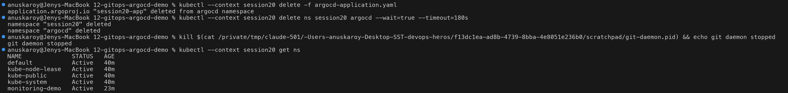

```bash
kubectl --context session20 delete -f argocd-application.yaml
kubectl --context session20 delete ns session20 argocd
kill <git-daemon-pid>
# cluster-scoped leftovers of the Argo CD install:
kubectl --context session20 delete crd applications.argoproj.io applicationsets.argoproj.io appprojects.argoproj.io
kubectl --context session20 get clusterrole,clusterrolebinding -o name | grep argocd | xargs kubectl --context session20 delete
# optionally remove the whole cluster:
minikube delete -p session20
```

Deleting the Application without the `resources-finalizer.argocd.argoproj.io` finalizer does **not** delete the app's resources. Deleting the `session20` namespace removes them. To get a cascading delete, add `metadata.finalizers: [resources-finalizer.argocd.argoproj.io]` to the Application.
