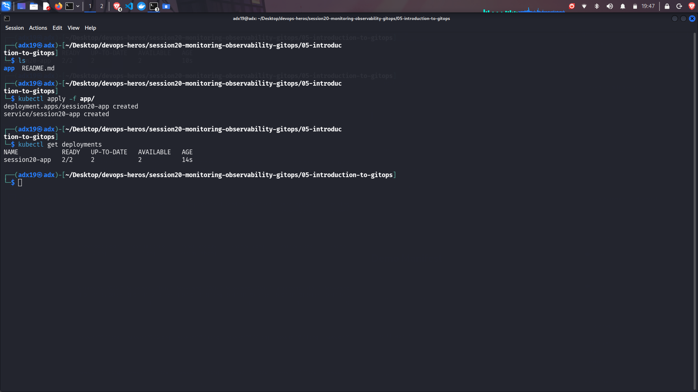

# Session 20 Assignment:

## What I did:

I did hands-on on the following:
- Metrics logs traces
- Prometheus
- Grafana
- Gitops
- Git source of truth
- Argocd

Basically I practiced everything in the session20 hands on

***Screenshots is given below***

## Screenshots:

- Metrics:

---

- Prometheus:

---

- Grafana:

---

- Gitops:

---

- Git source of truth:

---

- Argocd:

---

