# Session 20 — Monitoring, Observability & GitOps

# Task 1 — Monitoring

# 1. What is Monitoring?

Monitoring is the process of collecting and observing system information to determine whether an application or infrastructure is operating correctly.

Monitoring helps answer questions such as:

- Is the application running?
- How much CPU is being used?
- How much memory is being used?
- Are pods restarting?
- Are requests failing?
- Are services available?
- Has an important threshold been exceeded?

---

# 2. Monitoring Components

The monitoring demonstration focuses on:

```text
Application
    |
    +---- Metrics
    |       |
    |       +---- CPU
    |       +---- Memory
    |       +---- Pod status
    |
    +---- Logs
    |       |
    |       +---- Application events
    |       +---- Errors
    |
    +---- Health
    |       |
    |       +---- Liveness
    |       +---- Readiness
    |
    +---- Alerts
            |
            +---- Threshold exceeded
```

---

# 3. Kubernetes Cluster

Start Minikube:

```bash
minikube start
```

Verify the cluster:

```bash
kubectl cluster-info
```

Check nodes:

```bash
kubectl get nodes
```

Check all pods:

```bash
kubectl get pods -A
```

### Screenshot


---

# 4. Kubernetes Metrics Server

Metrics Server provides resource usage metrics for Kubernetes nodes and pods.

Enable it in Minikube:

```bash
minikube addons enable metrics-server
```

Check the Metrics Server:

```bash
kubectl get pods -n kube-system | grep metrics
```

Wait until the Metrics Server is running.

Then test:

```bash
kubectl top nodes
```

and:

```bash
kubectl top pods -A
```

Example:

```text
NAME       CPU(cores)   CPU%   MEMORY(bytes)   MEMORY%
minikube   120m         6%     850Mi           22%
```

The exact values will vary depending on workload.

### Screenshot


---

# 5. CPU Utilization

CPU utilization indicates how much CPU a node or pod is consuming.

Check node CPU:

```bash
kubectl top nodes
```

Check pod CPU:

```bash
kubectl top pods -A
```

Example:

```text
NAME              CPU(cores)   MEMORY(bytes)
monitoring-app     15m          40Mi
```

CPU monitoring helps identify:

- CPU-intensive workloads
- Resource bottlenecks
- Unexpected traffic
- Poor resource allocation
- Scaling requirements

### Screenshot


---

# 6. Memory Utilization

Memory utilization indicates how much RAM is being consumed.

Run:

```bash
kubectl top pods -A
```

Memory usage can help identify:

- Memory leaks
- Overloaded containers
- Incorrect resource limits
- OOMKilled containers
- Applications requiring more memory

Example:

```text
NAME            MEMORY
application     120Mi
```

---

# 7. Application Health

Kubernetes supports health checks through:

- Liveness probes
- Readiness probes
- Startup probes

## Liveness Probe

A liveness probe determines whether a container is still functioning.

If the liveness check repeatedly fails, Kubernetes can restart the container.

Example:

```yaml
livenessProbe:
  httpGet:
    path: /health
    port: 5000
  initialDelaySeconds: 10
  periodSeconds: 10
```

## Readiness Probe

A readiness probe determines whether a container is ready to receive traffic.

Example:

```yaml
readinessProbe:
  httpGet:
    path: /health
    port: 5000
  initialDelaySeconds: 5
  periodSeconds: 5
```

Check pod status:

```bash
kubectl get pods
```

Describe the pod:

```bash
kubectl describe pod <pod-name>
```

### Screenshot


---

# 8. Application Logs

Logs provide information about what happened inside an application.

View pod logs:

```bash
kubectl logs <pod-name>
```

For a deployment:

```bash
kubectl logs deployment/<deployment-name>
```

Follow logs in real time:

```bash
kubectl logs -f <pod-name>
```

Logs can reveal:

- Application errors
- Requests
- Warnings
- Startup events
- Dependency failures
- Authentication failures

### Screenshot


---

# 9. Prometheus

Prometheus is a popular open-source monitoring and metrics platform.

It collects time-series metrics from applications and infrastructure.

Typical Prometheus architecture:

```text
Application
     |
 Metrics Endpoint
     |
     v
 Prometheus
     |
     +---- Time Series Database
     |
     v
  Grafana
```

Prometheus can monitor:

- CPU
- Memory
- Request rate
- Error rate
- Latency
- Pod health
- Kubernetes resources

A common metric format looks like:

```text
http_requests_total
container_cpu_usage_seconds_total
container_memory_usage_bytes
```

### Screenshot


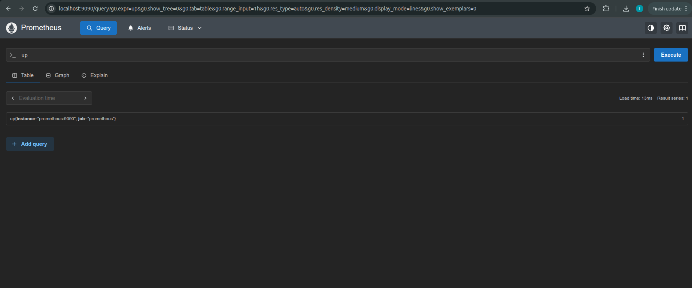
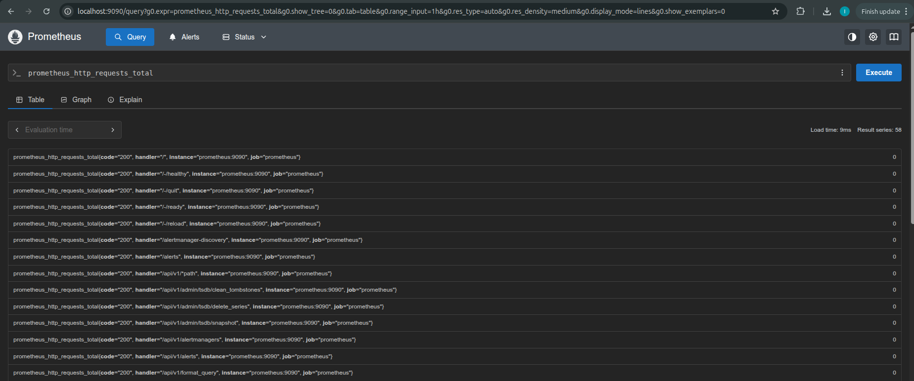
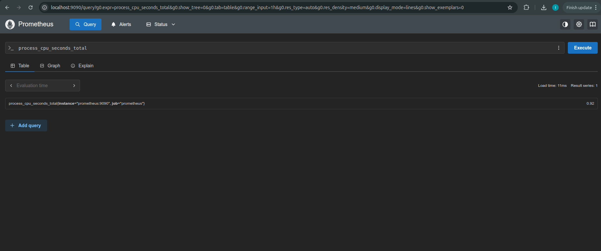


---

# 10. Grafana

Grafana is used to visualize metrics collected by systems such as Prometheus.

A dashboard can display:

```text
CPU Usage
Memory Usage
Pod Count
Request Rate
Error Rate
Latency
```

Example architecture:

```text
Kubernetes
    |
Prometheus
    |
Grafana
    |
Dashboards
```

A Grafana dashboard makes it easier to identify trends and abnormal behavior.

### Screenshot

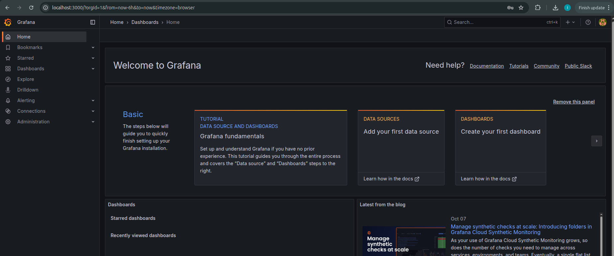
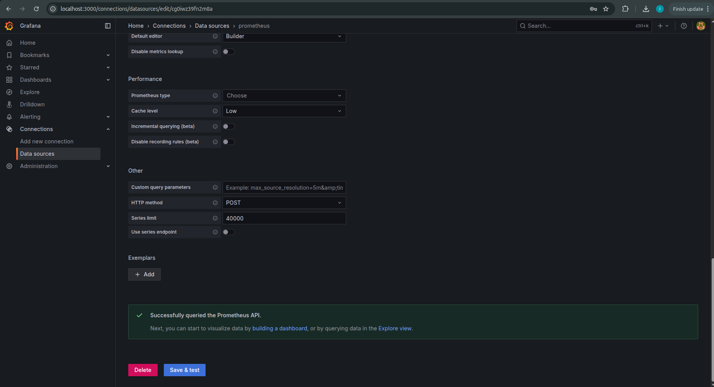
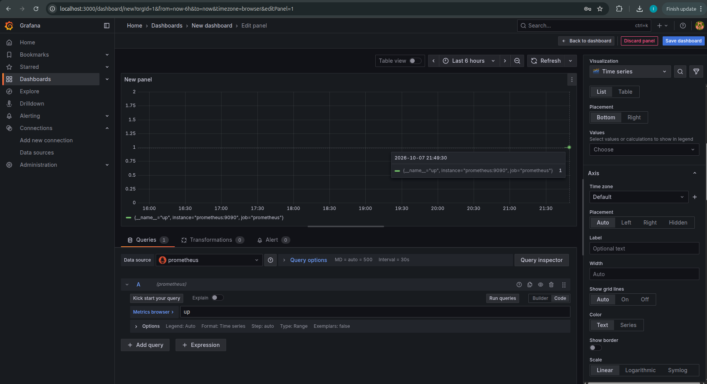

---

# 11. Alerts

An alert is generated when a monitored condition crosses a defined threshold.

Example:

```text
CPU Usage > 80%
        |
        v
     Alert
        |
        v
Alertmanager
```

Example Prometheus alert rule:

```yaml
groups:
  - name: kubernetes-alerts
    rules:
      - alert: HighCPUUsage
        expr: 100 * (1 - avg(rate(node_cpu_seconds_total{mode="idle"}[5m]))) > 80
        for: 5m
        labels:
          severity: warning
        annotations:
          summary: "High CPU usage detected"
```

Alertmanager can route alerts to notification systems.

Possible destinations include:

- Email
- Slack
- PagerDuty
- Webhooks

---

# 12. Monitoring Workflow

```text
Application / Kubernetes
          |
          v
       Metrics
          |
          v
     Prometheus
          |
          v
       Grafana
          |
          v
      Dashboards
          |
          v
       Alerts
          |
          v
    Alertmanager
```

---

# Task 2 — Observability

# 1. What is Observability?

Observability is the ability to understand the internal state and behavior of a system by analyzing the data it produces.

Monitoring mainly tells us:

```text
"Something is wrong."
```

Observability helps answer:

```text
"Why is it wrong?"
```

Observability is especially important in distributed systems and microservices where a single request may pass through multiple services.

---

# 2. Three Pillars of Observability

The three major pillars are:

```text
             Observability
                  |
       ┌──────────┼──────────┐
       |          |          |
    Metrics      Logs      Traces
       |          |          |
    Numbers    Events     Request path
```

---

# 3. Metrics

Metrics are numerical measurements collected over time.

Examples:

```text
CPU usage
Memory usage
Request count
Request latency
Error rate
Pod count
Network traffic
```

Example:

```text
http_requests_total = 15000
```

Metrics are useful for:

- Monitoring trends
- Capacity planning
- Alerting
- Performance analysis
- Infrastructure monitoring

Common tools:

- Prometheus
- Grafana
- AWS CloudWatch
- Datadog
- New Relic

---

# 4. Logs

Logs are timestamped records of events produced by applications and infrastructure.

Example:

```text
2026-10-07 10:30:01 INFO Request received
2026-10-07 10:30:02 INFO Database query completed
2026-10-07 10:30:05 ERROR Database connection failed
```

Logs are useful for:

- Debugging
- Error investigation
- Auditing
- Understanding application events

Common tools:

- Loki
- Elasticsearch
- Fluent Bit
- Fluentd
- Splunk
- CloudWatch Logs

---

# 5. Traces

Traces show the path of a request through a distributed system.

Example:

```text
User Request
     |
     v
API Gateway
     |
     v
User Service
     |
     v
Order Service
     |
     v
Database
```

A trace can show:

- Total request duration
- Individual service latency
- Errors
- Service dependencies
- Slow database calls

Common tracing tools:

- Jaeger
- OpenTelemetry
- Zipkin
- AWS X-Ray

---

# 6. Metrics vs Logs vs Traces

| Pillar | Answers | Example |
|---|---|---|
| Metrics | What is happening? | CPU = 85% |
| Logs | What happened? | Database connection failed |
| Traces | Where did the request go? | API → Service → DB |

Together they provide a complete view of application behavior.

---

# 7. Why Observability is Required

Modern applications often contain multiple services.

For example:

```text
Frontend
   |
API Gateway
   |
User Service
   |
Order Service
   |
Payment Service
   |
Database
```

If a request becomes slow, monitoring may only show:

```text
Latency = 5 seconds
```

Observability can help determine:

```text
Frontend
   ↓
API Gateway      50ms
   ↓
User Service     100ms
   ↓
Order Service    300ms
   ↓
Payment Service  4.2s  ← Problem
   ↓
Database         200ms
```

Therefore, observability reduces troubleshooting time and improves reliability.


---

# 8. Common Observability Tools

| Area | Tools |
|---|---|
| Metrics | Prometheus, CloudWatch, Datadog |
| Visualization | Grafana |
| Logs | Loki, ELK, Fluent Bit, Splunk |
| Traces | Jaeger, OpenTelemetry, Zipkin |
| Alerting | Alertmanager, PagerDuty |
| Cloud Monitoring | AWS CloudWatch |

---

# 9. Kubernetes Observability

Kubernetes observability involves collecting information from:

```text
Kubernetes Cluster
       |
 ┌─────┼─────────────┐
 |     |             |
Nodes Pods       Services
 |     |             |
CPU  Logs       Network
Memory
```

Important Kubernetes observability signals include:

- Node CPU
- Node memory
- Pod CPU
- Pod memory
- Pod restarts
- Container errors
- Deployment health
- Service availability
- Request latency
- Application logs

Common Kubernetes observability stack:

```text
              Kubernetes
                   |
       ┌───────────┼───────────┐
       |           |           |
    Metrics       Logs       Traces
       |           |           |
 Prometheus       Loki      Jaeger
       |           |           |
       └───────────┼───────────┘
                   |
                Grafana
```

### Screenshot


---

# Task 3 — GitOps

# 1. What is GitOps?

GitOps is a method of managing infrastructure and applications where Git acts as the **source of truth**.

Instead of manually changing Kubernetes resources, desired configuration is stored in a Git repository.

```text
Git Repository
      |
      v
Desired State
      |
      v
GitOps Controller
      |
      v
Kubernetes Cluster
```

---

# 1. Git as the Source of Truth

In GitOps, Kubernetes configuration is stored in Git.

Example:

```text
gitops/
├── deployment.yaml
├── service.yaml
└── application.yaml
```

The Git repository contains the desired state.

Example:

```yaml
replicas: 3
```

The GitOps controller continuously checks whether Kubernetes matches this desired state.

---

# 3. Declarative Configuration

GitOps uses a declarative approach.

Declarative configuration describes:

```text
WHAT the final state should be
```

rather than:

```text
HOW to perform every step
```

Example:

```yaml
spec:
  replicas: 3
```

This means:

```text
Desired state = 3 replicas
```

The GitOps controller works to make the cluster match that state.

---

# 4. Continuous Reconciliation

Continuous reconciliation is one of the core GitOps principles.

The controller continuously compares:

```text
Git Desired State
        |
        v
     Compare
        |
        v
Kubernetes Actual State
```

If they differ:

```text
Desired State != Actual State
              |
              v
       Reconciliation
              |
              v
       Cluster Updated
```

For example:

```text
Git:
replicas = 3

Cluster:
replicas = 2

        ↓

GitOps Controller

        ↓

Cluster:
replicas = 3
```

---

# 5. GitOps Workflow

The GitOps workflow is:

```text
Developer
    |
    v
Modify Kubernetes Manifest
    |
    v
Git Commit
    |
    v
Git Push
    |
    v
Git Repository
    |
    v
GitOps Controller
    |
    v
Detect Difference
    |
    v
Reconcile
    |
    v
Kubernetes Cluster
    |
    v
Application Updated
```

---

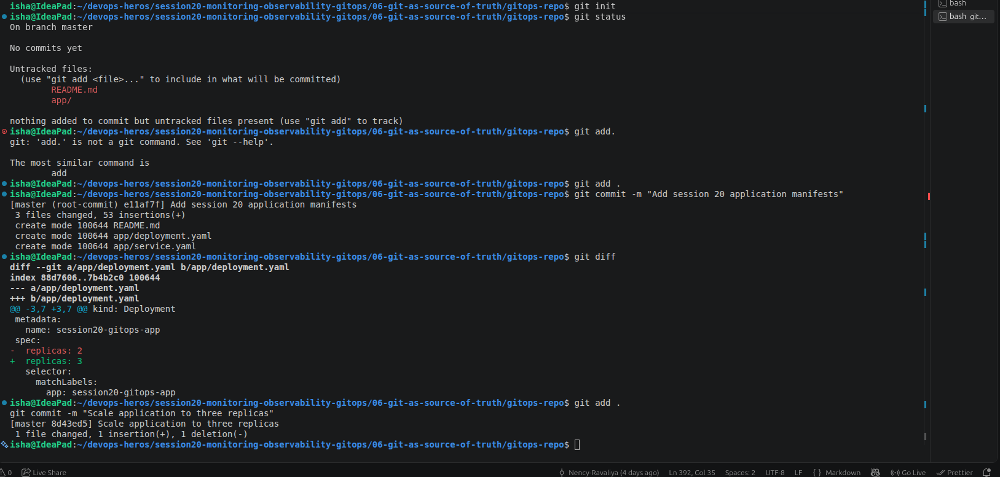

# 6. Kubernetes + GitOps

A common Kubernetes GitOps architecture is:

```text
                    GitHub
                      |
                Desired State
                      |
                      v
                 Argo CD
                      |
                Reconciliation
                      |
                      v
             Kubernetes Cluster
                      |
              ┌───────┴───────┐
              |               |
          Deployment        Service
              |
             Pods
```

Popular GitOps tools include:

- Argo CD
- Flux CD

---

# 7. GitOps Demo

## Step 1 — Create Git Repository


## Repository Structure

```
gitops-demo/
├── README.md                        ← this file
└── app/
    ├── deployment.yaml              ← your actual application (nginx pods)
    ├── service.yaml                 ← exposes the app inside the cluster
    └── argocd-application.yaml      ← tells Argo CD WHERE to find the above files
```

---

# 8. GitOps Kubernetes Manifest

 What is what?

| File | What it is | Who applies it |
|------|-----------|----------------|
| `app/deployment.yaml` | Your **actual application** — nginx containers | Argo CD (automatically from Git) |
| `app/service.yaml` | Makes the app reachable inside the cluster | Argo CD (automatically from Git) |
| `app/argocd-application.yaml` | Argo CD config that points at this repo | **You apply this once manually** |

> **The key confusion point:** You never directly apply `deployment.yaml` or `service.yaml` with kubectl.
> Instead, you apply `argocd-application.yaml` **once**, and then Argo CD reads the `app/` folder
> from GitHub and deploys everything automatically — now and on every future `git push`.

---

# 9. Install Argo CD

Create the Argo CD namespace:

```bash
kubectl create namespace argocd

kubectl apply -n argocd --server-side --force-conflicts -f https://raw.githubusercontent.com/argoproj/argo-cd/stable/manifests/install.yaml

```

Check the pods:

```bash
kubectl get pods -n argocd -w
```

Wait until the Argo CD components are running.

---

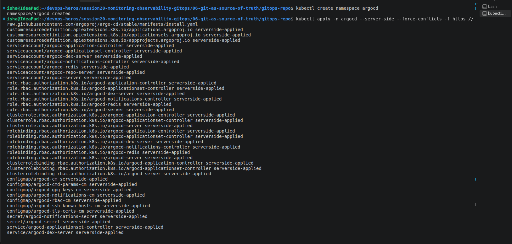
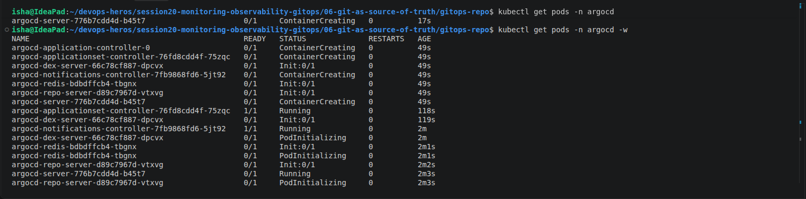


# 10. Access Argo CD

Check services:

```bash
kubectl port-forward svc/argocd-server -n argocd 8080:443
```

Open your browser at:

```
https://localhost:8080
```

> Your browser shows a certificate warning — click **Advanced → Proceed**. This is normal for local labs.

### Get the admin password

```bash
kubectl -n argocd get secret argocd-initial-admin-secret \
  -o jsonpath="{.data.password}" | base64 -d && echo
```

Login with:
- **Username:** `admin`
- **Password:** output of the command above

### Screenshot

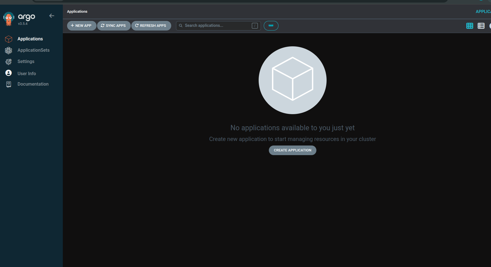

---

# 11. Create GitOps Application

This is the **single manual step** you do once. It tells Argo CD:
*"Watch the `app/` folder in this GitHub repo and deploy whatever is there into the `session20` namespace."*

```bash
kubectl apply -f app/argocd-application.yaml
```

### What this file does

```yaml
# app/argocd-application.yaml
source:
  repoURL: https://github.com/Nency-Ravaliya/gitops-demo.git
  targetRevision: main
  path: app          # ← Argo CD reads deployment.yaml + service.yaml from here

destination:
  namespace: session20   # ← deploys into this namespace in your cluster

syncPolicy:
  automated:
    prune: true        # ← deletes k8s resources if you remove files from Git
    selfHeal: true     # ← reverts manual kubectl changes back to what Git says
  syncOptions:
    - CreateNamespace=true   # ← creates the session20 namespace automatically
```

After applying, Argo CD will:
1. Read `deployment.yaml` and `service.yaml` from GitHub
2. Create the `session20` namespace
3. Deploy your nginx application

---

## Step 5 — Verify Your Application is Running

Check that Argo CD deployed your app:

```bash
# See the pods (your actual nginx containers)
kubectl get pods -n session20

# See the deployment
kubectl get deployment session20-gitops-app -n session20

# See what Argo CD thinks
kubectl get applications -n argocd
```

Expected:

```
# pods
NAME                                    READY   STATUS
session20-gitops-app-...               1/1     Running
session20-gitops-app-...               1/1     Running
... (5 total)

# application
NAME            SYNC STATUS   HEALTH STATUS
session20-app   Synced        Healthy
```

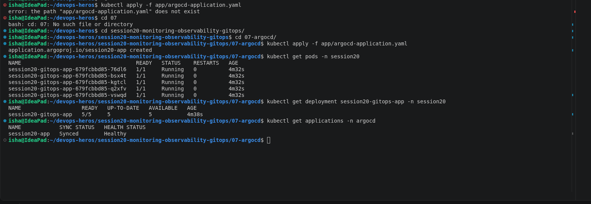

---

# 12. Open Your Actual Application in a Browser

Your app is nginx running inside Kubernetes. To access it locally:

Open a **new terminal tab** and run (keep it open):

```bash
kubectl port-forward svc/session20-gitops-app -n session20 9090:80
```

Then open:

```
http://localhost:9090
```

You will see the **nginx welcome page** — this is your actual application running in the cluster.

```
Two port-forwards you need open simultaneously:
  Terminal 1: kubectl port-forward svc/argocd-server -n argocd 8080:443    → Argo CD UI
  Terminal 2: kubectl port-forward svc/session20-gitops-app -n session20 9090:80 → Your app
```

### Screenshot

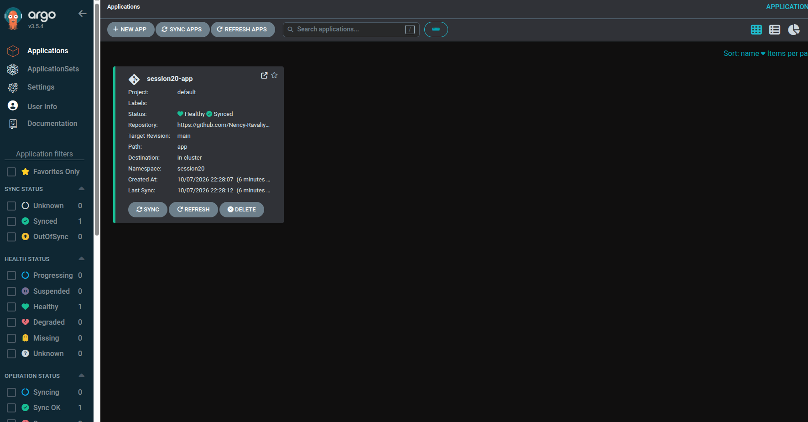
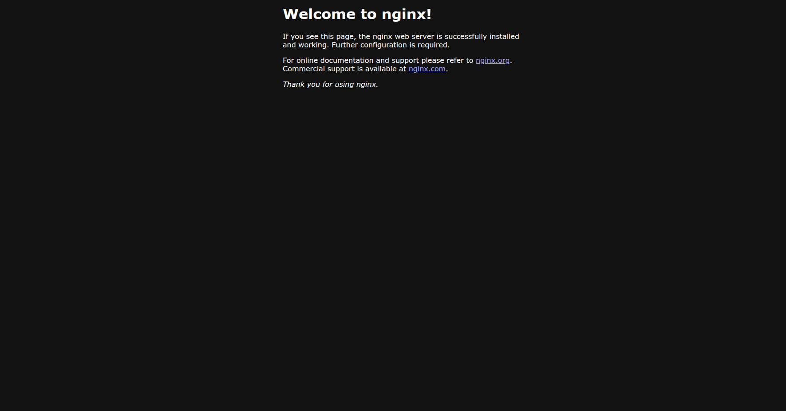

---

# 13.  GitOps in Action: Scale by Committing to Git

This is the whole point of GitOps. You **do not** run `kubectl scale`.
You change a file, push it to Git, and Argo CD syncs the cluster automatically.

---

### Scale down to 2 replicas

**1. Edit `app/deployment.yaml`:**

```yaml
# Change this:
replicas: 5

# To this:
replicas: 2
```

**2. Commit and push:**

```bash
git add app/deployment.yaml
git commit -m "Scale down to 2 replicas"
git push
```

**3. Watch Argo CD sync (within ~30 seconds):**

```bash
kubectl get pods -n session20 -w
```

You will see pods terminating until only 2 remain.

**4. Verify:**

```bash
kubectl get deployment session20-gitops-app -n session20
```

```
NAME                   READY   UP-TO-DATE   AVAILABLE
session20-gitops-app   2/2     2            2
```

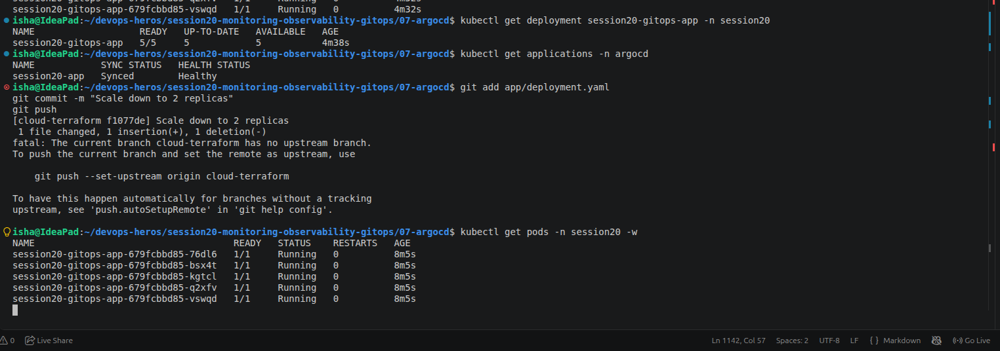

---

### Scale up to 3 replicas

**1. Edit `app/deployment.yaml`:**

```yaml
replicas: 3
```

**2. Commit and push:**

```bash
git add app/deployment.yaml
git commit -m "Scale up to 3 replicas"
git push
```

**3. Verify:**

```bash
kubectl get deployment session20-gitops-app -n session20
```

```
NAME                   READY   UP-TO-DATE   AVAILABLE
session20-gitops-app   3/3     3            3
```

---

# 14. Self-Healing Demonstration

GitOps can also detect configuration drift.

For example, manually scale the deployment:

```bash
kubectl scale deployment gitops-demo --replicas=1
```

Check:

```bash
kubectl get deployment gitops-demo
```

The desired Git state still specifies:

```text
replicas: 3
```

If automated self-healing is enabled, Argo CD detects the difference and reconciles the cluster back to:

```text
replicas: 3
```

This demonstrates:

```text
Manual Drift
     |
     v
Argo CD Detects Difference
     |
     v
Reconciliation
     |
     v
Desired Git State Restored
```

---

# 15. Final Application Verification

Check:

```bash
kubectl get deployments
kubectl get pods
kubectl get services
```

The GitOps-managed application should be running successfully.

Example:

```text
NAME          READY   UP-TO-DATE   AVAILABLE
gitops-demo   3/3     3            3
```

---

# 16. Monitoring vs Observability

| Monitoring | Observability |
|---|---|
| Tracks known conditions | Helps investigate unknown problems |
| Uses metrics and alerts | Uses metrics, logs, and traces |
| Answers "Is something wrong?" | Answers "Why is it wrong?" |
| Focuses on system health | Focuses on system behavior |
| Example: CPU > 80% | Example: Why request latency increased |

---

# 17. Monitoring, Observability and GitOps Together

These practices complement each other.

```text
                 GitOps
                   |
             Desired State
                   |
                   v
             Kubernetes
                   |
       ┌───────────┼───────────┐
       |           |           |
    Metrics       Logs       Traces
       |           |           |
       └───────────┼───────────┘
                   |
             Observability
                   |
              Monitoring
                   |
               Alerts
                   |
              Operations
```

GitOps manages **what should run**.

Monitoring tells us **whether it is healthy**.

Observability helps explain **why it behaves the way it does**.

---

# 18. Complete Command Summary

## Kubernetes

```bash
minikube start

kubectl cluster-info

kubectl get nodes

kubectl get pods -A
```

## Metrics

```bash
minikube addons enable metrics-server

kubectl top nodes

kubectl top pods -A
```

## Logs

```bash
kubectl logs <pod-name>

kubectl logs -f <pod-name>
```

## Application health

```bash
kubectl get pods

kubectl describe pod <pod-name>
```

## Argo CD

```bash
kubectl create namespace argocd

kubectl apply -n argocd \
  -f https://raw.githubusercontent.com/argoproj/argo-cd/stable/manifests/install.yaml

kubectl get pods -n argocd

kubectl get svc -n argocd

kubectl get applications -n argocd
```

## Git

```bash
git add .

git commit -m "Update GitOps configuration"

git push origin main
```

## Verify GitOps deployment

```bash
kubectl get deployment gitops-demo

kubectl get pods

kubectl get services
```

---