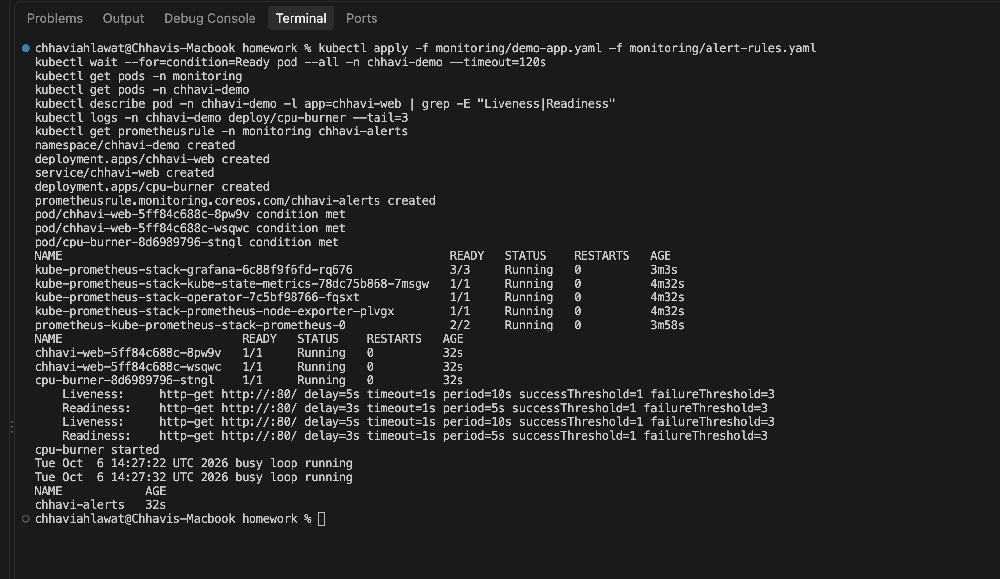
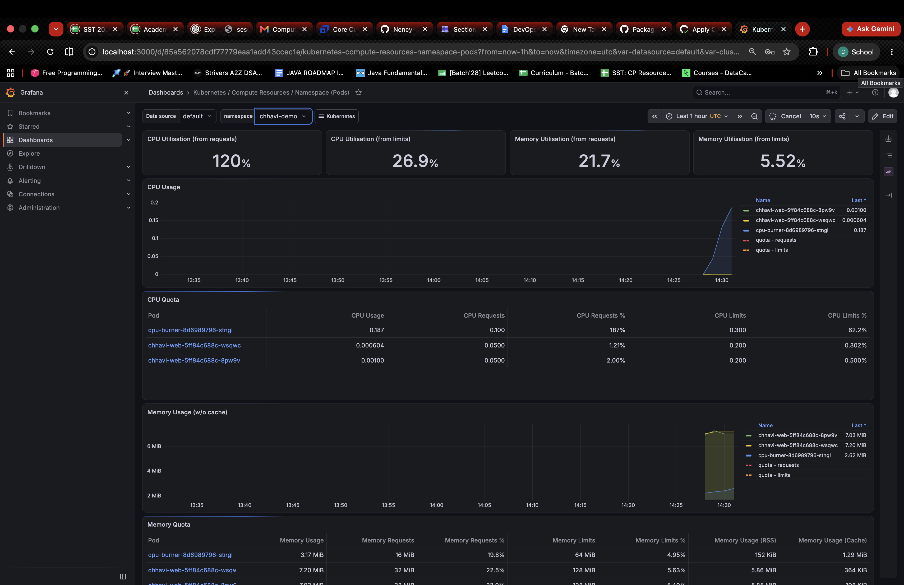
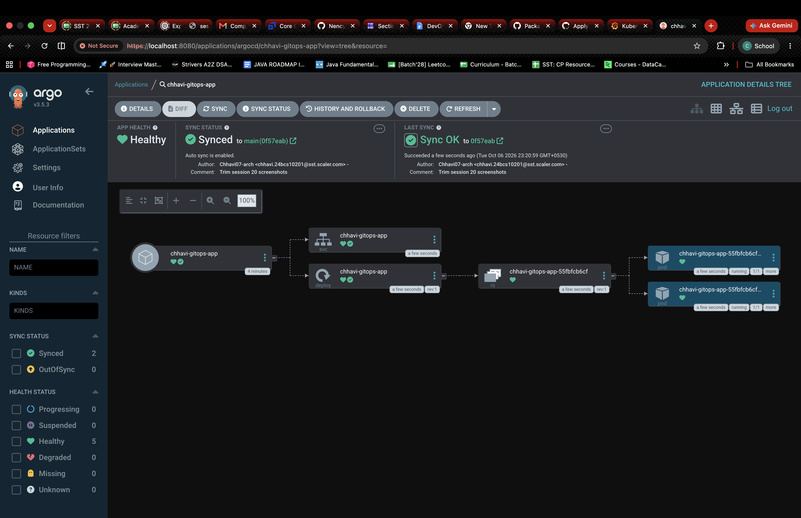

# Session 20 — Monitoring, Observability & GitOps (Homework)

**Name:** Chhavi Ahlawat
**Enrollment Number:** 24BCS10201
**Email:** chhavi.24bcs10201@sst.scaler.com

---

## Homework Tasks

| Task | Description | Status |
|---|---|---|
| 1 | Monitoring — metrics, logs, alerts, CPU, memory, app health (Prometheus + Grafana) | ✅ |
| 2 | Observability — metrics, logs, traces | ✅ |
| 3 | GitOps — Argo CD syncing from my fork, auto-sync + self-heal | ✅ |

## Folder Guide

| Path | Covers |
|---|---|
| [`homework/monitoring/demo-app.yaml`](homework/monitoring/demo-app.yaml) | nginx app with probes + limits, and a `cpu-burner` pod |
| [`homework/monitoring/alert-rules.yaml`](homework/monitoring/alert-rules.yaml) | `PrometheusRule`: `HighPodCPU`, `PodRestarting` |
| [`homework/gitops-app/`](homework/gitops-app/) | Manifests Argo CD watches in Git |
| [`homework/argocd-application.yaml`](homework/argocd-application.yaml) | Argo CD `Application` (repo = my fork, `main`) |

Cluster: minikube on macOS.

---

## Task 1 — Monitoring

### 1. Install the stack, deploy the app, check health, logs and alerts
```bash
helm repo add prometheus-community https://prometheus-community.github.io/helm-charts
helm repo update
helm install kube-prometheus-stack prometheus-community/kube-prometheus-stack -n monitoring --create-namespace \
  --set alertmanager.enabled=false
cd session20-monitoring-observability-gitops/homework
kubectl apply -f monitoring/demo-app.yaml -f monitoring/alert-rules.yaml
kubectl get pods -n monitoring                                                   # Prometheus, Grafana, operator, exporters
kubectl get pods -n chhavi-demo                                                  # app health
kubectl describe pod -n chhavi-demo -l app=chhavi-web | grep -E "Liveness|Readiness"
kubectl logs -n chhavi-demo deploy/cpu-burner --tail=3                           # logs
kubectl get prometheusrule -n monitoring chhavi-alerts                            # alerts: HighPodCPU, PodRestarting
```


### 2. CPU & memory metrics in Grafana
```bash
kubectl port-forward -n monitoring svc/kube-prometheus-stack-grafana 3000:80
kubectl get secret -n monitoring kube-prometheus-stack-grafana -o jsonpath="{.data.admin-password}" | base64 -d; echo
```
Login `admin` → Dashboards → *Kubernetes / Compute Resources / Namespace (Pods)* → namespace `chhavi-demo`. The `cpu-burner` pod pushes CPU above 0.1 core, which fires the `HighPodCPU` alert.



---

## Task 2 — Observability

Monitoring tells you **when** something is wrong (known checks); observability lets you ask **why** using the data the system emits.

| Pillar | What it is | Example | Tools |
|---|---|---|---|
| Metrics | Numbers over time | CPU = 0.3 cores, 5xx rate, restarts | Prometheus, Grafana, CloudWatch |
| Logs | Timestamped event records | `GET / 200`, stack traces | `kubectl logs`, Loki, ELK/EFK |
| Traces | Path of one request across services | checkout → payment → DB, 800 ms in DB | Jaeger, Tempo, OpenTelemetry |

**Why it's needed:** microservices fail in unexpected ways; pods are short-lived, so problems can't be debugged by SSH-ing into a box; it lowers MTTR and helps catch issues before users do.

**Kubernetes observability:** kubelet/cAdvisor + kube-state-metrics → Prometheus (metrics), container stdout → `kubectl logs`/Loki (logs), OpenTelemetry → Jaeger/Tempo (traces), plus `kubectl get events` and probes for health.

---

## Task 3 — GitOps with Argo CD

**GitOps** = Git is the **single source of truth**; the desired state is written **declaratively** (YAML), and an agent in the cluster **continuously reconciles** live state to match Git.

```text
edit YAML → git push → Argo CD detects change → syncs cluster → live state = Git
                       ↑______ drift (kubectl edits) reverted by selfHeal ______|
```

### 1. Install Argo CD and create the Application
```bash
kubectl create namespace argocd
kubectl apply -n argocd --server-side --force-conflicts -f https://raw.githubusercontent.com/argoproj/argo-cd/stable/manifests/install.yaml
kubectl apply -f session20-monitoring-observability-gitops/homework/argocd-application.yaml
kubectl port-forward svc/argocd-server -n argocd 8080:443
kubectl -n argocd get secret argocd-initial-admin-secret -o jsonpath="{.data.password}" | base64 -d; echo
```
Argo CD pulls `homework/gitops-app/` from my fork and deploys it to `chhavi-gitops`, with auto-sync, prune and self-heal turned on.



### 2. Change in Git → cluster follows; manual drift is reverted
```bash
# edit replicas in homework/gitops-app/deployment.yaml, then:
git commit -am "gitops: scale" && git push                        # Argo CD syncs the new replica count
kubectl scale deploy chhavi-gitops-app -n chhavi-gitops --replicas=5   # selfHeal puts it back to the Git value
```
