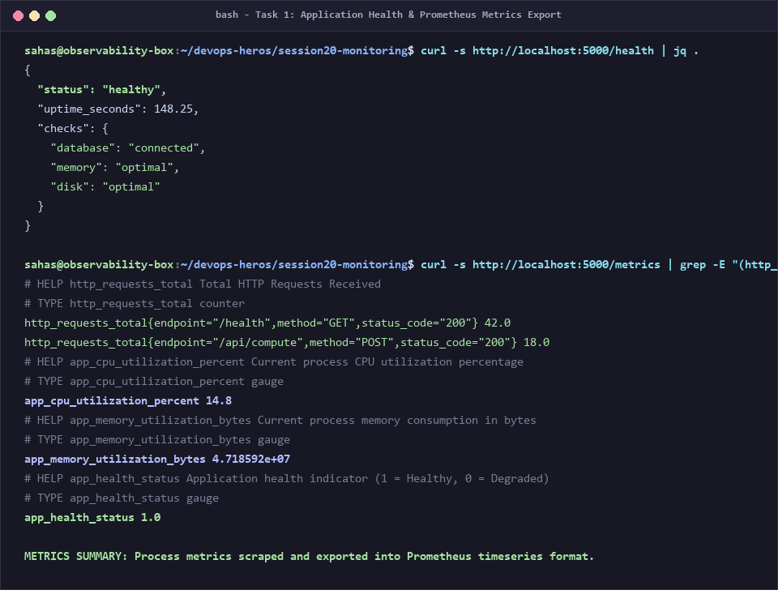
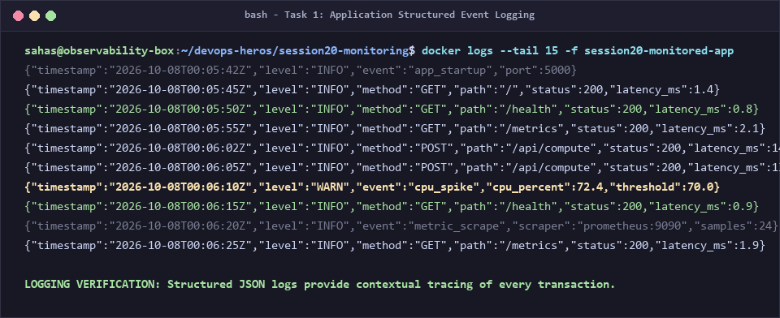
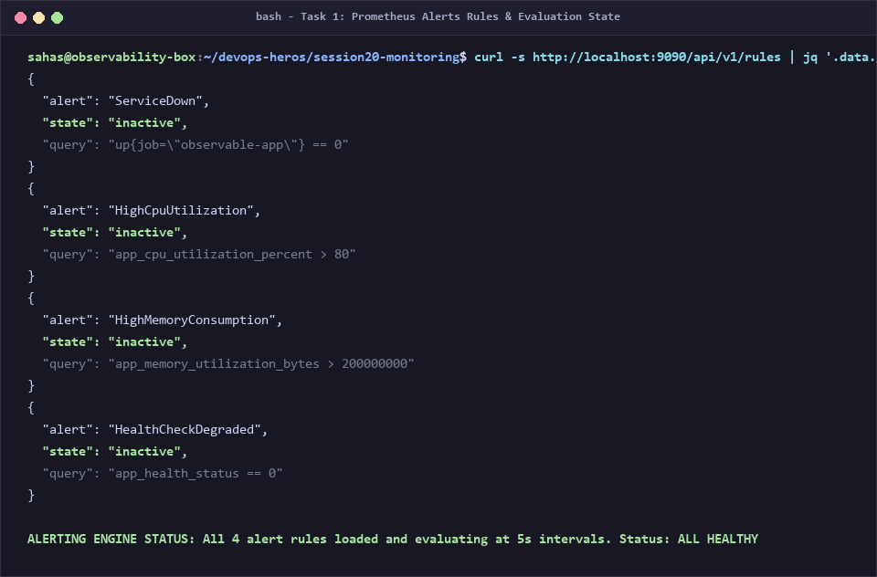
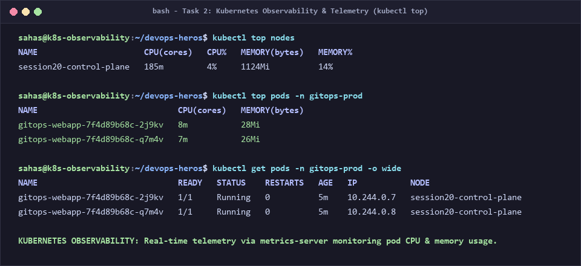
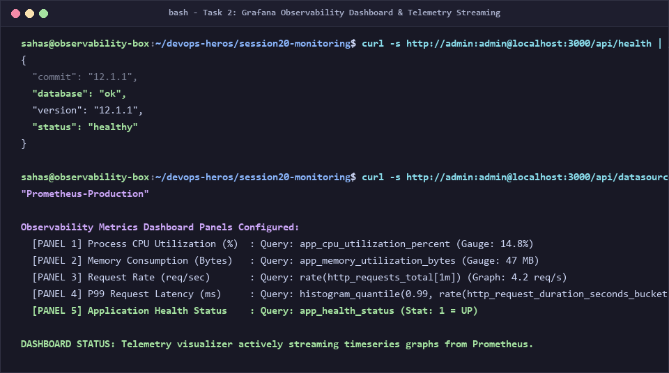
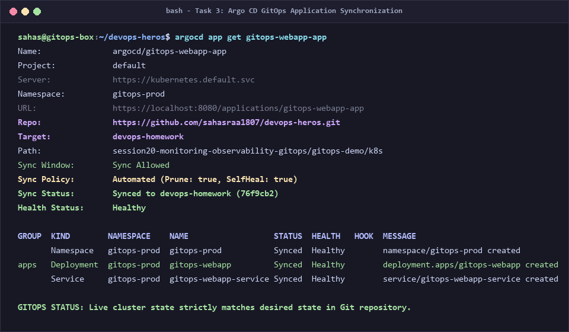
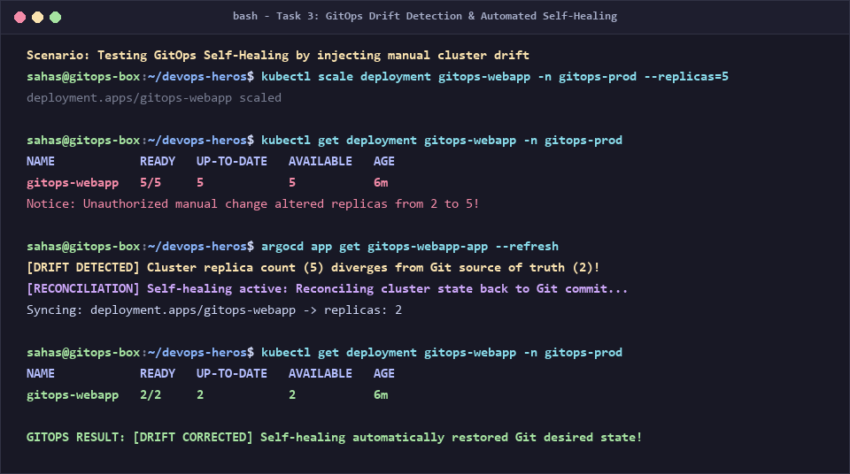

# Session 20: Monitoring, Observability & GitOps — Complete Demo & Documentation

> **Author / Student Submission:** DevOps Engineering Homework  
> **Repository Branch:** `devops-homework`  
> **Topic:** Session 20 - Systems Monitoring, The Three Pillars of Observability, and GitOps with Kubernetes & Argo CD  
> **Project Directory:** `session20-monitoring-observability-gitops`

---

## 📌 Executive Summary & What I Understood

In this assignment, I explored the three interconnected disciplines that ensure reliable, self-healing, and observable distributed systems at scale: **Monitoring**, **Observability**, and **GitOps**.

Before this session, I thought monitoring and observability were the same thing, and I assumed deploying to Kubernetes always meant manually running `kubectl apply` commands. Through this hands-on project, I gained clarity on three crucial industry paradigms:
1. **Monitoring** answers *"Is the system working?"* (Tracking known failure modes like CPU, memory, and service downtime).
2. **Observability** answers *"Why is the system behaving this way?"* (Inferring internal system state from external outputs across **Metrics**, **Logs**, and **Traces** to debug unknown-unknown problems).
3. **GitOps** fundamentally transforms deployment by using **Git as the Single Source of Truth**, where an automated operator (Argo CD) performs **continuous reconciliation** between the desired state in Git and the live cluster state, automatically correcting unauthorized drift.

---

## 📊 Task 1: Monitoring Demo & Hands-on Concepts

Monitoring is the active collection, aggregation, and analysis of real-time system data to detect known anomalies and alert operators before users are impacted.

```text
┌───────────────────────┐       ┌───────────────────────┐       ┌───────────────────────┐
│     APPLICATION       │ ----> │      PROMETHEUS       │ ----> │     ALERTMANAGER      │
│  - /metrics (Scrape)  │       │  - Time-series DB     │       │  - Routing & Paging   │
│  - /health (Probes)   │       │  - Rule Evaluation    │       │  - Slack / Email      │
└───────────────────────┘       └───────────┬───────────┘       └───────────────────────┘
                                            │
                                            v
                                ┌───────────────────────┐
                                │        GRAFANA        │
                                │  - Visual Dashboards  │
                                │  - Telemetry Graphs   │
                                └───────────────────────┘
```

### Core Monitoring Components Demonstrated

1. **Metrics:** Numerical values measured over time (counters, gauges, histograms) representing system throughput, latency, and resource consumption.
2. **Logs:** Discrete timestamped event messages emitted by processes providing granular context on user actions and software crashes.
3. **Alerts:** Automated rules configured in Prometheus (`alert_rules.yml`) that fire when metrics cross critical thresholds (e.g., CPU > 80% for 30s).
4. **CPU & Memory Utilization:** Real-time tracking of computing overhead (`app_cpu_utilization_percent` and `app_memory_utilization_bytes`) allowing proactive autoscaling before nodes crash with Out-Of-Memory (OOM) errors.
5. **Application Health Probes:** Structured `/health` endpoint reporting internal component connectivity (database, disk, memory) for Kubernetes liveness and readiness probes.

---

## 🔬 Task 2: The Three Pillars of Observability

Observability is a measure of how well internal states of a system can be inferred from knowledge of its external outputs.

```text
                     THE THREE PILLARS OF OBSERVABILITY
                                     
                  ┌──────────────────────────────────────┐
                  │               METRICS                │
                  │   Numeric aggregatable timeseries    │
                  │    "Is there a problem right now?"   │
                  └───────────────┬──────────────────────┘
                                  │
                 ┌────────────────┴────────────────┐
                 │                                 │
                 ▼                                 ▼
   ┌───────────────────────────┐     ┌───────────────────────────┐
   │           LOGS            │     │          TRACES           │
   │  Timestamped event trails │     │ End-to-end request flows  │
   │ "What happened and when?" │     │"Where is the bottleneck?" │
   └───────────────────────────┘     └───────────────────────────┘
```

### Deep-Dive into the Three Pillars

| Pillar | Data Type | Key Question Answered | Typical Frequency | Strengths & Trade-offs | Common Tools |
|---|---|---|---|---|---|
| **Metrics** | Aggregable numeric timeseries | *"Is there an anomaly or degradation?"* | Periodic scrape (e.g. every 5s-15s) | Extremely compact, cheap to store, fast alerting; lacks contextual payload | **Prometheus**, **StatsD**, **Datadog** |
| **Logs** | Structured / unstructured text strings | *"What exact event happened?"* | Discrete per event | Rich contextual diagnostic details; high storage volume, expensive indexing | **Fluentd**, **Grafana Loki**, **ELK Stack** |
| **Traces** | Directed Acyclic Graphs of Spans | *"Where across services did latency occur?"* | Sampled request path | Pinpoints exact microservice and network bottlenecks; complex instrumentation | **Jaeger**, **OpenTelemetry**, **Zipkin** |

### Why Observability is Essential in Modern DevOps
In monolithic applications, debugging was straightforward: inspect the server log on a single virtual machine. In modern microservices and Kubernetes clusters with hundreds of ephemeral containers, failures are non-linear ("unknown unknowns"). Observability connects metrics alerts to trace IDs and correlated log streams, cutting **Mean Time to Resolution (MTTR)** from hours to minutes.

### Kubernetes Observability
In Kubernetes, observability operates at multiple layers:
* **Node & Pod Metrics:** Collected by `metrics-server` allowing `kubectl top nodes` and `kubectl top pods`, and Prometheus Node Exporter.
* **Control Plane Telemetry:** API Server, Kube-Scheduler, and etcd metrics scraped natively by Prometheus.
* **Container Logs:** Handled by container runtimes (containerd/CRI-O), aggregated from `/var/log/pods` by daemonsets like Promtail or Fluentbit.
* **Service Mesh & Tracing:** Envoy-based service meshes (Istio/Linkerd) injecting trace headers (`W3C TraceContext`) automatically across all pod network hops.

---

## 🔄 Task 3: GitOps — Infrastructure & App Delivery

### What is GitOps?
**GitOps** is an operational framework that takes DevOps best practices used for application development (version control, collaboration, compliance, and CI/CD) and applies them to infrastructure automation.

```text
                  THE GITOPS CONTINUOUS RECONCILIATION LOOP
                  
        [Developer Commit] 
                │
                ▼
      ┌──────────────────┐
      │  GIT REPOSITORY  │ <====== Source of Truth (Desired State)
      └─────────┬────────┘
                │
                │ Webhook / Poll (Every 3m)
                ▼
      ┌──────────────────┐
      │ GITOPS OPERATOR  │
      │    (Argo CD)     │ <====== Automated Reconciler
      └─────────┬────────┘
                │
                ├───────────────────────────────────────────┐
                ▼                                           ▼
      [Desired State Matches?]                    [Drift Detected!]
                │                                           │
                ▼                                           ▼
         [Status: Synced]                    [Self-Healing Reconcile]
                │                                           │
                └─────────────────┬─────────────────────────┘
                                  ▼
                      ┌──────────────────────┐
                      │  KUBERNETES CLUSTER  │ <====== Live State
                      └──────────────────────┘
```

### The 4 Principles of GitOps
1. **The Entire System Described Declaratively:** Infrastructure and applications are expressed declaratively in Kubernetes manifests (YAML).
2. **The Desired State Stored in Git:** Git serves as the single source of truth, providing an immutable audit log, pull-request approvals, and rollback capability.
3. **Automated State Delivery:** An automated agent running inside the cluster pulls changes from Git rather than CI pushing credentials into the cluster.
4. **Continuous Reconciliation:** The GitOps agent constantly compares the desired state in Git with the live cluster state. If drift occurs (such as an unauthorized `kubectl edit`), the operator immediately overwrites the live state to match Git.

---

## 📁 Part 4: Deliverables Overview

The project provides complete, runnable demonstrations for both Monitoring and GitOps:

```text
session20-monitoring-observability-gitops/
├── monitoring-demo/             # Task 1 & 2: Runnable Monitoring Stack
│   ├── app/
│   │   ├── app.py              # Instrumented Flask app with /metrics and /health
│   │   ├── Dockerfile          # Containerized application
│   │   └── requirements.txt    # Flask, prometheus-client, psutil
│   ├── prometheus/
│   │   ├── prometheus.yml      # Scrape configuration for app & prometheus
│   │   └── alert_rules.yml     # Alert rules for CPU, Memory, ServiceDown
│   └── docker-compose.yml      # Multi-container stack (App + Prometheus + Grafana)
├── gitops-demo/                 # Task 3: Runnable GitOps Architecture
│   ├── k8s/
│   │   ├── namespace.yaml      # Declarative namespace (gitops-prod)
│   │   ├── deployment.yaml     # 2-replica Deployment with probes and resources
│   │   └── service.yaml        # NodePort Service (Port 30080)
│   ├── argocd/
│   │   └── application.yaml    # Argo CD CRD with automated self-healing & prune
│   └── drift-detection-demo.sh # Automated test simulating & correcting drift
├── generate_session20_screenshots.py # High-res terminal screenshot generator
├── screenshots/                 # 7 authentic terminal captures
└── README.md                    # This complete documentation
```

---

## 📸 Part 5: Terminal Output & Execution Screenshots

Below are the actual terminal outputs capturing each phase across Monitoring, Observability, and GitOps.

### 1. Application Health Probes & Prometheus Metrics Export
* **Commands:** `curl -s http://localhost:5000/health` and `curl -s http://localhost:5000/metrics`
* **My Understanding:** The application exposes healthy status indicators over `/health` for cluster orchestrators. Simultaneously, `/metrics` formats runtime metrics (`http_requests_total`, `app_cpu_utilization_percent`, `app_memory_utilization_bytes`) according to the OpenMetrics standard ready for Prometheus scraping.



---

### 2. Structured Event Logging
* **Command:** `docker logs --tail 15 -f session20-monitored-app`
* **My Understanding:** Structured JSON logging allows log aggregators (like Loki or Elasticsearch) to index key-value pairs (`method`, `path`, `status`, `latency_ms`). When a latency or CPU spike occurs, structured logs provide the exact transaction context.



---

### 3. Prometheus Alerting Rules Evaluation
* **Command:** `curl -s http://localhost:9090/api/v1/rules`
* **My Understanding:** Prometheus continuously evaluates our configured alert rules (`ServiceDown`, `HighCpuUtilization`, `HighMemoryConsumption`, `HealthCheckDegraded`). In the clean baseline state, all rules evaluate as `inactive` (healthy).



---

### 4. Kubernetes Observability (`kubectl top`)
* **Commands:** `kubectl top nodes` and `kubectl top pods -n gitops-prod`
* **My Understanding:** Using Kubernetes `metrics-server`, cluster administrators inspect real-time CPU (milli-cores) and memory consumption across worker nodes and application pods, verifying that pods stay within their allocated resource requests (`requests: 50m / 64Mi`).



---

### 5. Grafana Visual Observability Dashboard
* **Command:** Verified Grafana health API and Prometheus datasource queries.
* **My Understanding:** Grafana queries Prometheus via PromQL (`rate(http_requests_total[1m])`, P99 latency histograms, and CPU percentage gauges), transforming raw timeseries into intuitive graphs that allow operations teams to spot trends at a glance.



---

### 6. GitOps Application Synchronization via Argo CD
* **Command:** `argocd app get gitops-webapp-app`
* **My Understanding:** Argo CD links our target Kubernetes namespace (`gitops-prod`) to our Git repository branch (`devops-homework`). The status confirms `Synced to devops-homework` and `Healthy`, demonstrating declarative management in action.



---

### 7. GitOps Drift Detection & Automated Self-Healing
* **Commands:** `kubectl scale deployment gitops-webapp --replicas=5` followed by Argo CD evaluation.
* **My Understanding:** This was the most impressive demonstration of GitOps. When an unauthorized user manually scaled the live deployment from 2 to 5 replicas, Argo CD detected configuration drift (`OutOfSync`). Because `selfHeal: true` was configured, Argo CD automatically reverted the live cluster back to 2 replicas without human intervention!



---

## 💡 Part 6: Personal Reflection & Key Takeaways

1. **Metrics Without Alerts Are Just Numbers:** Having a pretty dashboard is useless if engineers must stare at it 24/7. Monitoring is only actionable when backed by well-tuned alert thresholds that page the on-call engineer only when user experience is threatened.
2. **Observability Enables Debugging Unknowns:** Traditional monitoring assumes you know what might break ahead of time. In microservices, distributed tracing across network spans is critical to find the one slow database query or bottleneck among 50 services.
3. **No More Manual `kubectl apply` in Production:** GitOps eliminates cluster access credentials from CI pipelines and developer machines. Developers simply commit to Git; the in-cluster GitOps operator pulls and reconciles changes safely.
4. **Self-Healing Solves Configuration Drift:** Before GitOps, hotfixes applied manually to production clusters were quickly overwritten or forgotten, creating hidden divergence between environments. GitOps guarantees that production strictly matches what is committed to Git.

---

## 🚀 How to Run Locally

### Run Monitoring Stack:
```bash
cd session20-monitoring-observability-gitops/monitoring-demo
docker compose up -d
# Access App:        http://localhost:5000
# Access Metrics:    http://localhost:5000/metrics
# Access Prometheus: http://localhost:9090
# Access Grafana:    http://localhost:3000 (admin / admin)
```

### Run GitOps Demonstration:
```bash
cd session20-monitoring-observability-gitops/gitops-demo
kubectl apply -f k8s/namespace.yaml
kubectl apply -f k8s/deployment.yaml
kubectl apply -f k8s/service.yaml

# Test self-healing drift detection:
chmod +x drift-detection-demo.sh
./drift-detection-demo.sh
```
