# Session 20, Task 3: GitOps with Argo CD

- **Git repository (source of truth):** https://github.com/MadaraUchiha-tech/gitops-demo (a copy is in [`gitops-repo/`](gitops-repo/))
- **Argo CD Application:** [`argocd/application.yaml`](argocd/application.yaml)
- Cluster: minikube, Argo CD v3.5.4. All screenshots in [`screenshots/`](screenshots/) are real captures.

## What is GitOps?

**GitOps** is an operating model for infrastructure and applications in which:

1. The **desired state** of the whole system is described **declaratively** (YAML manifests, Helm, Kustomize).
2. That desired state is **stored in Git**, which is the single source of truth and is versioned and reviewed.
3. Approved changes are **pulled automatically** by an agent running inside the cluster.
4. The agent **continuously reconciles**: it compares the live state with Git and corrects any difference.

The four OpenGitOps principles: *declarative, versioned and immutable, pulled automatically, continuously reconciled*.

## Git as the source of truth

- Every change to the cluster is a **commit**. That gives an audit trail (who, what, when, why), code review through pull requests, and easy rollback with `git revert`.
- Nobody needs `kubectl apply` access to production. Developers change Git, and only the in-cluster agent changes the cluster. The CI pipeline doesn't need cluster credentials either.
- Disaster recovery: a new cluster plus the same Git repo gives the same system.
- In my demo the only thing ever applied by hand is the Argo CD `Application` itself (the "bootstrap"). Everything in `apps/web/` (Namespace, ConfigMap, Deployment, Service) is created and changed **only** through Git.

## Declarative configuration

You describe **what** you want, not **how** to get there:

```yaml
# apps/web/deployment.yaml (excerpt)
spec:
  replicas: 2              # "I want 2 replicas" - not "start one more pod"
  template:
    spec:
      containers:
        - image: nginx:1.27-alpine
```

Kubernetes controllers and Argo CD work out the steps needed to make reality match the description. Imperative commands (`kubectl scale`, `kubectl edit`) are treated as **drift** and get reverted.

## Continuous reconciliation

```text
          ┌──────────── Argo CD (in the cluster) ────────────┐
 Git ───▶ │ repo-server renders manifests from Git            │
 (desired)│        │                                          │
          │        ▼                                          │
          │ application-controller: diff(desired, live)  ◀────┼──── live state (Kubernetes API)
          │        │                                          │
          │   OutOfSync? ──yes──▶ sync (apply / prune)  ──────┼───▶ cluster
          └───────────────────────────────────────────────────┘
          repeats every timeout.reconciliation (30s in this lab, 3m by default) or on a webhook
```

Two sources of change are both handled:
- **Git changed** (new commit) → Argo CD applies the new desired state (*automated sync*).
- **Cluster changed** (someone ran `kubectl`) → Argo CD puts it back (*selfHeal*). Resources removed from Git are deleted (*prune*).

## GitOps workflow

```text
developer ── PR ──▶ review ──▶ merge to main ──▶ Argo CD detects new commit ──▶ sync ──▶ Healthy
                                                     ▲                               │
              rollback = git revert ─────────────────┘        drift in cluster ──────┘ selfHeal
```

In a full pipeline, CI builds and scans the image (as in Session 17), then **commits the new image tag to the GitOps repo** instead of running `kubectl`. Argo CD then deploys it.

## Kubernetes + GitOps (Argo CD)

The `Application` CRD connects a Git source with a cluster destination:

```yaml
spec:
  source:
    repoURL: https://github.com/MadaraUchiha-tech/gitops-demo.git
    targetRevision: main
    path: apps/web
  destination:
    server: https://kubernetes.default.svc
    namespace: gitops-web
  syncPolicy:
    automated:
      prune: true      # delete resources that were removed from Git
      selfHeal: true   # revert manual changes in the cluster
    syncOptions:
      - CreateNamespace=true
```

Lab-only settings (applied as ConfigMap patches): anonymous **read-only** UI access ([argocd-cm-patch.yaml](argocd/argocd-cm-patch.yaml), [argocd-rbac-cm-patch.yaml](argocd/argocd-rbac-cm-patch.yaml)) so screenshots need no login form, a 30s polling interval, and plain HTTP behind `kubectl port-forward` ([argocd-cmd-params-patch.yaml](argocd/argocd-cmd-params-patch.yaml)).

---

## Demo

### 1. Argo CD installed

```bash
kubectl create namespace argocd
kubectl apply -n argocd --server-side -f https://raw.githubusercontent.com/argoproj/argo-cd/stable/manifests/install.yaml
```

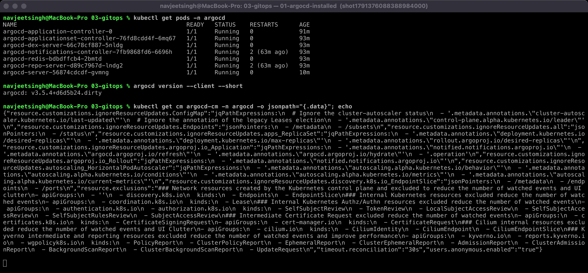

### 2. Register the Application, and Argo CD creates everything from Git

`kubectl apply -f argocd/application.yaml` is the only manual apply. Argo CD clones the repo, creates the namespace, ConfigMap, Deployment and Service, and reports `Synced / Healthy`:

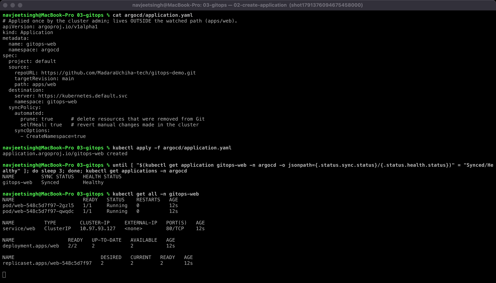

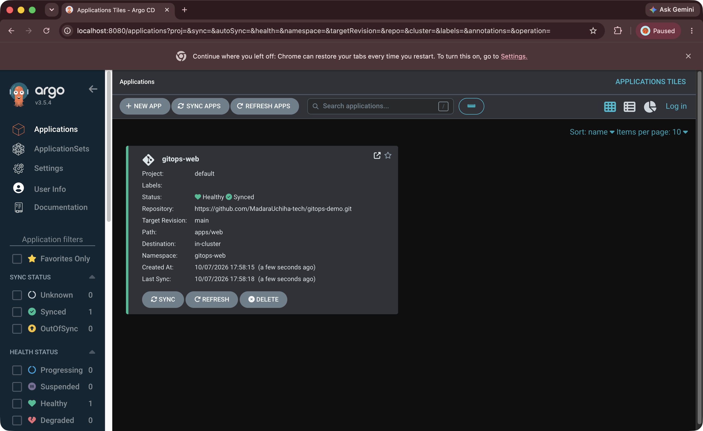

The resource tree that Argo CD manages (Application → Namespace / ConfigMap / Service / Deployment → ReplicaSet → Pods):

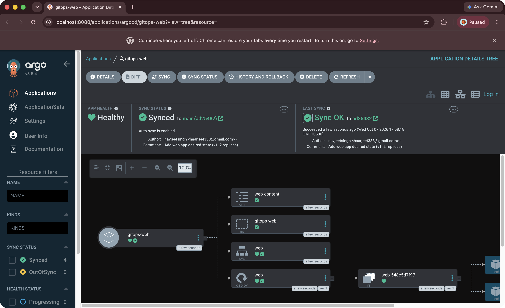

The app serves `version: v1`:

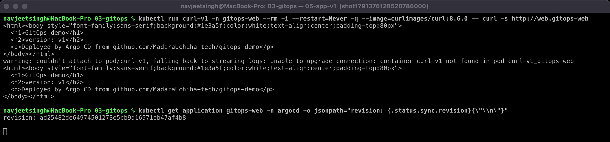

### 3. Change the desired state in Git → automatic deployment

I committed `replicas: 2 → 4` and the page `version: v1 → v2`, and pushed to `main`. There was no `kubectl` involved:

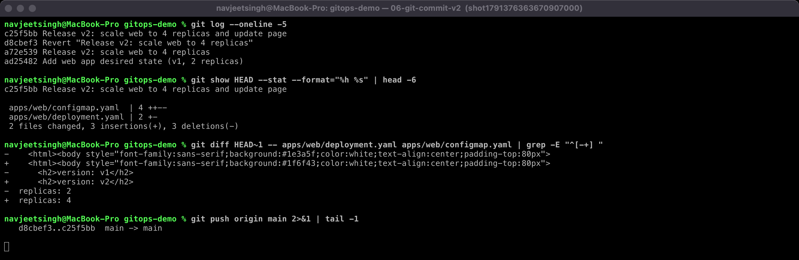

Within the polling interval Argo CD saw the new commit and synced it: `Synced / Healthy`, **4/4** Pods, and the app now serves `version: v2`:

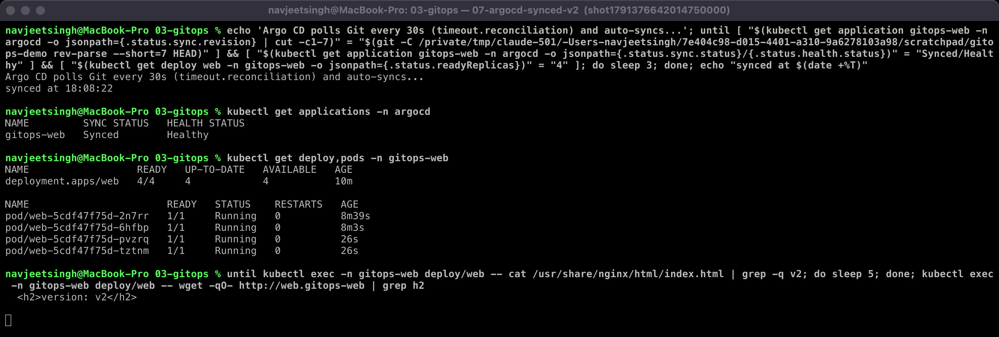

### 4. Drift: manual changes are reverted (selfHeal)

`kubectl scale deploy web --replicas=1` made the cluster differ from Git. Argo CD detected `OutOfSync`, re-applied Git, and the Deployment was back at **4/4** within 8 seconds:

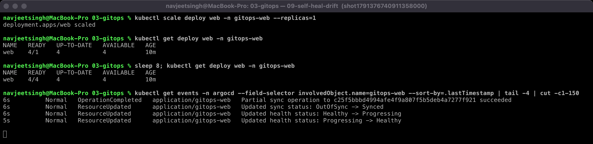

Even deleting a resource doesn't stick. The Service was recreated automatically:

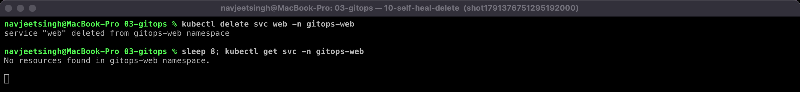

### 5. Rollback the GitOps way: `git revert`

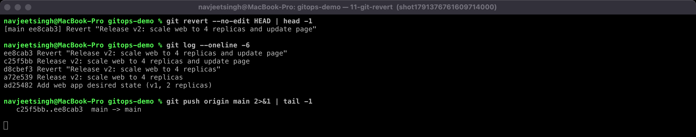

Argo CD synced the revert commit: back to **2/2** replicas and v1. `status.history` lists every revision Argo CD has deployed:

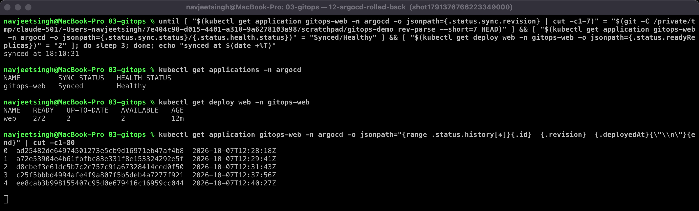

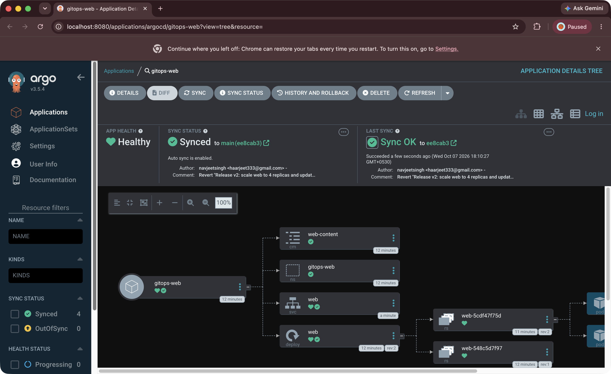

Git history is the deployment history:

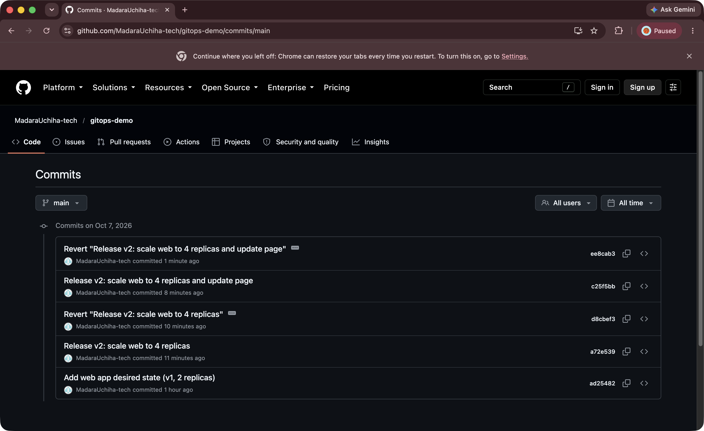

> The history contains the v2 release and revert **twice**. My first run took its screenshots before Argo CD had finished syncing: the wait condition only checked the revision, not `Synced/Healthy` and the ready replica count. I fixed the wait condition and repeated the release → drift → rollback sequence. Both runs are visible in Git and in Argo CD's `status.history` (revisions 1–4). The Argo CD UI screenshot of the v2 tree didn't capture, so the UI is shown before the change (v1) and after the rollback.

## What I learned

- The real control point moves from "who can run kubectl" to "who can merge to `main`", which is easier to review, audit and protect with branch rules.
- With `selfHeal` on, manual hotfixes in the cluster are silently undone. Every change, even an emergency one, has to go through Git. That's the point, but the team needs to know it.
- Rollback is just another commit (`git revert`), so a rollback is reviewed and recorded like any other change.
- Keep the `Application` object outside the path it watches, or Argo CD would try to manage itself from that folder.
- Polling (30s here, 3 minutes by default) adds delay. In production a Git webhook makes Argo CD sync almost immediately.
