# Session 20 – Monitoring, Observability & GitOps

**Name:** Kushal Talati  
**Enrollment No:** 24BCS10123  
**Environment:** kind v0.33.0 cluster `kushal-lab` (Kubernetes v1.37.0, 1 control-plane + 2 workers) on Docker Desktop 29.0.1, macOS / Apple Silicon – the same cluster as sessions 9–15. Monitoring: `kube-prometheus-stack` 92.1.0 (Prometheus Operator v0.94.1, Grafana 13.2.3, Alertmanager) in namespace `monitoring`. GitOps: Argo CD v3.5.4 in namespace `argocd`. The course's own docker-compose demos (Prometheus v3.5.0, Grafana 12.1.1) were run on the Mac as well.

Every command was really run; raw output is in [`logs/`](logs), the exact commands in [`scripts/`](scripts), browser screenshots in [`screenshots/`](screenshots). The professor's manifests (`02-metrics-logs-traces/k8s-demo`, `03-prometheus`, `04-grafana`, `08-mini-project`) were used unmodified; the manifests I wrote are in `01-monitoring/` and `gitops/`.

```text
kushal-24bcs10123/
├── README.md                          # this write-up (Task 1 monitoring demo, Task 3 GitOps demo)
├── 02-observability/README.md         # Task 2: the three pillars, why observability, tools, Kubernetes observability
├── 01-monitoring/
│   ├── metrics-app.yaml               # my app: /metrics, /health (probes), /burn (CPU load), JSON logs
│   ├── servicemonitor.yaml            # tells the Prometheus Operator to scrape it
│   ├── prometheusrule.yaml            # S20AppDown, S20HighCPU, S20HighMemory alerts
│   └── grafana-dashboard.json         # 5-panel dashboard imported through the Grafana API
├── 00-compose/grafana-port-override.yml   # only change to the course compose demo: Grafana on 19301 (3000 was taken)
├── gitops/
│   ├── app/{namespace,deployment,service}.yaml   # what Argo CD deploys (lives on fork branch gitops-kushal-s20)
│   └── argocd-application.yaml        # the one object I apply by hand (kept outside app/)
├── scripts/
│   ├── 00-course-compose-demo.sh      # Prometheus + Grafana via docker compose (course folders 03, 04)
│   ├── 01-logs-and-top.sh             # logs pillar + metrics-server, with the course k8s-demo
│   ├── 02-metrics-servicemonitor.sh   # metrics pillar: app -> ServiceMonitor -> Prometheus, PromQL CPU/memory
│   ├── 03-alerts.sh                   # PrometheusRule -> firing in Prometheus and Alertmanager -> resolved
│   ├── 04-grafana.sh                  # dashboard import + queries through the Grafana API
│   ├── 05-gitops-argocd.sh            # Argo CD: sync, git push 2->3 replicas, self-heal, cascade delete
│   ├── lib.sh  shot.mjs               # helpers (x()/hr(), port-forward, promql, headless-Chrome screenshots)
├── logs/                              # one .txt per script + the two `kubectl get deploy -w` captures
└── screenshots/                       # Prometheus, Alertmanager, Grafana, Argo CD
```

| Task | Where | What I showed |
|---|---|---|
| 1. Monitoring | sections 1–5 below, logs 00–04 | metrics (`/metrics` → Prometheus), logs (`kubectl logs`, JSON access log), alerts (two rules fired and resolved), CPU and memory utilization (PromQL + `kubectl top` + Grafana), application health (readiness/liveness, `up`, `kube_pod_container_status_ready`) |
| 2. Observability | [02-observability/README.md](02-observability/README.md) | pillars, why, tools, Kubernetes observability – written in my own words against this demo |
| 3. GitOps | section 6 below, [logs/05-gitops-argocd.txt](logs/05-gitops-argocd.txt) | Argo CD synced my fork branch; a `git push` (replicas 2→3) rolled out with no kubectl; `kubectl scale` drift was reverted in 3 s |

## 1. The course demo first: Prometheus and Grafana with docker compose

Log: [logs/00-course-compose-demo.txt](logs/00-course-compose-demo.txt)

`03-prometheus/docker-compose.yml` starts one Prometheus that scrapes itself every 5 s:

```text
$ docker compose -f 03-prometheus/docker-compose.yml up -d
$ curl -s http://localhost:9090/api/v1/targets | python3 -c '...print(scrapeUrl, health, lastScrape)'
http://prometheus:9090/metrics up 2026-10-07T18:01:21

$ curl -s 'http://localhost:9090/api/v1/query?query=up'
"status": "success", ... "metric": {"__name__": "up", "instance": "prometheus:9090", "job": "prometheus"}, "value": [..., "1"]
```

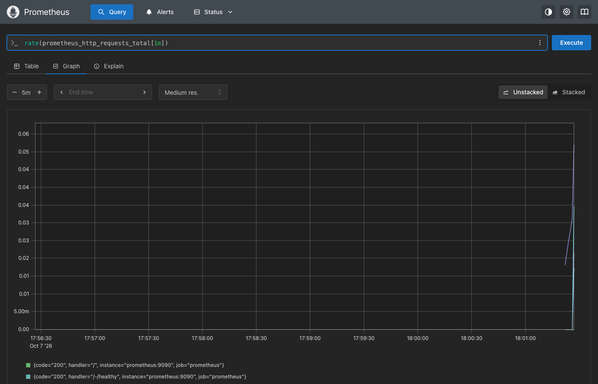

`04-grafana/docker-compose.yml` adds Grafana. Port 3000 on my Mac was in use, so I added a compose override that publishes Grafana on 19301 ([00-compose/grafana-port-override.yml](00-compose/grafana-port-override.yml)); the professor's file is untouched. I created the Prometheus data source through the API and queried through Grafana:

```text
$ curl -s -u admin:admin -X POST http://localhost:19301/api/datasources -d '{"name":"Prometheus","type":"prometheus","url":"http://prometheus:9090","access":"proxy","isDefault":true}'
{"datasource":{"id":1,"uid":"fg0j63rkiic5cb", ... "message":"Datasource added"}

$ curl -s -u admin:admin -X POST http://localhost:19301/api/ds/query -d '{"queries":[{"refId":"A","datasource":{"uid":"fg0j63rkiic5cb"},"expr":"up","instant":true}], ...}'
1 frame(s)
   {'__name__': 'up', 'instance': 'prometheus:9090', 'job': 'prometheus'} => 1
```

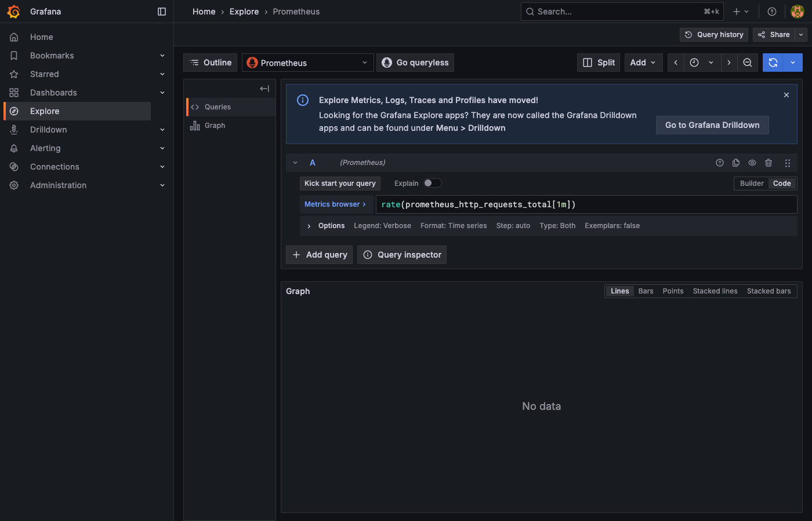

Both stacks were taken down again (`docker compose down -v`); the rest of the homework uses the in-cluster stack.

## 2. Logs and `kubectl top` (course `k8s-demo`)

Log: [logs/01-logs-and-top.txt](logs/01-logs-and-top.txt)

```text
$ kubectl -n s20-monitoring apply -f 02-metrics-logs-traces/k8s-demo/
$ kubectl -n s20-monitoring logs deployment/session20-demo
Session 20 observability demo started
Request received
Health check OK
...
$ kubectl -n s20-monitoring logs deployment/session20-demo --since=15s --timestamps
2026-10-07T17:44:53.402839011Z Request received
2026-10-07T17:44:53.402932552Z Health check OK

$ docker exec kushal-lab-worker2 sh -c 'ls /var/log/pods | grep session20-demo'     # where the lines physically live
s20-monitoring_session20-demo-6698db549f-4lvln_8da4baff-...

$ kubectl top nodes
NAME                       CPU(cores)   CPU(%)   MEMORY(bytes)   MEMORY(%)
kushal-lab-control-plane   183m         3%       1724Mi          10%
kushal-lab-worker          90m          1%       1576Mi          9%
kushal-lab-worker2         113m         1%       1306Mi          8%

$ kubectl top pods -n monitoring | sort -k2 -h -r | head -3      # the monitoring stack is the heaviest thing on the cluster
kube-prometheus-stack-grafana-67c6cc7598-lpsf7     19m   691Mi
prometheus-kube-prometheus-stack-prometheus-0      17m   449Mi
kube-prometheus-stack-operator-5b45f5c978-k4vxd    3m    35Mi
```

`kubectl logs` reads the files the kubelet writes under `/var/log/pods` on the node; `kubectl top` reads metrics-server, which keeps only the latest sample – fine for a quick look, useless for "what happened at 14:03". That is what Prometheus is for.

## 3. Metrics: my app → ServiceMonitor → Prometheus

Log: [logs/02-metrics-servicemonitor.txt](logs/02-metrics-servicemonitor.txt) · Manifests: [01-monitoring/metrics-app.yaml](01-monitoring/metrics-app.yaml), [01-monitoring/servicemonitor.yaml](01-monitoring/servicemonitor.yaml)

The app is 40 lines of Python standard library (so the `python:3.11-alpine` image already on the nodes is enough): `/` counts requests, `/health` answers the probes, `/metrics` prints Prometheus text format, `/burn?seconds=N` spins the CPU, and every request is one JSON log line.

```text
$ curl -s http://localhost:19080/metrics
# HELP http_requests_total Requests served, by path.
# TYPE http_requests_total counter
http_requests_total{path="/"} 3
http_requests_total{path="/health"} 3
http_requests_total{path="/metrics"} 1
# TYPE app_uptime_seconds gauge
app_uptime_seconds 7.6
app_info{version="1.0",owner="kushal-24bcs10123"} 1

$ kubectl -n s20-monitoring logs deployment/s20-metrics-app --tail=2
{"ts": 1791395107.209, "level": "info", "method": "GET", "path": "/doesnotexist", "status": "200", "client": "127.0.0.1"}
{"ts": 1791395108.231, "level": "info", "method": "GET", "path": "/metrics", "status": "200", "client": "127.0.0.1"}
```

Application health is the probes: readiness every 5 s, liveness every 10 s with 3 failures allowed, both on `/health`.

```text
$ kubectl -n s20-monitoring get pod -l app=s20-metrics-app -o jsonpath='...ready={.status.containerStatuses[0].ready} restarts=...'
s20-metrics-app-7d8665dc97-bb44w  ready=true  restarts=0
```

The ServiceMonitor is the only thing I had to add for Prometheus to scrape it – no `prometheus.yml` edit. The operator rewrote the config within about 30 s:

```text
$ kubectl apply -f 01-monitoring/servicemonitor.yaml
$ curl -s http://localhost:19090/api/v1/targets | ... | grep s20
s20-metrics-app http://10.244.3.35:8000/metrics unknown        <- first appearance, before the first scrape
$ curl -s http://localhost:19090/api/v1/status/config | grep -o 'job_name: serviceMonitor/s20-monitoring/s20-metrics-app/0'
job_name: serviceMonitor/s20-monitoring/s20-metrics-app/0
```

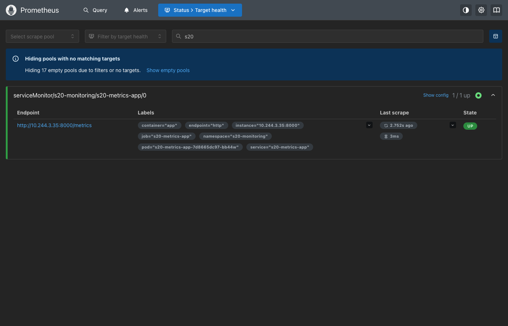

PromQL, after 120 requests to `/`:

```text
up{job="s20-metrics-app"}                                                       => 1
http_requests_total{job="s20-metrics-app",path="/"}                             => 123
sum by (path)(rate(http_requests_total{job="s20-metrics-app"}[1m]))             => / 0.178   /health 0.511   /metrics 0.067
sum by (pod)(rate(container_cpu_usage_seconds_total{namespace="s20-monitoring",container="app"}[2m]))   => 0.0019 cores
container_memory_working_set_bytes{namespace="s20-monitoring",container="app"}  => 22532096  (21.5 MiB)
kube_pod_container_resource_limits{namespace="s20-monitoring",resource="cpu"}   => 0.5
kube_pod_container_status_ready{namespace="s20-monitoring"}                     => 1

$ kubectl top pods -n s20-monitoring --containers
s20-metrics-app-7d8665dc97-bb44w   app    2m           21Mi          <- the same numbers, from metrics-server
```

The CPU and memory series come from cAdvisor inside the kubelet (`job="kubelet"`), the limits and readiness from kube-state-metrics – no code in my app for any of those.

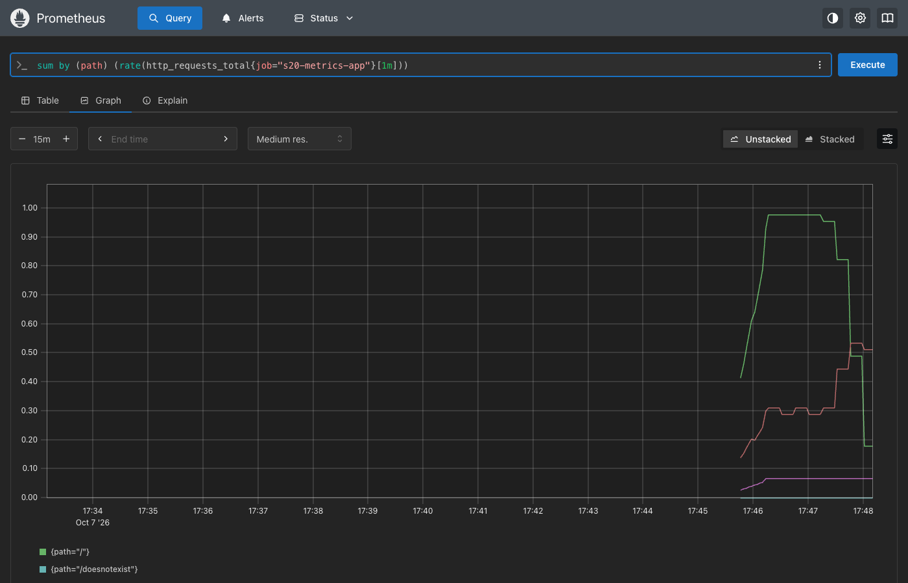

## 4. Alerts: PrometheusRule → Prometheus → Alertmanager

Log: [logs/03-alerts.txt](logs/03-alerts.txt) · Manifest: [01-monitoring/prometheusrule.yaml](01-monitoring/prometheusrule.yaml)

| Alert | Expression | for | How I triggered it |
|---|---|---|---|
| `S20HighCPU` (warning) | `sum(rate(container_cpu_usage_seconds_total{namespace="s20-monitoring",container="app"}[1m])) > 0.2` | 30s | two parallel `curl /burn?seconds=5` loops for 150 s |
| `S20AppDown` (critical) | `absent(up{job="s20-metrics-app"} == 1)` | 1m | `kubectl scale --replicas=0` |
| `S20HighMemory` (warning) | `max(container_memory_working_set_bytes{...}) > 100Mi` | 1m | not triggered (the app uses ~20 MiB) – kept as the memory example |

The operator copied the rule into the ConfigMap Prometheus mounts, and the rules appeared via the API:

```text
$ kubectl -n monitoring get configmap prometheus-kube-prometheus-stack-prometheus-rulefiles-0 -o json | ... grep s20
s20-monitoring-s20-metrics-app-22a62f12-d02b-4b9c-b317-f268fd08b907.yaml
$ curl -s http://localhost:19090/api/v1/rules | ...
S20AppDown inactive for 60
S20HighCPU inactive for 30
S20HighMemory inactive for 60
```

**CPU alert.** Under load the container went from 2m to 414m (its limit is 500m):

```text
$ kubectl top pods -n s20-monitoring --containers
s20-metrics-app-7d8665dc97-wdg6v   app    414m         11Mi
$ promql 'sum(rate(container_cpu_usage_seconds_total{namespace="s20-monitoring",container="app"}[1m]))'
  {} => 0.32397488021152604
  S20HighCPU is FIRING
$ promql 'ALERTS{owner="kushal-24bcs10123"}'
  {'alertname': 'S20HighCPU', 'alertstate': 'firing', 'severity': 'warning'} => 1
$ curl -s http://localhost:19093/api/v2/alerts | ...                       # Alertmanager received it
S20HighCPU active warning s20-metrics-app is using more than 200m CPU
```

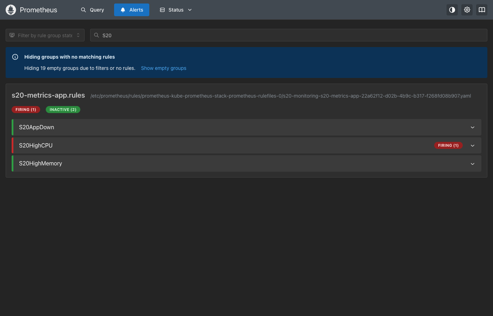
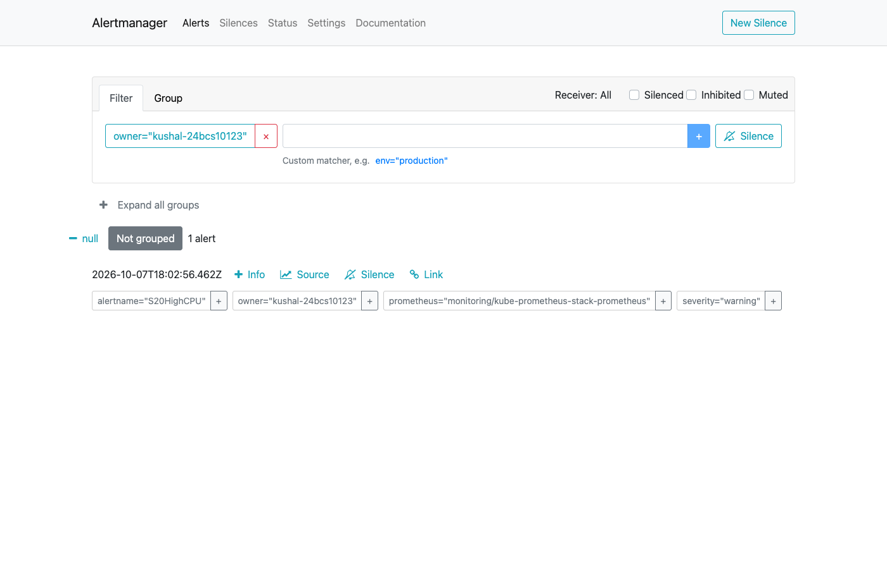

60 s after the load stopped the alert was *still* firing: `rate(...[1m])` looks back one minute and the scrape interval adds lag, so an alert resolves one window after the cause does. That is the trade-off of `for:` and range windows – fewer false alarms, slower resolution.

**Down alert.** Scaling to zero removes the pod from the Service, so the scrape target disappears entirely; `up == 0` would never match, which is why the rule uses `absent(up == 1)`:

```text
$ kubectl -n s20-monitoring scale deployment/s20-metrics-app --replicas=0
$ curl -s http://localhost:19090/api/v1/targets | ...
0 s20 targets left
  S20AppDown is FIRING
$ curl -s http://localhost:19093/api/v2/alerts | ...
S20AppDown active 2026-10-07T18:05:56 Prometheus has not been able to scrape a healthy s20-metrics-app pod for 1 minute.
```

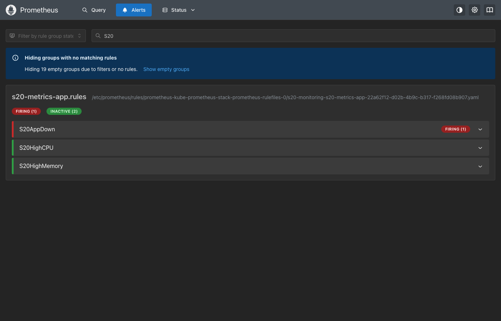


**Recovery.** `kubectl scale --replicas=1` → pod ready → next evaluation clears it, nothing to acknowledge by hand:

```text
$ promql 'ALERTS{owner="kushal-24bcs10123"}'
  (no series)
$ promql 'up{job="s20-metrics-app"}'
  {'instance': '10.244.1.64:8000', 'job': 's20-metrics-app', 'pod': 's20-metrics-app-7d8665dc97-rhtrn'} => 1
```

## 5. Grafana

Log: [logs/04-grafana.txt](logs/04-grafana.txt) · Dashboard: [01-monitoring/grafana-dashboard.json](01-monitoring/grafana-dashboard.json)

kube-prometheus-stack ships Grafana with Prometheus and Alertmanager already configured as data sources and 30 dashboards. I imported my own 5-panel dashboard through the API and ran the panel queries the way Grafana does:

```text
$ curl -s -u admin:*** http://localhost:19300/api/datasources | ...
alertmanager alertmanager http://kube-prometheus-stack-alertmanager.monitoring:9093/
prometheus   prometheus   http://kube-prometheus-stack-prometheus.monitoring:9090/ default

$ curl -s -u admin:*** -X POST http://localhost:19300/api/dashboards/db -d @01-monitoring/grafana-dashboard.json
{"status":"success","uid":"s20-kushal","url":"/d/s20-kushal/session-20-s20-metrics-app-kushal-24bcs10123","version":1}

$ /api/ds/query  sum by (pod)(container_memory_working_set_bytes{namespace="s20-monitoring",container="app"})
   {'pod': 's20-metrics-app-7d8665dc97-rhtrn'} => 5451776
$ /api/ds/query  sum by (path)(rate(http_requests_total{job="s20-metrics-app"}[5m]))
   {'path': '/health'} => 0.193   {'path': '/metrics'} => 0.043   {'path': '/burn'} => 0.150
```

The dashboard after the alert run – the two CPU spikes are the two `/burn` sessions, the flat orange line is the 0.2-core alert threshold, the memory panel shows each pod restart as a new series, and the alerts table is empty again because both alerts had resolved:

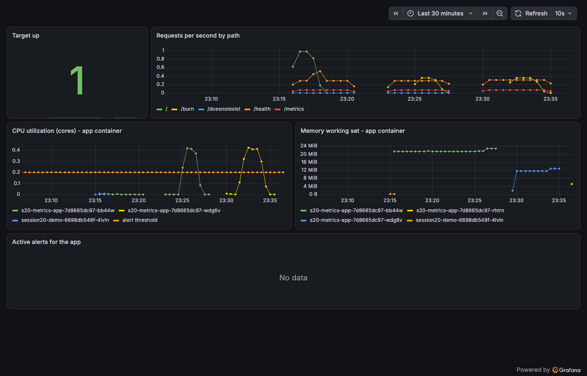

The built-in "Kubernetes / Compute Resources / Pod" dashboard for the same pod (requests vs limits vs usage):

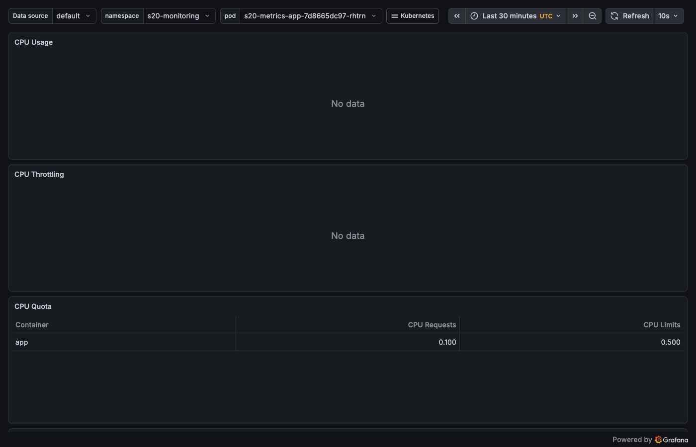

(Screenshots were taken with headless Chrome after logging in through the Grafana API and passing the session cookie – [scripts/shot.mjs](scripts/shot.mjs).)

## 6. GitOps with Argo CD

Log: [logs/05-gitops-argocd.txt](logs/05-gitops-argocd.txt) · Manifests: [gitops/](gitops) · Git source: fork `kushaltalati/devops-heros`, branch **`gitops-kushal-s20`**, path `session20-monitoring-observability-gitops/kushal-24bcs10123/gitops/app`

**What GitOps is, in one line each.** *Git as the source of truth*: the only place the desired state is written is a Git repository; the cluster is a copy of it. *Declarative configuration*: the repo holds "what" (Deployment with `replicas: 2`), never "how" (no `kubectl scale` scripts). *Continuous reconciliation*: a controller (Argo CD) keeps comparing desired (Git) with actual (cluster) and fixes the difference in both directions – new commit → apply; manual drift → revert. *Workflow*: change a YAML, open a PR, merge, done; nobody needs cluster credentials. *Kubernetes + GitOps*: Kubernetes is itself a reconciliation engine (Deployment → ReplicaSet → Pods), GitOps just adds one more loop above it with Git as input.

```text
   developer ── git push ──► GitHub: branch gitops-kushal-s20 / gitops/app/*.yaml   (desired state)
                                               │  polls every 3 min
                                               ▼
                               Argo CD (namespace argocd) ── compares ──► kube-apiserver   (actual state)
                                               │  applies / prunes / self-heals
                                               ▼
                               namespace s20-gitops: Deployment session20-mini, Service session20-mini
```

**Step 5 – register the Application** (the only `kubectl apply` in the whole demo; the file is kept outside `gitops/app/` so Argo CD does not try to deploy itself):

```text
$ kubectl apply -f gitops/argocd-application.yaml
application.argoproj.io/session20-mini created
$ kubectl -n argocd get applications
NAME             SYNC STATUS   HEALTH STATUS
session20-mini   Synced        Healthy

$ argocd app get session20-mini
Sync Policy:        Automated (Prune)
Sync Status:        Synced to gitops-kushal-s20 (75382d1)
Health Status:      Healthy
GROUP  KIND        NAMESPACE   NAME            STATUS  HEALTH
apps   Deployment  s20-gitops  session20-mini  Synced  Healthy
       Namespace               s20-gitops      Synced
       Service     s20-gitops  session20-mini  Synced  Healthy

$ kubectl -n s20-gitops get all
pod/session20-mini-68946db7dd-55zzg   1/1     Running
pod/session20-mini-68946db7dd-6tp6w   1/1     Running
deployment.apps/session20-mini   2/2     2            2
$ kubectl -n s20-gitops get deploy session20-mini -o jsonpath='{.metadata.annotations}'
argocd.argoproj.io/tracking-id: session20-mini:apps/Deployment:s20-gitops/session20-mini      <- Argo CD's ownership mark
```

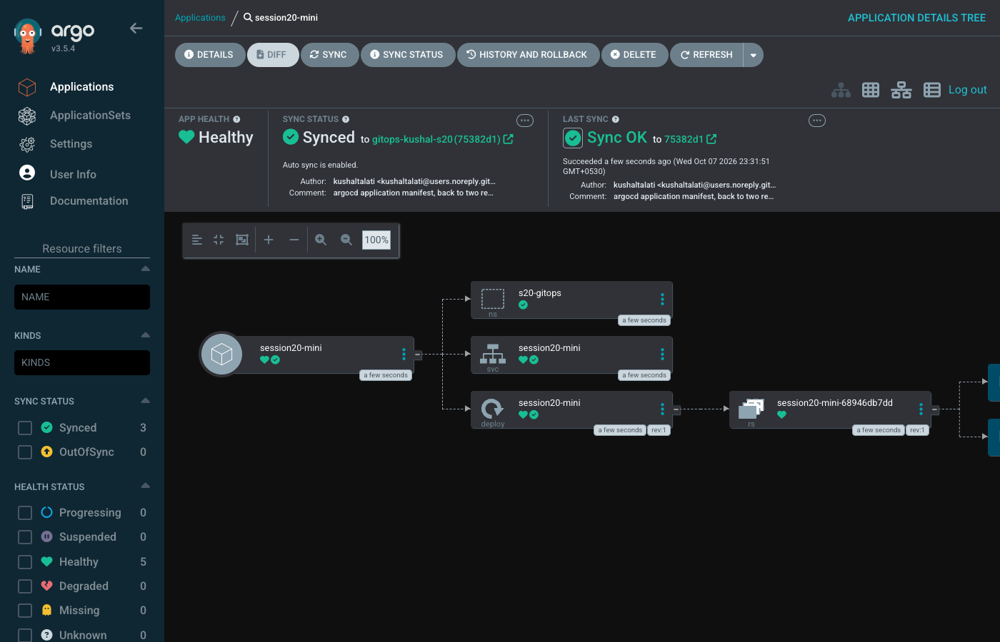

**Step 7 – change Git, not the cluster.** `replicas: 2 → 3`, commit, push, then only watch:

```text
$ sed -i '' 's/replicas: 2/replicas: 3/' gitops/app/deployment.yaml
$ git commit -m 'scale session20-mini to three replicas' && git push origin gitops-kushal-s20
688ebc1 scale session20-mini to three replicas
  waiting for Argo CD to notice the new commit (it polls the repo every 3 minutes by default; no manual sync) ...
  cluster reached 3/3 after 208s

$ cat logs/05-deploy-watch-git-change.txt          # kubectl get deploy -w, running the whole time
NAME             READY   UP-TO-DATE   AVAILABLE   AGE
session20-mini   2/2     2            2           17s
session20-mini   2/3     2            2           3m44s
session20-mini   3/3     3            3           3m44s

$ argocd app history session20-mini
ID      DATE                           REVISION
0       2026-10-07 23:31:50 +0530 IST  gitops-kushal-s20 (75382d1)
1       2026-10-07 23:35:34 +0530 IST  gitops-kushal-s20 (688ebc1)
```

**Step 8 – self-healing.** I broke the cluster on purpose with `kubectl scale --replicas=1`; `selfHeal: true` put it back in 3 seconds, because Git still said 3:

```text
$ kubectl -n s20-gitops scale deployment session20-mini --replicas=1
  spec.replicas is back to 3 after 3s
$ cat logs/05-deploy-watch-selfheal.txt
session20-mini   3/1     3            3            <- my manual change
session20-mini   1/1     1            1
session20-mini   1/3     1            1            <- Argo CD rewrote spec.replicas to 3
session20-mini   3/3     3            3

$ kubectl -n argocd get events --field-selector involvedObject.name=session20-mini ...
OperationStarted     Initiated automated sync to '688ebc1...'
ResourceUpdated      Updated sync status: Synced -> OutOfSync
OperationCompleted   Partial sync operation to 688ebc1... succeeded
ResourceUpdated      Updated sync status: OutOfSync -> Synced
ResourceUpdated      Updated health status: Progressing -> Healthy

$ argocd app diff session20-mini && echo 'no diff: Git == cluster'
no diff: Git == cluster
```

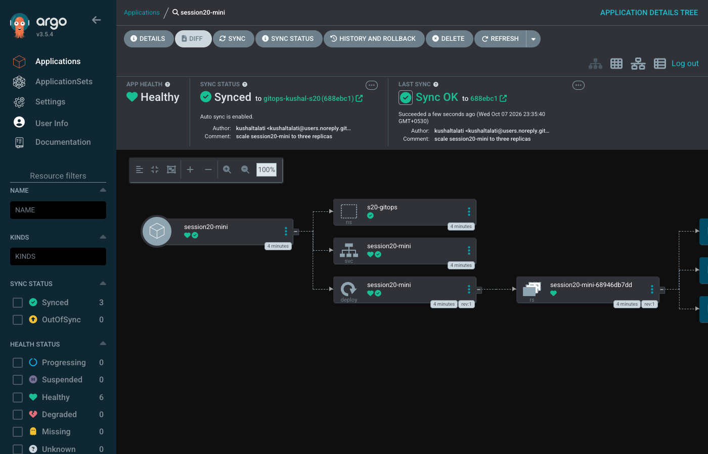

**Cleanup.** My first `kubectl delete application` removed only the Application object and left the Deployment running – without the `resources-finalizer` Argo CD does not cascade. `argocd app delete --cascade` deletes the Application *and* everything it manages, including the namespace (both attempts are in the log). The Git branch `gitops-kushal-s20` stays on my fork with the three commits, which is the point: the desired state outlives the cluster.

## What I understood

* **Monitoring is a subset of observability.** The alerts I wrote are monitoring (questions I knew in advance); the raw metrics, labels and logs are what let me answer the question I did not plan for (why did `S20HighCPU` stay firing after the load stopped? – the `[1m]` window).
* **Prometheus pulls, apps only expose.** My app never knows Prometheus exists; it prints text on `/metrics`. Discovery is Kubernetes' job (Service → Endpoints → ServiceMonitor), configuration is the operator's job.
* **Three sources of Kubernetes metrics, zero app code:** cAdvisor/kubelet for CPU and memory, kube-state-metrics for object state (ready, limits, replicas), node-exporter for the node. My app only adds business metrics (`http_requests_total`).
* **An alert is a PromQL expression that is true for `for:` long.** `absent()` is needed for "the thing is gone", because a missing target produces no `up == 0` sample at all. Prometheus evaluates, Alertmanager routes (dedup, group, silence, notify) – two different jobs.
* **GitOps inverts the direction of deployment.** CI never has cluster credentials; it writes to Git and the cluster pulls. The three properties I saw: desired state in Git (branch `gitops-kushal-s20`), reconciliation on a timer (208 s for the commit to land, 3 s for the drift to be reverted – the second is fast because Argo CD watches the cluster, the first waits for the repo poll), and append-only history (`argocd app history` maps revisions to commits).
* **Pruning and self-heal are opt-in and have teeth.** With `prune: true` deleting a YAML deletes the object; with `selfHeal: true` every manual `kubectl edit` is undone within seconds. Hot-fixing a cluster by hand stops being possible, which is exactly what you want in production.

## Checklist

- [x] Task 1 Monitoring: metrics (`/metrics`, PromQL), logs (`kubectl logs`, JSON access logs, `/var/log/pods`), alerts (S20HighCPU and S20AppDown fired in Prometheus and Alertmanager, then resolved), CPU utilization (`rate(container_cpu_usage_seconds_total)`, `kubectl top`, Grafana panel), memory utilization (`container_memory_working_set_bytes`), application health (readiness/liveness probes, `up`, `kube_pod_container_status_ready`)
- [x] Task 2 Observability documentation: [02-observability/README.md](02-observability/README.md)
- [x] Task 3 GitOps: what GitOps is, Git as source of truth, declarative config, continuous reconciliation (git push → 3 replicas), workflow, Kubernetes + Argo CD; self-heal demonstrated; 08-mini-project requirements (namespace, deployment with 2 replicas, service, Argo CD Application)
- [x] Screenshots (13) and README files; course docker-compose demos run too
