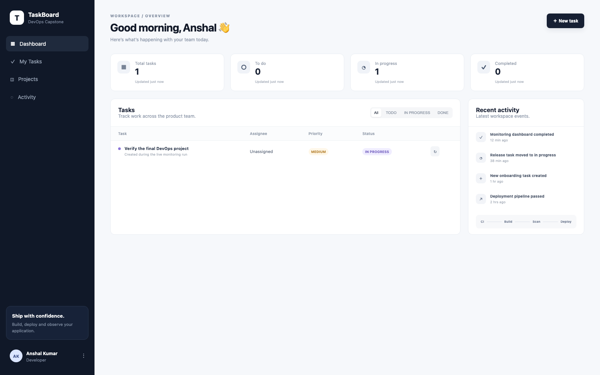
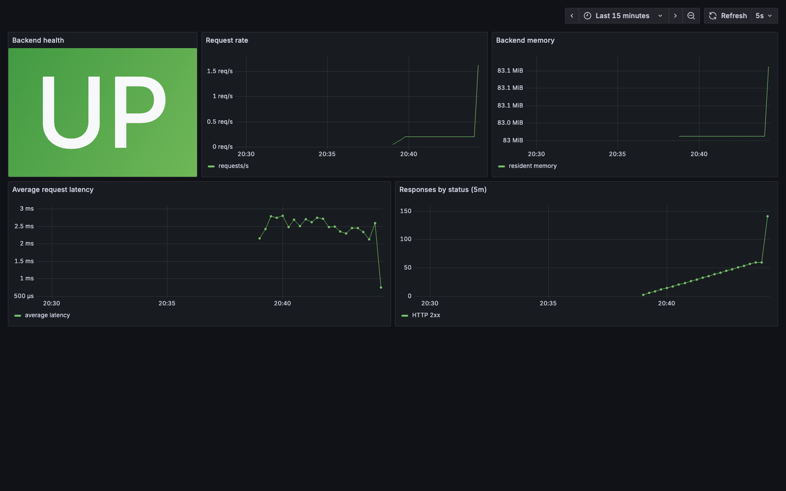
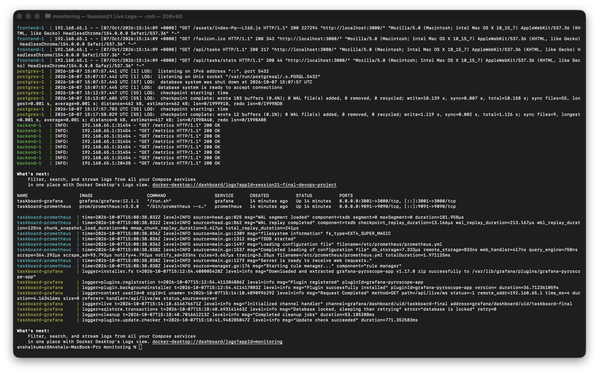
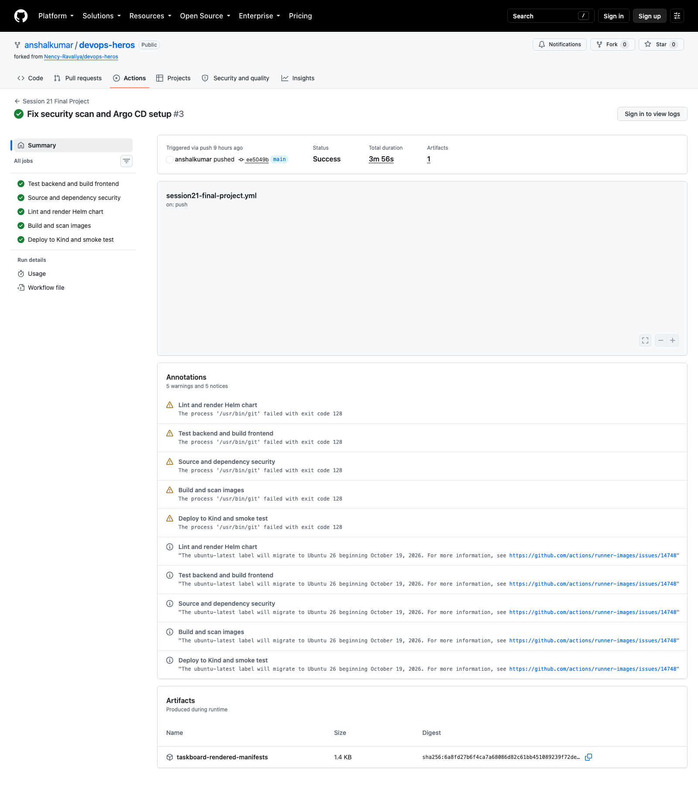

# Session 21 - Final DevOps Project

For my final project I used the instructor's TaskBoard application and connected the parts covered across the course. It has a React frontend, FastAPI backend, PostgreSQL database, automated tests, Docker, Kubernetes, Helm, Terraform, security checks, monitoring, GitOps, and deliberate troubleshooting exercises.

## Architecture

```text
Developer → GitHub → CI and security gates → GHCR images
                                                   |
                                                   v
Terraform → AWS VPC/EKS                         Kubernetes
                                                   |
                                  Ingress → frontend → backend → PostgreSQL PVC
                                                   |
                                      Prometheus metrics and Grafana
                                                   |
                                      Argo CD reconciliation from Git
```

## Repository layout

| Path | What I used it for |
|---|---|
| [`frontend/`](frontend/) | React/Vite interface served by Nginx |
| [`backend/`](backend/) | FastAPI API, SQLAlchemy models, Alembic, and pytest |
| [`docker-compose.yml`](docker-compose.yml) | Local three-container environment |
| [`helm/taskboard/`](helm/taskboard/) | Kubernetes package with ConfigMap, Secret, Ingress, HPA, probes, and PVC |
| [`terraform/`](terraform/) | VPC and EKS infrastructure definition |
| [`monitoring/`](monitoring/) | Prometheus/Grafana values and a runnable local dashboard |
| [`gitops/`](gitops/) | Argo CD Application watching the Helm chart |
| [`security/`](security/) | Security gates and decisions |
| [`troubleshooting/`](troubleshooting/) | Broken image and broken Service exercises |

## Application checks

The backend exposes `/health`, `/ready`, `/metrics`, and CRUD endpoints under `/api/tasks`. I run the automated checks with:

```bash
cd backend
python3 -m venv .venv
source .venv/bin/activate
pip install -r requirements.txt
pytest -q

cd ../frontend
npm install
npm run build
```

The tests use SQLite, so they do not need a shared PostgreSQL server. The deployed `/ready` endpoint checks database access before Kubernetes sends traffic to the Pod.

## Local Docker run

```bash
docker compose up --build -d
docker compose ps
curl -fsS http://localhost:8000/health
curl -fsS http://localhost:3000/health
docker compose down
```

I added a PostgreSQL health check so the backend waits for the database instead of racing it during startup.

This is the application from the live Docker Compose run. I created a task through the API before taking the screenshot, so the dashboard is showing data from the running backend and PostgreSQL database.



## Kubernetes and Helm

```bash
helm lint helm/taskboard
helm template taskboard helm/taskboard -f helm/taskboard/values-dev.yaml

helm upgrade --install taskboard helm/taskboard \
  --namespace taskboard --create-namespace \
  -f helm/taskboard/values-dev.yaml

kubectl rollout status deployment/taskboard-taskboard-backend -n taskboard
kubectl get deploy,svc,ingress,pvc,hpa -n taskboard
```

The chart includes:

- frontend and backend Deployments and Services
- ConfigMap for environment settings
- Secret for demonstration database credentials
- PostgreSQL with persistent storage
- readiness and liveness probes
- Ingress routing for `/` and `/api`
- backend HPA
- resource requests and limits
- optional Prometheus ServiceMonitor

The password in the default values is only for local learning. A real environment should inject it through an external secret manager or a protected values file.

## CI/CD and DevSecOps

The repository workflow runs backend tests, builds the frontend, scans Python with Bandit and pip-audit, checks the assignment files with Gitleaks, lints the Helm chart, builds both images, scans them with Trivy, pushes the tested images to GHCR, and deploys the chart to a temporary Kind cluster for an HTTP smoke test.

The pipeline stops before delivery when a quality or security gate fails. The details are in [`security/README.md`](security/README.md).

## Terraform

The Terraform project defines an AWS VPC across two Availability Zones and an EKS cluster with a managed node group.

```bash
cd terraform
terraform init
terraform fmt -check
terraform validate
terraform plan
```

VPC, NAT Gateway, EKS, and worker nodes can generate charges, so I review the plan before applying and destroy a learning environment when it is no longer required.

## Monitoring and GitOps

FastAPI exposes Prometheus metrics at `/metrics`. The Helm chart can create a ServiceMonitor for kube-prometheus-stack, and [`monitoring/prometheus-values.yaml`](monitoring/prometheus-values.yaml) contains the Kubernetes monitoring values.

I also added a small Docker Compose monitoring stack under [`monitoring/`](monitoring/) so I could test the dashboard locally without a paid cloud account:

```bash
cd monitoring
docker compose up -d
curl -fsS http://localhost:9091/-/ready
curl -fsS http://localhost:3001/api/health
```

Prometheus scraped the live TaskBoard backend on `/metrics`. Grafana loaded the data source and dashboard from the provisioning files in this repository. I generated test requests and confirmed health, request rate, memory, latency, and response status data on the dashboard.



I checked the container state and tailed the application, database, Prometheus, and Grafana logs from the same run.



[`gitops/application.yaml`](gitops/application.yaml) tells Argo CD to reconcile the production Helm values from this repository. Automated pruning and self-healing keep the cluster close to the Git declaration.

For the local Minikube proof, the Application disables the Ingress, ServiceMonitor, and PostgreSQL PVC. Those resources need add-ons that are outside the GitOps exercise. Argo CD still renders the chart from this Git repository and reconciles the application Deployments and Services.

## Troubleshooting

I included one invalid image and one Service with a broken selector. My investigation uses Pod status, `describe`, logs, events, labels, and EndpointSlices before changing the manifest. The diagnosis and fixes are documented in [`troubleshooting/README.md`](troubleshooting/README.md).

## Result

I ran the final project workflow on GitHub Actions. Backend and frontend checks, security scans, image scans, Helm validation, deployment to Kind, and the HTTP smoke test all passed.


