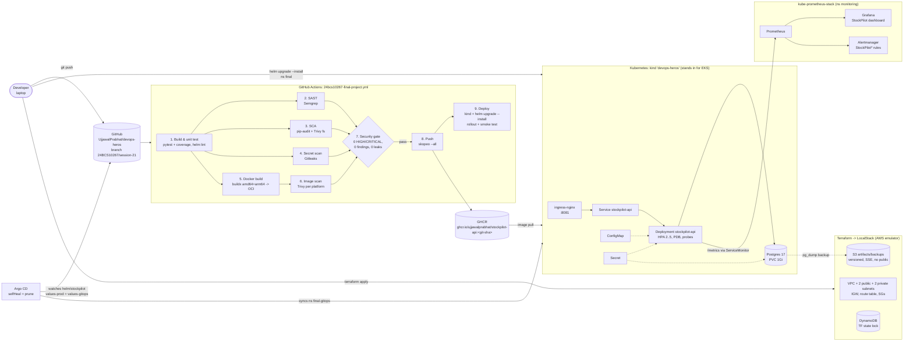

# StockPilot: Final DevOps Project

| | |
|---|---|
| **Student** | Ujjawal Prabhat |
| **Enrollment** | 24BCS10267 |
| **Course** | DevOps Heroes, Session 21 final project |
| **Branch** | [`24BCS10267/session-21`](https://github.com/UjjawalPrabhat/devops-heros/tree/24BCS10267/session-21/session21-python/24BCS10267-ujjawal-prabhat/final-devops-project) |
| **Pipeline** | [`.github/workflows/24bcs10267-final-project.yml`](https://github.com/UjjawalPrabhat/devops-heros/blob/24BCS10267/session-21/.github/workflows/24bcs10267-final-project.yml) |
| **Image** | `ghcr.io/ujjawalprabhat/stockpilot-api` (multi-arch: amd64 + arm64) |

> **Everything in this README is real.** Each command output below was
> captured from an actual run on 2026-10-06. The full, unedited files are in
> [`docs/outputs/`](docs/outputs/), and every pipeline claim links to a real
> GitHub Actions run. Where something was *not* done for real (EKS, ECR),
> the README says so explicitly.

---

## Table of contents
1. [Project overview](#1-project-overview)
2. [Architecture](#2-architecture)
3. [Technologies used](#3-technologies-used)
4. [Application setup](#4-application-setup)
5. [Docker setup](#5-docker-setup)
6. [Kubernetes deployment](#6-kubernetes-deployment)
7. [Helm deployment](#7-helm-deployment)
8. [Terraform infrastructure (LocalStack)](#8-terraform-infrastructure-localstack)
9. [CI/CD pipeline](#9-cicd-pipeline)
10. [DevSecOps implementation](#10-devsecops-implementation)
11. [Monitoring](#11-monitoring)
12. [GitOps (Argo CD)](#12-gitops-argo-cd)
13. [Troubleshooting challenge](#13-troubleshooting-challenge)
14. [Screenshots / captured evidence](#14-screenshots--captured-evidence)
15. [Lessons learned](#15-lessons-learned)

---

## 1. Project overview

**StockPilot** is a small inventory-management service for a workshop or warehouse.
It tracks SKUs, stock levels per location, stock movements in and out, and
reorder levels. A built-in page shows KPIs (SKUs, units on hand, low-stock
count, inventory value) and lets you add items.

The point of the project is the **delivery platform around the app**:

`code → tests → SAST/SCA/secret scan → multi-arch image → image scan → security gate → GHCR → Kubernetes (Helm) → GitOps (Argo CD) → Prometheus/Grafana alerts`,

plus Terraform-provisioned cloud infrastructure (on LocalStack) and a
troubleshooting lab.

### API

| Method | Path | Purpose |
|---|---|---|
| GET | `/` | Responsive HTML dashboard (static page that calls the API) |
| GET | `/health` | **Liveness**: process is up |
| GET | `/ready` | **Readiness**: DB reachable (and schema ensured) |
| GET | `/metrics` | Prometheus metrics (`prometheus_client`) |
| GET | `/api/info` | service, version (= git SHA in CI builds), env |
| GET | `/api/items[?location=]` | list items |
| POST | `/api/items` | create (409 on duplicate SKU, 422 on invalid) |
| GET/PUT/DELETE | `/api/items/{id}` | read / update / delete |
| POST | `/api/items/{id}/adjust` | stock movement (`delta` ±, can't go negative) |
| GET | `/api/items/low-stock` | items at or below reorder level |
| GET | `/api/summary` | KPIs (units, low-stock count, value) |

Custom metrics: `stockpilot_http_requests_total{method,route,status}`,
`stockpilot_http_request_duration_seconds` (histogram),
`stockpilot_http_requests_in_progress`, `stockpilot_stock_adjustments_total{direction}`,
`stockpilot_low_stock_items` (refreshed on every scrape) and `stockpilot_build_info`.

### Folder layout

```text
final-devops-project/
├── application/          FastAPI app (app/), pytest suite (tests/), requirements*.txt, pytest.ini
├── docker/               Dockerfile (multi-stage, non-root), .dockerignore (+ Dockerfile.dockerignore symlink)
├── kubernetes/           plain manifests: Namespace, ConfigMap, Secret (example), Postgres+PVC, Deployment, Service, Ingress, HPA
├── helm/stockpilot/      Helm chart: all of the above + PDB, ServiceMonitor, PrometheusRule, Grafana dashboard; values{,-dev,-prod,-gitops}.yaml
├── terraform/            AWS provider -> LocalStack: VPC, subnets, IGW, routes, SGs, S3, DynamoDB lock table, (ECR optional)
│   └── backend-demo/     S3 remote state + DynamoDB locking demo
├── .github/workflows/    reference copy of the pipeline (live copy is at repo root)
├── security/             semgrep.yml, gitleaks.toml, trivy.yaml, .trivyignore, SECURITY-GATE.md
├── monitoring/           ServiceMonitor, PrometheusRule, Grafana dashboard ConfigMap (rendered from the chart)
├── gitops/               Argo CD Application
├── troubleshooting/      6 scripted break/diagnose/fix scenarios + patches
├── scripts/              smoke test, HPA load, Prometheus/Grafana checks, LocalStack verify, TF lock demo, capture helpers
└── docs/outputs/         raw captured outputs referenced by this README
```

---

## 2. Architecture



---

## 3. Technologies used

| Area | Tooling (versions used) |
|---|---|
| App | Python 3.12, FastAPI 0.142.2, Uvicorn 0.54.0, SQLAlchemy 2.1.3, psycopg 3.3.6, Pydantic 2.13.5, prometheus-client 0.26.0 |
| Tests | pytest 9.1.1, pytest-cov 7.1.0, FastAPI TestClient (isolated SQLite) |
| Database | PostgreSQL 17 (alpine) on a PVC; SQLite for tests / plain `docker run` |
| Containers | Docker (BuildKit/buildx), multi-stage, `python:3.12-slim` (Debian 13), QEMU for arm64 |
| Registry | GitHub Container Registry (GHCR), pushed with `skopeo` |
| Orchestration | kind v0.33 (K8s v1.37, 3 nodes, arm64), ingress-nginx, metrics-server |
| Packaging | Helm 4.3 |
| IaC | Terraform 1.16.4, AWS provider 5.100.0, LocalStack Community 3.8.1 |
| CI/CD | GitHub Actions |
| Security | Semgrep 1.179, pip-audit, Trivy 0.75.0, Gitleaks 8.30.1 |
| Observability | kube-prometheus-stack (Prometheus Operator, Prometheus, Grafana, Alertmanager) |
| GitOps | Argo CD |

---

## 4. Application setup

```bash
cd application
python3.12 -m venv .venv && source .venv/bin/activate
pip install -r requirements-dev.txt
pytest -v --cov=app                     # 15 tests, isolated SQLite in a temp dir
uvicorn app.main:app --reload --port 8000   # SQLite ./stockpilot.db by default
# or against Postgres:
DB_HOST=localhost DB_USER=stockpilot DB_PASSWORD=... uvicorn app.main:app
```

Configuration comes only from environment variables (`app/config.py`):
`APP_ENV`, `APP_VERSION`, `LOG_LEVEL`, `DEFAULT_REORDER_LEVEL`, `DB_HOST/DB_PORT/DB_NAME`
(ConfigMap), `DB_USER/DB_PASSWORD` (Secret), or a full `DATABASE_URL`.

**Real output.** Local test run ([full](docs/outputs/pytest-local.txt)):

```text
tests/test_api.py::test_health PASSED                                    [  6%]
tests/test_api.py::test_ready_checks_database PASSED                     [ 13%]
tests/test_api.py::test_index_page_served PASSED                         [ 20%]
tests/test_api.py::test_info_reports_env PASSED                          [ 26%]
tests/test_api.py::test_create_and_get_item PASSED                       [ 33%]
tests/test_api.py::test_duplicate_sku_conflict PASSED                    [ 40%]
tests/test_api.py::test_invalid_sku_rejected PASSED                      [ 46%]
tests/test_api.py::test_default_reorder_level_from_config PASSED         [ 53%]
tests/test_api.py::test_list_and_filter_by_location PASSED               [ 60%]
tests/test_api.py::test_update_item PASSED                               [ 66%]
tests/test_api.py::test_adjust_stock_in_and_out PASSED                   [ 73%]
tests/test_api.py::test_adjust_stock_cannot_go_negative PASSED           [ 80%]
tests/test_api.py::test_low_stock_and_summary PASSED                     [ 86%]
tests/test_api.py::test_delete_item_and_404 PASSED                       [ 93%]
tests/test_api.py::test_metrics_exposed PASSED                           [100%]
...
Name              Stmts   Miss  Cover   Missing
-----------------------------------------------
app/__init__.py       0      0   100%
app/config.py        23      8    65%   15-23
app/db.py            17      0   100%
app/main.py         135      0   100%
app/metrics.py        7      0   100%
app/models.py        16      0   100%
app/schemas.py       35      0   100%
-----------------------------------------------
TOTAL               233      8    97%
============================== 15 passed in 0.17s ==============================
```

(The 8 missed lines in `config.py` are the Postgres URL builder. It's exercised
in Kubernetes, not in unit tests.)

---

## 5. Docker setup

[`docker/Dockerfile`](docker/Dockerfile). The build context is `application/`:

```bash
docker build -f docker/Dockerfile --build-arg APP_VERSION=1.0.1 -t stockpilot-api:1.0.1 application
docker run --rm -p 8000:8000 stockpilot-api:1.0.1      # SQLite in /data (owned by uid 10001)
```

* **Multi-stage.** The `builder` stage creates `/opt/venv`, and the runtime stage copies only the venv and `app/`.
* **Non-root.** Fixed `USER 10001:10001`, so Kubernetes `runAsNonRoot` can verify it.
* **Hardened.** `apt-get upgrade`. `pip` and `setuptools` are removed from both the venv and the system
  interpreter, because the system pip vendors `urllib3`/`msgpack`, which Trivy flagged HIGH (found and fixed locally).
  There's also a `HEALTHCHECK`, and uvicorn access logs are off (metrics replace them).
* **`.dockerignore`.** It lives in `docker/` next to the Dockerfile. `docker/Dockerfile.dockerignore` is a
  symlink to it, so BuildKit applies it even though the context is `application/`. It excludes tests, caches,
  `.env`, `*.db` and the venvs.

**Real output.** Container check: `docker run -d --name sp-test -p 18000:8000 stockpilot-api:1.0.0 && sleep 4 && curl -s localhost:18000/health; echo; docker exec sp-test id; curl -s localhost:18000/ready`
([trivy local](docs/outputs/trivy-image-local.txt), [build](docs/outputs/docker-build-local.txt)):

```text
1262f5e8b43ab5553e9e6e662256bab32474b5a1dc325319197a2b5aae6d6e55
{"status":"UP"}
uid=10001(app) gid=10001(app) groups=10001(app)
{"status":"READY"}
```

The first local Trivy scan flagged 4 HIGH findings, all in the *system pip*
(`msgpack` GHSA-6v7p-g79w-8964, `setuptools` CVE-2025-47273, `urllib3` CVE-2026-97687/97689).
After the pip/setuptools removal the scan had **0 fixable HIGH/CRITICAL**.
`python:3.12-slim` still carries 44 *unfixed* Debian HIGHs, which are reported but don't block (see the policy).

---

## 6. Kubernetes deployment

Plain manifests are in [`kubernetes/`](kubernetes/) (namespace `final-k8s`). The Helm chart is the primary
path; these show the raw objects:

| File | Object | Notes |
|---|---|---|
| `00-namespace.yaml` | Namespace `final-k8s` | |
| `01-configmap.yaml` | ConfigMap | non-secret config via `envFrom` |
| `02-secret.example.yaml` | Secret | **placeholder only** (`change-me-placeholder`) |
| `03-postgres.yaml` | PVC (1Gi, RWO, `standard`) + Deployment (Recreate) + Service | DB data survives pod restarts |
| `04-deployment.yaml` | Deployment (2 replicas) | liveness `/health`, readiness `/ready`, requests/limits, seccomp, read-only rootfs, drop ALL caps |
| `05-service.yaml` | ClusterIP :80 → `http` (8000) | named targetPort |
| `06-ingress.yaml` | Ingress, class `nginx`, host `stockpilot-k8s.local` | |
| `07-hpa.yaml` | HPA autoscaling/v2, CPU 60 %, 2..5 | |

**Real output** ([full](docs/outputs/kubernetes-plain-manifests.txt)):

```text
$ kubectl get deploy,po,svc,ing,hpa,pvc -n final-k8s
NAME                                  READY   UP-TO-DATE   AVAILABLE   AGE
deployment.apps/stockpilot-api        2/2     2            2           2m50s
deployment.apps/stockpilot-postgres   1/1     1            1           2m50s

NAME                                       READY   STATUS    RESTARTS   AGE
pod/stockpilot-api-9c7498988-2wtqd         1/1     Running   0          56s
pod/stockpilot-api-9c7498988-x2dfz         1/1     Running   0          51s
pod/stockpilot-postgres-58875cf57c-v62zt   1/1     Running   0          2m50s
...
NAME                                                 REFERENCE                   TARGETS       MINPODS   MAXPODS   REPLICAS   AGE
horizontalpodautoscaler.autoscaling/stockpilot-api   Deployment/stockpilot-api   cpu: 7%/60%   2         5         2          2m50s

NAME                                             STATUS   VOLUME                                     CAPACITY   ACCESS MODES   STORAGECLASS   ...
persistentvolumeclaim/stockpilot-postgres-data   Bound    pvc-40b4d0c4-b0f7-4c03-9233-8326eba1b1c1   1Gi        RWO            standard       ...

$ curl -s -H 'Host: stockpilot-k8s.local' localhost:8081/api/info
{"service":"StockPilot","version":"1.0.1","env":"k8s-plain"}
```

---

## 7. Helm deployment

Chart: [`helm/stockpilot`](helm/stockpilot). It templates the ConfigMap, Secret (unless
`database.existingSecret`), API Deployment (config/secret checksum annotations →
automatic rollout on change), Service, Ingress, HPA, PDB, Postgres PVC/Deployment/Service,
ServiceMonitor, PrometheusRule and the Grafana dashboard ConfigMap.

| Values file | Use |
|---|---|
| `values.yaml` | safe defaults (monitoring off, GHCR image, placeholder secret) |
| `values-dev.yaml` | local kind: `stockpilot-api:1.0.1` loaded with `kind load`, debug logs, monitoring on |
| `values-prod.yaml` | GHCR image by SHA, `existingSecret`, 3+ replicas, bigger limits, rate-limit annotation |
| `values-gitops.yaml` | Argo CD environment: image tag promoted by commit |

`helm lint` passes for all value files, and CI runs it on every push. Install:

```bash
kind load docker-image stockpilot-api:1.0.1 --name devops-heros
helm upgrade --install stockpilot helm/stockpilot -n final --create-namespace \
  -f helm/stockpilot/values-dev.yaml --wait --timeout 5m
```

**Real output** ([install](docs/outputs/helm-install-final.txt), [resources](docs/outputs/k8s-verify-final.txt), [ingress](docs/outputs/ingress-curl-final.txt)):

```text
$ helm list -n final
NAME      	NAMESPACE	REVISION	UPDATED                              	STATUS  	CHART           	APP VERSION
stockpilot	final    	3       	2026-10-06 19:36:57.344539 +0800 WITA	deployed	stockpilot-0.1.0	1.0.1

$ kubectl get all,cm,secret,ing,hpa,pvc,pdb -n final
NAME                                      READY   STATUS    RESTARTS   AGE
pod/stockpilot-api-8694764fbc-vd4mf       1/1     Running   0          45m
pod/stockpilot-api-8694764fbc-w4lzc       1/1     Running   0          65m
pod/stockpilot-postgres-8874969c8-94584   1/1     Running   0          65m

NAME                          TYPE        CLUSTER-IP      EXTERNAL-IP   PORT(S)    AGE
service/stockpilot-api        ClusterIP   10.96.194.226   <none>        80/TCP     68m
service/stockpilot-postgres   ClusterIP   10.96.1.113     <none>        5432/TCP   68m

NAME                                  READY   UP-TO-DATE   AVAILABLE   AGE
deployment.apps/stockpilot-api        2/2     2            2           68m
deployment.apps/stockpilot-postgres   1/1     1            1           68m
...
NAME                                                 REFERENCE                   TARGETS       MINPODS   MAXPODS   REPLICAS   AGE
horizontalpodautoscaler.autoscaling/stockpilot-api   Deployment/stockpilot-api   cpu: 8%/50%   2         5         2          68m

NAME                             DATA   AGE
configmap/kube-root-ca.crt       1      68m
configmap/stockpilot-config      7      68m
configmap/stockpilot-dashboard   1      68m

NAME                                      TYPE                 DATA   AGE
...
secret/stockpilot-db                      Opaque               2      68m

NAME                                   CLASS   HOSTS              ADDRESS     PORTS   AGE
ingress.networking.k8s.io/stockpilot   nginx   stockpilot.local   localhost   80      68m

NAME                                             STATUS   VOLUME                                     CAPACITY   ACCESS MODES   STORAGECLASS   ...
persistentvolumeclaim/stockpilot-postgres-data   Bound    pvc-ea345ebb-e675-4c2e-be51-a1650511282d   1Gi        RWO            standard       ...

NAME                                        MIN AVAILABLE   MAX UNAVAILABLE   ALLOWED DISRUPTIONS   AGE
poddisruptionbudget.policy/stockpilot-api   1               N/A               1                     68m
```

Through the ingress (ingress-nginx on host port 8081):

```text
$ curl -s -H 'Host: stockpilot.local' http://localhost:8081/ready
{"status":"READY"}

$ curl -s -H 'Host: stockpilot.local' -X POST -H Content-Type: application/json http://localhost:8081/api/items -d {"sku":"BRG-6204","name":"6204 ball bearing","quantity":4,"reorder_level":10,"unit_price_paise":18000,"location":"WH2"}
{"id":2,"sku":"BRG-6204","name":"6204 ball bearing","location":"WH2","quantity":4,"reorder_level":10,"unit_price_paise":18000,"low_stock":true,"updated_at":"2026-10-06T11:11:53.281763Z"}

$ curl -s -H 'Host: stockpilot.local' -X POST -H Content-Type: application/json http://localhost:8081/api/items/1/adjust -d {"delta":-80,"reason":"order-1001"}
{"id":1,"sku":"BOLT-M8","name":"M8 hex bolt","location":"MAIN","quantity":40,"reorder_level":50,"unit_price_paise":250,"low_stock":true,"updated_at":"2026-10-06T11:11:53.312715Z"}

$ curl -s -H 'Host: stockpilot.local' http://localhost:8081/api/summary
{"total_items":2,"total_units":44,"low_stock_items":2,"inventory_value_paise":82000}

$ curl -s -H 'Host: stockpilot.local' http://localhost:8081/metrics | grep -E '^stockpilot_' | head -15
stockpilot_http_requests_total{method="GET",route="/ready",status="200"} 13.0
stockpilot_http_requests_total{method="GET",route="/health",status="200"} 7.0
stockpilot_http_requests_total{method="POST",route="/api/items",status="201"} 1.0
stockpilot_http_requests_total{method="POST",route="/api/items/{item_id}/adjust",status="200"} 1.0
...
```

### HPA under load

`scripts/hpa-load.sh` starts a busybox pod with 8 parallel `wget` loops against the
Service for 150 s ([full output](docs/outputs/hpa-load-test.txt)):

```text
--- 19:30:21
stockpilot-api   Deployment/stockpilot-api   cpu: 8%/50%   2     5     2     22m
--- 19:30:36
stockpilot-api   Deployment/stockpilot-api   cpu: 664%/50%   2     5     2     23m
stockpilot-api-8694764fbc-99pfk   399m   74Mi
stockpilot-api-8694764fbc-w4lzc   265m   77Mi
--- 19:30:52
stockpilot-api   Deployment/stockpilot-api   cpu: 848%/50%   2     5     5     23m
stockpilot-api-8694764fbc-99pfk   439m   66Mi
stockpilot-api-8694764fbc-ghm9k   300m   76Mi
stockpilot-api-8694764fbc-mcvfj   271m   63Mi
stockpilot-api-8694764fbc-vd4mf   257m   62Mi
stockpilot-api-8694764fbc-w4lzc   409m   77Mi
...
$ kubectl -n final describe hpa stockpilot-api | grep SuccessfulRescale
  Normal   SuccessfulRescale             50m                horizontal-pod-autoscaler  New size: 2; reason: Current number of replicas below Spec.MinReplicas
  Normal   SuccessfulRescale             27m                horizontal-pod-autoscaler  New size: 5; reason: cpu resource utilization (percentage of request) above target
  Normal   SuccessfulRescale             23m                horizontal-pod-autoscaler  New size: 2; reason: All metrics below target
```

It scaled **2 → 5** (maxReplicas) within about 30 s of load, then **5 → 2** after load stopped
(the scale-down stabilization window is 60 s).

---

## 8. Terraform infrastructure (LocalStack)

[`terraform/`](terraform/) targets **LocalStack** (an AWS emulator at `http://localhost:4566`)
when `use_localstack = true`, which is the default. The provider then uses test credentials,
`skip_credentials_validation`, `skip_metadata_api_check`, `skip_requesting_account_id` and
`s3_use_path_style`, and a `dynamic "endpoints"` block that is emitted only for LocalStack.
Set `use_localstack = false` and the same code targets real AWS through the normal
credential chain.

| Resource | What / why |
|---|---|
| `aws_vpc` + IGW + public route table | `10.40.0.0/16` |
| 2 × public subnets, 2 × private subnets | `ap-south-1a/b`, tagged `kubernetes.io/role/elb` / `internal-elb` for EKS load balancers |
| `aws_security_group` app / db | app: 80/443 in; db: 5432 **only from the app SG** |
| `aws_s3_bucket` artifacts | versioning, SSE-AES256, full public-access block; DB backups land in `db-backups/` |
| `aws_dynamodb_table` tf-locks | `LockID` hash key, PAY_PER_REQUEST, PITR, for Terraform state locking |
| `aws_s3_bucket_lifecycle_configuration` | **real AWS only** (`count = use_localstack ? 0 : 1`), see below |
| `aws_ecr_repository` | **not created** (`create_ecr = false`): ECR is a LocalStack *Pro* feature; images live in GHCR |

**What would differ on real AWS:** an EKS cluster plus a managed node group would be created
in the private subnets (the `terraform-aws-modules/eks` block is in `main.tf` as a comment).
EKS isn't available in LocalStack Community, so **the local kind cluster stands in for EKS**.
You'd also add a NAT gateway for the private subnets, RDS instead of in-cluster Postgres,
ECR or GHCR, the S3 backend from `versions.tf`, and IAM/IRSA. None of that was applied to a
real AWS account.

**Real output** (files: [init](docs/outputs/terraform-init.txt), [validate](docs/outputs/terraform-validate.txt), [plan](docs/outputs/terraform-plan.txt), [apply](docs/outputs/terraform-apply.txt), [verify](docs/outputs/terraform-localstack-verify.txt), [lock demo](docs/outputs/terraform-state-lock-demo.txt), [destroy](docs/outputs/terraform-destroy.txt)):

```text
$ terraform init -no-color
Initializing the backend...
Initializing provider plugins...
- Finding hashicorp/aws versions matching "~> 5.0"...
- Installing hashicorp/aws v5.100.0...
- Installed hashicorp/aws v5.100.0 (signed by HashiCorp)
...
Terraform has been successfully initialized!

$ terraform fmt -check -recursive && terraform validate -no-color
Success! The configuration is valid.

$ terraform plan -no-color -out=tfplan
...
Plan: 16 to add, 0 to change, 0 to destroy.

$ terraform apply -no-color tfplan
...
Apply complete! Resources: 16 added, 0 changed, 0 destroyed.

Outputs:

app_security_group_id = "sg-d5b3e229bf02ecfbc"
artifacts_bucket = "stockpilot-dev-artifacts-24bcs10267"
db_security_group_id = "sg-6cb066e4ce7baf4eb"
ecr_repository_url = "not created (ECR needs LocalStack Pro) - images are in ghcr.io/ujjawalprabhat/stockpilot-api"
private_subnet_ids = [
  "subnet-72481b82",
  "subnet-88bc33ab",
]
public_subnet_ids = [
  "subnet-196116de",
  "subnet-e8581ded",
]
target = "LocalStack (http://localhost:4566)"
tf_lock_table = "stockpilot-dev-tf-locks"
vpc_id = "vpc-53157776"
```

Checked independently with the AWS CLI against LocalStack, plus a **real `pg_dump` of the
in-cluster database uploaded to the bucket**:

```text
|  ap-south-1a|  10.40.10.0/24 |  subnet-72481b82 |  stockpilot-dev-private-ap-south-1a   |
|  ap-south-1a|  10.40.0.0/24  |  subnet-196116de |  stockpilot-dev-public-ap-south-1a    |
|  ap-south-1b|  10.40.1.0/24  |  subnet-e8581ded |  stockpilot-dev-public-ap-south-1b    |
|  ap-south-1b|  10.40.11.0/24 |  subnet-88bc33ab |  stockpilot-dev-private-ap-south-1b   |
...
|  stockpilot-dev-app-sg |  80,443  |
|  stockpilot-dev-db-sg  |  5432    |
...
|  PAY_PER_REQUEST |  LockID |  stockpilot-dev-tf-locks  |  ACTIVE |
...
$ aws --endpoint-url http://localhost:4566 s3 ls s3://stockpilot-dev-artifacts-24bcs10267/db-backups/
2026-10-06 19:27:15       1029 stockpilot-20261006192715.sql.gz
```

**State-locking demo** ([`terraform/backend-demo`](terraform/backend-demo), S3 backend + the
DynamoDB table, two concurrent applies):

```text
$ aws dynamodb scan --table-name stockpilot-dev-tf-locks   # while (A) is running
[
    {
        "LockID": "stockpilot-dev-artifacts-24bcs10267/tfstate/backend-demo.tfstate",
        "Info": "{\"ID\":\"0bb14ccc-f0bb-d56d-53ad-6a3fa8eef474\",\"Operation\":\"OperationTypeApply\", ...
    }
]

$ terraform apply -auto-approve -no-color -lock-timeout=0s   # (B) concurrent apply
...
Error: Error acquiring the state lock

Error message: operation error DynamoDB: PutItem, https response error
StatusCode: 400, RequestID: d94171eb-78d3-459d-8f13-07e1e732a28c,
ConditionalCheckFailedException: The conditional request failed
Lock Info:
  ID:        0bb14ccc-f0bb-d56d-53ad-6a3fa8eef474
  Path:      stockpilot-dev-artifacts-24bcs10267/tfstate/backend-demo.tfstate
(B) exit code: 1
```

(Terraform 1.16 also warns that `dynamodb_table` is deprecated in favour of
`use_lockfile`, which is S3-native locking. DynamoDB is kept here because the course asked for it.)

**Destroy**, run after all outputs were captured:

```text
Destroy complete! Resources: 1 destroyed.       # backend-demo
...
aws_vpc.main: Destruction complete after 0s

Destroy complete! Resources: 16 destroyed.

$ aws ... s3 ls | grep stockpilot || echo 'no stockpilot buckets'; aws ... dynamodb list-tables ...; aws ... ec2 describe-vpcs ...; terraform -chdir=terraform state list | wc -l
no stockpilot buckets
[]
[]
       0
```

One problem hit for real: the first apply **timed out after 3 minutes** on
`aws_s3_bucket_lifecycle_configuration`. LocalStack stored the rule (checked with
`aws s3api get-bucket-lifecycle-configuration`), but the AWS provider's post-create
consistency waiter never got the response it expected. The lifecycle rule is now applied
only on real AWS. The full output is in [`terraform-apply-attempt1-lifecycle-timeout.txt`](docs/outputs/terraform-apply-attempt1-lifecycle-timeout.txt).

---

## 9. CI/CD pipeline

Live workflow: [`/.github/workflows/24bcs10267-final-project.yml`](https://github.com/UjjawalPrabhat/devops-heros/blob/24BCS10267/session-21/.github/workflows/24bcs10267-final-project.yml)
(reference copy: [`.github/workflows/`](.github/workflows/24bcs10267-final-project.yml)).

* **Triggers.** `push` to `24BCS10267/session-21`, filtered to this folder plus the workflow file,
  and `workflow_dispatch`. Markdown is excluded with a negated `!**/*.md` path, because GitHub
  doesn't allow `paths` and `paths-ignore` on the same event.
* **Concurrency.** One run per ref; older runs are cancelled.

| # | Job | What it does |
|---|---|---|
| 1 | Build & unit test | pip install, `pytest --cov` (coverage.xml + junit.xml artifact), `helm lint` on 3 value sets |
| 2 | SAST | Semgrep container: `p/python`, `p/secrets`, `p/dockerfile`, `security/semgrep.yml` → JSON + SARIF artifact |
| 3 | SCA | `pip-audit` + `trivy fs` (HIGH/CRITICAL, fixable) → JSON artifacts |
| 4 | Secret scan | Gitleaks scoped to this project folder → JSON artifact |
| 5 | Docker build | QEMU + buildx, **linux/amd64 + linux/arm64**, OCI archive artifact |
| 6 | Image scan | Trivy on the exact archive, **per platform**, SARIF + JSON artifacts |
| 7 | Security gate | `needs:` jobs 1–6; fails on any HIGH/CRITICAL, SAST finding or leak; writes a summary table |
| 8 | Push to GHCR | `skopeo copy --all` of the *scanned* archive → `:<git-sha>`, `:sha-<short>`, `:session-21-latest` (GITHUB_TOKEN, `packages: write`) |
| 9 | Deploy | `helm/kind-action` cluster, GHCR pull secret, `helm upgrade --install --wait`, `rollout status`, curl smoke test (`/health`, `/ready`, `/api/info` env check, POST item, low-stock, `/metrics`) |

### Real runs

| Run | Commit | Result | What it shows |
|---|---|---|---|
| [37465190454](https://github.com/UjjawalPrabhat/devops-heros/actions/runs/37465190454) | `528034c` | ✅ **success, all 9 jobs** | latest run on the branch (final code + outputs) |
| [37462051419](https://github.com/UjjawalPrabhat/devops-heros/actions/runs/37462051419) | `9fa1665` | ✅ **success, all 9 jobs** | same pipeline after the Gitleaks allowlist fix: gate passes again |
| [37459886248](https://github.com/UjjawalPrabhat/devops-heros/actions/runs/37459886248) | `ae25d71` | ✅ **success, all 9 jobs** | multi-arch build, scan, gate, push, deploy |
| [37460645786](https://github.com/UjjawalPrabhat/devops-heros/actions/runs/37460645786) | `8330767` | ❌ **blocked by security gate** | Gitleaks found 2 → gate FAIL → push and deploy **skipped** (§10) |
| [37458481779](https://github.com/UjjawalPrabhat/devops-heros/actions/runs/37458481779) | `a71c819` | ❌ docker build | first multi-arch attempt: buildx OCI nested index (`KeyError: 'platform'`) |
| [37456765735](https://github.com/UjjawalPrabhat/devops-heros/actions/runs/37456765735) | `f9d09f1` | ✅ success | first fully green run (amd64-only image) |
| [37455626930](https://github.com/UjjawalPrabhat/devops-heros/actions/runs/37455626930) | `d200f8a` | ❌ push | `docker load` + `docker push` → `unknown blob` (containerd image store); replaced by skopeo |

Job list of green run 37459886248:

```text
✓ 24BCS10267/session-21 24BCS10267 Final Project - StockPilot CI/CD · 37459886248
JOBS
✓ 1. Build & unit test in 20s (ID 112256520334)
✓ 4. Secret scan (Gitleaks) in 5s (ID 112256662255)
✓ 2. SAST (Semgrep) in 23s (ID 112256662271)
✓ 5. Docker build in 2m7s (ID 112256662274)
✓ 3. SCA (pip-audit + Trivy fs) in 30s (ID 112256662338)
✓ 6. Image scan (Trivy) in 22s (ID 112257460128)
✓ 7. Security gate in 2s (ID 112257624252)
✓ 8. Push image to GHCR in 50s (ID 112257660653)
✓ 9. Deploy to Kubernetes (kind) in 1m22s (ID 112258020634)
```

Job-summary and log excerpts from that run ([full excerpts](docs/outputs/ci-run-37459886248-excerpts.txt)):

```text
=== [5. Docker build] Build image (multi-stage, non-root, amd64+arm64)
    #27 exporting manifest list sha256:2a2a405032069330000fe2b8443e8646068963a4cbedaf650c9d501ad6cf105e done
    platform manifests in the OCI archive:
    linux/amd64  sha256:e2f4ac0063a081ce16bab423875f329df3f80662850e452f8b3e765886aec05f
    linux/arm64  sha256:a22feb949cf7c0b245ec55cdb022c7934443d104e56249ca285ee398a26655f4

=== [6. Image scan (Trivy)] Trivy image scan
    linux/amd64: 0 fixable HIGH/CRITICAL (blocking), 44 incl. unfixed (informational)
    linux/arm64: 0 fixable HIGH/CRITICAL (blocking), 44 incl. unfixed (informational)

=== [7. Security gate] Evaluate policy (block on any HIGH/CRITICAL, SAST finding or secret)
    SAST (Semgrep): 0 -> PASS
    SCA (pip-audit): 0 -> PASS
    SCA (Trivy fs (HIGH/CRITICAL)): 0 -> PASS
    Secrets (Gitleaks): 0 -> PASS
    Container image (Trivy image (HIGH/CRITICAL, fixable)): 0 -> PASS

=== [8. Push image to GHCR] Push scanned image with skopeo
    Login Succeeded!
    manifest linux/amd64 sha256:e2f4ac0063a081ce16bab423875f329df3f80662850e452f8b3e765886aec05f
    manifest linux/arm64 sha256:a22feb949cf7c0b245ec55cdb022c7934443d104e56249ca285ee398a26655f4

=== [9. Deploy to Kubernetes (kind)] helm upgrade --install
    Release "stockpilot" does not exist. Installing it now.
    STATUS: deployed
    REVISION: 1

=== [9. Deploy to Kubernetes (kind)] Smoke test
    {"status":"READY"}{"service":"StockPilot","version":"ae25d71d53b8cf800ae2502558d1118149f412a8","env":"ci"}{"id":1,"sku":"CI-SMOKE",...
```

The resulting image on GHCR is a real multi-arch index ([output](docs/outputs/ghcr-multiarch-image.txt)):

```text
$ docker buildx imagetools inspect ghcr.io/ujjawalprabhat/stockpilot-api:ae25d71d53b8cf800ae2502558d1118149f412a8
Name:      ghcr.io/ujjawalprabhat/stockpilot-api:ae25d71d53b8cf800ae2502558d1118149f412a8
MediaType: application/vnd.oci.image.index.v1+json
Digest:    sha256:2a2a405032069330000fe2b8443e8646068963a4cbedaf650c9d501ad6cf105e
           
Manifests: 
  Name:      ghcr.io/ujjawalprabhat/stockpilot-api:ae25d71d53b8cf800ae2502558d1118149f412a8@sha256:e2f4ac0063a081ce16bab423875f329df3f80662850e452f8b3e765886aec05f
  MediaType: application/vnd.oci.image.manifest.v1+json
  Platform:  linux/amd64
             
  Name:      ghcr.io/ujjawalprabhat/stockpilot-api:ae25d71d53b8cf800ae2502558d1118149f412a8@sha256:a22feb949cf7c0b245ec55cdb022c7934443d104e56249ca285ee398a26655f4
  MediaType: application/vnd.oci.image.manifest.v1+json
  Platform:  linux/arm64
```

Every job also writes a Markdown section to the run's **job summary** (coverage %, findings
per scanner, gate table, pushed tags and digest, deployed pods and `/api/summary`), which you
can see on each run page.

The warning `The process '/usr/bin/git' failed with exit code 128` that appears on every job
comes from `actions/checkout` cleanup. The upstream repo has a broken submodule entry
(`session-16-github-actions/mini-project 10-33-34-265`, no URL in `.gitmodules`). It's harmless
and not part of this project.

---

## 10. DevSecOps implementation

Policy document: [`security/SECURITY-GATE.md`](security/SECURITY-GATE.md).

* **Shift-left layers.** Unit tests → SAST (Semgrep with 4 custom rules) → SCA (pip-audit +
  Trivy fs) → secrets (Gitleaks) → container scan (Trivy, both architectures) → **one gate job**
  that decides. Scanners never fail on their own; they always publish reports.
* **What's blocked.** Any fixable HIGH/CRITICAL, any SAST finding, any secret. Unfixed OS CVEs
  are counted and shown but don't block (44 HIGH in Debian 13 `python:3.12-slim` on 2026-10-06).
* **Supply chain.** The *exact scanned bytes* are pushed (skopeo copies the OCI archive, with no
  rebuild between scan and push). Tags are immutable git SHAs. Tool versions are pinned (Trivy,
  Gitleaks). GITHUB_TOKEN is scoped per job (`packages: write` only in the push job).
* **Runtime.** Non-root UID 10001, `runAsNonRoot`, read-only root FS, no privilege escalation,
  `drop: [ALL]`, `seccompProfile: RuntimeDefault`, `automountServiceAccountToken: false`. The
  Secret holds placeholders only; prod and GitOps use an out-of-band `existingSecret`.

**The gate did block a real run.** Run [37460645786](https://github.com/UjjawalPrabhat/devops-heros/actions/runs/37460645786)
([evidence](docs/outputs/ci-run-37460645786-gate-blocked.txt)):

```text
=== [4. Secret scan (Gitleaks)] Gitleaks (scoped to project folder)
    12:04PM WRN leaks found: 2

=== [7. Security gate] Evaluate policy (block on any HIGH/CRITICAL, SAST finding or secret)
    SAST (Semgrep): 0 -> PASS
    SCA (pip-audit): 0 -> PASS
    SCA (Trivy fs (HIGH/CRITICAL)): 0 -> PASS
    Secrets (Gitleaks): 2 -> FAIL
    Container image (Trivy image (HIGH/CRITICAL, fixable)): 0 -> PASS

X 7. Security gate in 4s (ID 112260675912)
- 9. Deploy to Kubernetes (kind) in 0s (ID 112260723478)

$ gh run download 37460645786 -n gitleaks-report   # findings in gitleaks.json
generic-api-key  docs/outputs/ghcr-multiarch-image.txt:1  match=stockpilot-api:REDACTED
generic-api-key  docs/outputs/ghcr-multiarch-image.txt:2  match=stockpilot-api:REDACTED
```

Triage: the "secret" was the 40-hex **git commit SHA** used as the image tag inside a captured
output file. That's a false positive, because commit SHAs are public. The fix is a *narrow*
allowlist (`regexTarget = "match"`, `stockpilot-api:[0-9a-f]{40}`), and I checked locally that a
real `api_key = "sk_..."` string and a non-hex tag are **still detected** (`leaks found: 2`).

Custom Semgrep rules, tested against a deliberately bad file ([output](docs/outputs/semgrep-custom-rules-negative-test.txt)):

```text
│ 3 Code Findings │
   ... stockpilot-no-raw-sql-fstring          4┆ conn.execute(text(f"SELECT * FROM items WHERE sku={sku}"))
   ... stockpilot-no-hardcoded-db-password    5┆ URL = "postgresql+psycopg://admin:hunter2@db:5432/x"
   ... stockpilot-no-debug-uvicorn            6┆ uvicorn.run("a:b", reload=True)
```

---

## 11. Monitoring

kube-prometheus-stack (release `kps`, ns `monitoring`) was installed by the platform
(not by me). Its Prometheus selects ServiceMonitors and PrometheusRules in all namespaces,
and the Grafana sidecar loads ConfigMaps labelled `grafana_dashboard=1` from all namespaces.

Chart-managed objects (rendered copies in [`monitoring/`](monitoring/)):
* **ServiceMonitor** `stockpilot-api`: port `http`, `/metrics`, every 15 s.
* **PrometheusRule** `stockpilot-alerts`: recording rule `stockpilot:http_requests:rate5m`, plus
  alerts `StockPilotApiDown` (critical), `StockPilotHighErrorRate` (>5 % 5xx),
  `StockPilotHighLatencyP95` (>500 ms), `StockPilotLowStockItems` (business alert) and
  `StockPilotPodRestarting`.
* **Grafana dashboard** "StockPilot API (&lt;namespace&gt;)" with 8 panels: healthy targets, req/s,
  low-stock SKUs, 5xx ratio, req/s by route, p50/p95 latency, pod CPU, stock movements.

**Real output** from Prometheus while the HPA load test was running
([full](docs/outputs/prometheus-queries.txt), `kubectl -n monitoring port-forward svc/kps-kube-prometheus-stack-prometheus 19090:9090`):

```text
$ curl -s http://localhost:19090/api/v1/targets  (filtered: namespace=final)
   serviceMonitor/final/stockpilot-api/0 http://10.244.2.28:8000/metrics health=up lastScrape=2026-10-06T11:34:01
   serviceMonitor/final/stockpilot-api/0 http://10.244.2.80:8000/metrics health=up lastScrape=2026-10-06T11:34:01

$ curl -s http://localhost:19090/api/v1/query --data-urlencode 'query=sum by (route) (rate(stockpilot_http_requests_total{namespace="final"}[2m]))'
  {route="/api/items"} => 93.01817810827099
  {route="/api/summary"} => 93.42093974610688
  {route="/ready"} => 0.9555785210923579
  ...
$ curl -s http://localhost:19090/api/v1/query --data-urlencode 'query=histogram_quantile(0.95, sum by (le) (rate(stockpilot_http_request_duration_seconds_bucket{namespace="final"}[5m])))'
  {} => 0.014405214986151155

$ curl -s http://localhost:19090/api/v1/rules  (group stockpilot.rules)
  file: /etc/prometheus/rules/prometheus-kps-kube-prometheus-stack-prometheus-rulefiles-0/final-stockpilot-alerts-78617cd9-0c13-435a-bb6f-de7cf3d1154a.yaml
  - recording stockpilot:http_requests:rate5m health=ok  state=-
  - alerting  StockPilotApiDown            health=ok  state=inactive
  - alerting  StockPilotHighErrorRate      health=ok  state=inactive
  - alerting  StockPilotHighLatencyP95     health=ok  state=inactive
  - alerting  StockPilotLowStockItems      health=ok  state=firing
  - alerting  StockPilotPodRestarting      health=ok  state=inactive

$ curl -s http://localhost:19090/api/v1/alerts  (StockPilot alerts)
   StockPilotLowStockItems  firing value=2e+00 - 2 SKU(s) need reordering.
```

The business alert really **fired**: the two SKUs created through the ingress are below their
reorder levels.

Grafana (via its API, [full](docs/outputs/grafana-dashboard.txt)): the sidecar imported the
dashboard, and each panel query returns data through Grafana's datasource proxy:

```text
$ curl -s -u admin:*** 'http://localhost:13000/api/search?tag=stockpilot'
        "uid": "stockpilot-final",
        "title": "StockPilot API (final)",
...
  Healthy API targets                 1 series  value=2
  Request rate (req/s)                1 series  value=0.97
  Low-stock SKUs                      1 series  value=2
  5xx ratio (5m)                      0 series
  Requests per second by route   {{ro 8 series  /ready=0.675, /health=0.295, /api/items=0, /api/items/{item_id}/adjust=0
  Latency p50 / p95              p50  1 series  value=0.00311
  Latency p50 / p95              p95  1 series  value=0.0145
  Pod CPU (cores)                {{po 5 series  stockpilot-api-8694764fbc-w4lzc=0.0196, ...
  Stock movements per minute     {{di 1 series  out=0
```

That check found a dashboard bug: "5xx ratio" returned **0 series** when there were no 5xx
responses at all, because `sum()` of an empty vector is empty. I fixed it with
`(sum(...) or vector(0)) / ...` in the chart, then ran `helm upgrade` (revision 3).

---

## 12. GitOps (Argo CD)

[`gitops/application.yaml`](gitops/application.yaml) defines the Argo CD `Application`
`final-stockpilot-24bcs10267`:

* source: `https://github.com/UjjawalPrabhat/devops-heros.git`, revision `24BCS10267/session-21`,
  path `.../final-devops-project/helm/stockpilot`, value files `values-prod.yaml` + `values-gitops.yaml`
* destination: namespace `final-gitops`
* `automated: {prune: true, selfHeal: true}`, `CreateNamespace=true`, `ServerSideApply=true`, retry with backoff
* the DB Secret (`stockpilot-db-prod`) is created **out-of-band** with a random password and is never in Git
* **promotion = a commit**: set `image.tag` in `values-gitops.yaml` to a SHA that CI pushed

**First sync failed for real, and that's how troubleshooting issue #8 was found.** Argo CD
synced, but the pods crash-looped: the CI image was amd64-only and the kind nodes are arm64
(see §13, issue 8, and [argocd-sync.txt](docs/outputs/argocd-sync.txt)). After the pipeline was
changed to build multi-arch, I promoted the new image with commit `8330767`:

```text
$ kubectl -n argocd get application final-stockpilot-24bcs10267 -o wide
NAME                          SYNC STATUS   HEALTH STATUS   REVISION                                   PROJECT
final-stockpilot-24bcs10267   Synced        Healthy         8330767b8619205a17d8ebeba21aa153b4d87a18   default

$ kubectl -n argocd get application final-stockpilot-24bcs10267 -o jsonpath='{.status.operationState.phase} {.status.operationState.message}'
Succeeded successfully synced (all tasks run)

$ kubectl -n argocd get application final-stockpilot-24bcs10267 -o jsonpath='{.status.summary.images}'
["ghcr.io/ujjawalprabhat/stockpilot-api:ae25d71d53b8cf800ae2502558d1118149f412a8","postgres:17-alpine"]

$ curl -s -H 'Host: stockpilot-gitops.local' localhost:8081/api/info
{"service":"StockPilot","version":"ae25d71d53b8cf800ae2502558d1118149f412a8","env":"gitops"}
```

**selfHeal demo**: three kinds of manual drift, each reverted by Argo CD ([full](docs/outputs/argocd-selfheal.txt)):

```text
############ DRIFT 1: someone edits the ConfigMap by hand (LOG_LEVEL info -> debug) ############
$ kubectl -n final-gitops patch configmap stockpilot-config --type merge -p '{"data":{"LOG_LEVEL":"debug"}}'
configmap/stockpilot-config patched
$ kubectl -n final-gitops get configmap stockpilot-config -o jsonpath='{.data.LOG_LEVEL}{"\n"}'
debug
(waited 4s)
$ kubectl -n final-gitops get configmap stockpilot-config -o jsonpath='{.data.LOG_LEVEL}{"\n"}'
info

############ DRIFT 2: someone deletes the Service ############
$ kubectl -n final-gitops delete service stockpilot-api
service "stockpilot-api" deleted from final-gitops namespace
(waited 6s)
$ kubectl -n final-gitops get svc stockpilot-api
NAME             TYPE        CLUSTER-IP     EXTERNAL-IP   PORT(S)   AGE
stockpilot-api   ClusterIP   10.96.24.239   <none>        80/TCP    5s

############ DRIFT 3: someone scales the HPA floor up by hand (minReplicas 2 -> 4) ############
$ kubectl -n final-gitops patch hpa stockpilot-api --type merge -p '{"spec":{"minReplicas":4}}'
(waited 16s)
$ kubectl -n final-gitops get hpa stockpilot-api
NAME             REFERENCE                   TARGETS       MINPODS   MAXPODS   REPLICAS   AGE
stockpilot-api   Deployment/stockpilot-api   cpu: 4%/65%   2         4         4          34m

$ kubectl -n argocd get application final-stockpilot-24bcs10267 -o jsonpath='{range .status.history[*]}{.id}  {.revision}  {.deployedAt}{"\n"}{end}'
0  323e26f1d2d5448f6deef9791533367d39ae0949  2026-10-06T11:37:14Z
1  8330767b8619205a17d8ebeba21aa153b4d87a18  2026-10-06T12:04:36Z
...
2s          Normal   OperationStarted     application/final-stockpilot-24bcs10267   Initiated automated sync to '8330767b8619205a17d8ebeba21aa153b4d87a18'
2s          Normal   OperationCompleted   application/final-stockpilot-24bcs10267   Partial sync operation to 8330767b8619205a17d8ebeba21aa153b4d87a18 succeeded
final status: Synced/Healthy
```

(After the Service was deleted, curl through the ingress still returned 200. ingress-nginx
routes straight to the pod endpoints it had cached, and Argo CD recreated the Service within 6 s.)

---

## 13. Troubleshooting challenge

The lab ran in its own namespace, **`final-trouble`**, with a healthy baseline release
([`troubleshooting/values-trouble.yaml`](troubleshooting/values-trouble.yaml)). Each scenario
is a script that **breaks → shows symptoms → investigates → states root cause → fixes → verifies**,
and its full real output is in `docs/outputs/troubleshoot-0N-*.txt`. Issues 7 and 8 weren't
planned; they happened during the project.

| # | Issue | Break | Symptom | Root cause | Fix |
|---|---|---|---|---|---|
| 1 | Wrong image tag | `--set image.tag=1.0.9-typo` | `ErrImagePull` / `ImagePullBackOff`, rollout stuck | tag doesn't exist | redeploy known-good values |
| 2 | Readiness probe wrong path | `--set probes.readiness.path=/readyz` | new pod `0/1 Running`, `ready=false` endpoint | probe gets 404 | correct path |
| 3 | Missing Secret | `--set database.existingSecret=stockpilot-db-prd` | `CreateContainerConfigError` on API **and** DB → full outage (503) | Secret not found (+ cascade) | correct the name / create the secret first |
| 4 | HPA without requests | `--set resources=null` | HPA `cpu: <unknown>/50%` | `missing request for cpu` | restore requests |
| 5 | Service targetPort mismatch | `kubectl patch svc` → `targetPort: 9000` | ingress **502** | nothing listens on 9000 | `helm upgrade --force-conflicts` (Helm 4 SSA) |
| 6 | Ingress → wrong Service | `kubectl patch ingress` → `stockpilot-apii` | ingress **503** | backend Service doesn't exist | `helm upgrade --force-conflicts` |
| 7 | *(real)* DB start-up race | first install | API pods `RESTARTS 3–4`, CrashLoop | app crashed if Postgres wasn't up at start | lazy schema creation gated by `/ready` |
| 8 | *(real)* `exec format error` | Argo CD deploy of CI image | `CrashLoopBackOff`, exit 255 | amd64 image on arm64 nodes | multi-arch build in CI |

### Issue 1: ImagePullBackOff ([output](docs/outputs/troubleshoot-01-image-pull-backoff.txt))
```text
$ kubectl -n final-trouble get pods -l app.kubernetes.io/component=api
NAME                              READY   STATUS         RESTARTS   AGE
stockpilot-api-7d7c5dffcb-mtmbj   0/1     ErrImagePull   0          36s
stockpilot-api-8694764fbc-d66ln   1/1     Running        0          47s
stockpilot-api-8694764fbc-kpxk4   1/1     Running        0          47s

$ kubectl -n final-trouble describe pod ... | grep -E '^Name:|Image:|Reason:|Failed|Back-off'
Name:             stockpilot-api-7d7c5dffcb-mtmbj
    Image:          stockpilot-api:1.0.9-typo
      Reason:       ErrImagePull
...
6s          Normal    BackOff                        pod/stockpilot-api-7d7c5dffcb-mtmbj              Back-off pulling image "stockpilot-api:1.0.9-typo"
6s          Warning   Failed                         pod/stockpilot-api-7d7c5dffcb-mtmbj              Error: ImagePullBackOff
```
The ingress still answered `HTTP 200`: with `maxUnavailable: 0` the old ReplicaSet kept
serving, so the rollout strategy contained the blast radius. Fix: `helm upgrade` with the
known-good values → image `stockpilot-api:1.0.1`, `HTTP 200`.

### Issue 2: readiness probe wrong path ([output](docs/outputs/troubleshoot-02-readiness-probe.txt))
```text
$ kubectl -n final-trouble get endpointslices -l kubernetes.io/service-name=stockpilot-api -o jsonpath='...'
stockpilot-api-8694764fbc-kpxk4  10.244.1.140  ready=true
stockpilot-api-8694764fbc-d66ln  10.244.2.110  ready=true
stockpilot-api-6bd9b7b7c7-zqw2r  10.244.1.148  ready=false

   1     Readiness:  http-get http://:http/readyz delay=3s timeout=1s period=5s #success=1 #failure=3

$ kubectl -n final-trouble get events --field-selector reason=Unhealthy | grep 'statuscode: 404' | tail -2 | cut -c1-200
2m3s        Warning   Unhealthy   pod/stockpilot-api-6bd9b7b7c7-x7vvx       Readiness probe failed: HTTP probe failed with statuscode: 404
63s         Warning   Unhealthy   pod/stockpilot-api-6bd9b7b7c7-zqw2r       Readiness probe failed: HTTP probe failed with statuscode: 404

$ kubectl -n final-trouble exec pod/stockpilot-api-6bd9b7b7c7-zqw2r -- python -c "... urlopen('/readyz'), urlopen('/ready')"
/readyz HTTP Error 404: Not Found
/ready 200
```
Fix: re-apply the chart with `/ready`. Afterwards only ready endpoints remain and the ingress returns `HTTP 200`.

### Issue 3: missing Secret, a real cascade ([output](docs/outputs/troubleshoot-03-missing-secret.txt))
```text
$ kubectl -n final-trouble get pods
NAME                                   READY   STATUS                       RESTARTS   AGE
stockpilot-api-7d79c44db-xqck8         0/1     CreateContainerConfigError   0          25s
stockpilot-api-8694764fbc-d66ln        0/1     Running                      0          5m20s
stockpilot-api-8694764fbc-kpxk4        0/1     Running                      0          5m20s
stockpilot-postgres-655cfd8c44-tnvmk   0/1     CreateContainerConfigError   0          25s
$ curl ... /ready
HTTP 503
$ kubectl -n final-trouble get events --sort-by=.lastTimestamp | grep -E 'not found|Killing' | tail -4 | cut -c1-200
52s         Warning   Failed                         pod/stockpilot-api-7d79c44db-rbtrd               Error: secret "stockpilot-db-prd" not found
25s         Normal    Killing                        pod/stockpilot-postgres-8874969c8-s2zc7          Stopping container postgres
11s         Warning   Failed                         pod/stockpilot-postgres-655cfd8c44-tnvmk         Error: secret "stockpilot-db-prd" not found
$ kubectl -n final-trouble get secret -l app.kubernetes.io/instance=stockpilot
No resources found in final-trouble namespace.
... WARNING stockpilot readiness check failed: (psycopg.OperationalError) connection failed: ... Connection refused
```
Root cause chain: setting `existingSecret` stops the chart rendering its own Secret, so **Helm
deletes `stockpilot-db`**. Postgres (Recreate strategy) is restarted against the missing
Secret. The old API pods lose their DB, `/ready` returns 503, and they leave the Service, so
the whole service is down. After the fix, the old API pods became Ready again **without a
restart** (the `/ready` design from issue 7), and the ingress returned `HTTP 200`.

### Issue 4: HPA `<unknown>` ([output](docs/outputs/troubleshoot-04-hpa-no-requests.txt))
```text
$ kubectl -n final-trouble get hpa
NAME             REFERENCE                   TARGETS              MINPODS   MAXPODS   REPLICAS   AGE
stockpilot-api   Deployment/stockpilot-api   cpu: <unknown>/50%   2         3         2          7m3s
  ScalingActive   False   FailedGetResourceMetric  the HPA was unable to compute the replica count: failed to get cpu utilization: missing request for cpu in container api of Pod stockpilot-api-7b59456f5f-7t5zx
$ kubectl -n final-trouble get deploy stockpilot-api -o jsonpath='{.spec.template.spec.containers[0].resources}'
{}
$ kubectl -n final-trouble top pods -l app.kubernetes.io/component=api     # metrics-server is fine
stockpilot-api-7b59456f5f-7t5zx   3m           60Mi
```
After the fix: `{"limits":{"cpu":"500m","memory":"256Mi"},"requests":{"cpu":"50m","memory":"96Mi"}}`, and the HPA shows `cpu: 8%/50%`.

### Issue 5: Service targetPort mismatch, and Helm 4 server-side apply ([output](docs/outputs/troubleshoot-05-service-targetport.txt))
```text
$ curl ... /ready
HTTP 502
$ kubectl -n final-trouble get svc stockpilot-api -o jsonpath='port=... targetPort=...'
port=80 targetPort=9000
stockpilot-api-8694764fbc-6n29w containerPort=8000
... connect() failed (111: Connection refused) while connecting to upstream, ... upstream: "http://10.244.2.121:9000/ready"

# FIX attempt 1: plain helm upgrade
Error: UPGRADE FAILED: conflict occurred while applying object final-trouble/stockpilot-api /v1, Kind=Service: Apply failed with 1 conflict: conflict with "kubectl-patch" using v1: .spec.ports[port=80,protocol="TCP"].targetPort
$ kubectl ... --show-managed-fields ...
helm Apply
kubectl-patch Update

# FIX attempt 2
$ helm upgrade stockpilot ... --force-conflicts --wait --timeout 5m
REVISION: 30
port=80 targetPort=http
HTTP 200
```
Helm 4 uses server-side apply. The manual `kubectl patch` took ownership of `targetPort`, so a
plain `helm upgrade` *refused* to revert it. `--force-conflicts` takes the field back. That's
an important difference from Helm 3's 3-way merge.

### Issue 6: Ingress → wrong Service ([output](docs/outputs/troubleshoot-06-ingress-wrong-service.txt))
```text
HTTP 503
$ kubectl -n final-trouble describe ingress stockpilot | sed -n '/Rules:/,/Annotations/p'
  trouble.stockpilot.local
                            /   stockpilot-apii:http (<error: services "stockpilot-apii" not found>)
W1006 11:55:54.062005      11 controller.go:1109] Error obtaining Endpoints for Service "final-trouble/stockpilot-apii": no object matching key "final-trouble/stockpilot-apii" in local store
```
Fix: `helm upgrade --force-conflicts` → backend `stockpilot-api`, `HTTP 200`.

### Issue 7 (real): database start-up race ([output](docs/outputs/troubleshoot-07-db-startup-race.txt), [first install](docs/outputs/troubleshoot-07-initial-install-with-restarts.txt))
```text
pod/stockpilot-api-6884fd678c-lr8m5       1/1     Running   3 (93s ago)   111s   10.244.1.32   devops-heros-worker2   <none>           <none>
pod/stockpilot-api-6884fd678c-x9tr7       1/1     Running   4 (72s ago)   111s   10.244.2.19   devops-heros-worker    <none>           <none>

$ kubectl -n final logs deploy/stockpilot-api --previous --tail=6
Found 2 pods, using pod/stockpilot-api-6884fd678c-lr8m5
    raise last_ex.with_traceback(None)
sqlalchemy.exc.OperationalError: (psycopg.OperationalError) connection failed: connection to server at "10.96.1.113", port 5432 failed: Connection refused
	Is the server running on that host and accepting TCP/IP connections?
(Background on this error at: https://sqlalche.me/e/21/e3q8)

ERROR:    Application startup failed. Exiting.
```
Root cause: `create_all()` ran unconditionally at start-up. If Postgres wasn't accepting
connections yet, the process exited and kubelet restarted it, which is crash-loop behaviour
for a normal dependency delay. Fix (app 1.0.1): `ensure_schema()` is attempted at start-up,
**retried from `/ready`**, and failures only log a warning. The pod stays alive but
un-ready until the DB is reachable. Verification: deleting *all* pods at once (API + DB)
gave `RESTARTS 0` everywhere.

### Issue 8 (real): `exec format error` from an architecture mismatch ([output](docs/outputs/troubleshoot-08-exec-format-error.txt))
```text
$ kubectl -n final-gitops get pods -l app.kubernetes.io/component=api
stockpilot-api-7df94ccf4f-gbd4p   0/1     CrashLoopBackOff   6 (19s ago)   6m17s
$ kubectl -n final-gitops logs deploy/stockpilot-api --tail=5
exec /opt/venv/bin/uvicorn: exec format error
      Exit Code:    255
$ kubectl get nodes -o custom-columns=NAME:.metadata.name,ARCH:.status.nodeInfo.architecture
devops-heros-control-plane   arm64
...
$ docker buildx imagetools inspect ghcr.io/ujjawalprabhat/stockpilot-api:f9d09f1d0cd1a86a20a1711fda2d2d23f3171db5 --format '{{ .Image.OS }}/{{ .Image.Architecture }}'
linux/amd64
```
Root cause: GitHub runners are amd64, so CI produced an amd64-only image, but this kind
cluster runs on Apple Silicon (arm64). The fix is in the pipeline: QEMU + buildx for
`linux/amd64,linux/arm64`, Trivy scans **each** platform, and `skopeo copy --all` pushes the
index. Verified with Argo CD `Synced/Healthy` and `"env":"gitops"` served by the new image (§12).

---

## 14. Screenshots / captured evidence

This project ran headless, so instead of PNG screenshots every "screenshot" is the raw
terminal or API output, committed under [`docs/outputs/`](docs/outputs/) and linked from the
section it belongs to, plus the public GitHub Actions run pages:

| Evidence | File / link |
|---|---|
| CI green run (all 9 jobs) | https://github.com/UjjawalPrabhat/devops-heros/actions/runs/37459886248 |
| CI gate blocking a run | https://github.com/UjjawalPrabhat/devops-heros/actions/runs/37460645786 |
| GHCR package | https://github.com/UjjawalPrabhat/devops-heros/pkgs/container/stockpilot-api |
| pytest + coverage | [pytest-local.txt](docs/outputs/pytest-local.txt) |
| Docker build / Trivy local | [docker-build-local.txt](docs/outputs/docker-build-local.txt), [trivy-image-local.txt](docs/outputs/trivy-image-local.txt) |
| Helm install + all resources | [helm-install-final.txt](docs/outputs/helm-install-final.txt), [k8s-verify-final.txt](docs/outputs/k8s-verify-final.txt) |
| Ingress curl | [ingress-curl-final.txt](docs/outputs/ingress-curl-final.txt) |
| HPA load test | [hpa-load-test.txt](docs/outputs/hpa-load-test.txt) |
| Prometheus targets/queries/rules/alerts | [prometheus-queries.txt](docs/outputs/prometheus-queries.txt) |
| Grafana dashboard + panel data | [grafana-dashboard.txt](docs/outputs/grafana-dashboard.txt) |
| Terraform init → destroy | `docs/outputs/terraform-*.txt` |
| Argo CD sync + selfHeal | [argocd-sync.txt](docs/outputs/argocd-sync.txt), [argocd-sync-fixed.txt](docs/outputs/argocd-sync-fixed.txt), [argocd-selfheal.txt](docs/outputs/argocd-selfheal.txt) |
| Troubleshooting 1–8 | `docs/outputs/troubleshoot-0*.txt` |

To reproduce any of them, see `scripts/` and `troubleshooting/`. Every script prints the exact
command before its output.

---

## 15. Lessons learned

1. **Readiness ≠ liveness, and it changes failure modes.** Moving the DB dependency from
   start-up into `/ready` turned a crash-loop (issue 7) into a clean "not ready yet". In
   issue 3 it also let the old pods recover on their own once the DB came back.
2. **Your laptop isn't your runner.** amd64 CI images crash on arm64 nodes with nothing but
   `exec format error`. Build multi-arch, and **scan every architecture you ship**.
3. **Push the bytes you scanned.** `docker load` + `docker push` failed with `unknown blob` on
   the containerd image store. Copying the scanned OCI archive with `skopeo copy --all` is
   faster and closes the gap between "scanned" and "pushed".
4. **A gate is only useful if it actually blocks.** One gate job reading every scanner's
   output is easy to reason about, and run 37460645786 proved it works. Triage false
   positives with the narrowest allowlist you can, then check that real secrets are still caught.
5. **Helm 4 server-side apply keeps manual drift unless you force it.** `kubectl patch` hot-fixes
   become owned fields that `helm upgrade` won't revert without `--force-conflicts`. Argo CD
   `selfHeal` is the systematic answer to drift.
6. **Chart values can delete things.** Switching to `existingSecret` makes Helm delete the
   chart-managed Secret. Pair that change with creating the external Secret *first*.
7. **Emulators aren't the cloud.** LocalStack covers VPC/S3/DynamoDB well, but provider waiters
   can disagree with it (lifecycle timeout) and EKS/ECR need Pro. Keep a `use_localstack` switch
   and say clearly what was and wasn't provisioned for real.
8. **Verify dashboards with queries, not eyeballs.** Checking every panel's PromQL through
   Grafana's API found the empty-vector bug in the 5xx panel.
9. **HPA needs requests.** Without CPU requests the HPA shows `<unknown>` even though
   metrics-server works, and `kubectl top` working is the quickest way to tell those apart.

---

### Cluster state left running (shared kind cluster)

| Namespace | What | Created by |
|---|---|---|
| `final` | Helm release `stockpilot` (dev values, monitoring on) | this project |
| `final-k8s` | plain-manifest deployment | this project |
| `final-trouble` | troubleshooting lab release (healthy baseline) | this project |
| `final-gitops` | Argo CD app `final-stockpilot-24bcs10267` | this project |

Clean up: `helm uninstall stockpilot -n final; helm uninstall stockpilot -n final-trouble;
kubectl delete -f kubernetes/; kubectl delete -f gitops/application.yaml`, then delete the
namespaces. PVCs carry `helm.sh/resource-policy: keep`, so delete them explicitly.
