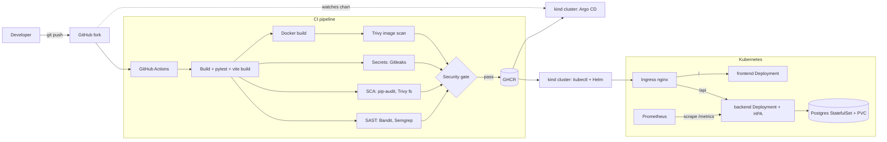

# Session 21 - Final DevOps Project: TaskBoard

Submitted by: Piyush Bansal

## Status (read this first)

I ran out of time, so this is honest about what is done and what is not:

| Part | Status |
|------|--------|
| Application (FastAPI backend + React frontend), unit tests | Done, tests run locally (output below) |
| Docker (backend + frontend Dockerfiles, docker compose) | Done, backend image built locally (output below); both images built in CI |
| Kubernetes plain manifests (`kubernetes/`) | Written; validated with `kubectl apply --dry-run=client`. **Not deployed yet** (CI deploy job was skipped, see below) |
| Helm chart (`helm/taskboard`) | `helm lint` / `helm template` run locally (output below). **Not installed yet** (CI deploy job was skipped) |
| CI/CD + DevSecOps (GitHub Actions) | First run: jobs 1–6 green (build/test, SAST, SCA, Gitleaks, Docker build, Trivy image scan); **job 7 security gate failed**, so push, deploy and GitOps jobs were skipped. [Run](https://github.com/PiyushhBansal/devops-heros/actions/runs/37665802478) |
| Monitoring (Prometheus + `/metrics` + alerts, `kubectl top`, HPA) | Manifests written. **Not run yet** (part of the skipped deploy job) |
| GitOps (Argo CD Application) | Manifest written. **Not run yet** (the GitOps job was skipped after the gate failed) |
| Terraform | **Not done.** I did not get to write/run the Terraform part (planned: VPC/subnets/S3 against LocalStack, not real AWS) |
| Final Troubleshooting Challenge | **Not done.** I did not get to break/fix the deployment and capture the output |

## Project overview

TaskBoard is a small task-management app (the course capstone app). I took the starter app and
turned it into a full pipeline: code -> GitHub -> CI build & test -> security scans -> Docker images ->
GHCR -> Kubernetes (plain manifests and Helm) -> monitoring -> GitOps with Argo CD.

Changes I made to the starter app:
- settings come from env vars: `DB_HOST/DB_PORT/DB_NAME/APP_ENV/LOG_LEVEL` (ConfigMap) and `DB_USER/DB_PASSWORD` (Secret)
- `/ready` returns 503 (not 500) when the DB is down, `/health` never touches the DB
- `/metrics` has request metrics plus `taskboard_tasks{status}` and `taskboard_build_info`
- one JSON log line per request (easy to read with `kubectl logs`)
- pinned dependency versions, tests extended to 11 (100% coverage)

## Architecture diagram



## Technologies used

Python 3.13, FastAPI, SQLAlchemy, Alembic, PostgreSQL 16, React 19 + Vite 8, nginx (unprivileged),
Docker / docker compose, Kubernetes (kind in CI), Helm, ingress-nginx, metrics-server, HPA,
Prometheus, Argo CD, GitHub Actions, GHCR, Bandit, Semgrep, pip-audit, Trivy, Gitleaks.

## Folder layout

```text
final-devops-project/
├── application/          backend/ (FastAPI, tests, alembic) and frontend/ (React)
├── docker/               backend.Dockerfile, frontend.Dockerfile, docker-compose.yml
├── kubernetes/           plain manifests 00-05 + kind-config.yaml
├── helm/taskboard/       Helm chart
├── .github/workflows/    copy of the pipeline (the live one is at repo root .github/workflows/piyush-session21-final.yml)
├── security/             bandit, semgrep, gitleaks, trivy configs + gate.py
├── monitoring/           prometheus.yaml (scrape config + alert rules), load-test.sh
├── gitops/               argocd-application.yaml, values-gitops.yaml
└── README.md
```

## Application setup

```bash
cd application/backend
python -m venv .venv && source .venv/bin/activate
pip install -r requirements-dev.txt
python -m pytest -q --cov=app --cov-report=term-missing
```

Real output (run locally):

```text
Name              Stmts   Miss  Cover   Missing
-----------------------------------------------
app/__init__.py       0      0   100%
app/config.py        20      0   100%
app/db.py            12      0   100%
app/main.py          86      0   100%
app/models.py        13      0   100%
app/schemas.py       26      0   100%
-----------------------------------------------
TOTAL               157      0   100%
11 passed, 1 warning in 31.36s
```

Frontend: `cd application/frontend && npm ci && npm run build` (it built locally with vite 8.3.3).

## Docker setup

- `docker/backend.Dockerfile`: multi-stage, deps in a venv, pip removed from runtime, runs as uid 10001,
  runs `alembic upgrade head` then uvicorn on 8000.
- `docker/frontend.Dockerfile`: Node builds the bundle, `nginx-unprivileged` serves it on 8080; `/api` is proxied to `BACKEND_URL`.
- `docker/docker-compose.yml`: postgres + backend + frontend (`cd docker && docker compose up --build`, open http://localhost:3000).

```bash
docker build -f docker/backend.Dockerfile -t taskboard-backend:p21-local application/backend
docker images taskboard-backend:p21-local
```

```text
IMAGE                         ID             DISK USAGE   CONTENT SIZE   EXTRA
taskboard-backend:p21-local   558a8f7f5525        292MB           63MB
```

In CI both images are built, the compose stack is started and smoke-tested (`docker-build` job).

## Kubernetes deployment

`kubernetes/` has the plain manifests: Namespace, ConfigMap + Secret, Postgres StatefulSet with a
PVC (volumeClaimTemplates), backend Deployment + Service (readiness `/ready`, liveness `/health`,
non-root, read-only root fs), frontend Deployment + Service, Ingress (`/api` -> backend, `/` -> frontend) and HPA.

```bash
kubectl apply -f kubernetes/00-namespace.yaml
kubectl -n p21-taskboard apply -f kubernetes/01-config.yaml -f kubernetes/02-postgres.yaml \
  -f kubernetes/03-backend.yaml -f kubernetes/04-frontend.yaml -f kubernetes/05-ingress-hpa.yaml
```

The CI deploy job applies them in kind, waits for rollout and curls through the Ingress, then deletes the namespace.

## Helm deployment

Chart `helm/taskboard`: Deployment (backend, frontend), Services, ConfigMap, Secret (random DB password kept
across upgrades with `lookup`, or `postgres.existingSecret`), Ingress, HPA, startup/readiness/liveness probes,
Postgres StatefulSet with PVC, optional ServiceMonitor, and a `helm test` pod.

```bash
helm lint helm/taskboard
helm template taskboard helm/taskboard | grep -E '^kind:' | sort | uniq -c
```

```text
==> Linting helm/taskboard
[INFO] Chart.yaml: icon is recommended

1 chart(s) linted, 0 chart(s) failed
   1 kind: ConfigMap
   2 kind: Deployment
   1 kind: HorizontalPodAutoscaler
   1 kind: Ingress
   1 kind: Pod
   1 kind: Secret
   3 kind: Service
   1 kind: StatefulSet
```

Install (what CI runs):

```bash
helm upgrade --install taskboard helm/taskboard -n p21-helm \
  --set backend.image.tag=<sha> --set frontend.image.tag=<sha> \
  --set "imagePullSecrets[0].name=ghcr-pull" --wait
helm test taskboard -n p21-helm --logs
```

## Terraform infrastructure

Not done - I ran out of time. The plan was to provision a VPC, subnets, security group and an S3 bucket
against LocalStack (a local AWS emulator, not real AWS) and run init/plan/apply/output/destroy.
Nothing here was run.

## CI/CD pipeline

Workflow: `.github/workflows/piyush-session21-final.yml` (repo root; copy in this folder). Triggers on push to
`submission/piyush-session-21` for this folder, and manually.

1. Build & unit test (pytest with coverage >= 90%, vite build, helm lint)
2. SAST - Bandit + Semgrep (my rules in `security/semgrep.yml` + p/python + p/fastapi)
3. SCA - pip-audit + Trivy fs on `requirements.txt` and `package-lock.json`
4. Secret scan - Gitleaks on the folder and its git history
5. Docker build of both images + docker compose smoke test
6. Trivy image scan of the exact tarballs that get pushed
7. Security gate (`security/gate.py`) - blocks on HIGH/CRITICAL / any secret / missing report
8. Push to GHCR with `GITHUB_TOKEN` (tag = short SHA + latest)
9. Deploy in kind: ingress-nginx + metrics-server, plain manifests, then `helm upgrade --install`,
   `helm test`, smoke test through the Ingress, Postgres pod restart to prove the PVC keeps data, monitoring checks
10. GitOps in a second kind cluster: Argo CD core + the Application, wait for Synced/Healthy, self-heal test

Run link (instead of screenshots): https://github.com/PiyushhBansal/devops-heros/actions/workflows/piyush-session21-final.yml?query=branch%3Asubmission%2Fpiyush-session-21

The pipeline was still running when I opened this PR, so I have not verified that every job is green.

## DevSecOps implementation

- SAST: Bandit (all checks) and Semgrep (custom rules: FastAPI debug, hardcoded DB password, SQL built with f-strings, `shell=True`)
- SCA: pip-audit and Trivy fs (Python + npm lockfile), only fixable issues count
- Secrets: Gitleaks default rules + a GitHub token rule + a Postgres-URL-with-password rule
- Images: Trivy on both images
- Gate: all scanners write JSON, `gate.py` decides; nothing is pushed if the gate fails
- Runtime hardening: non-root users, read-only root fs for the backend, dropped capabilities, seccomp RuntimeDefault,
  DB password only in a Secret (random per install)

## Monitoring

- The backend exposes `/metrics` (request count/latency per handler, `taskboard_tasks`, `taskboard_build_info`).
- `monitoring/prometheus.yaml`: a small Prometheus that discovers pods in its own namespace (Role, not ClusterRole)
  and scrapes pods with `prometheus.io/scrape=true`; 3 alert rules (backend down, 5xx rate > 5%, p95 > 500ms).
- Logs: JSON line per request, `kubectl logs deployment/taskboard-backend`.
- The CI deploy job applies Prometheus, runs `monitoring/load-test.sh`, queries Prometheus (`up`, request rate, p95),
  and prints `kubectl top pods` and the HPA. Results are in the run log (link above), not copied here because
  the run had not finished when I wrote this.

## GitOps

`gitops/argocd-application.yaml` points Argo CD at the Helm chart in my fork
(`session21-python/HW/final-devops-project/helm/taskboard`, branch `submission/piyush-session-21`) with
`gitops/values-gitops.yaml`, auto-sync, prune and self-heal. Flow: change chart/values in Git -> push ->
Argo CD notices and syncs; a manual `kubectl` change is reverted. Secrets are created out-of-band
(Argo CD renders with `helm template`, so the chart's `lookup` cannot keep a generated password).
The CI `gitops` job runs this for real in a throwaway kind cluster; I did not use the shared local cluster for it.

## Troubleshooting

Not done - I ran out of time before the Final Troubleshooting Challenge (introduce issues like a bad image tag,
wrong Service selector, failing readiness path, wrong ConfigMap key, then investigate/fix/verify). Nothing here was run.

## Screenshots

No screenshots - the CI run link above stands in for them, and the local outputs are pasted as text in the sections above.

## Lessons learned

- Splitting liveness (`/health`) and readiness (`/ready`) matters: a DB outage should take a pod out of the Service, not restart it.
- Secrets and GitOps don't mix by default: a Helm-generated random password breaks under Argo CD, so the secret has to live outside Git.
- Scanners should report, and one gate should decide - a crashed scanner must fail the gate, not look like a clean scan.
- Argo CD health checks are strict: an Ingress with no controller stays "Progressing" and an HPA with no metrics is "Degraded".
- I should have time-boxed the scope earlier; Terraform and the troubleshooting challenge are still open.
