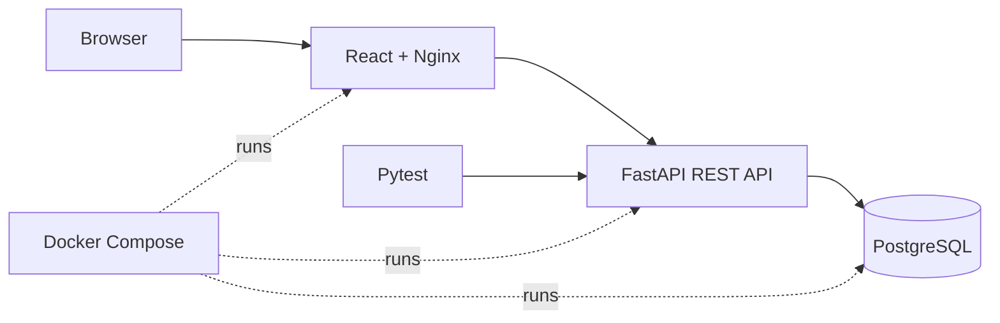
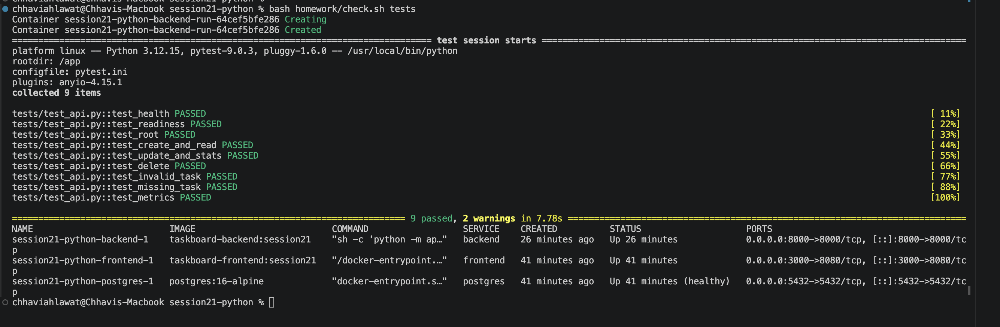
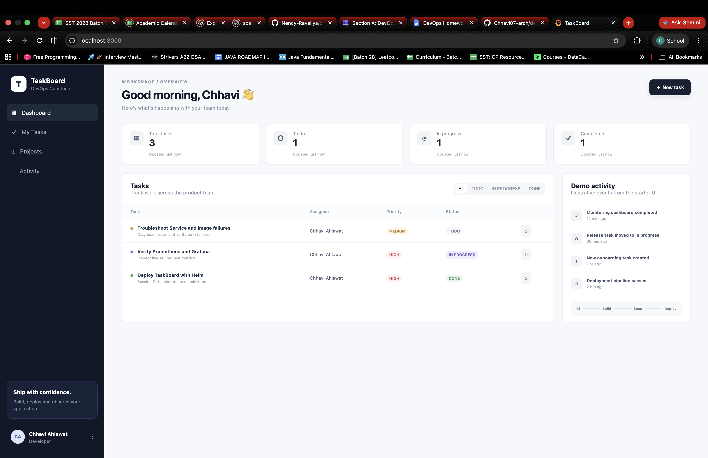

# Session 21 — Final DevOps Project & Troubleshooting

**Name:** Chhavi Ahlawat

**Enrollment:** 24BCS10201

**Email:** chhavi.24bcs10201@sst.scaler.com

## Project overview

This homework follows the teacher’s **TaskBoard** demo: a React frontend, FastAPI backend and PostgreSQL database. The application supports creating, listing, updating and deleting tasks, plus task-status statistics. The reference lesson is preserved in [LESSON.md](LESSON.md).

## Architecture



The repository also contains configuration for GitHub Actions, security scanning, GHCR, Terraform, Kubernetes, Helm, Ingress, HPA, Prometheus/Grafana and Argo CD. Their execution status is listed below.

## Work completed and verified

| Area | Result |
|---|---|
| Application | TaskBoard loaded at `http://localhost:3000`, with three tasks assigned to Chhavi Ahlawat |
| Docker | Frontend and backend images built; all three Compose services started, with PostgreSQL healthy |
| API | Health/readiness responses and frontend-to-backend proxy verified |
| Automated tests | **9 tests passed**, covering health, readiness, CRUD, statistics, validation and metrics |
| Test isolation | Each test uses a fresh SQLite database, separate from the running PostgreSQL database |
| Security | Bandit reported no source issues; pip-audit reported no known vulnerabilities after dependency updates |
| Helm | Chart lint and rendered YAML checks passed |
| Terraform | `terraform init` and `terraform validate` passed |

## Screenshot 1 — API tests and Docker Compose

The terminal shows all nine tests passing and the frontend, backend and PostgreSQL containers running.



## Screenshot 2 — Running TaskBoard application

The dashboard shows three tasks: one To Do, one In Progress and one Done.



Task status labels are demonstration data. The sidebar is marked as illustrative activity; it does not represent actual CI or monitoring results.

## Run locally

From the repository root:

```bash
cd session21-python
docker compose up -d --build
bash homework/check.sh tests
```

- Application: `http://localhost:3000`
- API documentation: `http://localhost:8000/docs`
- Readiness: `http://localhost:8000/ready`
- Metrics: `http://localhost:8000/metrics`

The backend runs Alembic migrations before starting Uvicorn. PostgreSQL health checks control Compose startup order. Both application images use non-root runtime users.

## Troubleshooting and fixes

| Finding | Change |
|---|---|
| Ingress routed API traffic to port 8080 instead of 8000 | Corrected the backend Service port in the chart |
| Nginx’s backend hostname differed between Compose and Kubernetes | Aligned the proxy hostname and added a Compose network alias |
| Backend could start before PostgreSQL was ready | Added the database health check and Compose dependency condition |
| Starter tests shared state and had limited coverage | Added nine isolated API tests |
| Dependency audit found vulnerable pytest/Starlette versions | Updated compatible dependencies; reran tests and pip-audit successfully |
| Backend initialization exceeded early liveness checks | Added a startup probe to the prepared chart; successful Kubernetes rollout remains unverified |
| Terraform module/provider blocks had invalid HCL syntax | Rewrote the blocks and verified Terraform initialization and validation |

The intentionally broken Service/image exercises are available in [`troubleshooting/`](troubleshooting/) and [`homework/check.sh`](homework/check.sh). A completed live troubleshooting exercise is **not claimed** in this submission.

## Prepared DevOps configuration

| Component | Files and purpose |
|---|---|
| CI/CD and DevSecOps | [Repository-root workflow](../.github/workflows/session21-capstone.yml): tests, frontend build, Bandit, dependency checks, Trivy secret/image scans, SHA-tagged images and a CI Kubernetes deployment |
| Kubernetes and Helm | [`helm/taskboard/`](helm/taskboard/): Deployments, Services, ConfigMap, Secret, Ingress, HPA, probes and PostgreSQL storage |
| Infrastructure | [`terraform/`](terraform/): AWS VPC, subnets, NAT gateway, EKS and a managed node group |
| Monitoring | [`monitoring/`](monitoring/): dashboard and monitoring configuration, including an unverified lightweight local-stack option |
| GitOps | [`gitops/application.yaml`](gitops/application.yaml): Argo CD reconciliation configuration |
| Security details | [`security/README.md`](security/README.md): scan gates, findings and dependency repairs |

The new CI workflow is **manual-only** (`workflow_dispatch`), so publishing this submission does not start additional builds or deployments.

## Scope and limitations

This submission includes **two genuine screenshots** documenting the local application, automated tests and Docker Compose stack. Deployment experiments were stopped after repeated local cluster timeouts and resource constraints.

A complete healthy Kubernetes rollout, HPA scaling, populated monitoring dashboard, live GitOps reconciliation, successful GitHub Actions/GHCR publication, Trivy container scan, and AWS plan/apply/destroy were **not verified**. Prepared configuration and successful static validation are not evidence that these deployment stages ran successfully. These portions of the full final-project requirements remain incomplete.

## Lessons learned

- Service names, selectors and ports must agree across application and deployment configuration.
- Container startup and database readiness are separate concerns.
- Tests should use isolated data, and security fixes need regression tests.
- Liveness checks should allow for application initialization through startup probes.
- Local resource limits can prevent a valid chart from reaching a healthy deployment.
