# Session 21: Final DevOps Project & Troubleshooting (TaskBoard)

An end-to-end DevOps project built on the course's **TaskBoard** application (React + FastAPI + PostgreSQL). Every stage in the homework is covered: **Application → Git → GitHub → CI → Build & Test → Security Scanning → Docker Image → Container Registry → Kubernetes → Helm → Monitoring → GitOps**, plus **Terraform** infrastructure and a **troubleshooting challenge**.

| | Link |
|---|---|
| Project code (in this repo) | [`final-devops-project/`](./) |
| Standalone repo where CI/CD and GitOps run | https://github.com/MadaraUchiha-tech/taskboard-devops |
| Pipeline runs | https://github.com/MadaraUchiha-tech/taskboard-devops/actions |
| Images | `ghcr.io/madarauchiha-tech/taskboard-backend`, `ghcr.io/madarauchiha-tech/taskboard-frontend` |

All screenshots in [`screenshots/`](../homework/screenshots/) are real captures (terminal windows, and GitHub/app pages in Chrome).

> The `GRADING.md` capstone (own application domain, real AWS EKS) is a separate assignment due later. This README covers the Session 21 homework.

---

## 1. Project overview

TaskBoard is a small project-management app: create tasks, set priority and assignee, and move them TODO → IN_PROGRESS → DONE. The backend exposes a REST API with `/health`, `/ready` and Prometheus `/metrics`. I took the provided project, ran it through every DevOps stage, **found and fixed nine real problems** in it (section 13), and built the CI/CD → registry → Kubernetes → GitOps flow around it.

## 2. Architecture

```text
 Developer ── git push ──▶ GitHub (taskboard-devops)
                               │
                               ▼  GitHub Actions
   ┌─ test (pytest + npm build) ─┐
   ├─ SAST (Bandit) ─────────────┤
   ├─ SCA (pip-audit) ───────────┼─▶ build images ─▶ Trivy gate ─▶ push GHCR :<sha>
   └─ secrets (Gitleaks) ────────┘                                   │
                                     deploy test: kind + helm ◀──────┤
                                                                     ▼
                         gitops: commit new tag to helm/taskboard/values-gitops.yaml
                                                                     │
                     Argo CD (in cluster) watches Git ◀──────────────┘
                               │ sync
                               ▼
  Kubernetes (minikube)  namespace taskboard-prod / taskboard
   Ingress (nginx) ─┬─ /     ─▶ frontend Service ─▶ frontend Pods (nginx + React) ─┐ /api proxy
                    └─ /api  ─▶ backend Service  ─▶ backend Pods (FastAPI) ◀───────┘
                                 ConfigMap + Secret   HPA (CPU 60%)   probes /health /ready
                                                 │
                                 PostgreSQL Deployment + PVC (5Gi)
   Prometheus ◀─ ServiceMonitor ─ /metrics      Grafana dashboard      Loki ◀─ Promtail (logs)

 Terraform: AWS VPC (2 AZ, public/private subnets, NAT) + EKS cluster + managed node group
```

## 3. Technologies used

FastAPI, SQLAlchemy, Alembic, PostgreSQL, React/Vite, nginx · pytest · Docker, Docker Compose · GitHub Actions · Bandit, pip-audit, Gitleaks, Trivy · GitHub Container Registry · Kubernetes (minikube, kind) · Helm · ingress-nginx · metrics-server + HPA · Prometheus, Grafana, Loki, Promtail (kube-prometheus-stack) · Argo CD · Terraform (AWS VPC + EKS modules), LocalStack.

## 4. Repository layout

```text
final-devops-project/
├── application/          backend/ (FastAPI, Alembic, tests) and frontend/ (React + nginx)
├── docker/               backend.Dockerfile, frontend.Dockerfile, docker-compose.yml
├── kubernetes/           plain manifests: namespace, Secret, ConfigMap, PVC, PostgreSQL,
│                         backend + frontend Deployments/Services, HPA, Ingress, troubleshooting/
├── helm/taskboard/       Helm chart (values.yaml, values-dev.yaml, values-gitops.yaml)
├── terraform/            AWS VPC + EKS
├── .github/workflows/    ci-cd.yml (CI/CD + DevSecOps + GitOps update)
├── security/             Bandit, Gitleaks, Trivy configs + gate documentation
├── monitoring/           Prometheus values, ServiceMonitor, Grafana dashboard
├── gitops/               Argo CD Application + values-gitops.yaml
└── README.md
```

Run locally: `docker compose -f docker/docker-compose.yml up --build`. Plain manifests: `kubectl apply -f kubernetes/`. Helm: `helm upgrade --install taskboard helm/taskboard -n taskboard --create-namespace`.

---

## 5. Application setup

```bash
docker compose up --build        # http://localhost:3000 (UI), :8000/docs (API)
```

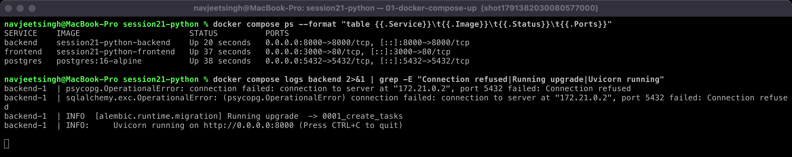

API calls (create tasks, list, stats, metrics):

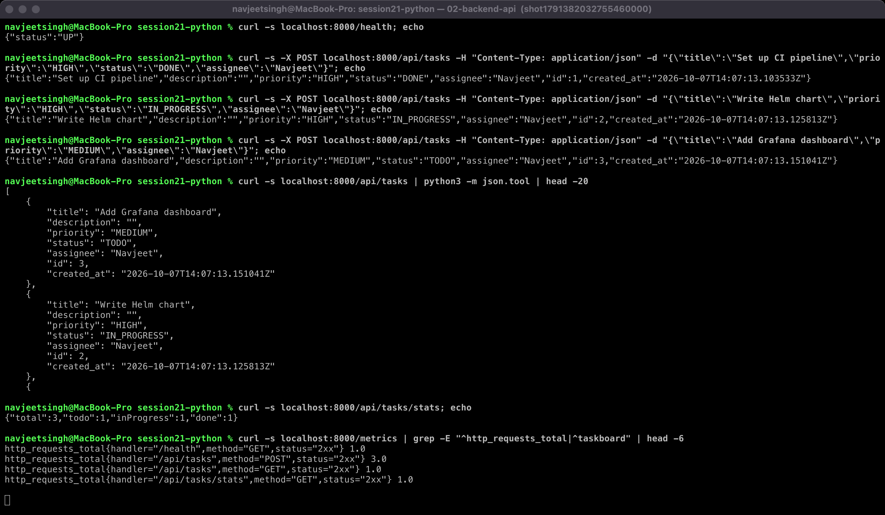

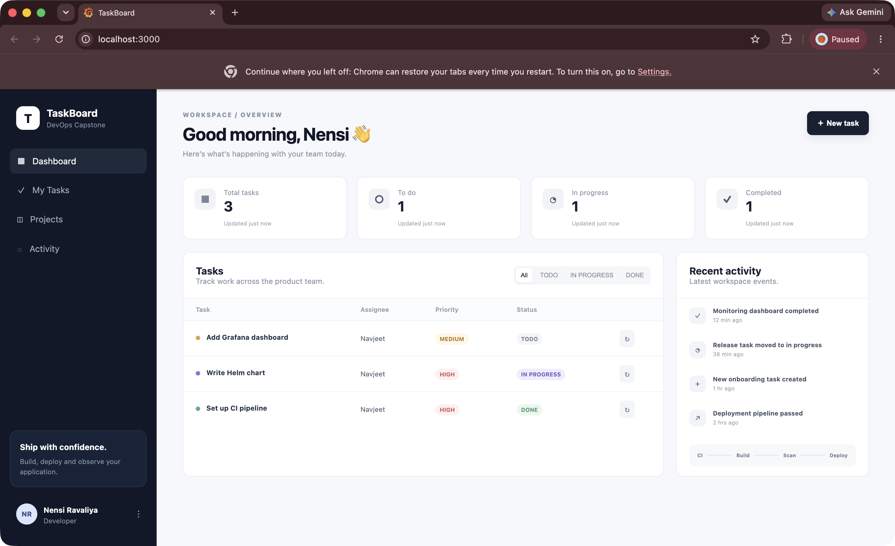

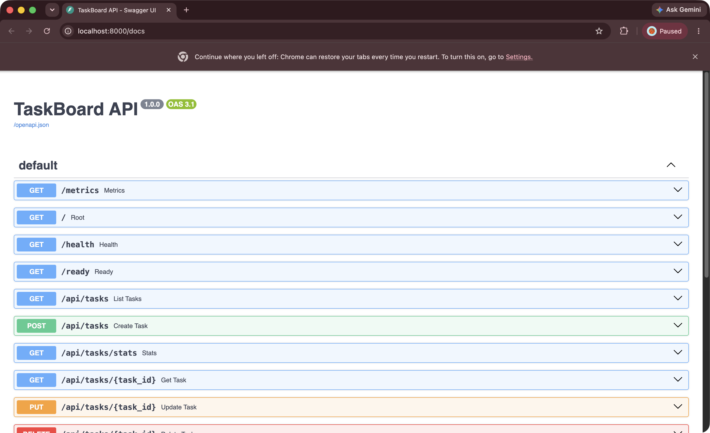

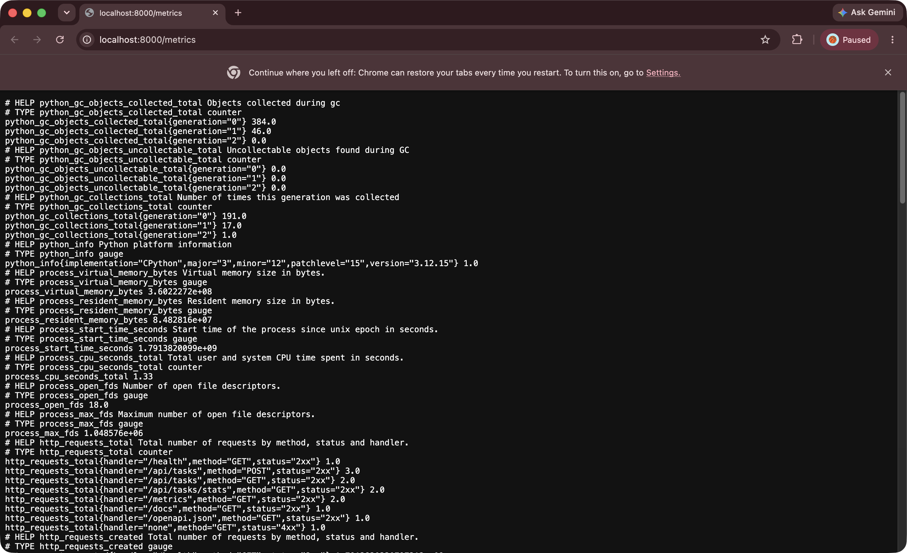

Tests (run in `python:3.12-slim`, the same Python as the Dockerfile):

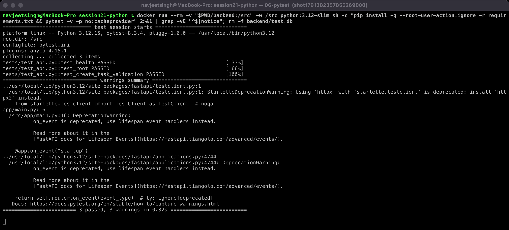

## 6. Docker setup

- **Backend:** `python:3.12-slim`, dependencies, Alembic and app code, **non-root user 10001**, and Alembic migration on start.
- **Frontend:** a **multi-stage** build (Node builds the React `dist/`, then an nginx runtime serves it). The nginx config is a template, so the API upstream (`BACKEND_HOST`) can be set per environment.

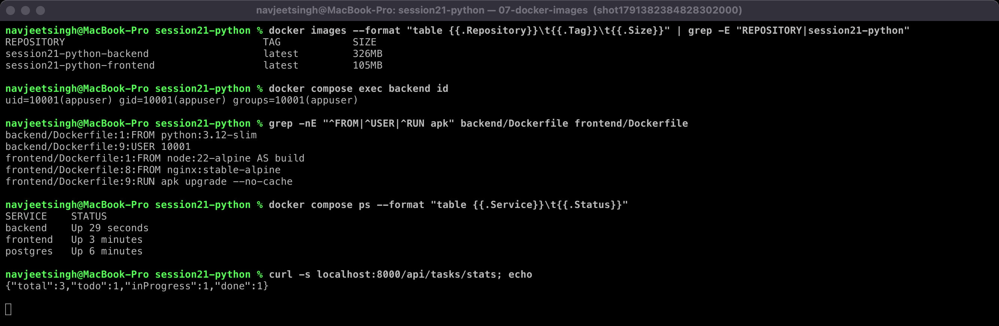

## 7. Kubernetes deployment

Deployment, Service, **ConfigMap**, **Secret**, **Ingress**, **HPA**, **probes** (liveness `/health`, readiness `/ready`, an initContainer that waits for PostgreSQL) and **storage** (a PostgreSQL PVC).

```bash
kubectl apply -f k8s/namespace.yaml
helm upgrade --install taskboard ./helm/taskboard -n taskboard -f helm/taskboard/values-dev.yaml \
  --set backend.image=taskboard-backend --set backend.tag=v1 \
  --set frontend.image=taskboard-frontend --set frontend.tag=v2 --set ingress.host=taskboard.127.0.0.1.nip.io
```

The first install of the chart *as provided* failed. See problems 4–6 in section 13.

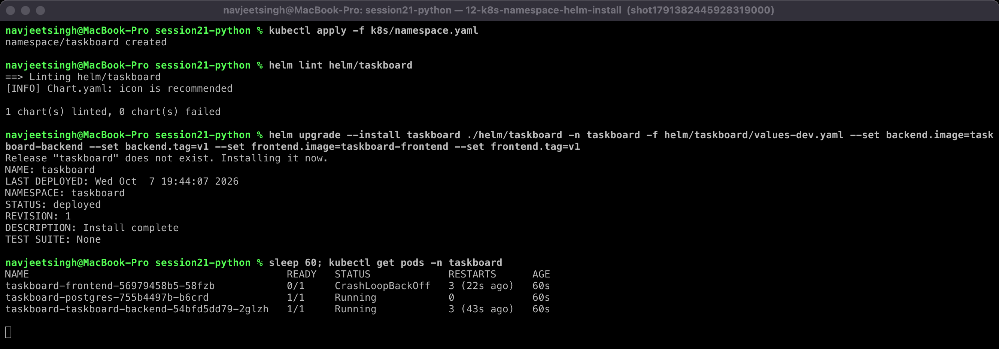

After the fixes, every object is running: Pods, Services, Ingress, ConfigMap, Secret, PVC.

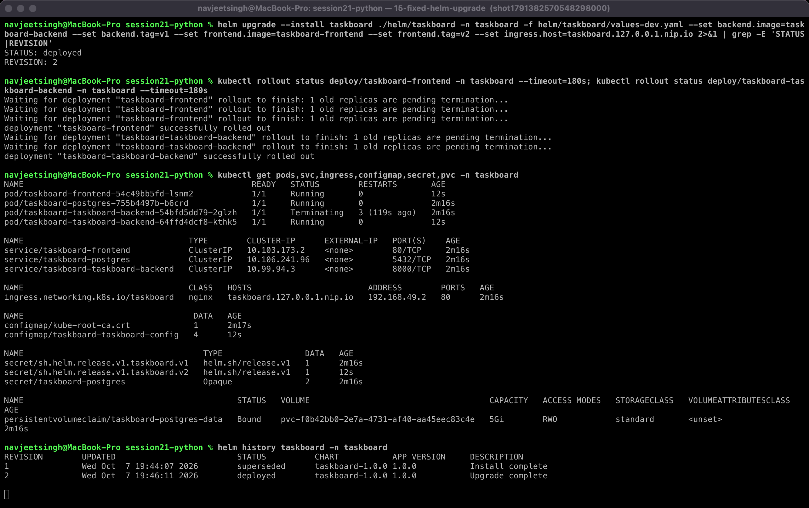

### Ingress

`/api` goes to the backend Service and `/` to the frontend. (The ingress controller is port-forwarded to `localhost:8081`; `*.127.0.0.1.nip.io` resolves to localhost, so no `/etc/hosts` edit is needed.)

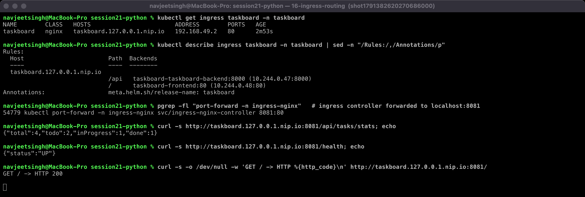

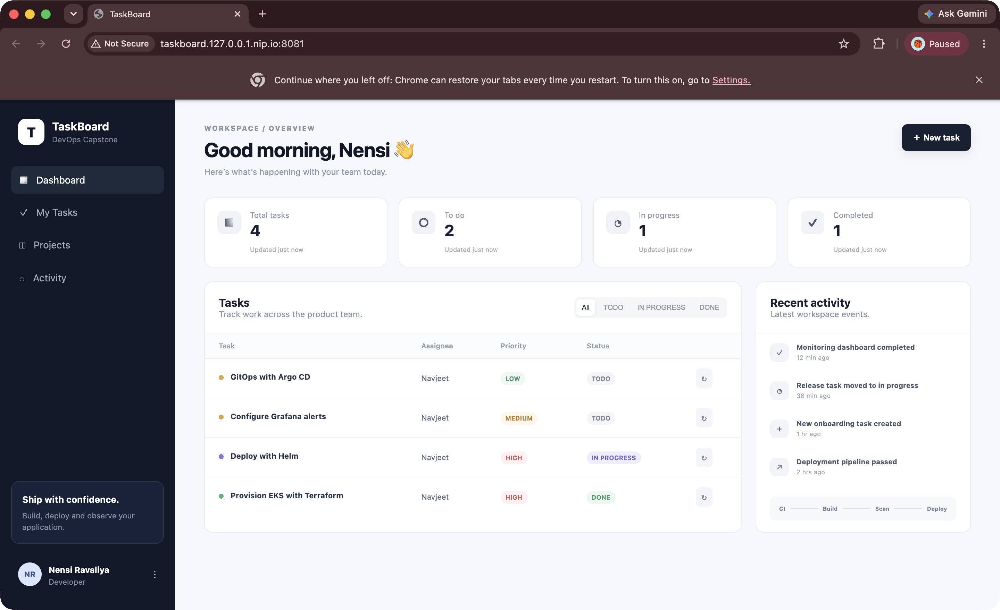

### HPA

A load generator ([hpa-load-generator.yaml](../homework/hpa-load-generator.yaml), 6 clients) drove backend CPU from **9%** to **237–456%** of the request, and the HPA scaled **1 → 4** replicas (its maximum):

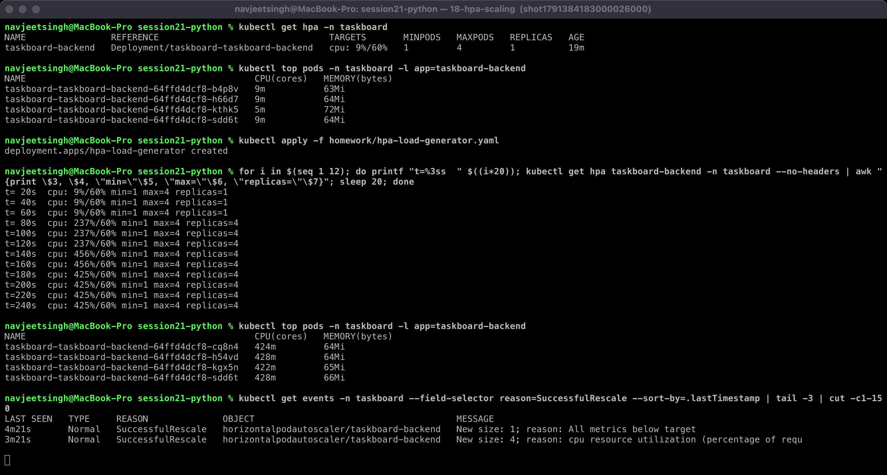

## 8. Helm deployment

The chart in `helm/taskboard/` packages the frontend, backend, PostgreSQL (Secret + PVC), ConfigMap, Services, Ingress, HPA and ServiceMonitor. `values.yaml` holds the defaults, `values-dev.yaml` is for a single replica plus Ingress, and `values-gitops.yaml` is the desired state for Argo CD. `helm history` shows the install and upgrade revisions (screenshot 15).

## 9. Terraform infrastructure

`terraform/` uses the official `terraform-aws-modules` to build a **VPC** (2 AZs, public and private subnets, single NAT gateway) and an **EKS 1.31** cluster with a managed node group (t3.medium, 2–4 nodes) in `ap-south-1`.

The provided code **didn't parse** (problem 9):

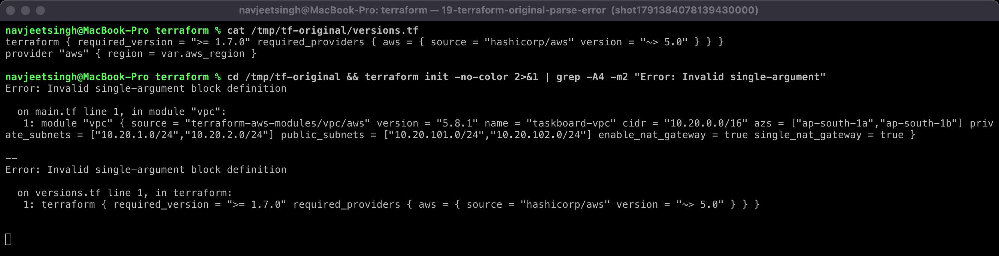

After the fix, `init`, `fmt` and `validate` pass, and `plan` shows **54 resources**:

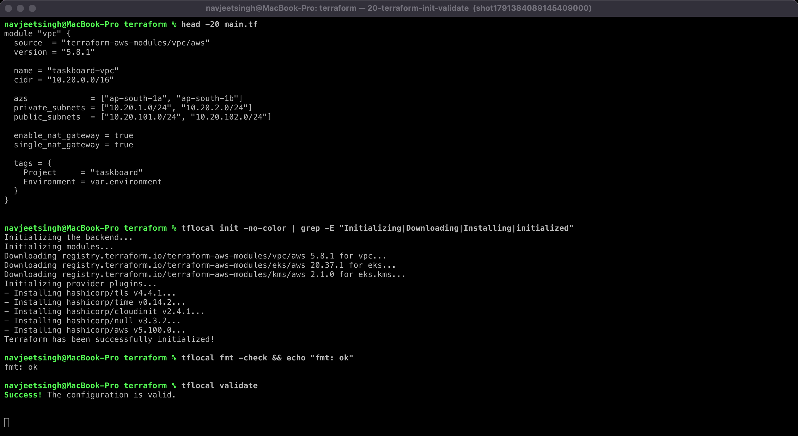

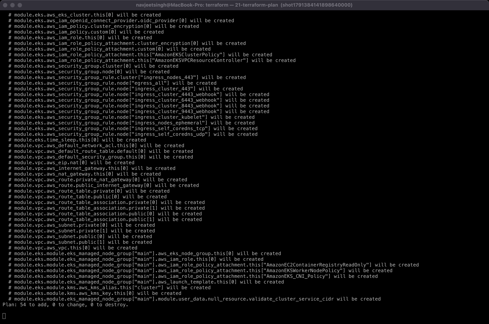

I then applied the VPC module (`terraform apply -target=module.vpc`, 19 resources), verified the VPC, subnets and NAT gateway, and destroyed it.

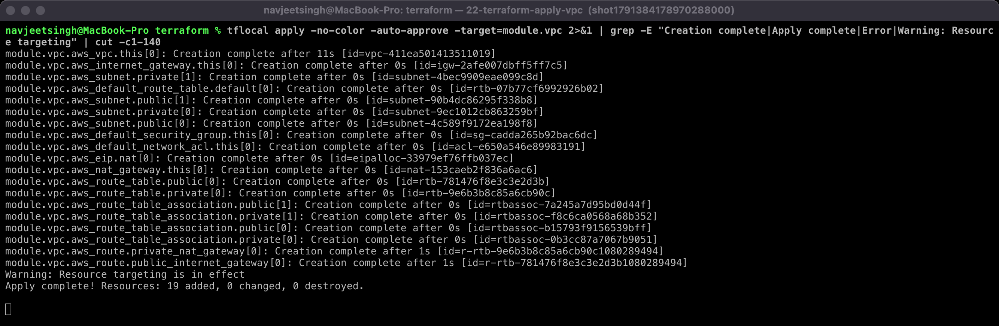

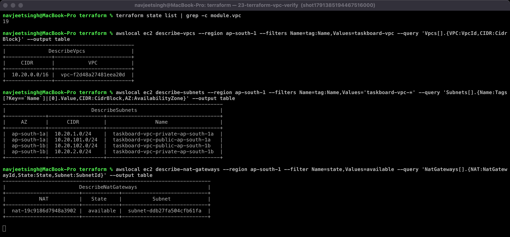

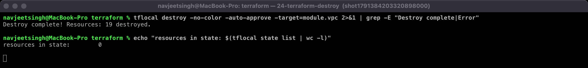

## 10. CI/CD pipeline

[`.github/workflows/ci-cd.yml`](.github/workflows/ci-cd.yml), running in [taskboard-devops](https://github.com/MadaraUchiha-tech/taskboard-devops/actions):

| Job | What it does |
|---|---|
| Test | `pytest` (backend) and `npm run build` (frontend) |
| SAST | Bandit, failing on MEDIUM+ |
| SCA | pip-audit, failing on any known vulnerability |
| Secret scan | Gitleaks over the full git history |
| Build, Trivy gate, push | builds both images, **Trivy fails the build on fixable HIGH/CRITICAL**, pushes to GHCR tagged with the **commit SHA** |
| Deploy to Kubernetes | creates a kind cluster, runs `helm upgrade --install` with the GHCR images, waits for rollout, smoke-tests frontend → backend → PostgreSQL |
| GitOps | commits the new image tag to `helm/taskboard/values-gitops.yaml` (`[skip ci]`) |

The first run was **blocked by the SCA gate**: pip-audit found `PYSEC-2026-1845` in `pytest 8.3.4` (problem 3). After the upgrade, every job is green:

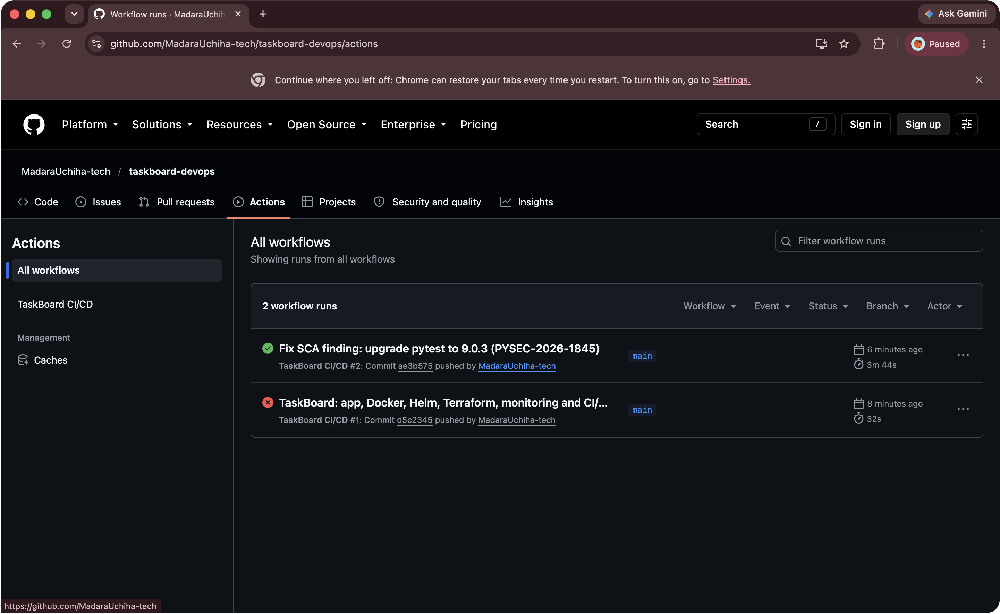

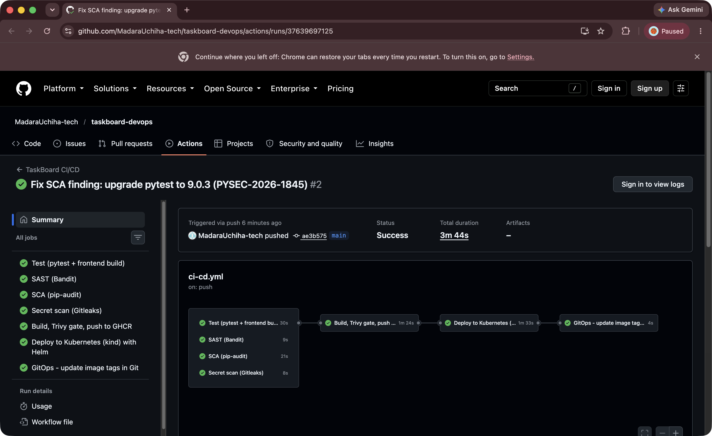

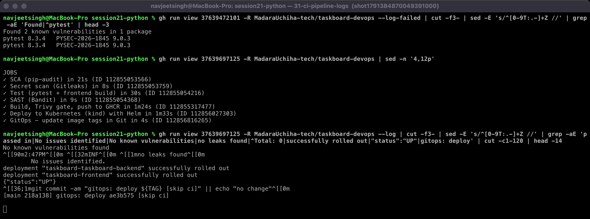

## 11. DevSecOps implementation

| Control | Tool | Result |
|---|---|---|
| SAST | Bandit | no issues |
| SCA | pip-audit | caught pytest CVE, fixed |
| Secret scanning | Gitleaks | no leaks (only findings were in downloaded Terraform module examples, which are git-ignored) |
| Container image scanning | Trivy | frontend **44 → 0**, backend **3 → 0** fixable HIGH/CRITICAL |
| Security gate | `needs:` + `exit-code: 1` | nothing is pushed or deployed unless every check passes |
| Runtime | non-root backend container, credentials in a Kubernetes Secret, private DB (ClusterIP) | |

Image scans before and after the fixes (problems 1–2):

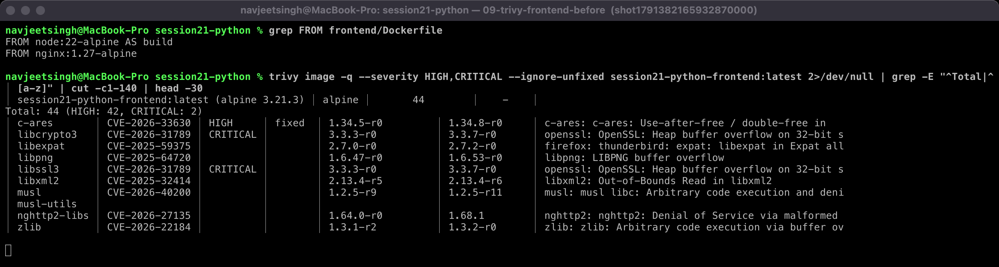

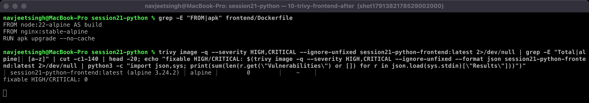

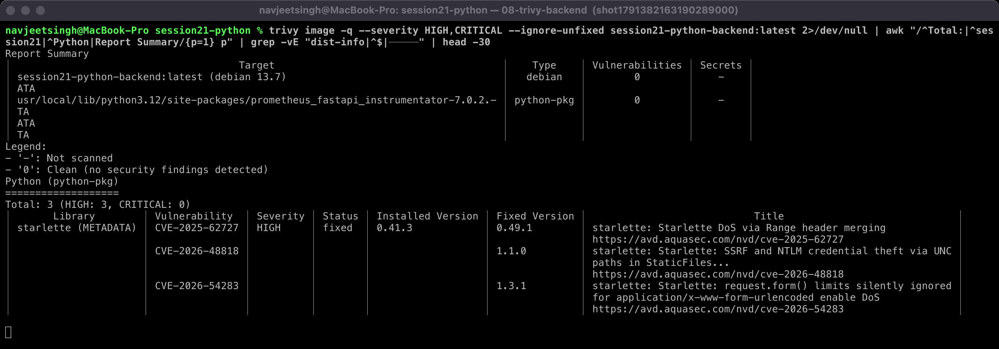

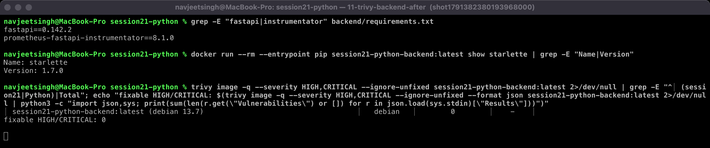

## 12. Monitoring and GitOps

### Monitoring (logs and metrics)

The chart's ServiceMonitor makes Prometheus (kube-prometheus-stack) scrape `/metrics` on every backend Pod. All 4 are **UP**:

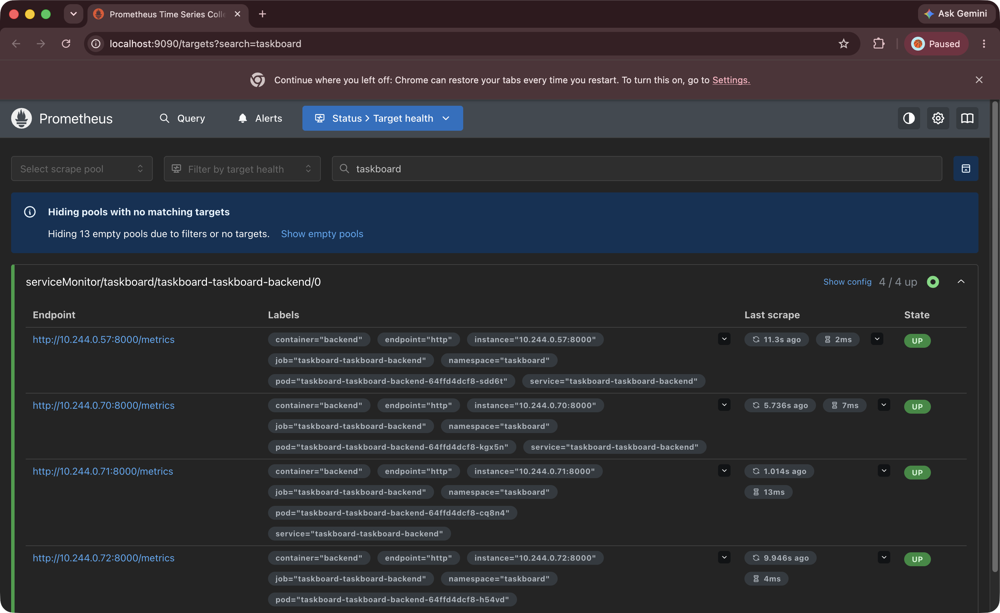

The Grafana dashboard ([monitoring/grafana-dashboard.yaml](monitoring/grafana-dashboard.yaml)) shows backend Pods up, request rate, 5xx ratio, HPA replicas, requests/s and p95 latency per endpoint, CPU and memory per Pod, and Loki logs. It was captured during the load test:

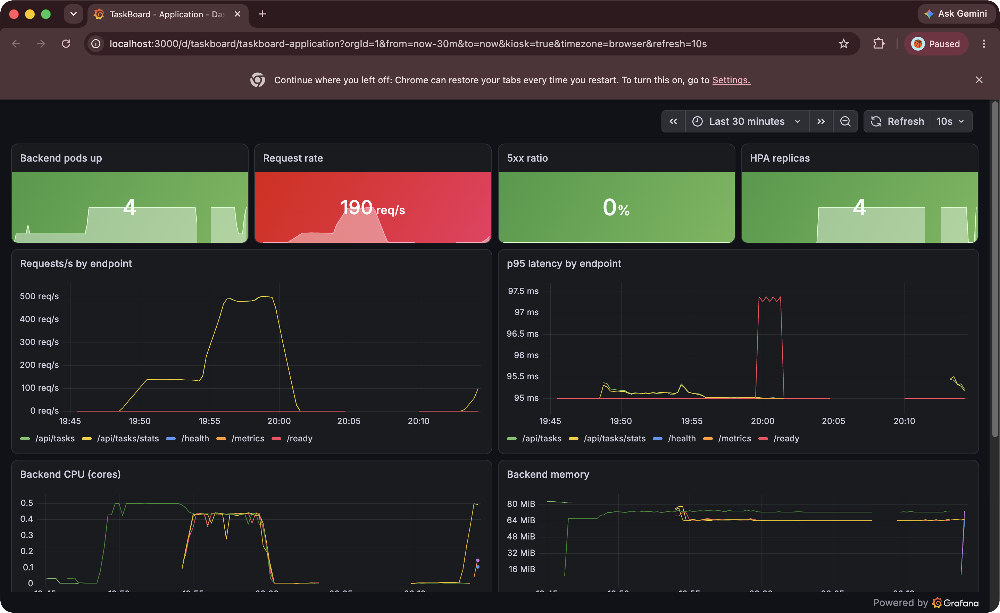

### GitOps workflow

[gitops/argocd-application.yaml](gitops/argocd-application.yaml): Argo CD watches `helm/taskboard` + `values-gitops.yaml` in the taskboard-devops repo, with automated sync, prune and self-heal. CI built `ae3b575`, and the bot committed `gitops: deploy ae3b575`. Argo CD then deployed exactly those GHCR images to `taskboard-prod`: `Synced / Healthy`, 2+2 replicas, nobody ran `kubectl apply`.

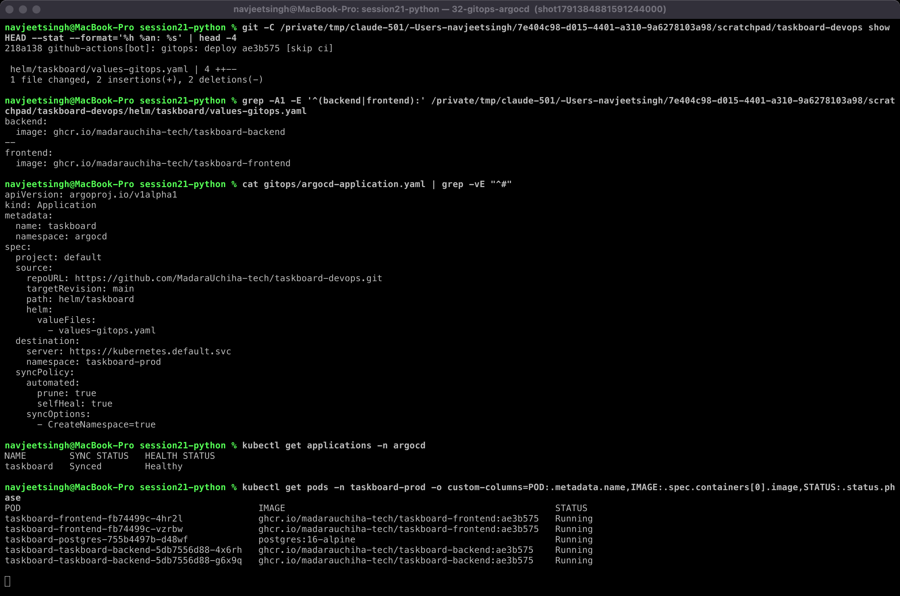

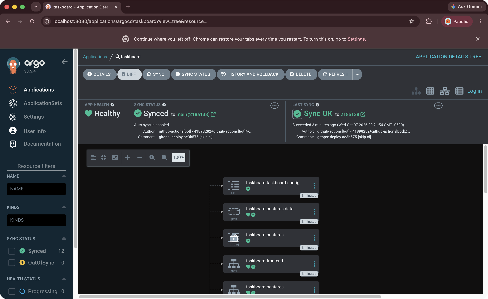

---

## 13. Troubleshooting

### Final troubleshooting challenge: intentionally broken manifests

**A. Broken image** (`troubleshooting/broken-image.yaml`)
- **Identify:** Pod `ErrImagePull` → `ImagePullBackOff`.
- **Investigate:** `kubectl describe pod` → `Failed to pull image "ghcr.io/example/taskboard-backend:does-not-exist"`.
- **Root cause:** the image/tag doesn't exist.
- **Fix:** `kubectl set image` to an existing image.
- **Verify:** new Pod `Running`, `READY true`, `Pulled` event.

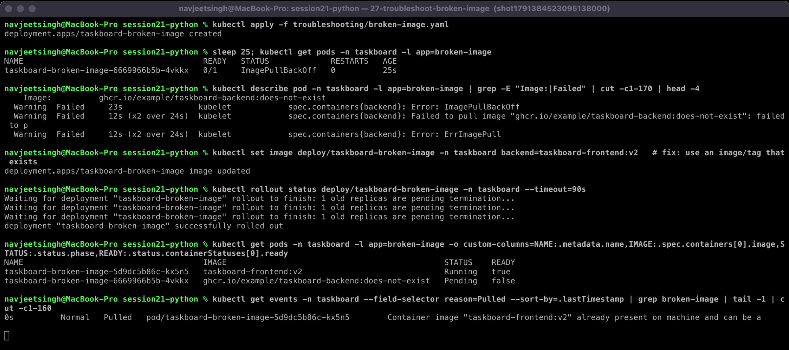

**B. Broken Service** (`troubleshooting/broken-service.yaml`)
- **Identify:** the Service has **no endpoints**; a request to it fails.
- **Investigate:** compare the Service selector (`app=label-that-does-not-exist`, targetPort 8080) with the Pod labels (`app=taskboard-backend`, container port 8000).
- **Root cause:** a selector/label mismatch, plus the wrong targetPort.
- **Fix:** patch the selector and targetPort.
- **Verify:** 4 endpoints, and `wget http://broken-service:8080/health` → `{"status":"UP"}`.

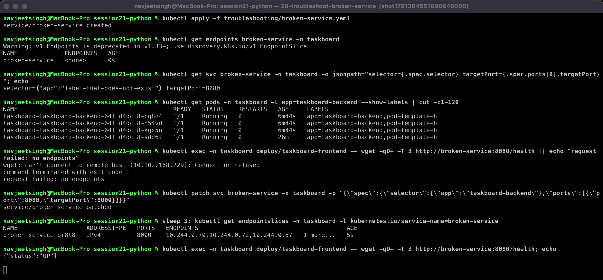

### Real problems found in the provided project (and fixed)

| # | Where | Symptom (how I found it) | Root cause | Fix | Verified |
|---|---|---|---|---|---|
| 1 | Frontend image | Trivy: **44 HIGH/CRITICAL** | outdated `nginx:1.27-alpine` (Alpine 3.21.3) | `nginx:stable-alpine` + `apk upgrade` | Trivy 0 |
| 2 | Backend image | Trivy: 3 HIGH in **starlette 0.41.3** | old `fastapi==0.115.6` (+ instrumentator 7.0.2 capping starlette < 1.0) | `fastapi==0.142.2`, `prometheus-fastapi-instrumentator==8.1.0` → starlette 1.7.0 | Trivy 0, tests pass, app works |
| 3 | CI SCA | pip-audit blocked the pipeline | `pytest==8.3.4` PYSEC-2026-1845 | `pytest==9.0.3` | pipeline green |
| 4 | Tests | `test_create_task_validation` failed: `no such table: tasks` (also on the original code) | tests use SQLite but nothing creates the schema (the app relies on Alembic) | `Base.metadata.create_all(engine)` in the test | 3 passed |
| 5 | Kubernetes frontend | **CrashLoopBackOff**, nginx: `host not found in upstream "backend"` | nginx hard-coded the Docker Compose name `backend:8000`; in K8s the Service is `taskboard-taskboard-backend` | nginx config as a template with `${BACKEND_HOST}`, value from the ConfigMap | Pod Running |
| 6 | Kubernetes backend / Compose | backend **restarted 3×** (Compose: crashed once): `connection refused` to PostgreSQL | startup race: Alembic runs before PostgreSQL accepts connections | `initContainer` running `pg_isready`; Compose `healthcheck` + `condition: service_healthy` | 0 restarts |
| 7 | Ingress | `/api` would have returned 503 | Ingress pointed to Service `taskboard-backend:8080`; the real one is `<release>-taskboard-backend:8000` | template uses the chart fullname and port 8000 | `/api/tasks/stats` OK via Ingress |
| 8 | Config/Secret | DB password in a plain `env` value even though a Secret existed; no ConfigMap | — | **ConfigMap** for host/port/name, **Secret** for user/password, `DATABASE_URL` assembled with `$(VAR)` | ConfigMap + Secret in use |
| 9 | Terraform | `terraform init` fails: *Invalid single-argument block definition* | blocks written on one line with several arguments, which isn't valid HCL | rewrote as normal multi-line HCL, same settings and module versions | validate OK, plan 54 resources |

Evidence for 5 and 6, from the first deploy:

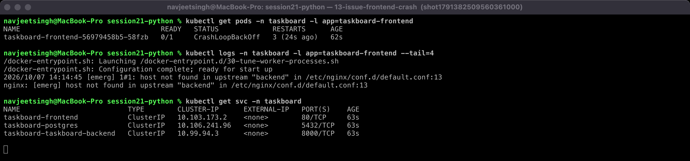

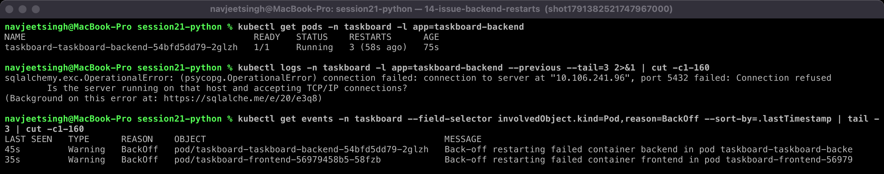

Two mistakes of my own, also worth recording. My first HPA attempt never actually created the HPA (a shell quoting error), and its load generator kept running, so the next measurement started at 500%. I waited for the backend to go idle and repeated the test from 9%. I also first wired an import in the test fix that shadowed the `app` object; the tests caught it immediately.

## 14. Screenshots

All 33 are in [`screenshots/`](../homework/screenshots/), numbered in the order they were taken.

## 15. Lessons learned

- **Run it for real.** The chart, Terraform and tests all looked fine on paper. Deploying them exposed five bugs that no review had caught.
- **Security gates pay off immediately.** The SCA and Trivy gates stopped vulnerable code twice before anything was pushed. Most findings were in base images and transitive dependencies, not in the app's own code.
- **Names differ between environments.** `backend:8000` works in Compose and breaks in Kubernetes. Make service addresses configuration (a ConfigMap), not code.
- **Startup order is not guaranteed.** Use readiness probes, initContainers and Compose health conditions instead of hoping the database is up first.
- **Keep secrets in Secrets.** The ConfigMap holds non-sensitive settings, and `DATABASE_URL` is built at runtime.
- **GitOps closes the loop.** CI never touches the cluster; it changes Git, and Argo CD makes the cluster match. Every deployment is a commit.
- **Measure from a clean baseline.** My first HPA result was polluted by leftover load.
