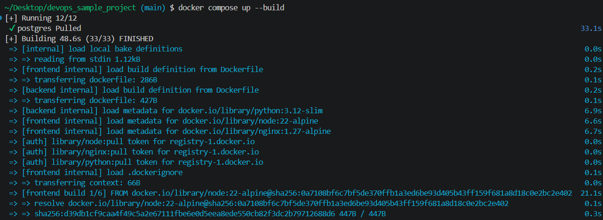
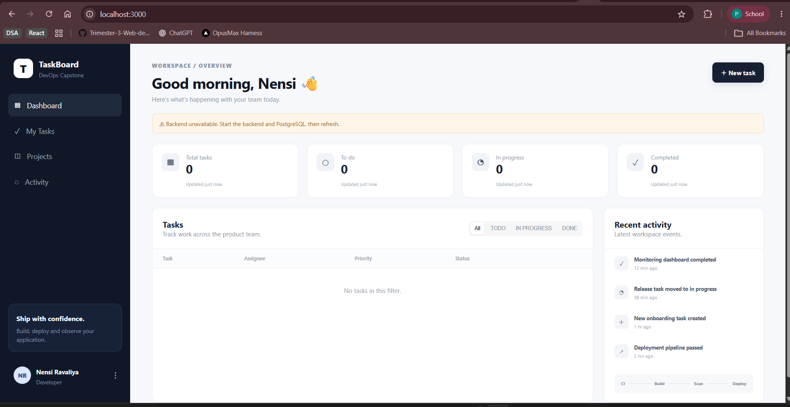
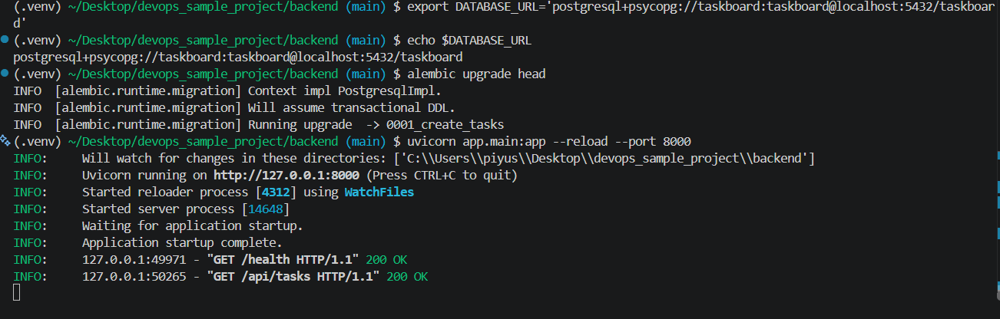
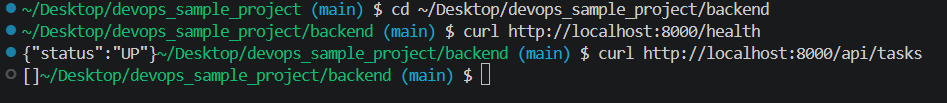
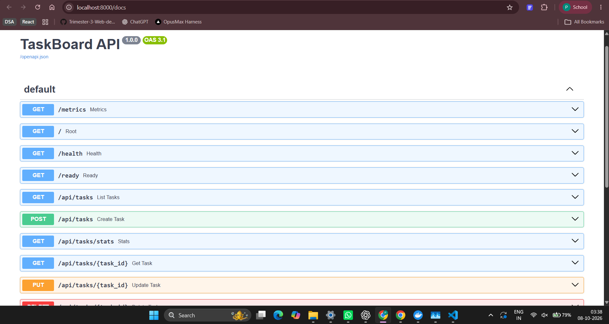
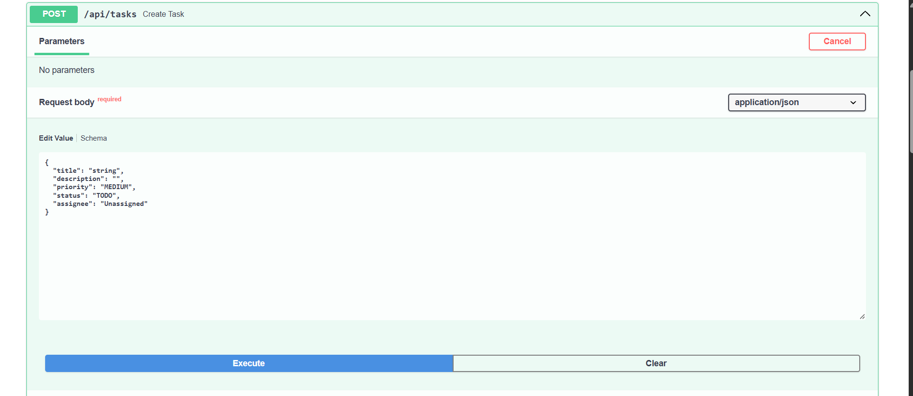
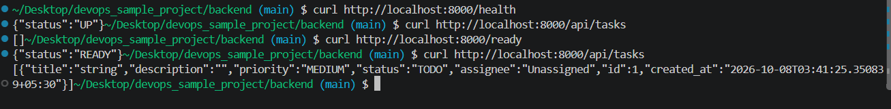
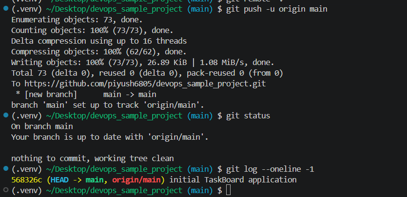
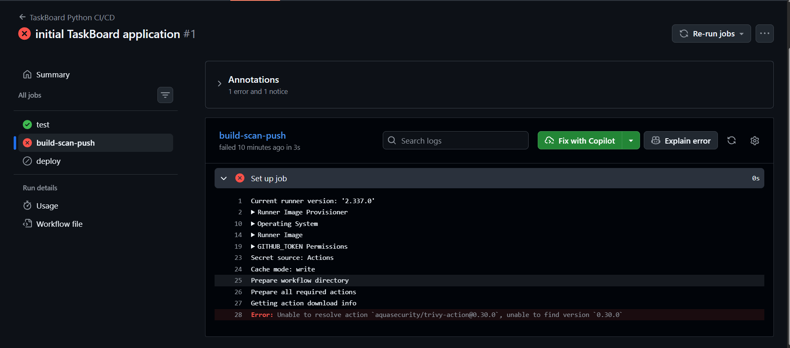

# Session 21: TaskBoard Final DevOps Project

## Local execution

The TaskBoard stack was run using the documented Docker Compose workflow. It starts PostgreSQL, the FastAPI backend, and the React/Nginx frontend.

During verification, the backend attempted its Alembic migration before PostgreSQL was ready. `docker-compose.yml` now has a PostgreSQL health check and waits for `service_healthy`, so the migration completes before Uvicorn starts.

## Quality and deployment assets

- Backend API tests: **3 passed**.
- Helm TaskBoard chart: **lint passed**.
- The repository contains Dockerfiles, Compose configuration, Helm, Kubernetes, monitoring, CI/CD, Terraform, and troubleshooting folders as described in the main project README.

## Troubleshooting lab

The deliberately broken image and Service manifests, plus the TaskBoard namespace manifest, were validated with client-side Kubernetes dry runs. They are ready for the investigation steps documented in `README.md` when a suitable cluster/image registry target is configured.

![Troubleshooting manifest validation]

## Notes

The local application and validation steps were executed without provisioning AWS infrastructure, pushing container images, or running a GitHub-hosted workflow. Those stages require the repository, cloud account, registry, and GitHub secrets described in the main README.
