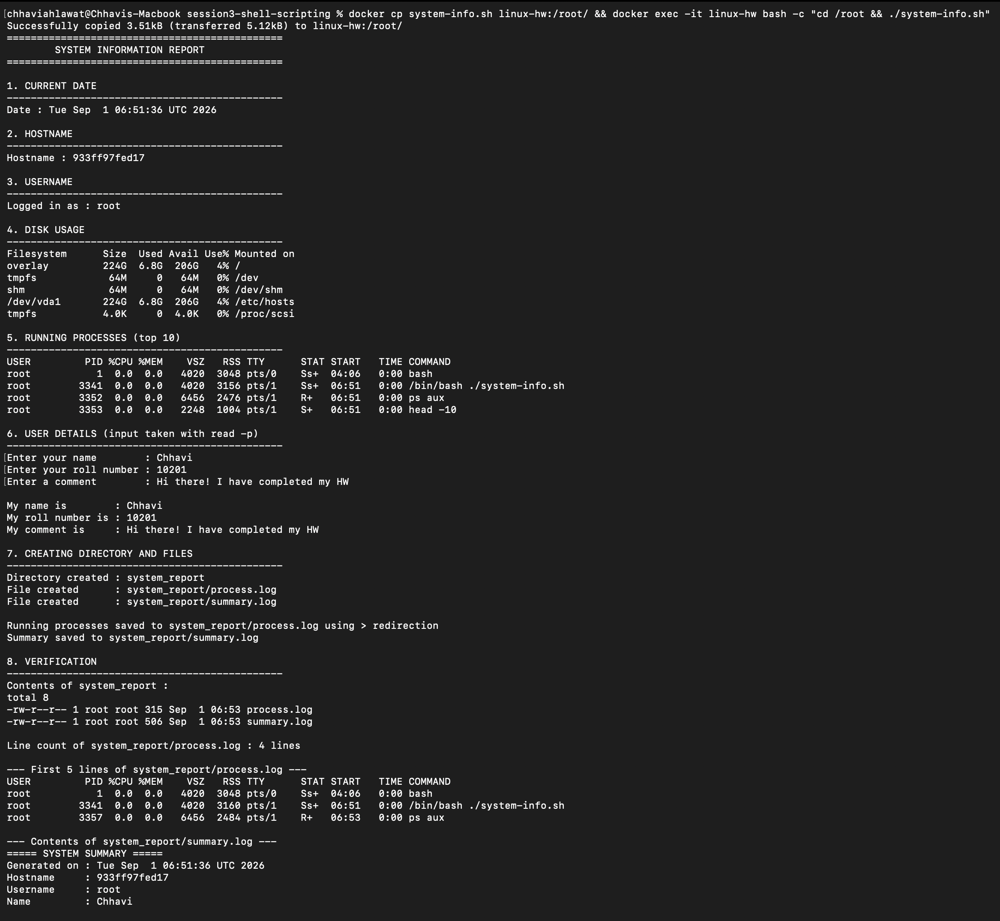

# Session 3 — Shell Scripting (Homework)

**Name:** Chhavi Ahlawat
**Enrollment Number:** 24BCS10201
**Email:** chhavi.24bcs10201@sst.scaler.com

---

## Task: System Information Script

Write a shell script that:

| # | Requirement | How it's done | ✅ |
|---|---|---|---|
| 1 | Print the current date | `date` stored in `$current_date` | ✅ |
| 2 | Print the hostname | `hostname` stored in `$host_name` | ✅ |
| 3 | Print the username | `whoami` stored in `$user_name` | ✅ |
| 4 | Print the disk usage | `df -h` | ✅ |
| 5 | Print the running processes | `ps aux \| head -10` | ✅ |
| 6 | Use variables | `current_date`, `host_name`, `user_name`, `name`, `roll_no`, `comment`, `report_dir`, `process_file`, `summary_file` | ✅ |
| 7 | Take user input | `read -p "Enter your name : " name` | ✅ |
| 8 | Create a directory | `mkdir -p "$report_dir"` | ✅ |
| 9 | Create a file | `touch "$process_file"` | ✅ |
| 10 | Store processes in the file with `>` | `ps aux > "$process_file"` | ✅ |

**Script file:** [`system-info.sh`](system-info.sh)

---

## How to run it

```bash
chmod +x system-info.sh
./system-info.sh
```

---

## The Script

```bash
#!/bin/bash
# =============================================================
#  System Information Script
#  Session 3 - Shell Scripting Homework
#  Name: Chhavi Ahlawat | Enrollment: 24BCS10201
# =============================================================

echo "=============================================="
echo "        SYSTEM INFORMATION REPORT"
echo "=============================================="
echo

# ---------- VARIABLES: store command output using $( ) ----------
current_date=$(date)
host_name=$(hostname)
user_name=$(whoami)

# ---------- 1. Current date ----------
echo "1. CURRENT DATE"
echo "Date : $current_date"

# ---------- 2. Hostname ----------
echo "2. HOSTNAME"
echo "Hostname : $host_name"

# ---------- 3. Username ----------
echo "3. USERNAME"
echo "Logged in as : $user_name"

# ---------- 4. Disk usage ----------
echo "4. DISK USAGE"
df -h

# ---------- 5. Running processes ----------
echo "5. RUNNING PROCESSES (top 10)"
ps aux | head -10

# ---------- 6. Take user input with read -p ----------
read -p "Enter your name        : " name
read -p "Enter your roll number : " roll_no
read -p "Enter a comment        : " comment

echo "My name is        : $name"
echo "My roll number is : $roll_no"
echo "My comment is     : $comment"

# ---------- 7. Create a directory with mkdir ----------
report_dir="system_report"
mkdir -p "$report_dir"

# ---------- 8. Create files with touch ----------
process_file="$report_dir/process.log"
summary_file="$report_dir/summary.log"
touch "$process_file"
touch "$summary_file"

# ---------- 9. Store running processes in the file using > ----------
ps aux > "$process_file"

# ---------- Build a summary file using > and >> ----------
echo "===== SYSTEM SUMMARY =====" >  "$summary_file"
echo "Generated on : $current_date" >> "$summary_file"
echo "Hostname     : $host_name"    >> "$summary_file"
echo "Username     : $user_name"    >> "$summary_file"
echo "Name         : $name"         >> "$summary_file"
echo "Roll Number  : $roll_no"      >> "$summary_file"
echo "Comment      : $comment"      >> "$summary_file"
echo "--- Disk Usage ---"           >> "$summary_file"
df -h                               >> "$summary_file"

# ---------- 10. Verify ----------
ls -l "$report_dir"
head -5 "$process_file"
cat "$summary_file"
```

> The full, commented version is in [`system-info.sh`](system-info.sh).

---

# ▶️ Complete Output

```
$ ./system-info.sh

==============================================
        SYSTEM INFORMATION REPORT
==============================================

1. CURRENT DATE
----------------------------------------------
Date : Mon Aug 31 18:34:53 UTC 2026

2. HOSTNAME
----------------------------------------------
Hostname : 933ff97fed17

3. USERNAME
----------------------------------------------
Logged in as : root

4. DISK USAGE
----------------------------------------------
Filesystem      Size  Used Avail Use% Mounted on
overlay         224G  2.8G  210G   2% /
tmpfs            64M     0   64M   0% /dev
shm              64M     0   64M   0% /dev/shm
/dev/vda1       224G  2.8G  210G   2% /etc/hosts
tmpfs           4.0K     0  4.0K   0% /proc/scsi

5. RUNNING PROCESSES (top 10)
----------------------------------------------
USER         PID %CPU %MEM    VSZ   RSS TTY      STAT START   TIME COMMAND
root           1  0.0  0.0   4020  3312 pts/0    Ss+  18:25   0:00 bash
root         426  0.0  0.0   3888  2792 ?        Ss   18:34   0:00 bash -c ...
root         434  0.0  0.0   3888  2796 ?        S    18:34   0:00 bash system-info.sh
root         440  0.0  0.0   6456  2476 ?        R    18:34   0:00 ps aux
root         441  0.0  0.0   2248  1004 ?        S    18:34   0:00 head -10

6. USER DETAILS (input taken with read -p)
----------------------------------------------
Enter your name        : Chhavi Ahlawat
Enter your roll number : 24BCS10201
Enter a comment        : Completed the shell scripting homework successfully!

My name is        : Chhavi Ahlawat
My roll number is : 24BCS10201
My comment is     : Completed the shell scripting homework successfully!

7. CREATING DIRECTORY AND FILES
----------------------------------------------
Directory created : system_report
File created      : system_report/process.log
File created      : system_report/summary.log

Running processes saved to system_report/process.log using > redirection
Summary saved to system_report/summary.log

8. VERIFICATION
----------------------------------------------
Contents of system_report :
total 8
-rw-r--r-- 1 root root 533 Aug 31 18:34 process.log
-rw-r--r-- 1 root root 539 Aug 31 18:34 summary.log

Line count of system_report/process.log : 5 lines

--- First 5 lines of system_report/process.log ---
USER         PID %CPU %MEM    VSZ   RSS TTY      STAT START   TIME COMMAND
root           1  0.0  0.0   4020  3312 pts/0    Ss+  18:25   0:00 bash
root         426  0.0  0.0   3888  2792 ?        Ss   18:34   0:00 bash -c ...
root         434  0.0  0.0   3888  2800 ?        S    18:34   0:00 bash system-info.sh
root         445  0.0  0.0   6456  2472 ?        R    18:34   0:00 ps aux

--- Contents of system_report/summary.log ---
===== SYSTEM SUMMARY =====
Generated on : Mon Aug 31 18:34:53 UTC 2026
Hostname     : 933ff97fed17
Username     : root
Name         : Chhavi Ahlawat
Roll Number  : 24BCS10201
Comment      : Completed the shell scripting homework successfully!
--- Disk Usage ---
Filesystem      Size  Used Avail Use% Mounted on
overlay         224G  2.8G  210G   2% /
tmpfs            64M     0   64M   0% /dev
shm              64M     0   64M   0% /dev/shm
/dev/vda1       224G  2.8G  210G   2% /etc/hosts
tmpfs           4.0K     0  4.0K   0% /proc/scsi

==============================================
              REPORT COMPLETE
==============================================
```

### 📸 Screenshot — running the script interactively



This is a **separate interactive run**, which is why the date, PIDs and the entered
name/roll/comment differ from the transcript above. It shows what the transcript can't:
the **`read -p` prompts pausing for real keyboard input** —

```
Enter your name        : Chhavi
Enter your roll number : 10201
Enter a comment        : Hi there! I have completed my HW
```

— and then every requirement in sequence: the date, hostname, username, `df -h`, `ps aux`,
the directory created with `mkdir`, the two files created with `touch`, `ps aux` written to
`process.log` via `>` redirection, and the verification reading both files back.

**Generated files** (committed in [`system_report/`](system_report)):
- [`system_report/process.log`](system_report/process.log) — created by `ps aux > "$process_file"`
- [`system_report/summary.log`](system_report/summary.log) — built with `>` then `>>`

---

# Explanation of each command used

## `mkdir` — make directory

```bash
mkdir system_report          # create one directory
mkdir -p a/b/c               # create the whole nested path
mkdir -p "$report_dir"       # -p also means "don't error if it already exists"
```

`-p` matters in scripts: without it, re-running the script would fail with
`mkdir: cannot create directory 'system_report': File exists`. With `-p` it's **idempotent**
— safe to run many times.

## `touch` — create an empty file / update its timestamp

```bash
touch process.log
touch file1.txt file2.txt file3.txt   # several at once
```

If the file doesn't exist, `touch` creates it empty (0 bytes). If it *does* exist, `touch`
leaves the contents alone and just updates the modified time.

## `echo` — print text

```bash
echo "Hello"
echo "My name is $name"      # double quotes -> variables ARE expanded
echo 'My name is $name'      # single quotes -> prints literally: $name
echo -n "no newline"         # -n suppresses the trailing newline
```

**Always double-quote your variables** (`"$name"`) so that a value containing spaces stays
one word instead of being split.

## `df` — disk free

```bash
df           # in 1-KB blocks, hard to read
df -h        # human-readable: G / M / K
df -h /      # just the root filesystem
df -i        # inode usage instead of block usage
```

The **`Use%`** column is what you check first when something says "no space left on device".

## `ps` — process status

```bash
ps                # only processes in the current shell
ps aux            # ALL processes, all users, detailed
ps -ef            # same idea, System-V style output
ps aux | head -10 # top 10 lines (header + 9 processes)
ps aux | grep nginx
```

Flags: `a` = all users' processes, `u` = user-oriented detailed format,
`x` = also include processes without a controlling terminal (daemons).

## `read -p` — prompt for user input

```bash
read -p "Enter your name : " name        # -p prints the prompt on the same line
read -sp "Password: " pass               # -s hides typing (silent) - for passwords
read -t 10 -p "Quick! " answer           # -t 10 = timeout after 10 seconds
read -a colours                          # -a reads into an array
```

Without `-p` you'd need two lines (`echo -n "prompt"` then `read name`). `-p` does both.

## Variables

```bash
name="Chhavi"                # NO spaces around = ... name = "Chhavi" is an error
current_date=$(date)         # $( ) = command substitution: run it, capture stdout
count=$((5 + 3))             # $(( )) = arithmetic

echo "$name"                 # use with $ and quotes
echo "${name}_suffix"        # braces when the name touches other characters
```

| Syntax | Meaning |
|---|---|
| `$var` / `${var}` | value of the variable |
| `$(command)` | run the command, substitute its output |
| `$((2+3))` | arithmetic |
| `"$var"` | expanded, spaces preserved ✅ |
| `'$var'` | literal, not expanded |
| `$0` | the script's own name |
| `$1 $2 $3` | command-line arguments |
| `$#` | number of arguments |
| `$?` | exit status of the last command (`0` = success) |
| `$$` | PID of the current script |

## `>` and `>>` — output redirection

```bash
ps aux > process.log      # OVERWRITE: wipes the file, then writes
ps aux >> process.log     # APPEND: adds to the end
command 2> errors.log     # redirect stderr only
command &> all.log        # redirect stdout AND stderr
command > /dev/null 2>&1  # throw everything away
command < input.txt       # redirect INPUT into a command
```

| Number | Stream | Meaning |
|---|---|---|
| `0` | stdin | input |
| `1` | stdout | normal output (this is the default for `>`) |
| `2` | stderr | error messages |

`>` is exactly what the homework asks for in "Stores the running processes information in
the file using `>` output redirection":

```bash
ps aux > "$process_file"
```

---

# Other scripts in this folder (class practice)

| File | What it demonstrates |
|---|---|
| [`hello.sh`](hello.sh) | The very first script — shebang and `echo` |
| [`variable.sh`](variable.sh) | Declaring and using variables |
| [`input.sh`](input.sh) | Taking input with `read -p` |
| [`condition.sh`](condition.sh) | `if` / `elif` / `else` |
| [`loop.sh`](loop.sh) | `for` loop |
| [`while_loop.sh`](while_loop.sh), [`while_loop1.sh`](while_loop1.sh) | `while` loop |
| [`function.sh`](function.sh) | Defining and calling functions |
| [`data.sh`](data.sh), [`script1.sh`](script1.sh), [`test1.sh`](test1.sh) | File operations, redirection |
| [`system-info.sh`](system-info.sh) | ⭐ **The homework submission** |

Concept notes: [`variables.md`](variables.md), [`input.md`](input.md),
[`conditions.md`](conditions.md), [`forloop.md`](forloop.md),
[`whileloop.md`](whileloop.md), [`functions.md`](functions.md),
[`fileoperations.md`](fileoperations.md)

---

# Key things I learned

1. **`#!/bin/bash` (the shebang) must be the first line.** It tells the kernel which
   interpreter to run the file with. Without it the script runs under whatever shell
   invoked it, which may not support bash-only syntax like `read -p`.

2. **`$(command)` captures output into a variable.** Writing `current_date=$(date)` runs
   `date` once and freezes that value — so every use of `$current_date` in the script shows
   the *same* timestamp, instead of drifting by a second each time.

3. **No spaces around `=` when assigning.** `name="Chhavi"` works; `name = "Chhavi"` makes
   bash try to run a program called `name`.

4. **Always quote variables** — `"$name"` not `$name`. If the value is `Chhavi Ahlawat`,
   the unquoted version becomes *two* arguments and things break in surprising ways.

5. **`>` destroys, `>>` adds.** I used `>` for the first line of `summary.log` (to start
   fresh on every run) and `>>` for every line after it. Getting these the wrong way round
   is the classic beginner bug.

6. **`mkdir -p` makes scripts re-runnable.** Idempotency — running a script twice should be
   safe — is a core DevOps habit and this is the smallest possible example of it.

7. **Piping composes small tools into big ones.** `ps aux | head -10` isn't a special
   feature of `ps`; it's `ps` writing to stdout and `head` reading from stdin. Any two
   commands compose this way.
