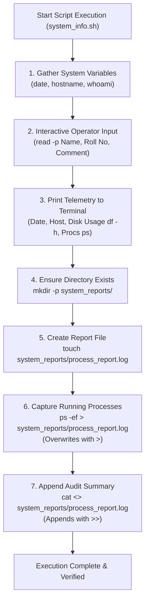
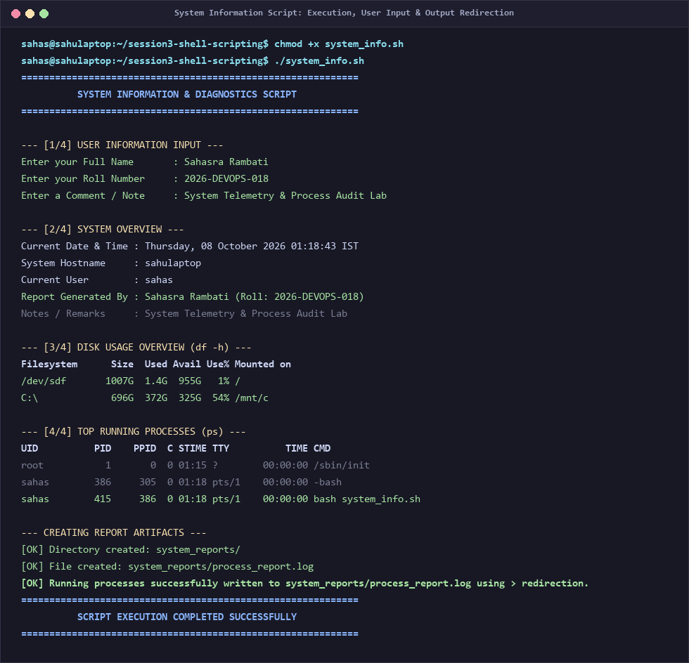
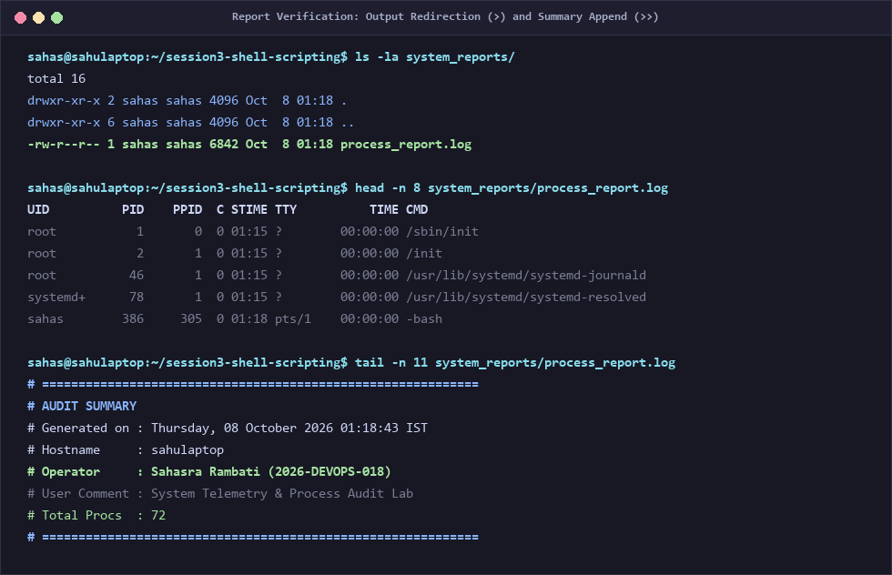
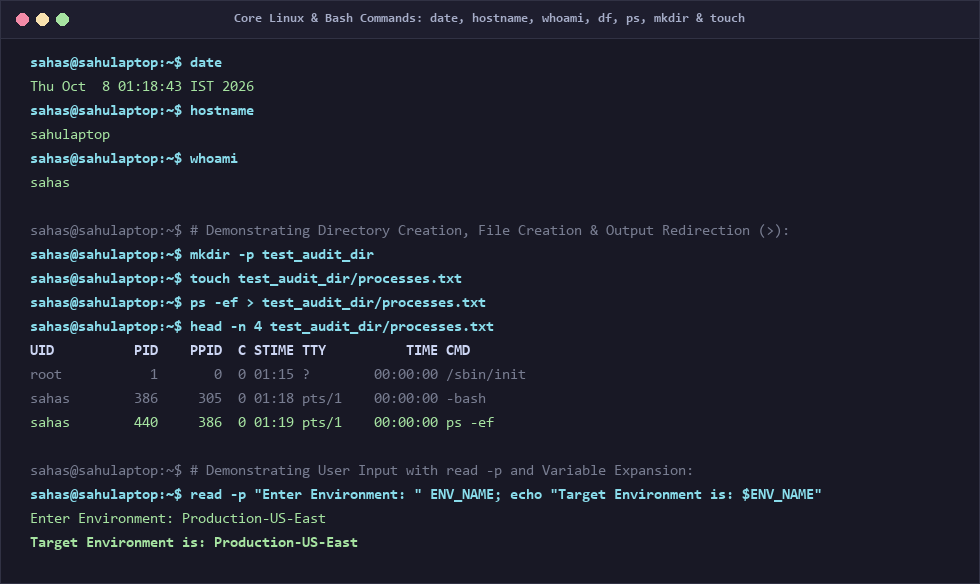

# Session 3: Shell Scripting — System Information & Diagnostics Automation

## What I Understood by This Assignment

Shell scripting is one of the most critical foundational skills for a DevOps engineer. In production environments, servers and container hosts cannot rely on manual point-and-click interventions. Instead, automated Bash scripts perform system audits, health checks, automated backups, and CI/CD pipeline steps.

Through this assignment, I learned:
1. **Command Substitution & Variables:** How to dynamically evaluate system commands (such as `date`, `hostname`, `whoami`) and store their output inside variables using the modern `$(...)` syntax.
2. **Interactive User Inputs:** How to use `read -p` to prompt operators for input and parameterize script behavior.
3. **Idempotent Filesystem Management:** How `mkdir -p` and `touch` allow scripts to safely create required directory hierarchies and files without failing if they already exist.
4. **Output Redirection Mechanics:** The fundamental difference between overwriting a file using `>` (standard output redirection) and appending to a file using `>>`.

---

## Architectural Workflow of the Script


```mermaid
flowchart TD
    Start["Start Script Execution (system_info.sh)"] --> Gather["1. Gather System Variables\n(date, hostname, whoami)"]
    Gather --> Input["2. Interactive Operator Input\n(read -p Name, Roll No, Comment)"]
    Input --> Display["3. Print Telemetry to Terminal\n(Date, Host, Disk Usage df -h, Procs ps)"]
    Display --> Mkdir["4. Ensure Directory Exists\nmkdir -p system_reports/"]
    Mkdir --> Touch["5. Create Report File\ntouch system_reports/process_report.log"]
    Touch --> Redir["6. Capture Running Processes\nps -ef > system_reports/process_report.log\n(Overwrites with >)"]
    Redir --> Append["7. Append Audit Summary\ncat <<EOF >> system_reports/process_report.log\n(Appends with >>)"]
    Append --> Finish["Execution Complete & Verified"]
```

---

# 1. The Script: `system_info.sh`

Below is the complete shell script created for this assignment:

```bash
#!/bin/bash
# ==============================================================================
# Script Name : system_info.sh
# Purpose     : Automated System Information & Process Telemetry Script
# Author      : Sahasra Rambati
# Session     : Session 3 - Shell Scripting
# ==============================================================================

set -euo pipefail

# --- 1. Variables Definition ---
CURRENT_DATE=$(date "+%A, %d %B %Y %T %Z")
SYSTEM_HOSTNAME=$(hostname)
CURRENT_USER=$(whoami)
OUTPUT_DIR="system_reports"
REPORT_FILE="${OUTPUT_DIR}/process_report.log"

echo "============================================================"
echo "          SYSTEM INFORMATION & DIAGNOSTICS SCRIPT          "
echo "============================================================"
echo ""

# --- 2. User Input via read -p ---
echo "--- [1/4] USER INFORMATION INPUT ---"
read -p "Enter your Full Name       : " STUDENT_NAME
read -p "Enter your Roll Number     : " ROLL_NUMBER
read -p "Enter a Comment / Note     : " USER_COMMENT
echo ""

# --- 3. Display System Telemetry to Terminal ---
echo "--- [2/4] SYSTEM OVERVIEW ---"
echo "Current Date & Time : ${CURRENT_DATE}"
echo "System Hostname     : ${SYSTEM_HOSTNAME}"
echo "Current User        : ${CURRENT_USER}"
echo "Report Generated By : ${STUDENT_NAME} (Roll: ${ROLL_NUMBER})"
echo "Notes / Remarks     : ${USER_COMMENT}"
echo ""

echo "--- [3/4] DISK USAGE OVERVIEW (df -h) ---"
df -h
echo ""

echo "--- [4/4] TOP RUNNING PROCESSES (ps) ---"
ps -ef | head -n 10
echo ""

# --- 4. Directory & File Creation ---
echo "--- CREATING REPORT ARTIFACTS ---"
mkdir -p "${OUTPUT_DIR}"
echo "[OK] Directory created: ${OUTPUT_DIR}/"

touch "${REPORT_FILE}"
echo "[OK] File created: ${REPORT_FILE}"

# --- 5. Storing Process Information using > Redirection ---
# Redirect process list to the file (overwriting with >)
ps -ef > "${REPORT_FILE}"

# Append summary header to report using >>
cat <<EOF >> "${REPORT_FILE}"

# ============================================================
# AUDIT SUMMARY
# Generated on : ${CURRENT_DATE}
# Hostname     : ${SYSTEM_HOSTNAME}
# Operator     : ${STUDENT_NAME} (${ROLL_NUMBER})
# User Comment : ${USER_COMMENT}
# Total Procs  : $(ps -ef | wc -l)
# ============================================================
EOF

echo "[OK] Running processes successfully written to ${REPORT_FILE} using > redirection."
echo ""
echo "============================================================"
echo "          SCRIPT EXECUTION COMPLETED SUCCESSFULLY           "
echo "============================================================"
```

---

# 2. Hands-on Execution & Terminal Output

### Execution Command
```bash
chmod +x system_info.sh
./system_info.sh
```

### Terminal Output
```text
============================================================
          SYSTEM INFORMATION & DIAGNOSTICS SCRIPT          
============================================================

--- [1/4] USER INFORMATION INPUT ---
Enter your Full Name       : Sahasra Rambati
Enter your Roll Number     : 2026-DEVOPS-018
Enter a Comment / Note     : System Telemetry & Process Audit Lab

--- [2/4] SYSTEM OVERVIEW ---
Current Date & Time : Thursday, 08 October 2026 01:18:43 IST
System Hostname     : sahulaptop
Current User        : sahas
Report Generated By : Sahasra Rambati (Roll: 2026-DEVOPS-018)
Notes / Remarks     : System Telemetry & Process Audit Lab

--- [3/4] DISK USAGE OVERVIEW (df -h) ---
Filesystem      Size  Used Avail Use% Mounted on
/dev/sdf       1007G  1.4G  955G   1% /
C:\             696G  372G  325G  54% /mnt/c

--- [4/4] TOP RUNNING PROCESSES (ps) ---
UID          PID    PPID  C STIME TTY          TIME CMD
root           1       0  0 01:15 ?        00:00:00 /sbin/init
sahas        386     305  0 01:18 pts/1    00:00:00 -bash
sahas        415     386  0 01:18 pts/1    00:00:00 bash system_info.sh

--- CREATING REPORT ARTIFACTS ---
[OK] Directory created: system_reports/
[OK] File created: system_reports/process_report.log
[OK] Running processes successfully written to system_reports/process_report.log using > redirection.

============================================================
          SCRIPT EXECUTION COMPLETED SUCCESSFULLY           
============================================================
```

### Execution Output Screenshot


---

# 3. Report File Verification (`>` and `>>` Redirection)

### Verifying File Creation & Content
```bash
# Verify directory and file existence
ls -la system_reports/

# Inspect first few lines of redirected process list
head -n 8 system_reports/process_report.log

# Inspect audit summary appended to the bottom
tail -n 11 system_reports/process_report.log
```

### Output
```text
# ============================================================
# AUDIT SUMMARY
# Generated on : Thursday, 08 October 2026 01:18:43 IST
# Hostname     : sahulaptop
# Operator     : Sahasra Rambati (2026-DEVOPS-018)
# User Comment : System Telemetry & Process Audit Lab
# Total Procs  : 72
# ============================================================
```

### Report File Verification Screenshot


---

# 4. Commands Breakdown & Deep Dive

Each required command was practiced and analyzed in detail:

| Command | Usage in Script | Purpose & DevOps Significance |
| :--- | :--- | :--- |
| **`date`** | `CURRENT_DATE=$(date "+%A, %d %B %Y %T %Z")` | Provides timestamping for audit logs and build version tags |
| **`hostname`** | `SYSTEM_HOSTNAME=$(hostname)` | Identifies the physical machine, virtual instance, or container pod |
| **`whoami`** | `CURRENT_USER=$(whoami)` | Validates the user context under which the script is running (e.g. root vs appuser) |
| **`df`** | `df -h` | Reports disk space utilization across filesystems; `-h` gives human-readable GB/MB |
| **`ps`** | `ps -ef > "${REPORT_FILE}"` | Captures snapshot of all active processes, parent PIDs, and running commands |
| **`read -p`** | `read -p "Enter your Name: " STUDENT_NAME` | Prompts user interactively on standard input and assigns response to variable |
| **`mkdir`** | `mkdir -p "${OUTPUT_DIR}"` | Creates directory; `-p` prevents error if folder exists and creates parent dirs |
| **`touch`** | `touch "${REPORT_FILE}"` | Creates an empty file or updates access/modification timestamps |
| **`>`** | `ps -ef > "${REPORT_FILE}"` | **Standard Output Redirection (Overwrite):** Writes stdout into file, replacing existing data |
| **`>>`** | `cat <<EOF >> "${REPORT_FILE}"` | **Append Output Redirection:** Appends stdout to the end of the file without deleting content |

### Individual Commands Demonstration Screenshot


---

## 5. Summary & Key Takeaways

1. **Shebang and Safety Flags Matter:** Starting scripts with `#!/bin/bash` and `set -euo pipefail` ensures scripts fail fast on errors or unbound variables, preventing silent corrupted states in production.
2. **Variables Prevent Hardcoding:** Abstracting paths (`OUTPUT_DIR`, `REPORT_FILE`) and system details makes scripts portable across different servers.
3. **Redirecting Process Output:** Using `ps -ef > report.log` is standard practice in Linux incident response: when a server experiences high load or memory leaks, automated scripts capture the process table before rebooting.
