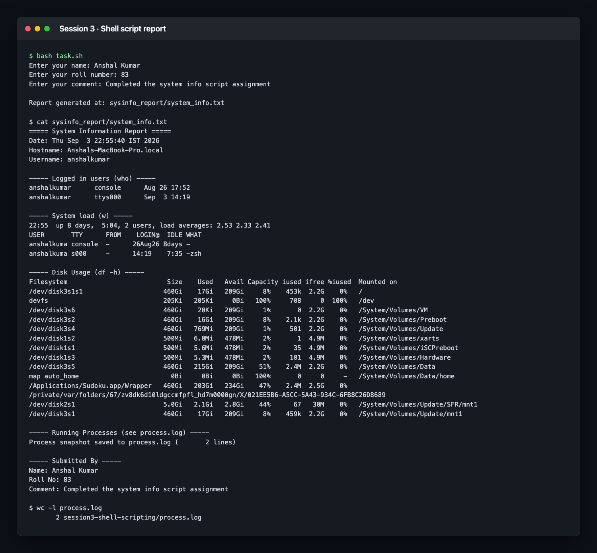

# Session 3 - Shell Scripting

For this assignment I wrote [`task.sh`](task.sh), a small system-information script. It uses the commands required in the homework: variables, `read -p`, `mkdir`, `touch`, `echo`, `df`, `ps`, and `>` redirection.

## What the script does

The script creates `sysinfo_report/`, writes the main report to `system_info.txt`, and saves the process list separately in `process.log`. I kept the process list separate because it can be much longer than the rest of the report.

It records:

- current date, hostname, and username
- logged-in users and system load
- disk usage
- a snapshot of running processes
- name, roll number, and comment entered by the user

## Running it

```bash
bash task.sh
```

This is part of my actual test run:

```text
Enter your name: Anshal Kumar
Enter your roll number: 83
Enter your comment: Completed the system info script assignment

Report generated at: sysinfo_report/system_info.txt
===== System Information Report =====
Date: Thu Sep  3 22:55:40 IST 2026
Hostname: Anshals-MacBook-Pro.local
Username: anshalkumar

----- Disk Usage (df -h) -----
Filesystem       Size   Used  Avail Capacity  Mounted on
/dev/disk3s1s1  460Gi   17Gi  209Gi     8%   /

----- Running Processes (see process.log) -----
Process snapshot saved to process.log

----- Submitted By -----
Name: Anshal Kumar
Roll No: 83
Comment: Completed the system info script assignment
```

The process file was created using output redirection:

```bash
ps > sysinfo_report/process.log
```

I also kept my smaller practice scripts in this folder: [`condition.sh`](condition.sh), [`variable.sh`](variable.sh), [`input.sh`](input.sh), [`function.sh`](function.sh), and the loop examples.

## Proof of the run

This screenshot shows the details I entered and the report created by the script. It also confirms that the process output was written to a separate file.


