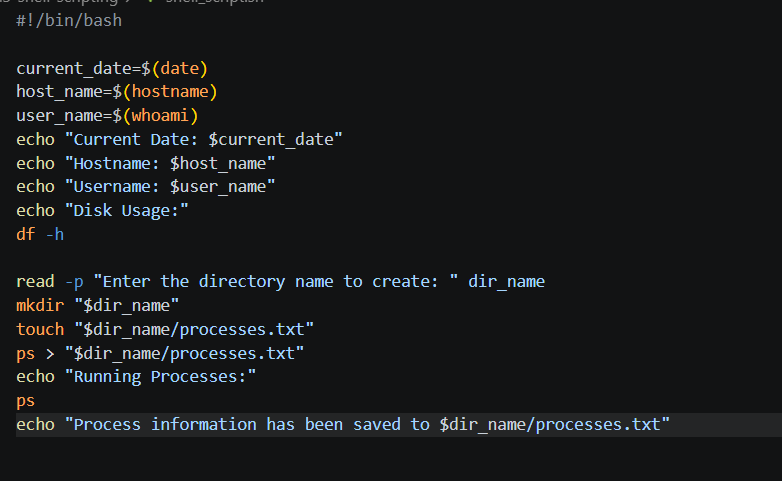
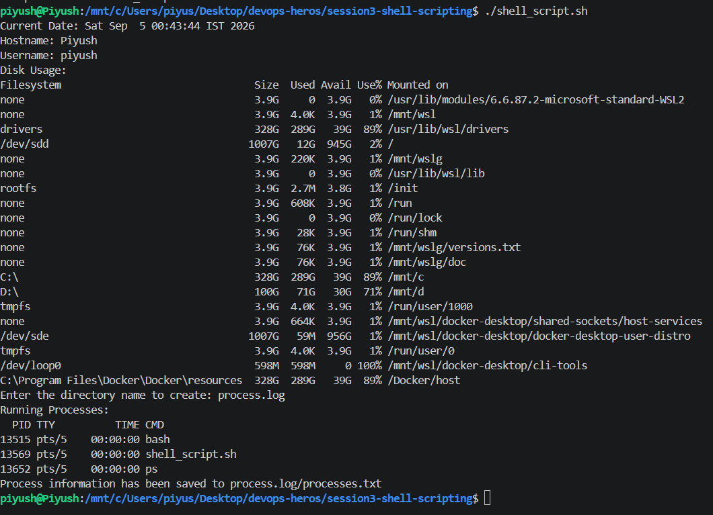

## Name - Piyush Kumar Mahato
## Roll no- 10233

#!/bin/bash

current_date=$(date)
host_name=$(hostname)
user_name=$(whoami)
echo "Current Date: $current_date"
echo "Hostname: $host_name"
echo "Username: $user_name"
echo "Disk Usage:"
df -h

read -p "Enter the directory name to create: " dir_name
mkdir "$dir_name"
touch "$dir_name/processes.txt"
ps > "$dir_name/processes.txt"
echo "Running Processes:"
ps
echo "Process information has been saved to $dir_name/processes.txt"

