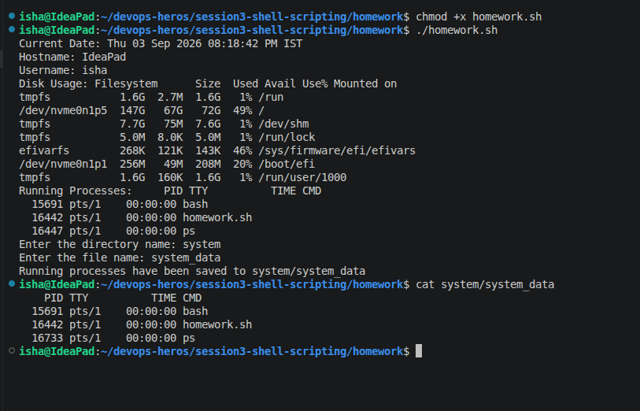

# Shell Script Homework

This script collects system information, asks for a directory and file name, creates them, and saves the current running processes into the new file.

## Commands used in the script

```bash
#!/bin/bash

# Store information in variables
current_date=$(date)
hostname=$(hostname)
username=$(whoami)
disk_usage=$(df -h)
processes=$(ps)

# Print the information
echo "Current Date: $current_date"
echo "Hostname: $hostname"
echo "Username: $username"
echo "Disk Usage: $disk_usage"
echo "Running Processes: $processes"

# Take user input
read -p "Enter the directory name: " directory
read -p "Enter the file name: " filename

# Create directory
mkdir -p "$directory"

# Create file inside the directory
touch "$directory/$filename"

# Store running processes in the file using > redirection
ps > "$directory/$filename"

echo "Running processes have been saved to $directory/$filename"
```

## How to run it

```bash
chmod +x homework.sh
./homework.sh
```

## Example

When prompted:

```bash
Enter the directory name: myfolder
Enter the file name: process.txt
```

The script will create:

```bash
myfolder/process.txt
```

and save the current running processes into that file.

## Useful commands explained

```bash
date        # Shows the current date and time
hostname    # Shows the machine hostname
whoami      # Shows the current logged-in user
df -h       # Displays disk usage in a human-readable format
ps          # Shows running processes
mkdir -p    # Creates a directory if it does not exist
read -p     # Reads user input with a prompt
touch       # Creates a file if it does not exist
ps > file   # Redirects process output into a file
```

