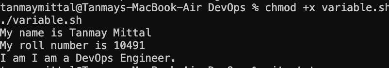
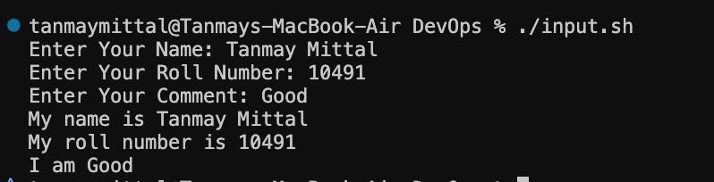
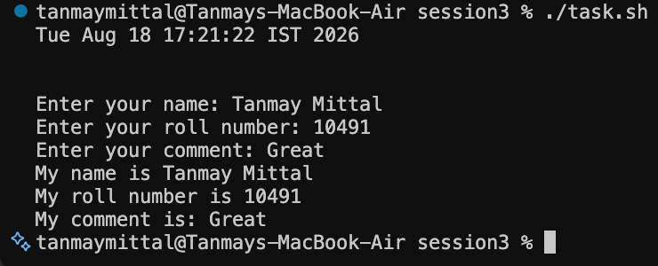
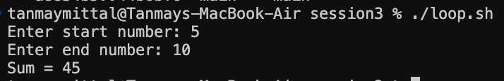
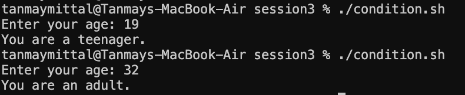
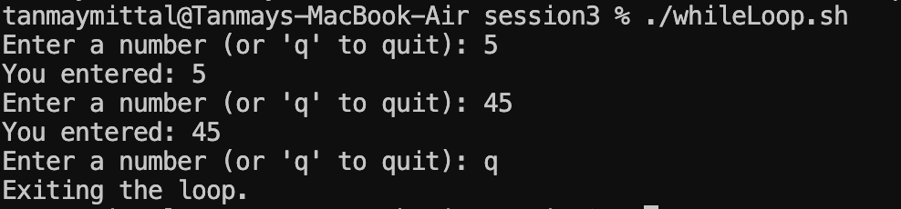

# Session 3 — Shell Scripting

This session covers the fundamentals of **Shell Scripting** through practical scripts involving variables, user input, command substitution, loops, conditions, file creation, and process management.

---

## 1. Variables — `variable.sh`

This script demonstrates how to:

* Declare and assign variables.
* Store strings and numbers.
* Access variable values using `$variable`.
* Print variable values using `echo`.

### Code

```bash
name="Tanmay Mittal"

roll_no=10491

comment="I am a DevOps Engineer."

echo "My name is $name"

echo "My roll number is $roll_no"

echo "I am $comment"
````

### Output



---

## 2. User Input — `input.sh`

This script demonstrates how to take input from the user using the `read` command.

It takes the user's:

* Name
* Roll number
* Comment

and then prints the entered values.

### Code

```bash
read -p "Enter Your Name: " name

read -p "Enter Your Roll Number: " roll_no

read -p "Enter Your Comment: " comment

echo "My name is $name"

echo "My roll number is $roll_no"

echo "My comment is $comment"
```

### Output



---

## 3. Command Substitution & Process Information — `task.sh`

This script demonstrates:

* Command substitution using `$()`.
* Getting the current date.
* Accessing system information.
* Listing running processes using `ps`.
* Redirecting process information into a file.
* Taking user input.

### Code

```bash
current_date=$(date)

echo $current_date

echo $hostname

echo $whoami

ps > process.log

read -p "Enter your name: " name

read -p "Enter your roll number: " roll_no

read -p "Enter your comment: " comment

echo "My name is $name"

echo "My roll number is $roll_no"

echo "My comment is: $comment"
```

### Output



### Process Log

The `ps > process.log` command redirects the currently running process information into `process.log`.

---

## 4. Loops & Addition — `loop.sh`

This script demonstrates a `for` loop that takes a **start number** and an **end number** from the user and calculates their sum.

### Code

```bash
read -p "Enter start number: " start

read -p "Enter end number: " end

sum=0

for ((i=start; i<=end; i++))
do
    sum=$((sum + i))
done

echo "Sum = $sum"
```

### Example

For input:

```text
Enter start number: 1
Enter end number: 5
```

The script calculates:

```text
1 + 2 + 3 + 4 + 5 = 15
```

### Output



### Concept

The loop iterates from the user-provided `start` value to the `end` value. During every iteration, the current value of `i` is added to `sum`.

---

## 5. Conditional Statements — `condition.sh`

This script demonstrates conditional logic using `if`, `elif`, and `else`.

It takes the user's age and categorizes it as:

* Invalid age
* Child
* Teenager
* Adult

### Code

```bash
read -p "Enter your age: " age

if [ $age -lt 0 ]; then

    echo "Invalid age. Please enter a valid age."

elif [ $age -lt 13 ]; then

    echo "You are a child."

elif [ $age -lt 20 ]; then

    echo "You are a teenager."

else

    echo "You are an adult."

fi
```

### Output



---

## 6. While Loop & Input Validation — `whileloop.sh`

This script demonstrates a `while` loop that continuously takes input from the user until the user enters `q`.

It also validates the input and only accepts numbers.

### Code

```bash
while true; do
    read -p "Enter a number (or 'q' to quit): " input

    if [[ $input == "q" ]]; then
        echo "Exiting the loop."
        break

    elif ! [[ $input =~ ^[0-9]+$ ]]; then
        echo "Invalid input. Please enter a valid number."
        continue
    fi

    echo "You entered: $input"
done
```

### Output



### Concept

* `while true` creates an infinite loop.
* `read` takes input from the user.
* `if` checks whether the user entered `q`.
* `break` exits the loop.
* `^[0-9]+$` validates that the input contains only digits.
* `continue` skips the current iteration when invalid input is entered.
* Valid numbers are printed using `echo`.

---

---

## 7. Shell Scripting Homework

### Objective

The homework was to create a shell script that demonstrates variables, user
input, system information, file creation, directory creation, and output
redirection.

The script performs the following tasks:

- Prints the current date
- Prints the hostname
- Prints the current username
- Displays disk usage
- Displays running processes
- Takes user input using `read -p`
- Creates a directory
- Creates a file inside the directory
- Stores process information in the file

### Script

```bash
#!/bin/bash

read -p "Enter your name: " name
read -p "Enter your roll number: " roll_no

current_date=$(date)
hostname_name=$(hostname)
username=$(whoami)

echo "Name: $name"
echo "Roll Number: $roll_no"
echo "Current Date: $current_date"
echo "Hostname: $hostname_name"
echo "Username: $username"

echo "Disk Usage:"
df -h

mkdir -p system_info
touch system_info/processes.txt

ps > system_info/processes.txt

echo "Running processes have been stored in system_info/processes.txt"

echo "Process information:"
cat system_info/processes.txt
```

### Commands Used

| Command / Concept | Purpose |
|---|---|
| `read -p` | Takes input from the user |
| Variables | Store and reuse values |
| `date` | Displays the current date and time |
| `hostname` | Displays the system hostname |
| `whoami` | Displays the current username |
| `df -h` | Displays disk usage in human-readable format |
| `mkdir` | Creates the directory |
| `touch` | Creates the output file |
| `ps` | Displays running processes |
| `>` | Redirects process output into a file |
| `echo` | Displays text and variable values |

### Output

The script was executed in the Linux environment and the generated process
information was stored in:

```text
system_info/processes.txt
```

### Result

The script successfully demonstrates the required Linux commands and shell
scripting concepts including variables, user input, command substitution,
directory and file creation, disk usage, process information, and output
redirection.

---

## Commands & Concepts Used

| Command / Concept  | Purpose                                    |
| ------------------ | ------------------------------------------ |
| `echo`             | Prints text or variable values             |
| `read`             | Takes input from the user                  |
| `$variable`        | Accesses a variable's value                |
| `$(command)`       | Command substitution                       |
| `date`             | Displays the current date and time         |
| `ps`               | Displays running processes                 |
| `>`                | Redirects output and overwrites a file     |
| `chmod +x`         | Gives execute permission to a script       |
| `./script.sh`      | Executes a shell script                    |
| `for`              | Creates a loop                             |
| `while`            | Repeats commands while a condition is true |
| `if / elif / else` | Conditional execution                      |
| `break`            | Exits a loop                               |
| `continue`         | Skips the current loop iteration           |
| `mkdir`            | Creates a directory                        |
| `touch`            | Creates an empty file                      |

---

## Running the Scripts

Give execute permission before running a script:

```bash
chmod +x script.sh
```

Then execute it:

```bash
./script.sh
```

For example:

```bash
chmod +x loop.sh
./loop.sh
```

---

## Directory Structure

```text
session3/

├── data1/

├── images/
│   ├── AddLoop.png
│   ├── condition.png
│   ├── input.png
│   ├── task.png
│   ├── variable.png
│   └── whileloop.png

├── condition.sh
├── data.sh
├── input.sh
├── loop.sh
├── process.log
├── Readme.md
├── task.sh
├── variable.sh
└── whileloop.sh
```
