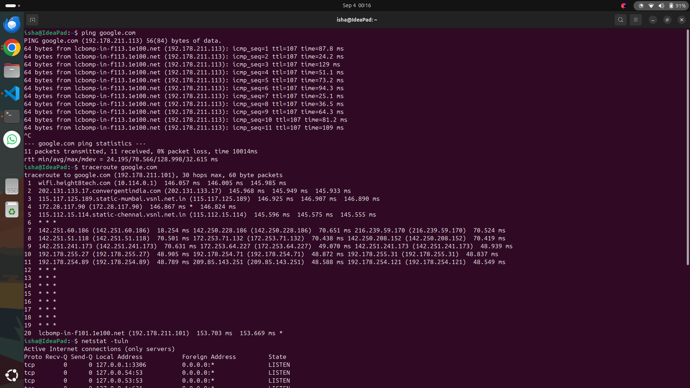
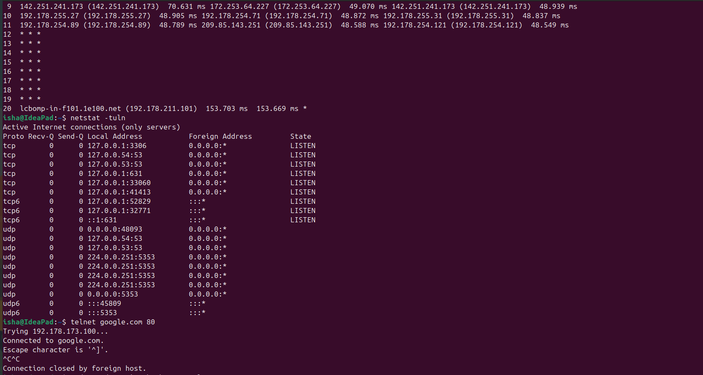
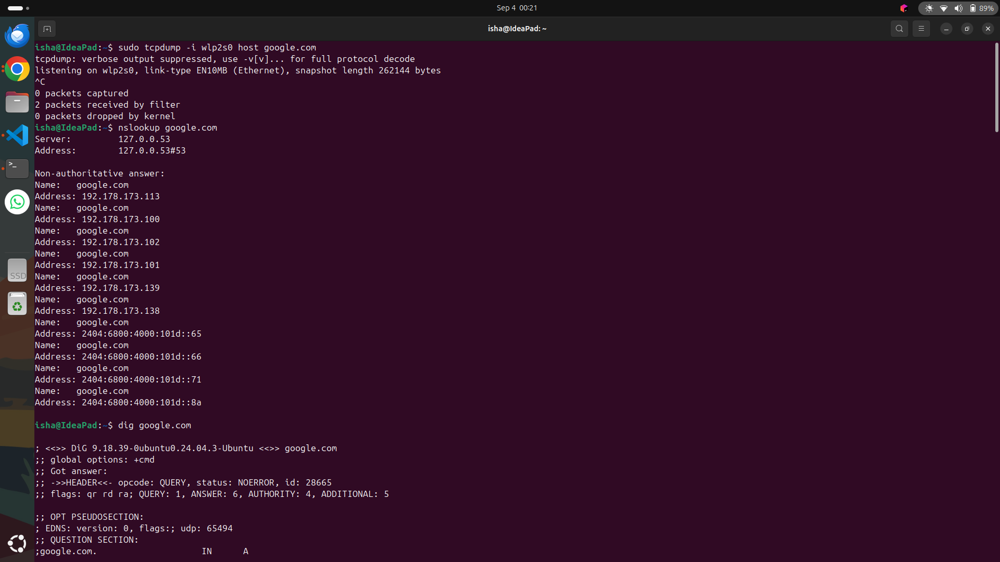
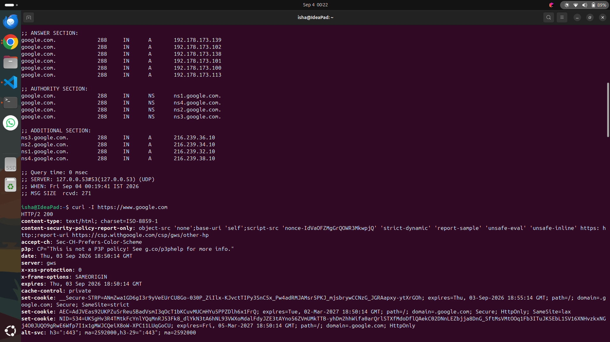
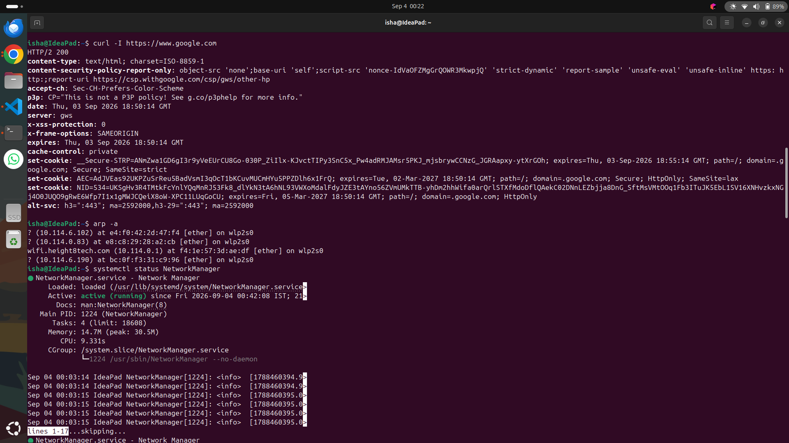

### 1. ping

I understood that `ping` is used to check whether my system can reach `google.com`. It sends small packets to the destination and waits for a reply. From the reply, I can also see the response time, which gives an idea about the network latency.

### 2. traceroute

I understood that `traceroute` shows the path taken by packets from my computer to `google.com`. It displays the different network devices or hops the packet passes through. This can help identify where a connection is becoming slow or failing.

### 3. netstat

I understood that `netstat -tuln` is used to see the network ports that are currently open or listening on my computer. It helps me understand which ports are being used by local services and can also help identify unexpected open ports.

### 4. telnet

I understood that `telnet` can be used to test whether I can establish a connection to a particular port on a server. For example, `telnet google.com 80` checks whether port 80 on Google can be reached. It is useful for checking basic TCP connectivity to a specific service.

### 5. tcpdump

I understood that `tcpdump` is used to capture and inspect network packets going through my computer's network interface. It helps me see whether packets are actually being sent and received. In my case, `eth0` did not exist on my system, so I would need to find the correct interface first or use `-i any`.

### 6. nslookup

I understood that `nslookup` is used to check DNS resolution. It takes a domain name such as `google.com` and shows the IP address returned by the DNS server. This helps determine whether the problem is related to DNS.

### 7. dig

I understood that `dig` is another DNS troubleshooting command, but it provides more detailed information than `nslookup`. It shows information such as the DNS answer, record type, TTL, and other details about the DNS query.

### 8. curl

I understood that `curl` can be used to test whether I can actually communicate with a website using HTTP or HTTPS. With `curl -I`, I can check the response headers without downloading the complete webpage. A successful response such as `HTTP/2 200` means the web server responded successfully.

### 9. arp

I understood that `arp` is used to view the mapping between IP addresses and MAC addresses on the local network. It is mainly useful for checking communication between my computer and devices on the same local network. The example showing `google.com` in the ARP table is simplified; normally, ARP is used for local-network devices rather than Google's remote server.

### 10. systemctl

I understood that `systemctl` is used to manage and check services running on a Linux system. In this case, `systemctl status NetworkManager` lets me check whether the NetworkManager service is running properly. If the service has failed, it could affect the system's network configuration.
