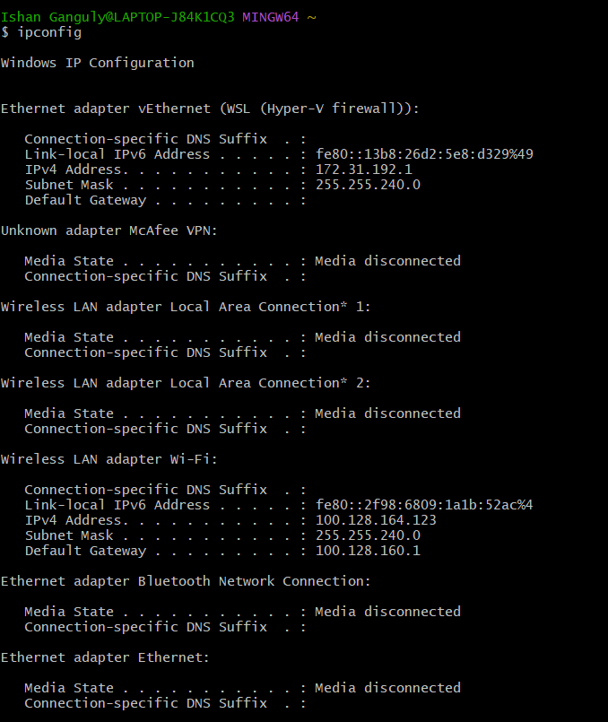
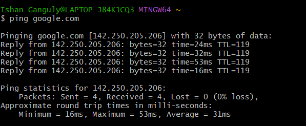
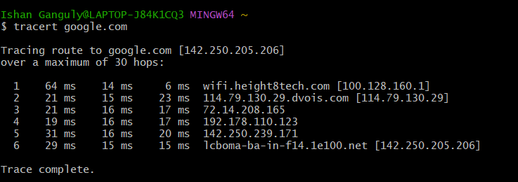
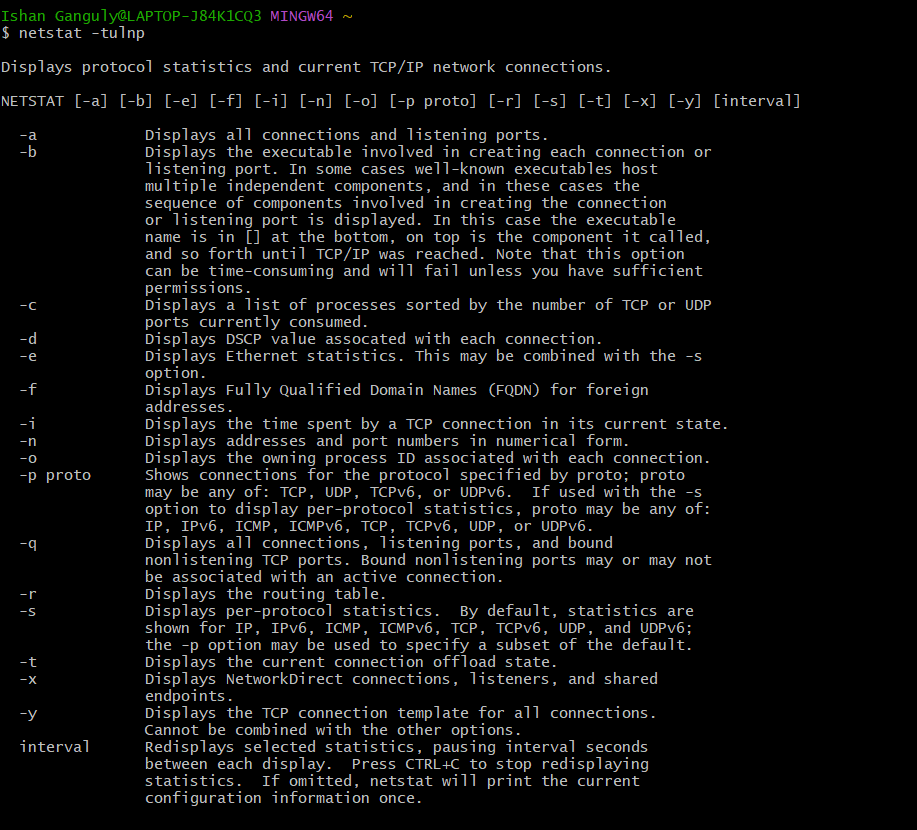
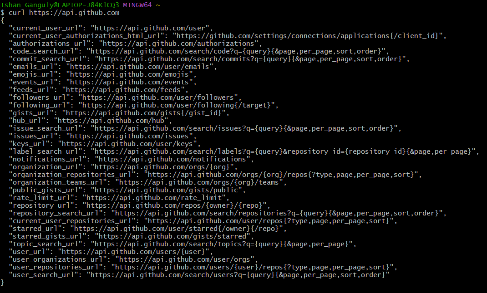
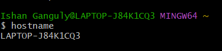
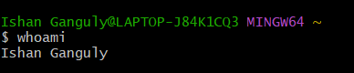
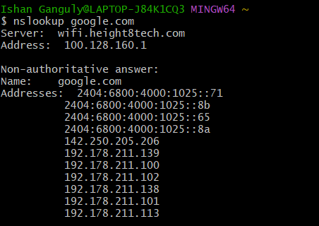

# Networking Homework Tasks

## Task 1

- Practice commands and repo shared in devops-hero GitHub repo.

## Task 2

- Create an empty Markdown (`.md`) file.
- Execute the networking commands and add the output/screenshots to the file.
- Add a short explanation of what you understood about each command.

# SOLUTION:

### `ipconfig`
Used to display the IP addresses and network interfaces of the system.

### `ping`
Used to check connectivity between the system and another host. It also shows the response time.

### `traceroute`
Used to find the route taken by packets from the source system to the destination host by showing the intermediate hops.

### `netstat`
Used to display network connections, listening ports, and network statistics.

### `curl`
Used to communicate with a URL and fetch data from a web server or API.

### `hostname`
Prints the machine's name on the network.

### `whoami`
Prints the effective username of whoever is running the shell.

### `nslookup`
Resolves a name to its IP addresses.