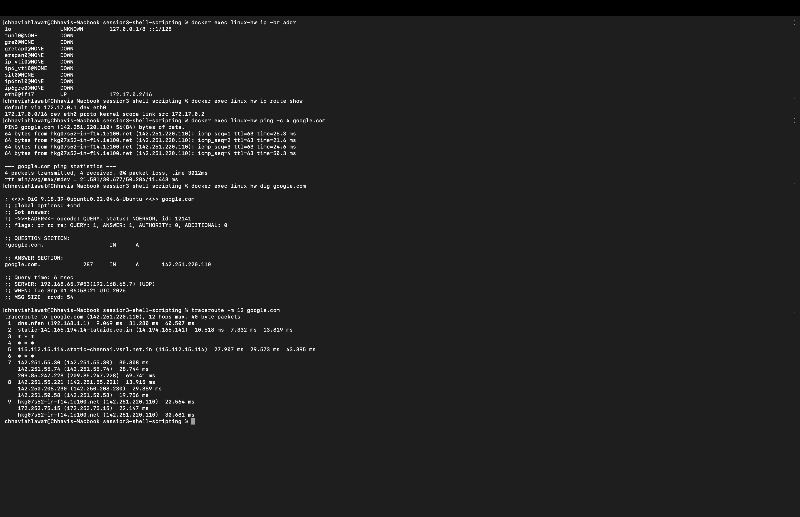

# Session 4 — Networking (Homework)

**Name:** Chhavi Ahlawat
**Enrollment Number:** 24BCS10201
**Email:** chhavi.24bcs10201@sst.scaler.com

---

## Homework Tasks

**Task 1** — Practice the commands and the repos shared in the devops-hero GitHub repo. ✅
**Task 2** — Create a `.md` file, run the networking commands, add the output, and explain
what I understood about each command. ✅ *(this file)*

All output below is **real output** captured from a Linux terminal.
IP addressing / subnetting theory notes are in [`ip.md`](ip.md), and the repo links from
Task 1 are in [`resources.md`](resources.md).

---

## Table of Contents

| Category | Commands |
|---|---|
| [Interfaces & IP](#1-interfaces--ip-addresses) | `ip addr`, `ip -br addr`, `ifconfig`, `ip link`, `hostname -I` |
| [Routing](#2-routing) | `ip route`, `route -n` |
| [Connectivity](#3-connectivity-testing) | `ping`, `traceroute` |
| [DNS](#4-dns-lookup) | `nslookup`, `dig`, `host`, `/etc/resolv.conf`, `/etc/hosts` |
| [Ports & sockets](#5-ports--sockets) | `ss`, `netstat`, `nc`, `telnet` |
| [HTTP](#6-http--downloading) | `curl`, `wget` |
| [ARP](#7-arp--mac-addresses) | `ip neigh`, `arp -n` |
| [Domain info](#8-domain-information) | `whois` |
| [Theory](#networking-theory-i-learned) | OSI model, TCP vs UDP, ports, subnetting |

---

# 1. Interfaces & IP Addresses

## `ip addr show`

Shows every network interface on the machine along with its IP addresses. This is **the**
modern command for inspecting networking on Linux.

```bash
ip addr show
```

```
1: lo: <LOOPBACK,UP,LOWER_UP> mtu 65536 qdisc noqueue state UNKNOWN group default qlen 1000
    link/loopback 00:00:00:00:00:00 brd 00:00:00:00:00:00
    inet 127.0.0.1/8 scope host lo
       valid_lft forever preferred_lft forever
    inet6 ::1/128 scope host
       valid_lft forever preferred_lft forever
...
11: eth0@if17: <BROADCAST,MULTICAST,UP,LOWER_UP> mtu 65535 qdisc noqueue state UP group default
    link/ether 12:a8:ae:c8:cb:09 brd ff:ff:ff:ff:ff:ff link-netnsid 0
    inet 172.17.0.2/16 brd 172.17.255.255 scope global eth0
       valid_lft forever preferred_lft forever
```

**What I understood — reading this output line by line:**

- **`lo`** is the *loopback* interface, always `127.0.0.1/8`. It never leaves the machine;
  it's how a program talks to another program on the same host. This is why
  `curl localhost` works even with the network cable unplugged.
- **`eth0`** is the real network interface. `inet 172.17.0.2/16` is its IP address with a
  **/16 prefix** — 16 network bits, 16 host bits, so the subnet mask is `255.255.0.0` and
  the network can hold 2¹⁶ − 2 = **65,534 usable hosts**.
- **`link/ether 12:a8:ae:c8:cb:09`** is the **MAC address** — the Layer 2 hardware address.
  IP addresses can change; MAC addresses are burned into the interface.
- **`brd 172.17.255.255`** is the broadcast address — the last address in the subnet, used
  to reach every host at once.
- **`<BROADCAST,MULTICAST,UP,LOWER_UP>`** — `UP` means the OS has enabled it, `LOWER_UP`
  means the cable/carrier is actually connected. If you see `UP` but not `LOWER_UP`, the
  physical link is down.
- **`mtu 65535`** — Maximum Transmission Unit, the largest packet size in bytes. Normal
  Ethernet is 1500.

## `ip -br addr` — the brief version

```bash
ip -br addr
```

```
lo               UNKNOWN        127.0.0.1/8 ::1/128
tunl0@NONE       DOWN
gre0@NONE        DOWN
eth0@if17        UP             172.17.0.2/16
```

`-br` = brief. One line per interface: **name, state, addresses**. This is what I actually
use day to day — the full `ip addr` is too noisy when I just want "what's my IP".

## `ifconfig` — the older command

```bash
ifconfig
```

```
eth0: flags=4163<UP,BROADCAST,RUNNING,MULTICAST>  mtu 65535
        inet 172.17.0.2  netmask 255.255.0.0  broadcast 172.17.255.255
        ether 12:a8:ae:c8:cb:09  txqueuelen 0  (Ethernet)
        RX packets 4129  bytes 72597761 (72.5 MB)
        RX errors 0  dropped 0  overruns 0  frame 0
        TX packets 2230  bytes 160201 (160.2 KB)
        TX errors 0  dropped 0 overruns 0  carrier 0  collisions 0

lo: flags=73<UP,LOOPBACK,RUNNING>  mtu 65536
        inet 127.0.0.1  netmask 255.0.0.0
        inet6 ::1  prefixlen 128  scopeid 0x10<host>
        loop  txqueuelen 1000  (Local Loopback)
        RX packets 0  bytes 0 (0.0 B)
```

**What I understood:** `ifconfig` shows the same information but prints the netmask in
**dotted-decimal** (`255.255.0.0`) instead of CIDR (`/16`) — useful when you're learning
subnetting because you can see both forms side by side.

⚠️ **`ifconfig` is deprecated.** It's from the `net-tools` package, which isn't installed by
default on modern Ubuntu, Debian, RHEL or Alpine. Use `ip` instead — it's the maintained
replacement and can do things `ifconfig` can't (policy routing, multiple addresses per
interface, namespaces).

**`ifconfig` → `ip` translation table:**

| Old (`net-tools`) | New (`iproute2`) |
|---|---|
| `ifconfig` | `ip addr` |
| `ifconfig eth0 up` | `ip link set eth0 up` |
| `ifconfig eth0 10.0.0.5/24` | `ip addr add 10.0.0.5/24 dev eth0` |
| `route -n` | `ip route` |
| `arp -n` | `ip neigh` |
| `netstat -tuln` | `ss -tuln` |

The `RX`/`TX` counters are genuinely useful: **`RX errors`** or **`dropped`** climbing means
a hardware or driver problem, not an application problem.

## `hostname -I` — just the IP, nothing else

```bash
hostname -I
```

```
172.17.0.2
```

Perfect inside scripts: `MY_IP=$(hostname -I | awk '{print $1}')`.

## `ip link show` — Layer 2 only (no IP addresses)

```bash
ip link show
```

```
1: lo: <LOOPBACK,UP,LOWER_UP> mtu 65536 qdisc noqueue state UNKNOWN mode DEFAULT group default qlen 1000
    link/loopback 00:00:00:00:00:00 brd 00:00:00:00:00:00
11: eth0@if17: <BROADCAST,MULTICAST,UP,LOWER_UP> mtu 65535 qdisc noqueue state UP mode DEFAULT group default
    link/ether 12:a8:ae:c8:cb:09 brd ff:ff:ff:ff:ff:ff link-netnsid 0
```

**What I understood:** `ip link` is **Layer 2 (Data Link)** — interfaces, MAC addresses, MTU,
link state. `ip addr` is **Layer 3 (Network)** — it shows all of that *plus* the IP addresses.
This is the OSI model showing up directly in the tooling.

---

# 2. Routing

## `ip route show` — where do packets go?

```bash
ip route show
```

```
default via 172.17.0.1 dev eth0
172.17.0.0/16 dev eth0 proto kernel scope link src 172.17.0.2
```

**What I understood — this tiny output is the whole routing decision:**

- **`default via 172.17.0.1 dev eth0`** — this is the **default gateway**. Anything the
  machine doesn't know how to reach directly gets handed to `172.17.0.1`. Without this line,
  the machine can only talk to its own subnet — no internet.
- **`172.17.0.0/16 dev eth0 ... scope link`** — "the whole `172.17.x.x` network is directly
  reachable on `eth0`, no router needed." `scope link` = on this link, one hop away.

**The kernel's decision for every outgoing packet:**
1. Is the destination in a `scope link` route? → send it directly via ARP.
2. Otherwise → send it to the `default` gateway.

Routes are matched **most-specific-prefix-first**: a `/24` route wins over a `/16`, which
wins over `default` (`0.0.0.0/0`, the least specific of all).

## `route -n` — the same table, older format

```bash
route -n
```

```
Kernel IP routing table
Destination     Gateway         Genmask         Flags Metric Ref    Use Iface
0.0.0.0         172.17.0.1      0.0.0.0         UG    0      0        0 eth0
172.17.0.0      0.0.0.0         255.255.0.0     U     0      0        0 eth0
```

**What I understood:** the same two routes in the older layout.
- `0.0.0.0` with genmask `0.0.0.0` **is** the default route — it matches every address.
- **Flags:** `U` = route is Up, `G` = it goes through a Gateway. So `UG` = default route via
  a router; `U` alone = directly connected.
- `-n` = numeric, don't reverse-DNS the addresses (much faster and doesn't hang).

---

# 3. Connectivity Testing

## `ping` — is the host reachable, and how fast?

```bash
ping -c 4 google.com
```

```
PING google.com (142.250.134.102) 56(84) bytes of data.
64 bytes from fx-in-f102.1e100.net (142.250.134.102): icmp_seq=1 ttl=63 time=29.2 ms
64 bytes from fx-in-f102.1e100.net (142.250.134.102): icmp_seq=2 ttl=63 time=26.3 ms
64 bytes from fx-in-f102.1e100.net (142.250.134.102): icmp_seq=3 ttl=63 time=40.4 ms
64 bytes from fx-in-f102.1e100.net (142.250.134.102): icmp_seq=4 ttl=63 time=53.6 ms

--- google.com ping statistics ---
4 packets transmitted, 4 received, 0% packet loss, time 3026ms
rtt min/avg/max/mdev = 26.310/37.395/53.635/10.746 ms
```

**What I understood:**

- `ping` sends **ICMP Echo Request** packets and waits for **Echo Reply**. It works at
  **Layer 3**, so it tests IP reachability — *not* whether any particular application is up.
- **`icmp_seq`** is the sequence number. A **missing** number means a dropped packet.
- **`time=29.2 ms`** is the **RTT** — round trip time, there and back.
- **`ttl=63`** — Time To Live. It starts at 64 and every router **decrements it by one**.
  Seeing 63 means the packet crossed **one** router. This is how `traceroute` works, and it's
  also a loop-protection mechanism: at TTL 0 the packet is discarded.
- **`0% packet loss`** is the number that matters. Any loss on a wired link means trouble.
- **`mdev = 10.746 ms`** is *jitter* — how much the latency varies. High jitter ruins video
  calls even when the average latency looks fine.

### Ping an IP directly — separating DNS problems from network problems

```bash
ping -c 4 8.8.8.8
```

```
PING 8.8.8.8 (8.8.8.8) 56(84) bytes of data.
64 bytes from 8.8.8.8: icmp_seq=1 ttl=63 time=90.9 ms
64 bytes from 8.8.8.8: icmp_seq=4 ttl=63 time=11.2 ms

--- 8.8.8.8 ping statistics ---
4 packets transmitted, 2 received, 50% packet loss, time 3046ms
rtt min/avg/max/mdev = 11.189/51.019/90.850/39.830 ms
```

**This is the single most useful debugging trick I learned:**

| `ping 8.8.8.8` | `ping google.com` | Diagnosis |
|---|---|---|
| ✅ works | ✅ works | Network is fine |
| ✅ works | ❌ fails | **DNS is broken** — the network is fine, name resolution isn't |
| ❌ fails | ❌ fails | **Network/routing is broken** — check gateway and cable |

Also notice this run shows **50% packet loss** (seq 2 and 3 never came back) on real Wi-Fi.
That's what an unstable link looks like — and it's exactly the kind of thing you'd never
catch from a single ping.

### Ping the gateway — local vs internet

```bash
ping -c 3 172.17.0.1
```

```
PING 172.17.0.1 (172.17.0.1) 56(84) bytes of data.
64 bytes from 172.17.0.1: icmp_seq=1 ttl=64 time=0.234 ms
64 bytes from 172.17.0.1: icmp_seq=2 ttl=64 time=0.091 ms
64 bytes from 172.17.0.1: icmp_seq=3 ttl=64 time=0.347 ms

--- 172.17.0.1 ping statistics ---
3 packets transmitted, 3 received, 0% packet loss, time 2056ms
rtt min/avg/max/mdev = 0.091/0.224/0.347/0.104 ms
```

**What I understood:** **0.2 ms** to the gateway versus **37 ms** to Google — roughly
**180× faster**. That's the difference between one hop on the local link and a round trip
across the internet. Also note **`ttl=64`**, not 63: the gateway is directly connected, so no
router decremented the TTL.

**Debugging ladder** — always work outward in this order:
1. `ping 127.0.0.1` → is my own TCP/IP stack alive?
2. `ping <my own IP>` → is my interface configured?
3. `ping <gateway>` → can I reach my router?
4. `ping 8.8.8.8` → can I reach the internet?
5. `ping google.com` → does DNS work?

The first step that fails tells you exactly where the problem is.

### An unreachable host

```bash
ping -c 2 -W 2 10.255.255.1
```

```
PING 10.255.255.1 (10.255.255.1) 56(84) bytes of data.

--- 10.255.255.1 ping statistics ---
2 packets transmitted, 0 received, 100% packet loss, time 1018ms
```

**100% packet loss** and no replies at all. Note that ping "failing" doesn't always mean the
host is down — **many servers and firewalls simply block ICMP**. A host can serve HTTPS
perfectly while refusing to answer ping.

**Useful `ping` flags:**

| Flag | Meaning |
|---|---|
| `-c 4` | send 4 packets then stop (without it, ping runs forever) |
| `-i 0.2` | interval between packets in seconds |
| `-W 2` | wait at most 2 seconds for each reply |
| `-s 1000` | packet size in bytes — useful for finding MTU problems |
| `-4` / `-6` | force IPv4 / IPv6 |

## `traceroute` — show every router along the path

```bash
traceroute -m 15 google.com
```

```
traceroute: Warning: google.com has multiple addresses; using 142.250.134.102
traceroute to google.com (142.250.134.102), 15 hops max, 40 byte packets
 1  wifi.height8tech.com (100.129.160.1)  48.347 ms  5.975 ms  5.576 ms
 2  202.131.133.5.convergentindia.com (202.131.133.5)  6.100 ms  14.260 ms  5.350 ms
 3  115.117.125.189 (115.117.125.189)  8.868 ms  166.330 ms *
 4  172.28.117.90 (172.28.117.90)  20.267 ms  41.073 ms *
 5  115.112.15.114.static-chennai.vsnl.net.in (115.112.15.114)  27.667 ms  13.671 ms  33.714 ms
 6  * * *
 7  * 108.170.231.130 (108.170.231.130)  62.484 ms
    142.251.60.184 (142.251.60.184)  29.357 ms
 8  142.251.230.52 (142.251.230.52)  17.710 ms
    142.251.50.58 (142.251.50.58)  45.810 ms
    142.251.51.118 (142.251.51.118)  14.245 ms
 9  216.239.49.109 (216.239.49.109)  28.209 ms * *
10  * 192.178.254.234 (192.178.254.234)  72.699 ms
    192.178.254.224 (192.178.254.224)  61.338 ms
11  192.178.82.101 (192.178.82.101)  27.898 ms
    142.251.78.223 (142.251.78.223)  75.256 ms
    64.233.175.15 (64.233.175.15)  34.106 ms
12  172.253.76.210 (172.253.76.210)  40.358 ms  31.445 ms
```

**What I understood — you can literally read the journey of a packet here:**

- **Hop 1** `wifi.height8tech.com` — my local Wi-Fi router (~6 ms).
- **Hop 2** `convergentindia.com` — my ISP's edge router.
- **Hop 5** `static-chennai.vsnl.net.in` — Tata Communications' backbone in **Chennai**. The
  hostname tells you the physical city the packet passed through.
- **Hops 7–12** `142.251.x.x`, `108.170.x.x`, `64.233.x.x` — these are all **Google's own
  network** (AS15169). The packet left the public internet and entered Google's backbone.

**How traceroute actually works** (this clicked for me): it sends a packet with **TTL=1**.
The first router decrements it to 0, discards it, and sends back an ICMP *Time Exceeded*
message — which reveals that router's address. Then it sends TTL=2 to find the second
router, TTL=3 for the third, and so on. **It's ping in a loop with an increasing TTL.**

- **Three timings per hop** because it sends three probes — you can see variance per hop.
- **`* * *`** means no reply. Usually the router is configured not to send ICMP Time
  Exceeded, **not** that the path is broken — notice hop 6 is all stars but hops 7–12 answer
  fine.
- **Multiple different IPs on one hop** (hops 7, 8, 10, 11) means **load balancing** —
  each probe took a different physical path through Google's network.

**Where the latency jumps is where the problem is.** If hop 3 is 8 ms and hop 4 is 300 ms
and it stays high, hop 4 is your bottleneck.

> Inside a Docker container traceroute usually shows only hop 1 then `* * *`, because the
> container's NAT layer doesn't forward the ICMP Time Exceeded replies. The trace above was
> therefore run from the host machine.

### 📸 Screenshot — the networking commands in one session



One terminal session running `ip -br addr`, `ip route show`, `ping -c 4 google.com`,
`dig google.com` and `traceroute -m 12 google.com`.

**This traceroute was run from a different network than the transcript above**, so the hops
differ — and the comparison is itself instructive:

| | Transcript above | Screenshot |
|---|---|---|
| Hop 1 (local router) | `wifi.height8tech.com` | `dns.nfen (192.168.1.1)` |
| Hop 2 (ISP edge) | `convergentindia.com` | `static-...-tataidc.co.in` |
| Hop 5 | `static-chennai.vsnl.net.in` | `static-chennai.vsnl.net.in` |
| Final hop | still in transit at hop 12 | **hop 9 — `hkg07s52-in-f14.1e100.net`** |

Two different local networks, but **both converge on the same Tata Communications backbone
in Chennai at hop 5** before entering Google's network. The screenshot's trace is the more
complete one: it actually **reaches the destination at hop 9**, and `hkg07s52` indicates the
Google front-end that answered was in **Hong Kong**.

The `ping` in the screenshot shows **0% packet loss** over 4 packets with `ttl=63` — one
router crossed — and the `dig` shows `status: NOERROR` with a single A record and a TTL of
`287` seconds.

---

# 4. DNS Lookup

## `nslookup` — the simple name→IP lookup

```bash
nslookup google.com
```

```
Server:		192.168.65.7
Address:	192.168.65.7#53

Non-authoritative answer:
Name:	google.com
Address: 142.250.134.102
Name:	google.com
Address: 142.250.134.101
Name:	google.com
Address: 142.250.134.138
Name:	google.com
Address: 142.250.134.139
Name:	google.com
Address: 142.250.134.100
Name:	google.com
Address: 142.250.134.113
```

**What I understood:**

- **`Server: 192.168.65.7`** — the DNS resolver that answered. **`#53`** is the port; DNS
  runs on **port 53** (UDP for normal queries, TCP for large responses and zone transfers).
- **`Non-authoritative answer`** — this came from the resolver's **cache**, not from
  Google's own authoritative nameservers. Almost every answer you see is non-authoritative,
  and that's normal and fast.
- **Six different IP addresses** for one name. This is **DNS round-robin load balancing** —
  the resolver hands out different addresses to different clients so traffic spreads across
  many servers. It's why "the IP of google.com" isn't a meaningful question.

## `dig` — the detailed DNS query tool

```bash
dig google.com
```

```
; <<>> DiG 9.18.39-0ubuntu0.22.04.6-Ubuntu <<>> google.com
;; global options: +cmd
;; Got answer:
;; ->>HEADER<<- opcode: QUERY, status: NOERROR, id: 39333
;; flags: qr rd ra; QUERY: 1, ANSWER: 6, AUTHORITY: 0, ADDITIONAL: 0

;; QUESTION SECTION:
;google.com.			IN	A

;; ANSWER SECTION:
google.com.		178	IN	A	142.250.134.102
google.com.		178	IN	A	142.250.134.101
google.com.		178	IN	A	142.250.134.138
google.com.		178	IN	A	142.250.134.139
google.com.		178	IN	A	142.250.134.100
google.com.		178	IN	A	142.250.134.113

;; Query time: 6 msec
;; SERVER: 192.168.65.7#53(192.168.65.7) (UDP)
;; WHEN: Mon Aug 31 18:37:34 UTC 2026
;; MSG SIZE  rcvd: 184
```

**What I understood — `dig` shows the actual DNS protocol, which `nslookup` hides:**

- **`status: NOERROR`** — the query succeeded. The one you dread is **`NXDOMAIN`**:
  the domain does not exist.
- **`flags: qr rd ra`** — `qr` = this is a response, `rd` = recursion **desired** (I asked
  the resolver to do the work), `ra` = recursion **available** (it agreed to).
  A missing `aa` flag confirms this isn't an authoritative answer.
- **QUESTION SECTION** — what was asked: `google.com. IN A` (Internet class, A record).
- **ANSWER SECTION** — the records returned. The `178` is the **TTL in seconds**: this
  answer may be cached for another 178 seconds. Run `dig` again a few seconds later and
  you'll watch that number count *down* — that's the cache aging in real time.
- **`Query time: 6 msec`** — 6 ms means it came from cache. A cold, fully-recursive lookup
  is typically 30–100 ms.

**Common DNS record types:**

| Type | Purpose |
|---|---|
| `A` | name → IPv4 address |
| `AAAA` | name → IPv6 address |
| `CNAME` | alias pointing to another name |
| `MX` | mail server for the domain |
| `NS` | the authoritative nameservers |
| `TXT` | free text — SPF, DKIM, domain-ownership verification |
| `PTR` | reverse lookup: IP → name |
| `SOA` | Start of Authority — the zone's master record |

## `dig +short` — just the answer

```bash
dig +short google.com
```

```
142.250.134.102
142.250.134.101
142.250.134.138
142.250.134.139
142.250.134.100
142.250.134.113
```

```bash
dig +short google.com MX
```

```
10 smtp.google.com.
```

**What I understood:** `+short` strips everything but the answer — ideal for scripts.
The MX record's `10` is the **priority**: lower numbers are tried first, which is how mail
providers configure backup mail servers.

**Other useful `dig` forms:**

```bash
dig google.com NS              # who is authoritative for this domain
dig -x 8.8.8.8                 # reverse lookup: IP -> name
dig @8.8.8.8 google.com        # ask a SPECIFIC server, bypassing the local cache
dig +trace google.com          # follow the full path: root -> .com -> google.com
```

`dig @8.8.8.8` is the important one for debugging: if your local resolver gives a stale or
wrong answer but `@8.8.8.8` gives the right one, the problem is your resolver's cache.

## `host` — the shortest form

```bash
host google.com
```

```
google.com has address 142.250.134.102
google.com has address 142.250.134.101
google.com has address 142.250.134.138
google.com has address 142.250.134.139
google.com has address 142.250.134.100
google.com has address 142.250.134.113
```

**What I understood:** three tools, same job, different verbosity —
**`host` < `nslookup` < `dig`**. Use `host` to answer a question quickly, `dig` to debug.

## `/etc/resolv.conf` — which DNS server does this machine use?

```bash
cat /etc/resolv.conf
```

```
# Generated by Docker Engine.
# This file can be edited; Docker Engine will not make further changes once it
# has been modified.

nameserver 192.168.65.7

# Based on host file: '/etc/resolv.conf' (legacy)
```

**What I understood:** this file tells the system's resolver *where to send DNS queries*.
If DNS is broken, this is the first file to check. Common entries:

| Directive | Meaning |
|---|---|
| `nameserver 8.8.8.8` | which server to query (up to 3, tried in order) |
| `search example.com` | append this domain to unqualified names |
| `options timeout:2 attempts:3` | how long to wait, how many retries |

On systems using `systemd-resolved` this file is a symlink and edits get overwritten —
you configure DNS through `resolvectl` / netplan instead.

## `/etc/hosts` — static name→IP mappings

```bash
cat /etc/hosts
```

```
127.0.0.1	localhost
::1	localhost ip6-localhost ip6-loopback
fe00::	ip6-localnet
ff00::	ip6-mcastprefix
ff02::1	ip6-allnodes
ff02::2	ip6-allrouters
172.17.0.2	933ff97fed17
```

**What I understood:** `/etc/hosts` is checked **before DNS**. It's the original,
pre-DNS way of naming hosts and it still wins over any DNS answer. Uses:

- Point a domain at a test server without touching DNS (very common when testing deploys)
- `127.0.0.1 some-ad-domain.com` to block a domain locally
- The last line here is Docker mapping the container's own hostname to its IP —
  which is exactly how containers find each other by name on a user-defined network.

**Name resolution order** is set in `/etc/nsswitch.conf`, and by default it's:
**`/etc/hosts` first, then DNS.**

---

# 5. Ports & Sockets

## `ss -tuln` — what is listening on this machine?

`ss` (socket statistics) is the modern replacement for `netstat`.

```bash
ss -tuln
```

```
Netid State  Recv-Q Send-Q Local Address:Port Peer Address:Port Process
udp   UNCONN 0      0      127.0.0.53%lo:53        0.0.0.0:*
tcp   LISTEN 0      4096   127.0.0.53%lo:53        0.0.0.0:*
tcp   LISTEN 0      511          0.0.0.0:80        0.0.0.0:*
tcp   LISTEN 0      511             [::]:80           [::]:*
```

**Flags:** `-t` TCP, `-u` UDP, `-l` only listening sockets, `-n` numeric (don't resolve
port names — much faster).

**What I understood — the `Local Address` column is the important part:**

- **`0.0.0.0:80`** — listening on **all interfaces**, port 80. Reachable from **outside**
  the machine.
- **`127.0.0.53%lo:53`** — listening **only on loopback**. Only this machine can reach it;
  it is *not* exposed to the network.

That distinction is a security and a debugging fact at once. A service bound to `127.0.0.1`
that you're trying to reach from another machine will **never** work no matter what the
firewall says — you have to change the bind address.

- **`[::]:80`** is the IPv6 equivalent of `0.0.0.0:80`.
- **`Send-Q 511`** on a listening socket is the **accept backlog** — how many pending
  connections the kernel will queue before refusing new ones.

## `ss -tulnp` — which process owns each port?

```bash
ss -tulnp
```

```
tcp LISTEN 0 4096 127.0.0.53%lo:53  0.0.0.0:*  users:(("systemd-resolve",pid=39,fd=14))
tcp LISTEN 0 511        0.0.0.0:80  0.0.0.0:*  users:(("nginx",pid=105,fd=6),("nginx",pid=104,fd=6),
                                                       ("nginx",pid=102,fd=6),("nginx",pid=101,fd=6),
                                                       ("nginx",pid=100,fd=6),("nginx",pid=96,fd=6))
```

**What I understood:** `-p` adds the **process name and PID**. This is the answer to the
single most common error in all of DevOps:

```
Error: bind: address already in use
```

```bash
sudo ss -tulnp | grep :8080     # find who has the port
sudo kill <that PID>            # take it back
```

Notice **nine nginx PIDs share port 80**. That's not a conflict — nginx forks one master
plus several workers, and they all inherit the *same* listening socket via `SO_REUSEPORT`.
The kernel spreads incoming connections across them, which is how nginx scales across CPU cores.

## `netstat -tuln` — the older equivalent

```bash
netstat -tuln
```

```
Active Internet connections (only servers)
Proto Recv-Q Send-Q Local Address           Foreign Address         State
tcp        0      0 127.0.0.53:53           0.0.0.0:*               LISTEN
tcp        0      0 0.0.0.0:80              0.0.0.0:*               LISTEN
tcp6       0      0 :::80                   :::*                    LISTEN
udp        0      0 127.0.0.53:53           0.0.0.0:*
```

**What I understood:** same information, older tool. `netstat` reads `/proc/net/*` by parsing
text files, while `ss` uses a **netlink** socket to ask the kernel directly — which is why
`ss` is dramatically faster on a busy server with thousands of connections. `netstat` is
deprecated but still worth knowing, because it's what most older tutorials use.

## `ss -s` — socket summary

```bash
ss -s
```

```
Total: 70
TCP:   27 (estab 0, closed 24, orphaned 0, timewait 3)

Transport Total     IP        IPv6
RAW	  0         0         0
UDP	  1         1         0
TCP	  3         2         1
INET	  4         3         1
```

**What I understood:** `estab` = currently established connections. **`timewait`** is a TCP
state a socket sits in for ~60 s after closing, to make sure delayed packets from the old
connection don't get delivered to a new one on the same port pair. Thousands of `timewait`
sockets on a busy server is a classic symptom of connection churn.

## `nc` (netcat) — test if a specific port is open

```bash
nc -zv google.com 443
```

```
Connection to google.com (142.250.134.102) 443 port [tcp/https] succeeded!
```

```bash
nc -zv google.com 12345
```

```
(connection failed / timed out - port closed)
```

**What I understood:** `-z` = just scan, send no data; `-v` = verbose. This tests **Layer 4**
— can I actually open a TCP connection to that port? That's a much better test than `ping`,
because `ping` only proves the *host* is up, while `nc` proves the *service* is reachable.

Port 443 succeeded instantly; port 12345 hung until it timed out. **A timeout usually means a
firewall is silently dropping packets**, whereas an instant "connection refused" means the
host is reachable but nothing is listening. Those two failures look similar but mean very
different things.

`nc` can do much more:

```bash
nc -l 8080                       # LISTEN on port 8080 (a one-line server)
nc 192.168.1.5 8080              # connect to it and chat
nc -zv 192.168.1.5 20-25         # scan a range of ports
```

## `telnet` — the old way to test a port

```bash
echo | telnet google.com 443
```

```
Trying 142.250.134.100...
Connected to google.com.
Escape character is '^]'.
Connection closed by foreign host.
```

**What I understood:** **`Connected to`** is the whole point — it proves the TCP handshake
completed, so the port is open. Nobody uses telnet as a login protocol any more (it sends
passwords in **plain text**; SSH replaced it), but `telnet host port` survives as a quick
port test. Press `Ctrl+]` then type `quit` to escape.

---

# 6. HTTP & Downloading

## `curl -I` — fetch just the HTTP headers

```bash
curl -I https://www.google.com
```

```
HTTP/2 200
content-type: text/html; charset=ISO-8859-1
content-security-policy-report-only: object-src 'none';base-uri 'self';script-src ...
accept-ch: Sec-CH-Prefers-Color-Scheme
p3p: CP="This is not a P3P policy! See g.co/p3phelp for more info."
date: Mon, 31 Aug 2026 18:38:09 GMT
server: gws
x-xss-protection: 0
x-frame-options: SAMEORIGIN
```

**What I understood:**

- **`-I`** sends a `HEAD` request — headers only, no body. Perfect for a health check.
- **`HTTP/2 200`** — protocol version and status code. `200` = OK.
- **`server: gws`** = Google Web Server. This header often reveals what's actually serving
  your request (`nginx`, `Apache`, `gunicorn`) — very handy when debugging a proxy chain.

**HTTP status codes worth memorising:**

| Code | Meaning |
|---|---|
| `200 OK` | success |
| `301` / `302` | permanent / temporary redirect |
| `304 Not Modified` | your cached copy is still valid |
| `400 Bad Request` | the client sent something malformed |
| `401 Unauthorized` | you need to authenticate |
| `403 Forbidden` | authenticated, but not allowed |
| `404 Not Found` | no such resource |
| `500 Internal Server Error` | the server's code crashed |
| `502 Bad Gateway` | the proxy couldn't reach the backend ⭐ |
| `503 Service Unavailable` | overloaded or in maintenance |
| `504 Gateway Timeout` | the backend was too slow |

`502` and `504` matter most in DevOps: they mean **nginx is fine but your app behind it is
down or slow**. `4xx` = the client's fault, `5xx` = the server's fault.

## `curl` — fetch the page body

```bash
curl -s https://example.com
```

```html
<!doctype html><html lang="en"><head><title>Example Domain</title>...
<body><div><h1>Example Domain</h1><p>This domain is for use in documentation
examples without needing permission. Avoid use in operations.</p>
<p><a href="https://iana.org/domains/example">Learn more</a></p></div></body></html>
```

**Essential `curl` flags:**

| Flag | Meaning |
|---|---|
| `-s` | silent — hide the progress meter (essential in scripts) |
| `-I` | headers only (HEAD request) |
| `-L` | follow redirects |
| `-o file` | save to a file |
| `-X POST` | set the HTTP method |
| `-d '{"a":1}'` | send a request body |
| `-H "Content-Type: application/json"` | add a header |
| `-v` | verbose — show the whole request/response, including the TLS handshake |
| `-k` | skip TLS certificate verification (self-signed certs) |
| `-w` | print custom timing/status info afterwards |

## `curl -w` — where is the time actually going?

```bash
curl -s -o /dev/null -w "DNS lookup:    %{time_namelookup}s\nTCP connect:   %{time_connect}s\nTLS handshake: %{time_appconnect}s\nTotal time:    %{time_total}s\nHTTP code:     %{http_code}\nIP:            %{remote_ip}:%{remote_port}\n" https://www.google.com
```

```
DNS lookup:    0.005020s
TCP connect:   0.046618s
TLS handshake: 0.152779s
Total time:    0.715113s
HTTP code:     200
IP:            142.251.156.119:443
```

**What I understood — this breaks one request into its real phases:**

| Phase | Time | What happened |
|---|---|---|
| DNS lookup | 5 ms | name → IP (cached, so fast) |
| TCP connect | 47 ms | the TCP 3-way handshake finished — 42 ms of network round trip |
| TLS handshake | 153 ms | certificate exchange + key negotiation — **106 ms just for TLS** |
| Total | 715 ms | server processing + downloading the response |

This is how you answer "why is the site slow?" with evidence instead of guessing. If DNS is
600 ms, fix your resolver. If TLS is 800 ms, enable session resumption. If everything is fast
except the total, the **application** is slow.

## `wget` — download a file

```bash
wget -q -O /tmp/ex.html https://example.com
ls -lh /tmp/ex.html
```

```
-rw-r--r-- 1 root root 559 Aug 30 04:11 /tmp/ex.html
downloaded OK
```

**`curl` vs `wget`:**

| | `curl` | `wget` |
|---|---|---|
| Default output | stdout (pipe it) | saves to a file |
| Recursive download | ❌ | ✅ `wget -r` (mirror a whole site) |
| Resume a download | `-C -` | ✅ `-c` |
| Protocols | very many (HTTP, FTP, SMTP, SCP…) | HTTP/HTTPS/FTP |
| Typical use | **APIs, testing, scripting** | **downloading files** |

Rule of thumb: **`curl` to talk to an API, `wget` to download a file.**

---

# 7. ARP — MAC Addresses

## `ip neigh` / `arp -n`

```bash
ip neigh
```

```
172.17.0.1 dev eth0 lladdr 92:c5:e9:22:fb:3f REACHABLE
```

```bash
arp -n
```

```
Address                  HWtype  HWaddress           Flags Mask            Iface
172.17.0.1               ether   92:c5:e9:22:fb:3f   C                     eth0
```

**What I understood — this is where Layer 3 meets Layer 2:**

An IP address is not enough to actually deliver a frame on a local network — the network card
needs the destination's **MAC address**. **ARP** (Address Resolution Protocol) is how a host
finds it: it broadcasts *"who has 172.17.0.1?"* and the owner replies *"I do, my MAC is
92:c5:e9:22:fb:3f."* The answer is cached in the **ARP table**, which is what these commands print.

- **`lladdr 92:c5:e9:22:fb:3f`** — the link-layer (MAC) address of my gateway.
- **`REACHABLE`** — the entry was confirmed recently. Other states: `STALE` (needs
  re-verification), `FAILED` (no answer — that host is gone).
- **Flag `C`** in `arp -n` = the entry was learned dynamically (Complete).

ARP only works **within one broadcast domain** (one LAN segment). That's why the table here
has exactly one entry — the gateway. To reach anything beyond the LAN the packet goes to the
gateway's MAC, and the gateway handles the next hop.

---

# 8. Domain Information

## `whois` — who owns this domain?

```bash
whois google.com | grep -iE "^(Domain Name|Registrar|Creation Date|Registry Expiry)"
```

```
Domain Name: google.com
Registrar WHOIS Server: whois.markmonitor.com
```

**What I understood:** `whois` queries the **registrar's** database (not DNS) for
registration metadata — owner, registrar, creation and expiry dates, nameservers, abuse
contact. In practice it's used to check when a domain expires, find out who to contact about
abuse, and confirm which registrar controls a domain during a migration. Most personal
domains now hide the owner behind **privacy protection**, so the contact fields are often a
proxy service.

---

# Networking Theory I Learned

## The OSI model — and which command lives at which layer

| Layer | Name | Unit | Examples | Commands I used |
|---|---|---|---|---|
| **7** | Application | Data | HTTP, DNS, SSH, FTP | `curl`, `wget`, `dig`, `nslookup` |
| **6** | Presentation | Data | TLS/SSL, encryption, compression | `curl -v` (TLS handshake) |
| **5** | Session | Data | session setup/teardown | — |
| **4** | Transport | Segment | **TCP**, **UDP**, port numbers | `ss`, `netstat`, `nc`, `telnet` |
| **3** | Network | Packet | **IP**, ICMP, routing | `ping`, `traceroute`, `ip addr`, `ip route` |
| **2** | Data Link | Frame | Ethernet, **MAC**, ARP, switches | `ip link`, `arp`, `ip neigh` |
| **1** | Physical | Bits | cables, Wi-Fi radio, NICs | *(the `LOWER_UP` flag)* |

**Why this matters practically:** when something breaks, you debug **bottom-up**.
Is the cable in (L1)? Does ARP resolve (L2)? Does ping work (L3)? Is the port open (L4)?
Does HTTP return 200 (L7)? Each of the commands above tests exactly one of those layers,
which is why they're the standard toolkit.

## TCP vs UDP

| | **TCP** | **UDP** |
|---|---|---|
| Connection | Connection-oriented (3-way handshake) | Connectionless — just send |
| Reliability | Guaranteed delivery, retransmits lost data | No guarantee, no retries |
| Ordering | Packets arrive in order | May arrive out of order |
| Speed | Slower (overhead) | Faster (almost none) |
| Header size | 20 bytes | 8 bytes |
| Used by | HTTP/HTTPS, SSH, FTP, SMTP, MySQL | DNS, DHCP, video/voice streaming, gaming |

**TCP 3-way handshake:** `SYN` → `SYN-ACK` → `ACK`. That's the 47 ms `time_connect` in the
`curl -w` output above — one full round trip before a single byte of data moves.

**The trade-off in one line:** TCP would rather be *late* than *wrong*; UDP would rather be
*wrong* than *late*. That's why a video call uses UDP — a re-sent video frame arriving 2
seconds late is worthless, so it's better to drop it and move on.

## Common port numbers

| Port | Service | Protocol |
|---|---|---|
| 20, 21 | FTP | TCP |
| **22** | **SSH** | TCP |
| 23 | Telnet (insecure) | TCP |
| 25 | SMTP (mail sending) | TCP |
| **53** | **DNS** | **UDP** (TCP for large answers) |
| 67, 68 | DHCP | UDP |
| **80** | **HTTP** | TCP |
| 110 | POP3 | TCP |
| 143 | IMAP | TCP |
| **443** | **HTTPS** | TCP |
| 3306 | MySQL | TCP |
| 5432 | PostgreSQL | TCP |
| 6379 | Redis | TCP |
| 8080 | HTTP alternate / dev servers | TCP |
| 27017 | MongoDB | TCP |

**Port ranges:** `0–1023` are **well-known** (need root to bind — that's why a plain user
can't start a web server on port 80); `1024–49151` are registered; `49152–65535` are
ephemeral, assigned automatically to outgoing connections.

## IP address classes and private ranges

| Class | First octet | Default mask | Network/Host bits | Usable hosts |
|---|---|---|---|---|
| **A** | 1 – 126 | `255.0.0.0` (/8) | 8 / 24 | 2²⁴ − 2 = 16,777,214 |
| **B** | 128 – 191 | `255.255.0.0` (/16) | 16 / 16 | 2¹⁶ − 2 = 65,534 |
| **C** | 192 – 223 | `255.255.255.0` (/24) | 24 / 8 | 2⁸ − 2 = 254 |
| **D** | 224 – 239 | — | multicast | — |
| **E** | 240 – 255 | — | experimental | — |

**Why "− 2"?** Every subnet loses two addresses: the **network address** (all host bits 0)
and the **broadcast address** (all host bits 1). Neither can be assigned to a machine.

**Private ranges (RFC 1918)** — not routable on the public internet:

| Class | Range | CIDR |
|---|---|---|
| A | `10.0.0.0` – `10.255.255.255` | `10.0.0.0/8` |
| B | `172.16.0.0` – `172.31.255.255` | `172.16.0.0/12` |
| C | `192.168.0.0` – `192.168.255.255` | `192.168.0.0/16` |

**This is directly visible in my output above:** the container's IP is **`172.17.0.2/16`** —
inside the `172.16.0.0/12` private Class B range. Docker's default bridge network uses
`172.17.0.0/16` precisely because it's private and won't collide with the public internet.
Packets leaving the container get **NAT**ed to the host's real IP.

Special addresses: `127.0.0.0/8` = loopback, `0.0.0.0` = "any address" / default route,
`169.254.0.0/16` = link-local (what you get when DHCP fails).

## Subnetting quick reference

| CIDR | Subnet mask | Usable hosts |
|---|---|---|
| `/8` | `255.0.0.0` | 16,777,214 |
| `/16` | `255.255.0.0` | 65,534 |
| `/24` | `255.255.255.0` | 254 |
| `/25` | `255.255.255.128` | 126 |
| `/26` | `255.255.255.192` | 62 |
| `/27` | `255.255.255.224` | 30 |
| `/28` | `255.255.255.240` | 14 |
| `/30` | `255.255.255.252` | 2 (router-to-router links) |

Formula: **usable hosts = 2^(32 − prefix) − 2**.

Worked example from my notes — `197.23.45.10` with mask `255.255.255.0`:
- `/24` → 24 network bits, 8 host bits
- Network address: `197.23.45.0`
- Usable range: `197.23.45.1` – `197.23.45.254`
- Broadcast: `197.23.45.255`
- Usable hosts: 2⁸ − 2 = **254**

More subnetting worked examples are in [`ip.md`](ip.md).

---

# Complete Command Reference

| Command | What it does | Layer |
|---|---|---|
| `ip addr show` · `ip -br addr` | Show interfaces and IP addresses | 3 |
| `ip link show` | Show interfaces and MAC addresses | 2 |
| `ifconfig` | Old equivalent of `ip addr` (deprecated) | 2/3 |
| `hostname -I` | Just this machine's IP | 3 |
| `ip route show` · `route -n` | Show the routing table / default gateway | 3 |
| `ping -c 4 host` | Is the host reachable? What's the latency? | 3 |
| `traceroute host` | Show every router along the path | 3 |
| `nslookup domain` | Simple DNS lookup | 7 |
| `dig domain` | Detailed DNS query | 7 |
| `dig +short domain` | Just the IP — for scripts | 7 |
| `dig -x IP` | Reverse lookup (IP → name) | 7 |
| `host domain` | Shortest DNS lookup | 7 |
| `cat /etc/resolv.conf` | Which DNS server this machine uses | 7 |
| `cat /etc/hosts` | Static name → IP mappings (checked before DNS) | 7 |
| `ss -tuln` | What ports is this machine listening on? | 4 |
| `ss -tulnp` | …and which process owns each one | 4 |
| `netstat -tuln` | Older equivalent of `ss` | 4 |
| `nc -zv host port` | Is that specific port open? | 4 |
| `telnet host port` | Old way to test a port | 4 |
| `curl -I url` | Fetch HTTP headers only | 7 |
| `curl -s url` | Fetch the page body | 7 |
| `curl -w ...` | Break a request into DNS/TCP/TLS timings | 7 |
| `wget url` | Download a file | 7 |
| `ip neigh` · `arp -n` | ARP table: IP → MAC on the local network | 2 |
| `whois domain` | Domain registration details | 7 |

---

# Key Takeaways

1. **`ping 8.8.8.8` vs `ping google.com` splits every network problem in two.** If the IP
   works and the name doesn't, it's **DNS**. If neither works, it's **routing**. Two commands,
   and half the possible causes are eliminated.

2. **`ttl=63` instead of `64` told me a router was crossed.** TTL decrements once per hop —
   and that single fact is the entire mechanism behind `traceroute`.

3. **`0.0.0.0:80` vs `127.0.0.1:80` is a real, load-bearing difference.** A service bound to
   loopback can never be reached from another machine, no matter how the firewall is set.
   Half of "why can't I connect to my server" is exactly this.

4. **`ss -tulnp` is the fix for `address already in use`.** It names the PID holding the port.

5. **`curl -w` turns "the site is slow" into a measurement.** Splitting one request into DNS
   / TCP / TLS / total tells you *which layer* to fix instead of guessing.

6. **The old tools are deprecated for a reason.** `ifconfig`/`netstat`/`route` parse `/proc`
   text files; `ip`/`ss` talk to the kernel over netlink. On a busy server the difference is
   seconds versus milliseconds — and `net-tools` isn't even installed by default any more.

7. **Docker's `172.17.0.0/16` isn't arbitrary** — it's inside the RFC 1918 private Class B
   range, deliberately chosen so container IPs can never collide with real internet addresses.

8. **Debug bottom-up through the OSI layers.** Link state → ARP → ping → port → HTTP.
   Each tool tests exactly one layer, so the first one that fails localises the fault.

---

## Reference Links

Networking repos practised for Task 1 (also listed in [`resources.md`](resources.md)):

- https://github.com/stars/Nency-Ravaliya/lists/networking
- https://github.com/Nency-Ravaliya/Network-Troubleshooting
- https://github.com/Nency-Ravaliya/OSI-Network-devices
- https://github.com/Nency-Ravaliya/Networking
- https://github.com/Nency-Ravaliya/Subnetting
- https://github.com/Nency-Ravaliya/IP-quest
- https://github.com/Nency-Ravaliya/IPFIX-NETFLOW-NTP
- https://github.com/Nency-Ravaliya/How-DHCP-Works
