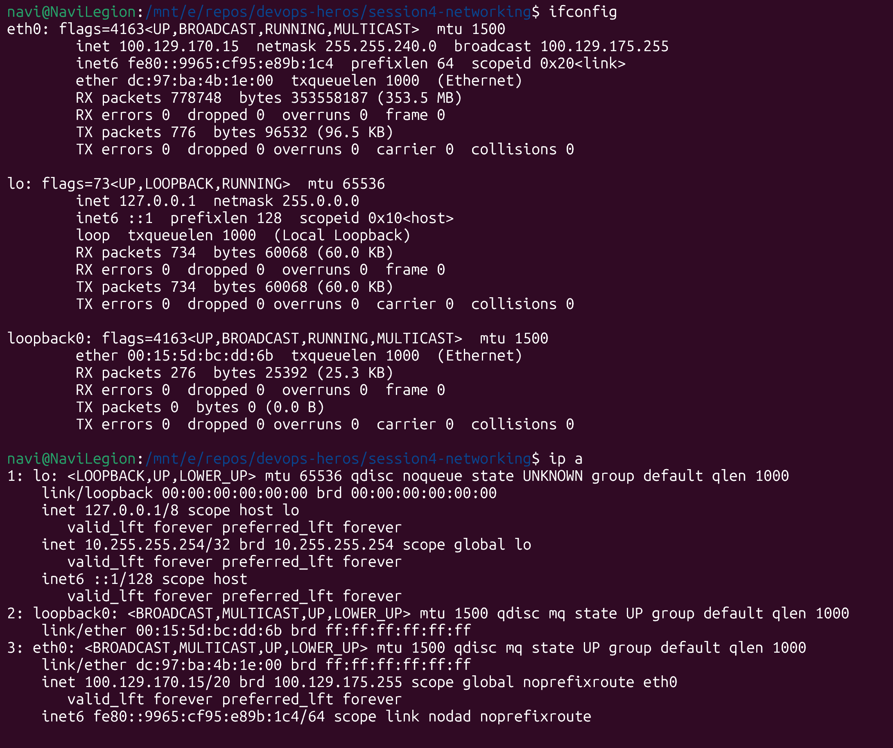
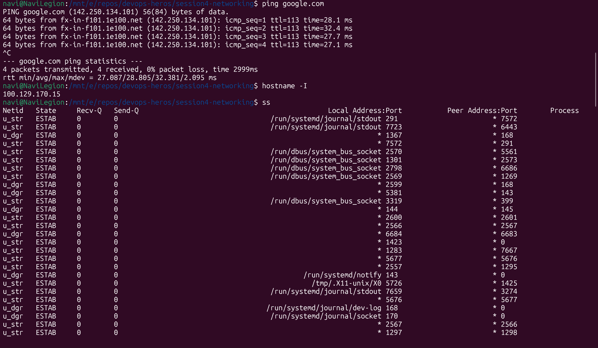
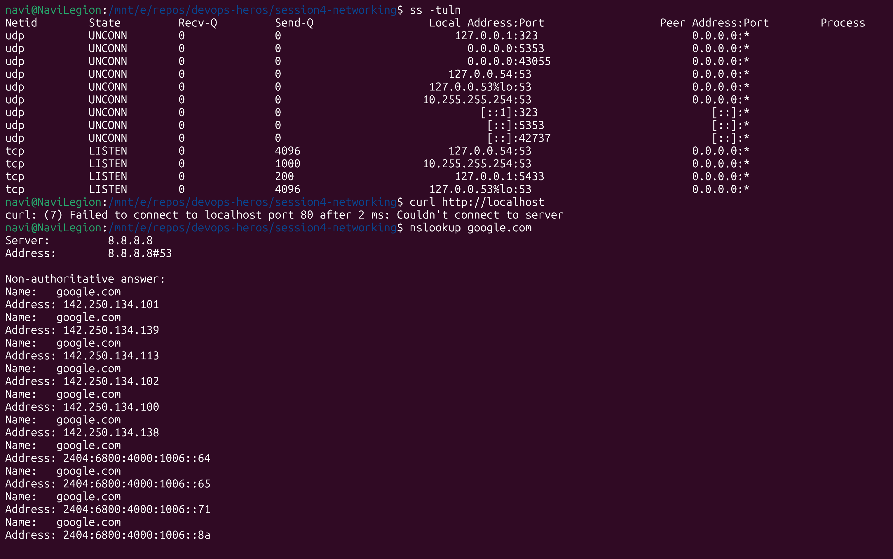
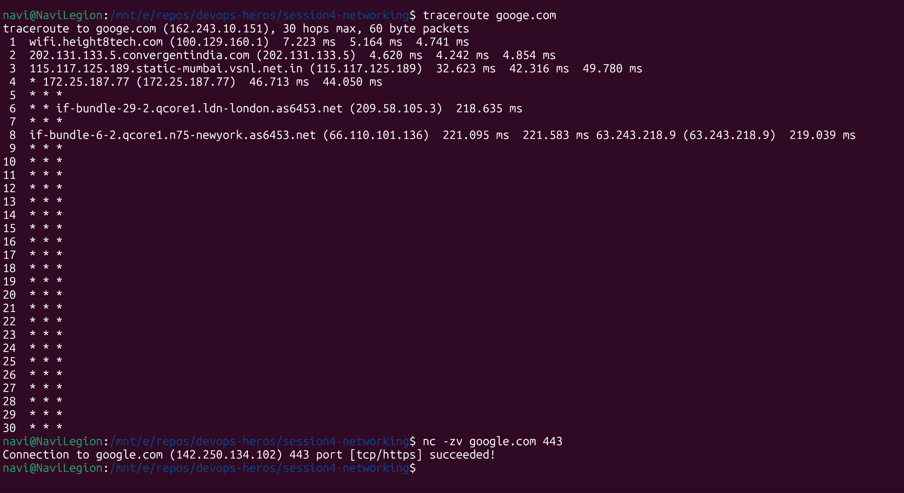

ifconfig shows all network adapters on device. ip a is the modern version

ping: pings a server with packets and gets the travel time
hostname: gets the device hostname. -I gives just the ipaddress
ss: shows status of all ports. -tuln shows just tcp and UDP ports.

curl: sends a HTTP request to that URL
nslookup: shows DNS info

traceroute: traces the network hops along the entire path from host till the mentioned server
nc: netcat - displays if a port is available