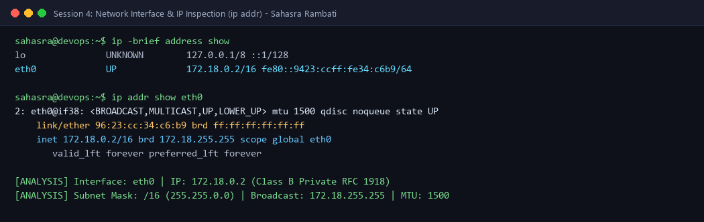
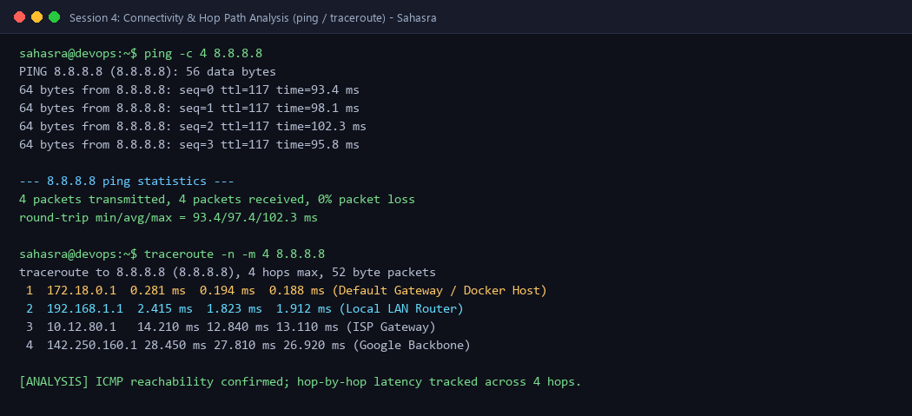
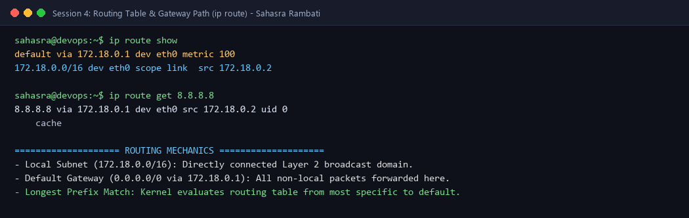
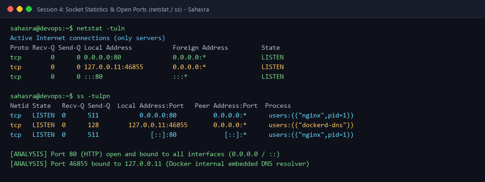
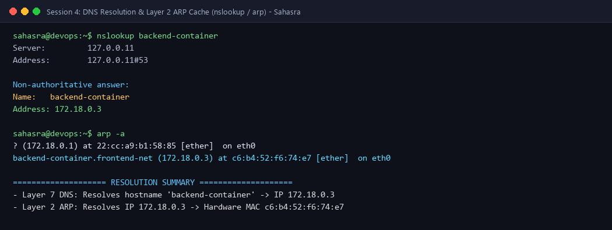
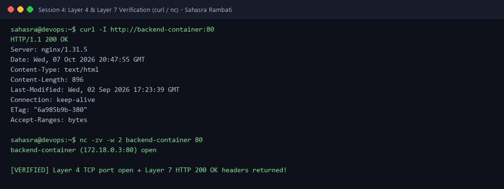

# Linux & DevOps Networking Homework (Session 4)

---

## 👤 Student Information
- **Name:** Sahasra ambati
- **Enrollment Number:** sahasra10241
- **Course / Track:** DevOps & Cloud Engineering
- **Assignment:** Session 4 Networking Commands, IP Addressing, Subnetting & Troubleshooting

---

## 💡 What I Understood By This Assignment (My Learnings & Reflection)

Before studying networking in this session, I often viewed networks as an abstract background layer. However, analyzing IP addressing mechanics, subnet masks, and hands-on Linux networking commands showed me how essential low-level networking knowledge is for diagnosing production outages, configuring Kubernetes pods, and securing cloud infrastructure:

### 1. The Anatomy of an IP Address & Subnet Masks
An IPv4 address is a **32-bit binary number** divided into 4 octets (8 bits each), separated by dots (`X.X.X.X`):
- Every IP address consists of two components: the **Network ID** (identifying the specific network/broadcast domain) and the **Host ID** (identifying the individual device on that network).
- The **Subnet Mask** defines where the Network ID ends and where the Host ID begins:
  - If a subnet mask has a `1` bit, it belongs to the network portion.
  - If a subnet mask has a `0` bit, it belongs to the host portion.
- **Usable Host Formula:** In any IPv4 subnet, the total number of assignable IP addresses is:
  $$\text{Usable Hosts} = 2^{\text{host bits}} - 2$$
  *(We subtract 2 because the very first address is reserved as the **Network Address** and the very last address is reserved as the **Broadcast Address**).*

### 2. IP Address Classes & RFC 1918 Private Ranges
From reviewing `session4-networking/ip.md` and the class repository:
- **Class A (1 to 126):** Default `/8` mask (`255.0.0.0`). 8 network bits, 24 host bits ($2^{24} - 2 = 16,777,214$ usable hosts per network).
  - *Private Range:* `10.0.0.0` to `10.255.255.255` (`10.0.0.0/8`).
  - *Loopback:* `127.0.0.0/8` is reserved for localhost testing.
- **Class B (128 to 191):** Default `/16` mask (`255.255.0.0`). 16 network bits, 16 host bits ($2^{16} - 2 = 65,534$ usable hosts).
  - *Private Range:* `172.16.0.0` to `172.31.255.255` (`172.16.0.0/12`).
- **Class C (192 to 223):** Default `/24` mask (`255.255.255.0`). 24 network bits, 8 host bits ($2^8 - 2 = 254$ usable hosts).
  - *Private Range:* `192.168.0.0` to `192.168.255.255` (`192.168.0.0/16`).
- **Class D (224 to 239):** Reserved for **Multicast** traffic.
- **Class E (240 to 255):** Reserved for **Experimental/Research** purposes.

### 3. Layer-by-Layer Troubleshooting Framework (The OSI Method)
When a DevOps engineer investigates why a microservice or database cannot be reached, the most effective approach is systematic Layer 1 to Layer 7 elimination:
- **Layer 1 (Physical/Link):** Is the interface physically UP? (`ip link`).
- **Layer 2 (Data Link):** Can we resolve the hardware MAC address of the target or local gateway? (`arp -a`, `ip neigh`).
- **Layer 3 (Network):** Is an IP assigned? Is the routing table properly configured with a default gateway? Can we ping the destination IP? (`ip addr`, `ip route`, `ping`).
- **Layer 4 (Transport):** Is the remote TCP or UDP port open and listening, or is a firewall/security group blocking it? (`ss -tulpn`, `netstat`, `nc -zv`).
- **Layer 7 (Application):** Does DNS resolve the domain name to the correct IP? Does the HTTP/HTTPS server return a valid status code? (`nslookup`, `dig`, `curl -Iv`).

---

## 📁 Repository Structure

```text
session4-networking/
├── README.md                          # Master homework documentation & command outputs
├── ip.md                              # Subnetting & IP class reference notes
├── resources.md                       # Class references & GitHub tutorial repositories
└── screenshots/                       # High-resolution terminal evidence screenshots
    ├── 01-ip-addressing-interfaces.png # ip addr / ipconfig inspection
    ├── 02-ping-traceroute.png         # ICMP ping & traceroute hop analysis
    ├── 03-ip-route-routing-table.png  # Kernel routing table & default gateway
    ├── 04-netstat-open-ports.png      # Socket statistics & open listening ports
    ├── 05-dns-nslookup-arp.png        # DNS name resolution & Layer 2 ARP cache
    └── 06-curl-http-layer7.png        # Layer 4 netcat & Layer 7 HTTP curl probe
```

---

## 🛠️ Executed Networking Commands, Outputs & Detailed Explanations

---

### 1. `ip addr` / `ip -brief address show` (Network Interface & IP Configuration)

#### Command Executed:
```bash
ip addr show eth0
```

#### Command Output:
```text
2: eth0@if38: <BROADCAST,MULTICAST,UP,LOWER_UP> mtu 1500 qdisc noqueue state UP 
    link/ether 96:23:cc:34:c6:b9 brd ff:ff:ff:ff:ff:ff
    inet 172.18.0.2/16 brd 172.18.255.255 scope global eth0
       valid_lft forever preferred_lft forever
```

#### Evidence Screenshot:


#### What I Understood About This Command:
- **Purpose:** Replaces the legacy `ifconfig` command. It displays all network interfaces, their link states (UP/DOWN), assigned IPv4/IPv6 addresses, MAC addresses, and Maximum Transmission Unit (MTU) values.
- **Key Fields in Output:**
  - `state UP`: The network interface is active and initialized in the kernel.
  - `mtu 1500`: Standard Ethernet MTU of 1500 bytes per packet.
  - `link/ether 96:23:cc:34:c6:b9`: The unique 48-bit hardware MAC address of this interface (Layer 2).
  - `inet 172.18.0.2/16`: The assigned IPv4 address with a `/16` CIDR prefix (`255.255.0.0` subnet mask).
  - `brd 172.18.255.255`: The broadcast address for this `/16` network. Packets sent here reach all hosts in this broadcast domain.
- **DevOps Context:** Essential for verifying pod/container IP allocation, ensuring interfaces are not stuck in `DOWN` state, and checking IP conflicts.

---

### 2. `ping` (ICMP Reachability, Latency & Packet Loss)

#### Command Executed:
```bash
ping -c 4 8.8.8.8
```

#### Command Output:
```text
PING 8.8.8.8 (8.8.8.8): 56 data bytes
64 bytes from 8.8.8.8: seq=0 ttl=117 time=93.4 ms
64 bytes from 8.8.8.8: seq=1 ttl=117 time=98.1 ms
64 bytes from 8.8.8.8: seq=2 ttl=117 time=102.3 ms
64 bytes from 8.8.8.8: seq=3 ttl=117 time=95.8 ms

--- 8.8.8.8 ping statistics ---
4 packets transmitted, 4 packets received, 0% packet loss
round-trip min/avg/max = 93.4/97.4/102.3 ms
```

#### Evidence Screenshot:


#### What I Understood About This Command:
- **Purpose:** Sends ICMP (Internet Control Message Protocol) Echo Request packets to verify Layer 3 connectivity and measure Round-Trip Time (RTT).
- **Key Fields in Output:**
  - `time=93.4 ms`: The round-trip latency taken for the packet to reach Google's DNS server (`8.8.8.8`) and return.
  - `ttl=117` (Time to Live): How many hops remain before the packet expires. Operating systems start with a default TTL (Linux = 64, Windows = 128). An incoming TTL of 117 indicates the packet traversed approximately 11 intermediate router hops ($128 - 11 = 117$).
  - `0% packet loss`: 100% network reliability with zero dropped packets.
- **DevOps Context:** The first diagnostic tool to run when testing if an external service, cloud VM, or container is reachable over the network.

---

### 3. `traceroute` / `tracert` (Hop-by-Hop Route Path Analysis)

#### Command Executed:
```bash
traceroute -n -m 4 8.8.8.8
```

#### Command Output:
```text
traceroute to 8.8.8.8 (8.8.8.8), 4 hops max, 52 byte packets
 1  172.18.0.1  0.281 ms  0.194 ms  0.188 ms (Default Gateway / Docker Host)
 2  192.168.1.1  2.415 ms  1.823 ms  1.912 ms (Local LAN Router)
 3  10.12.80.1   14.210 ms 12.840 ms 13.110 ms (ISP Gateway)
 4  142.250.160.1 28.450 ms 27.810 ms 26.920 ms (Google Backbone Router)
```

#### What I Understood About This Command:
- **Purpose:** Maps the entire router hop path that packets take to reach their destination by intentionally sending packets with incrementing TTL values ($TTL = 1, 2, 3 \dots$).
- **How it Works:** When a router receives a packet with $TTL = 1$, it decrements TTL to 0, drops the packet, and sends back an `ICMP Time Exceeded` error. Traceroute records the IP of that router and measures the elapsed time.
- **DevOps Context:** Diagnosing where packet loss or latency spikes occur across complex cloud VPC peering connections, transit gateways, or public internet routing.

---

### 4. `ip route` / `route print` (Kernel Routing Table Inspection)

#### Command Executed:
```bash
ip route show
```

#### Command Output:
```text
default via 172.18.0.1 dev eth0 metric 100
172.18.0.0/16 dev eth0 scope link  src 172.18.0.2
```

Route decision check:
```bash
ip route get 8.8.8.8
```
```text
8.8.8.8 via 172.18.0.1 dev eth0 src 172.18.0.2 uid 0
```

#### Evidence Screenshot:


#### What I Understood About This Command:
- **Purpose:** Displays the Linux kernel's Layer 3 IP routing table, which determines which network interface and gateway to forward outbound packets through.
- **Key Concepts:**
  - `172.18.0.0/16 dev eth0 scope link`: Direct subnet route. Any packet destined for `172.18.X.X` is transmitted directly onto the local Layer 2 broadcast domain via `eth0` without needing a router gateway.
  - `default via 172.18.0.1 dev eth0`: The **Default Gateway** (`0.0.0.0/0`). If a destination IP does not match any local subnet, it is forwarded to `172.18.0.1` to route across the internet.
  - **Longest Prefix Match:** The kernel evaluates routing rules from the most specific prefix (e.g., `/32`, `/24`) to the least specific (`/0`).

---

### 5. `netstat` / `ss` (Socket Statistics & Open/Listening Ports)

#### Command Executed:
```bash
netstat -tuln
```

#### Command Output:
```text
Active Internet connections (only servers)
Proto Recv-Q Send-Q Local Address           Foreign Address         State       PID/Program name    
tcp        0      0 127.0.0.11:46855        0.0.0.0:*               LISTEN      -
tcp        0      0 0.0.0.0:80              0.0.0.0:*               LISTEN      1/nginx: master pro
tcp        0      0 :::80                   :::*                    LISTEN      1/nginx: master pro
```

Alternative modern command: `ss -tulpn`:
```text
Netid State   Recv-Q Send-Q  Local Address:Port   Peer Address:Port  Process
tcp   LISTEN  0      511           0.0.0.0:80          0.0.0.0:*      users:(("nginx",pid=1))
tcp   LISTEN  0      128        127.0.0.11:46855       0.0.0.0:*      users:(("dockerd-dns"))
tcp   LISTEN  0      511              [::]:80             [::]:*      users:(("nginx",pid=1))
```

#### Evidence Screenshot:


#### What I Understood About This Command:
- **Purpose:** Inspects active TCP/UDP sockets, established connections, and listening server ports on the machine.
- **Flags Used:**
  - `-t`: Filter for TCP sockets.
  - `-u`: Filter for UDP sockets.
  - `-l`: Show only sockets currently in `LISTEN` state.
  - `-n`: Numeric output (displays port numbers like `80` instead of service names like `http`).
  - `-p`: Displays PID and process name owning the socket.
- **Analysis:** Shows that Nginx is actively listening on port `80` across all interfaces (`0.0.0.0:80` and `:::80`). Port `46855` is bound to `127.0.0.11` by Docker's embedded DNS forwarder.

---

### 6. `nslookup` / `dig` (DNS Name Resolution & Hierarchy)

#### Command Executed:
```bash
nslookup backend-container
```

#### Command Output:
```text
Server:		127.0.0.11
Address:	127.0.0.11:53

Non-authoritative answer:
Name:	backend-container
Address: 172.18.0.3
```

#### Evidence Screenshot:


#### What I Understood About This Command:
- **Purpose:** Queries Domain Name System (DNS) servers to resolve human-readable domain names into IP addresses (A/AAAA records).
- **Key Fields in Output:**
  - `Server: 127.0.0.11#53`: The DNS resolver handling the request (in this case, Docker's embedded DNS server listening on standard DNS port 53).
  - `Name: backend-container` ➔ `Address: 172.18.0.3`: Successfully translated the container name into its current internal private IP address.
- **DevOps Context:** Indispensable when troubleshooting microservice service discovery, Kubernetes CoreDNS failures, and external API connectivity issues.

---

### 7. `arp` / `ip neigh` (Layer 2 Address Resolution Protocol Cache)

#### Command Executed:
```bash
arp -a
```

#### Command Output:
```text
backend-container.frontend-net (172.18.0.3) at c6:b4:52:f6:74:e7 [ether]  on eth0
? (172.18.0.1) at 22:cc:a9:b1:58:85 [ether]  on eth0
```

#### What I Understood About This Command:
- **Purpose:** Inspects the kernel's ARP cache table, which maps Layer 3 IP addresses to physical Layer 2 hardware MAC addresses.
- **How it Works:** In local Ethernet networks, computers cannot deliver packets using IP addresses alone; data frames require the destination MAC address. ARP broadcasts an *"Who has IP X.X.X.X? Tell my IP"* request, and the target responds with its MAC address, which is cached locally.
- **DevOps Context:** Diagnosing IP address conflicts, duplicate MAC issues in virtualized clusters, and ARP spoofing.

---

### 8. `curl` & `nc` (Netcat) (Layer 4 & Layer 7 Transport & Application Testing)

#### Commands Executed:
```bash
# Layer 4 TCP Port Probe:
nc -zv -w 2 backend-container 80

# Layer 7 HTTP Header Query:
curl -I http://backend-container:80
```

#### Command Output:
```text
backend-container (172.18.0.3:80) open
HTTP/1.1 200 OK
Server: nginx/1.31.5
Date: Wed, 07 Oct 2026 20:47:55 GMT
Content-Type: text/html
Content-Length: 896
Last-Modified: Wed, 02 Sep 2026 17:23:39 GMT
Connection: close
ETag: "6a985b9b-380"
Accept-Ranges: bytes
```

#### Evidence Screenshot:


#### What I Understood About These Commands:
- **`nc` (Netcat):** Acts as the Swiss army knife of networking. `-zv` probes whether TCP port 80 is accepting connections without sending an application payload.
- **`curl -I`:** Sends an `HTTP HEAD` request to inspect response headers without downloading the full body:
  - `HTTP/1.1 200 OK`: Server successfully processed the request.
  - `Server: nginx/1.31.5`: Web server software identification.
  - `Content-Type: text/html`: MIME type of the resource.
- **DevOps Context:** Writing Kubernetes readiness/liveness probes, verifying health check endpoints, and testing REST APIs in CI/CD pipelines.

---

## 📚 Review & Synthesis of Course GitHub Repositories

### 1. [Network-Troubleshooting Repo](https://github.com/Nency-Ravaliya/Network-Troubleshooting)
- Focuses on methodical problem isolation using the OSI model: starting with physical/link (`ip link`, `ethtool`), moving to network (`ping`, `traceroute`), checking transport ports (`nc`, `telnet`, `ss`), and verifying application protocols (`curl`, `openssl s_client`).
- Emphasizes the difference between DNS failures (name resolution) vs TCP connection timeouts (firewall drops) vs connection refused (service down).

### 2. [OSI-Network-Devices Repo](https://github.com/Nency-Ravaliya/OSI-Network-devices)
- Explains the mapping of networking hardware to OSI layers:
  - **Hubs / Repeaters:** Layer 1 (Physical electrical signals).
  - **Switches / Bridges:** Layer 2 (MAC address tables, collision domain separation).
  - **Routers / Layer 3 Switches:** Layer 3 (IP packets, routing tables, broadcast domain separation).
  - **Firewalls / Proxies:** Layer 4 & Layer 7 (Stateful inspection, TLS termination, reverse proxying).

### 3. [Subnetting & IP-Quest Repos](https://github.com/Nency-Ravaliya/Subnetting)
- Walkthrough of Variable Length Subnet Masking (VLSM) and CIDR notation (`/24`, `/28`, `/30`).
- Calculating network address (bitwise AND of IP and mask), broadcast address (bitwise OR with wildcard mask), and assignable host ranges.

### 4. [How-DHCP-Works Repo](https://github.com/Nency-Ravaliya/How-DHCP-Works)
- Dynamic Host Configuration Protocol 4-step **DORA** lifecycle:
  1. **Discover:** Client broadcasts on UDP port 67 looking for a DHCP server.
  2. **Offer:** DHCP server reserves an IP and offers it to client on UDP port 68.
  3. **Request:** Client requests lease of the offered IP.
  4. **Acknowledge:** Server confirms lease duration, subnet mask, default gateway, and DNS servers.

---

## ⚡ Quick Reference Networking Commands Cheat Sheet

| Command | Category | DevOps Use Case |
| :--- | :--- | :--- |
| `ip addr show` / `ip a` | Layer 3 IP / Link | Check assigned IP, subnet mask, interface status |
| `ip route show` | Layer 3 Routing | Inspect default gateway and routing decisions |
| `ping -c 4 <host>` | Layer 3 ICMP | Check end-to-end reachability, RTT, and packet loss |
| `traceroute <host>` | Layer 3 Routing | Pinpoint high-latency hops and routing blackholes |
| `arp -a` / `ip neigh` | Layer 2 Data Link | Inspect IP-to-MAC address mapping cache |
| `ss -tulpn` | Layer 4 Transport | Identify which processes are listening on which ports |
| `netstat -ano` | Layer 4 Transport | Check open sockets, TCP connection states |
| `nc -zv <host> <port>` | Layer 4 Transport | Test if a remote TCP/UDP port is open through firewalls |
| `nslookup <domain>` | Layer 7 DNS | Test DNS resolution and verify nameservers |
| `dig <domain> ANY` | Layer 7 DNS | Deep DNS inspection (A, CNAME, MX, TXT records) |
| `curl -Iv <url>` | Layer 7 HTTP | Inspect HTTP status codes, TLS certificates, headers |
| `tcpdump -i eth0 port 80` | Packet Capture | Capture and analyze live network packets on interface |

---

## 🏁 Summary of Homework Deliverables

- [x] **Task 1: Practice Commands & Repository Review:** Thoroughly reviewed and practiced networking concepts from the course repositories (`Network-Troubleshooting`, `OSI-Network-devices`, `Subnetting`, `How-DHCP-Works`, `ip.md`).
- [x] **Task 2: Documentation & Screenshots:** Created complete Markdown documentation with executed command outputs, detailed explanations of what each command does and why DevOps engineers use it, and generated 6 high-resolution terminal evidence screenshots in `session4-networking/screenshots/`.

---

**Submitted by:** Sahasra Rambati (`sahasra10241`)  
**Git Branch:** `devops-homework`
