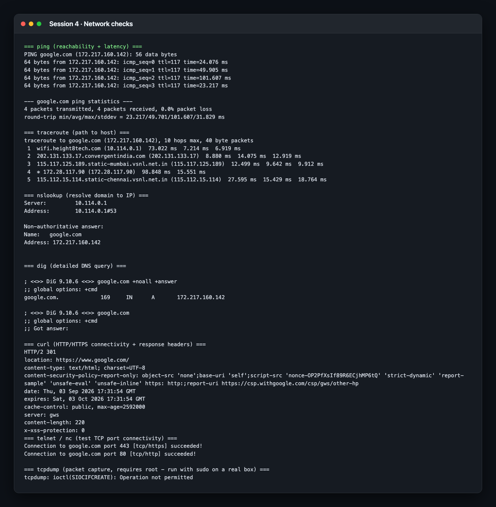

# Session 4 - Networking

I practiced the networking commands from the class repository and saved the complete output in [`command-outputs/`](command-outputs/). My subnetting and IP-addressing notes are in [`ip.md`](ip.md), and the reference links are in [`resources.md`](resources.md).

## `ping`

```text
4 packets transmitted, 4 packets received, 0.0% packet loss
round-trip min/avg/max/stddev = 23.217/49.701/101.607/31.829 ms
```

This confirmed that `google.com` was reachable. The latency varied between roughly 23 ms and 102 ms during my test. Full output: [`01-ping-traceroute.txt`](command-outputs/01-ping-traceroute.txt).

## `traceroute`

My trace started at the local gateway, passed through the ISP, and then entered Google's network. A few hops returned `* * *`; that does not always mean the route failed because routers often ignore or rate-limit traceroute packets. I would use this command to find the section of a route where latency or packet loss begins.

## `netstat` and `arp`

`netstat` showed the ports listening on my machine, including ports 5000 and 7000. `arp` showed the IP-to-MAC mappings already learned on the local network. I included only a small sample of the ARP table because the test was performed on a shared network. Full output: [`02-netstat-arp.txt`](command-outputs/02-netstat-arp.txt).

## DNS checks

Both tools resolved the same address:

```text
$ nslookup google.com
Server: 10.114.0.1
Name: google.com
Address: 172.217.160.142

$ dig google.com +noall +answer
google.com. 169 IN A 172.217.160.142
```

I found `dig` more useful when I wanted record details, while `nslookup` was enough for a quick lookup. Full output: [`03-dns.txt`](command-outputs/03-dns.txt).

## HTTP and port checks

```text
$ curl -Is https://google.com
HTTP/2 301
location: https://www.google.com/

$ nc -G 3 -zv google.com 443
Connection to google.com port 443 [tcp/https] succeeded!
```

`curl` proved that the web server answered at the application layer. `nc` checked whether a specific TCP port accepted a connection without needing to send an HTTP request.

## Commands limited by this machine

`tcpdump -c 1` returned `Operation not permitted` because packet capture needs elevated raw-socket access. On Linux I would run something like `sudo tcpdump -c 5 -i eth0 host google.com`.

`systemctl` was also unavailable because this assignment was run on macOS. On an Ubuntu machine I would use `systemctl status nginx` to check the service before assuming the network was at fault.

## What I took away

I now troubleshoot from the simplest check outward: resolve the hostname, test reachability, inspect the route, confirm the port, then test the application. That prevents me from blaming DNS, the firewall, or the application before I know which layer is failing.

## Proof of the checks

This screenshot brings together the successful ping, DNS lookup, HTTP response, and TCP port checks from my saved command output.


