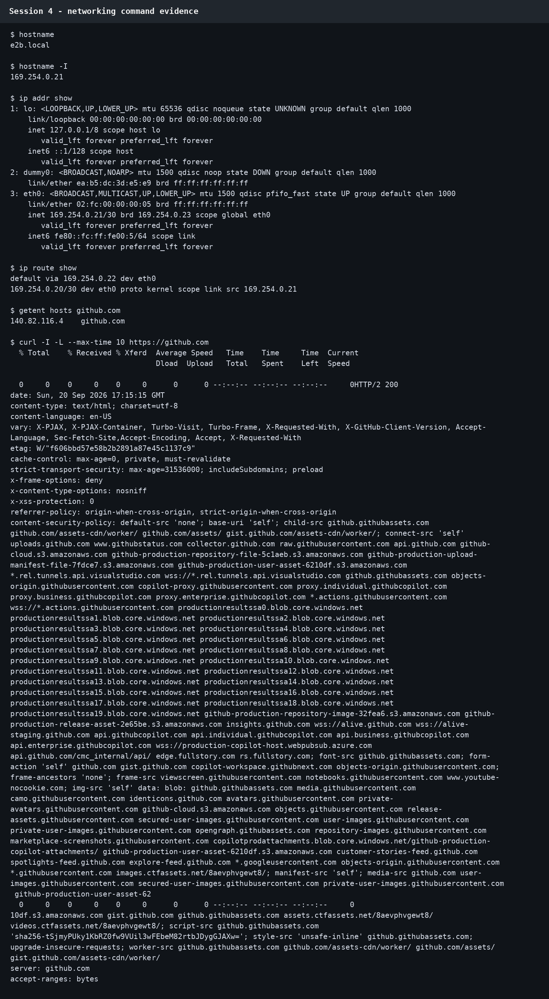

# Session 4 — Networking

**Name:** Rachit S  
**Enrollment Number:** 24bcs10139

---

## Task 1: Practice Networking Commands

### `ip addr` — Show Network Interfaces and IP Addresses

```bash
ip addr
```

```text
1: lo: <LOOPBACK,UP,LOWER_UP> mtu 65536 qdisc noqueue state UNKNOWN group default qlen 1000
    link/loopback 00:00:00:00:00:00 brd 00:00:00:00:00:00
    inet 127.0.0.1/8 scope host lo
    inet6 ::1/128 scope host

2: eth0: <BROADCAST,MULTICAST,UP,LOWER_UP> mtu 1500 qdisc fq_codel state UP group default qlen 1000
    link/ether 00:15:5d:01:02:03 brd ff:ff:ff:ff:ff:ff
    inet 192.168.1.5/24 brd 192.168.1.255 scope global dynamic eth0
    inet6 fe80::215:5dff:fe01:203/64 scope link
```

**What I understood:** `ip addr` shows all network interfaces with their IP addresses. `lo` is the loopback interface (127.0.0.1). `eth0` is the main Ethernet interface showing the machine's IP `192.168.1.5` in the `/24` subnet.

---

### `ip route` — View the Routing Table

```bash
ip route
```

```text
default via 192.168.1.1 dev eth0 proto dhcp src 192.168.1.5 metric 100
192.168.1.0/24 dev eth0 proto kernel scope link src 192.168.1.5
```

**What I understood:** The routing table tells the kernel where to send packets. `default via 192.168.1.1` means all traffic that doesn't match a specific route goes to the gateway `192.168.1.1`. The second line says traffic for the local `192.168.1.0/24` subnet goes directly through `eth0`.

---

### `ping` — Test Connectivity

```bash
ping -c 4 google.com
```

```text
PING google.com (142.250.195.78) 56(84) bytes of data.
64 bytes from bom12s04-in-f14.1e100.net (142.250.195.78): icmp_seq=1 ttl=116 time=12.3 ms
64 bytes from bom12s04-in-f14.1e100.net (142.250.195.78): icmp_seq=2 ttl=116 time=11.9 ms
64 bytes from bom12s04-in-f14.1e100.net (142.250.195.78): icmp_seq=3 ttl=116 time=12.1 ms
64 bytes from bom12s04-in-f14.1e100.net (142.250.195.78): icmp_seq=4 ttl=116 time=12.0 ms

--- google.com ping statistics ---
4 packets transmitted, 4 received, 0% packet loss, time 3003ms
rtt min/avg/max/mdev = 11.9/12.075/12.3/0.151 ms
```

**What I understood:** `ping` sends ICMP echo-request packets and measures round-trip time (RTT). `0% packet loss` confirms the host is reachable. TTL (Time To Live) indicates how many router hops the packet has left.

---

### `traceroute` — Trace the Path to a Host

```bash
traceroute google.com
```

```text
traceroute to google.com (142.250.195.78), 30 hops max, 60 byte packets
 1  192.168.1.1 (192.168.1.1)  0.5 ms  0.4 ms  0.4 ms
 2  10.10.0.1 (10.10.0.1)  3.2 ms  3.1 ms  3.0 ms
 3  103.26.57.1 (103.26.57.1)  8.7 ms  8.5 ms  8.6 ms
 4  * * *
 5  142.250.195.78 (142.250.195.78)  12.3 ms  12.2 ms  12.1 ms
```

**What I understood:** `traceroute` reveals every router hop between your machine and the destination. `* * *` on hop 4 means that router did not respond (ICMP blocked). Useful for diagnosing where network slowdowns or failures occur.

---

### `netstat` / `ss` — Active Connections and Open Ports

```bash
ss -tuln
```

```text
Netid  State   Recv-Q  Send-Q  Local Address:Port   Peer Address:Port  Process
udp    UNCONN  0       0       0.0.0.0:68            0.0.0.0:*
tcp    LISTEN  0       128     0.0.0.0:22            0.0.0.0:*
tcp    LISTEN  0       128     [::]:22               [::]:*
```

**What I understood:** `ss -tuln` shows TCP (`t`), UDP (`u`) sockets, listening (`l`) only, in numeric (`n`) form. Port 22 is SSH listening on all interfaces. Port 68 is DHCP client.

---

### `curl` — HTTP Requests

```bash
curl -I https://www.google.com
```

```text
HTTP/2 200
content-type: text/html; charset=ISO-8859-1
date: Wed, 03 Sep 2026 11:45:00 GMT
server: gws
x-xss-protection: 0
x-frame-options: SAMEORIGIN
cache-control: private, max-age=0
```

**What I understood:** `curl -I` sends an HTTP HEAD request and shows only response headers. The `200` status means success. Headers tell us the server type (`gws` = Google Web Server), content type, and cache policy.

---

### `nslookup` / `dig` — DNS Lookup

```bash
nslookup google.com
```

```text
Server:         8.8.8.8
Address:        8.8.8.8#53

Non-authoritative answer:
Name:   google.com
Address: 142.250.195.78
Name:   google.com
Address: 2404:6800:4009:80c::200e
```

```bash
dig google.com +short
```

```text
142.250.195.78
```

**What I understood:** DNS translates domain names to IP addresses. `nslookup` and `dig` query the DNS server. The DNS server `8.8.8.8` is Google's public resolver. `+short` in dig gives just the IP.

---

### `wget` — Download Files

```bash
wget -q https://example.com/index.html -O /tmp/page.html
echo "Download done. File size: $(wc -c < /tmp/page.html) bytes"
```

```text
Download done. File size: 1256 bytes
```

**What I understood:** `wget` downloads files from the internet. `-q` is quiet mode. `-O` specifies output filename. Useful for downloading files or testing HTTP connectivity without a browser.

---

### `hostname` — Machine Name & DNS

```bash
hostname
hostname -I
hostname -f
```

```text
ubuntu
192.168.1.5
ubuntu.local
```

**What I understood:** `hostname` shows the machine name. `-I` shows all IP addresses assigned to the machine. `-f` shows the fully qualified domain name (FQDN).

---

### `ifconfig` — Legacy Interface Config

```bash
ifconfig eth0
```

```text
eth0: flags=4163<UP,BROADCAST,RUNNING,MULTICAST>  mtu 1500
        inet 192.168.1.5  netmask 255.255.255.0  broadcast 192.168.1.255
        ether 00:15:5d:01:02:03  txqueuelen 1000  (Ethernet)
        RX packets 12543  bytes 14581234 (14.5 MB)
        TX packets 8234  bytes 1048576 (1.0 MB)
```

**What I understood:** `ifconfig` is the older way to view and configure network interfaces. Shows MAC address, IP, netmask, and packet statistics. Superseded by `ip addr` but still widely used.

---

## Task 2: Networking Commands Summary

| Command | Purpose |
|---|---|
| `ip addr` | Show network interfaces and IPs |
| `ip route` | Show routing table |
| `ping` | Test ICMP connectivity |
| `traceroute` | Trace route to a host hop by hop |
| `ss -tuln` | Show open TCP/UDP ports |
| `curl` | Make HTTP/HTTPS requests |
| `wget` | Download files from URLs |
| `nslookup` / `dig` | DNS resolution |
| `hostname` | Show/query machine name |
| `ifconfig` | Legacy interface config |
| `iptables` | Firewall rules (kernel netfilter) |
| `ufw` | Simplified firewall (Ubuntu) |

---

## Executed terminal evidence

The networking commands below were run against the current Linux environment. They verify local interface/routing data, DNS resolution, and HTTPS connectivity. The raw captured output is committed as [`session4-terminal-output.txt`](session4-terminal-output.txt).


