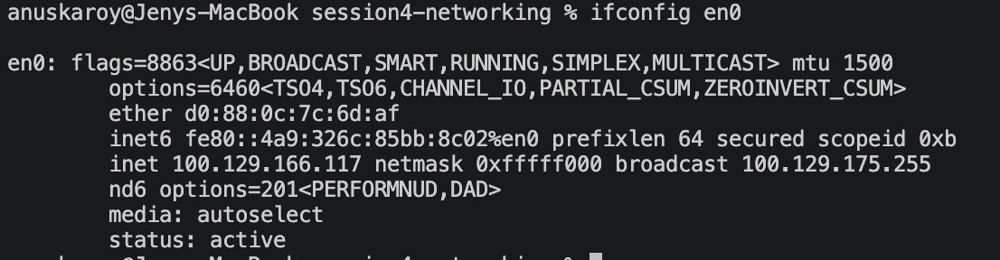
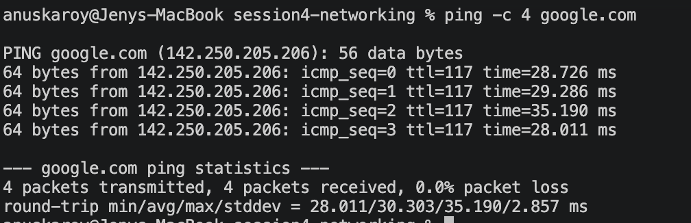
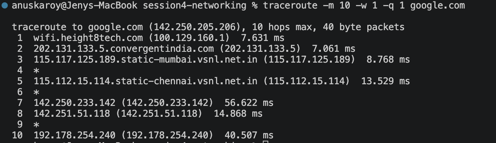
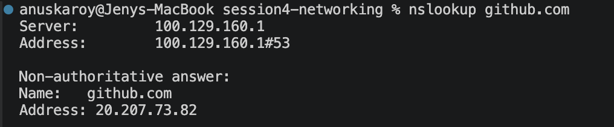
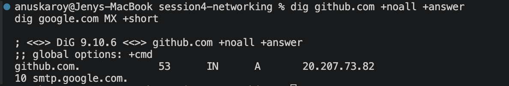
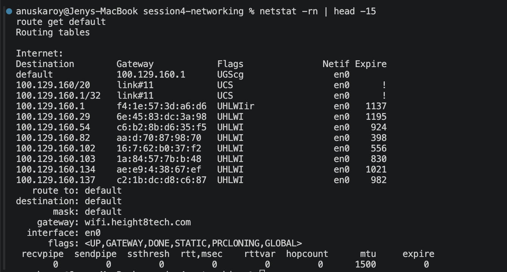
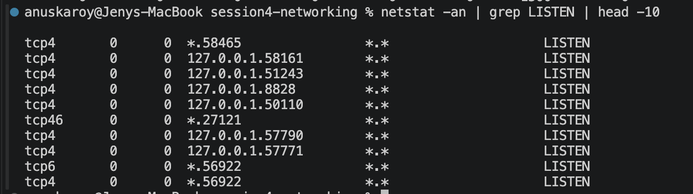
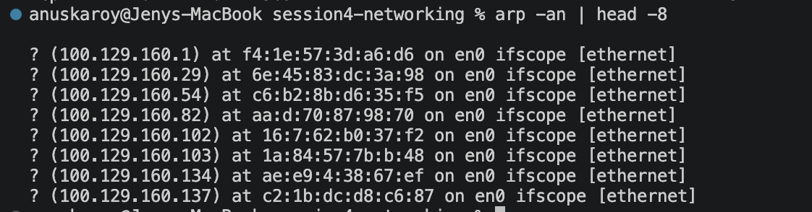
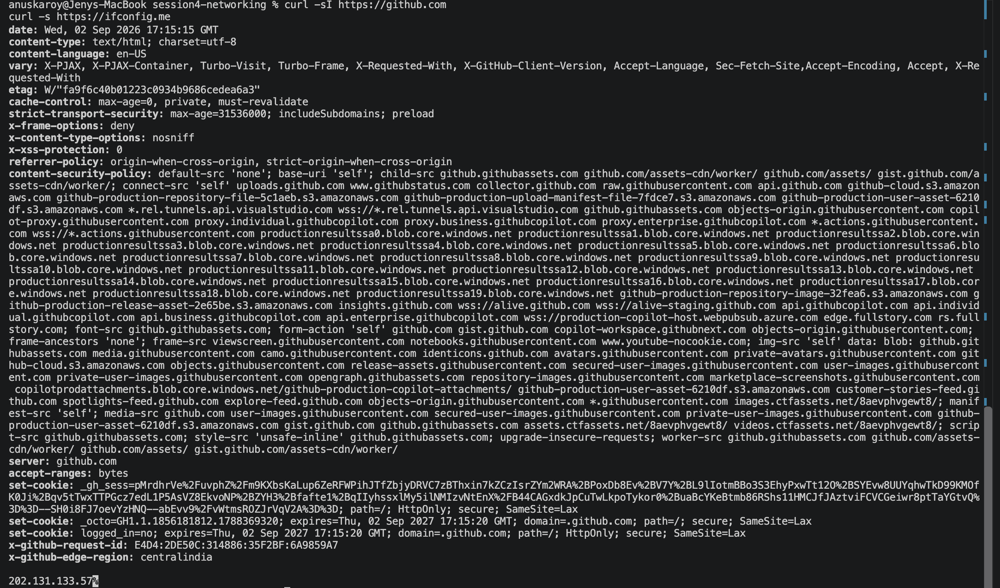
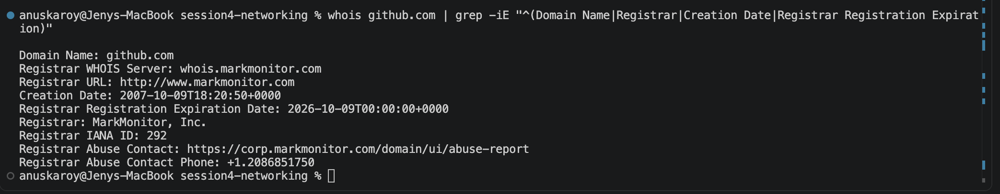

# Networking Commands — Practice & Notes

Hands-on practice of core networking commands, with the actual output from my machine and what I understood from each one.

**Environment:** macOS (Darwin 23.6.0) · Hostname `Jenys-MacBook.local` · Interface `en0` (Wi-Fi)

---

## Table of Contents

| # | Command | What it answers |
| --- | --- | --- |
| 1 | [`hostname`](#1-hostname) | What is this machine called? |
| 2 | [`ifconfig` / `ip addr`](#2-ifconfig--ip-addr) | What is my IP address? |
| 3 | [`ping`](#3-ping) | Is the host reachable, and how fast? |
| 4 | [`traceroute`](#4-traceroute) | What path do packets take? |
| 5 | [`nslookup`](#5-nslookup) | What IP does this domain resolve to? |
| 6 | [`dig`](#6-dig) | Detailed DNS records |
| 7 | [`host`](#7-host) | Quick DNS lookup |
| 8 | [`netstat -rn` / `route`](#8-netstat--rn--route) | Where does my traffic go? |
| 9 | [`netstat -an`](#9-netstat--an) | What ports are open on my machine? |
| 10 | [`arp`](#10-arp) | Which MAC address maps to which local IP? |
| 11 | [`curl`](#11-curl) | Talk to a web server over HTTP |
| 12 | [`nc` (netcat)](#12-nc-netcat) | Is a specific port open? |
| 13 | [`whois`](#13-whois) | Who owns this domain? |

---

## 1. `hostname`

Prints the name the machine identifies itself by on the network.

```bash
$ hostname
Jenys-MacBook.local
```

**📸 Screenshot:**


**What I understood:** Every device on a network has a human-readable name so we don't have to remember IP addresses. The `.local` suffix comes from mDNS (Bonjour), which lets devices on the same LAN find each other by name without a DNS server.

---

## 2. `ifconfig` / `ip addr`

Shows the network interfaces and their configuration.

```bash
$ ifconfig en0
en0: flags=8863<UP,BROADCAST,SMART,RUNNING,SIMPLEX,MULTICAST> mtu 1500
	options=6460<TSO4,TSO6,CHANNEL_IO,PARTIAL_CSUM,ZEROINVERT_CSUM>
	ether d0:88:0c:7c:6d:af
	inet6 fe80::4a9:326c:85bb:8c02%en0 prefixlen 64 secured scopeid 0xb 
	inet 100.129.166.117 netmask 0xfffff000 broadcast 100.129.175.255
	nd6 options=201<PERFORMNUD,DAD>
	media: autoselect
	status: active
```

**📸 Screenshot:**



**Linux equivalent:** `ip addr show en0` (or just `ip a`)

**What I understood — reading this output line by line:**

* `en0` — the interface name (Wi-Fi on macOS; on Linux this is usually `eth0` or `wlan0`)
* `UP,RUNNING` — the interface is enabled and the cable/Wi-Fi is actually connected. These are two different things: `UP` is admin state, `RUNNING` is link state.
* `mtu 1500` — Maximum Transmission Unit. The largest packet size in bytes that can be sent in one piece; anything larger gets fragmented. 1500 is the Ethernet standard.
* `ether d0:88:0c:7c:6d:af` — the **MAC address**, a hardware identifier burned into the network card. This works at Layer 2 (data link) and only matters on the local network segment.
* `inet 100.129.166.117` — the **IPv4 address**, my machine's Layer 3 address.
* `netmask 0xfffff000` — this is hex. `fffff000` = `255.255.240.0` = **/20**. So 20 bits are network, 12 bits are host → 2¹² − 2 = **4094 usable hosts** on this subnet.
* `broadcast 100.129.175.255` — the address that reaches every host on this subnet at once.
* `inet6 fe80::...` — a link-local IPv6 address. `fe80::/10` addresses are auto-generated and never routable off the local link.

**Connecting to my subnetting notes ([ip.md](ip.md)):** `100.129.166.117` sits in the `100.64.0.0/10` range — that's **CGNAT** (Carrier-Grade NAT) space, not a normal private range. It confirms my ISP is putting me behind their own NAT layer, which is exactly why my public IP (see [`curl`](#11-curl) below) is completely different from this one.

---

## 3. `ping`

Tests whether a host is reachable and measures the round-trip time.

```bash
$ ping -c 4 google.com
PING google.com (142.250.205.206): 56 data bytes
64 bytes from 142.250.205.206: icmp_seq=0 ttl=117 time=28.726 ms
64 bytes from 142.250.205.206: icmp_seq=1 ttl=117 time=29.286 ms
64 bytes from 142.250.205.206: icmp_seq=2 ttl=117 time=35.190 ms
64 bytes from 142.250.205.206: icmp_seq=3 ttl=117 time=28.011 ms

--- google.com ping statistics ---
4 packets transmitted, 4 packets received, 0.0% packet loss
round-trip min/avg/max/stddev = 28.011/30.303/35.190/2.857 ms
```

`-c 4` sends exactly 4 packets and stops (without it, ping runs forever until Ctrl+C).

**📸 Screenshot:**



**What I understood:** `ping` sends an ICMP Echo Request and waits for an Echo Reply. It's the first thing to reach for when something "isn't working", because it separates two very different problems: *is the host unreachable* vs *is the application broken*.

The three numbers that matter:

* **`time=28.726 ms`** — round-trip latency. My average of 30 ms is normal for a server reached over the public internet.
* **`0.0% packet loss`** — every packet came back. Loss above ~1–2% causes visible stuttering in calls and slow page loads.
* **`ttl=117`** — Time To Live. This is the one I found most interesting. The sender starts TTL at a round number (64, 128, or 255) and **every router that forwards the packet decrements it by 1**. Arriving at 117 means it likely started at 128 and crossed ~11 routers. TTL exists to stop packets looping forever — at TTL 0 the router discards the packet and sends back an error. That error is exactly what makes `traceroute` possible.

**Important caveat:** a failed ping does **not** prove a host is down. Plenty of servers and firewalls simply drop ICMP as a security policy while serving HTTP perfectly. Use [`nc`](#12-nc-netcat) or `curl` to check the actual port before concluding something is offline.

---

## 4. `traceroute`

Shows every router (hop) a packet passes through on its way to the destination.

```bash
$ traceroute -m 10 -w 1 -q 1 google.com
traceroute to google.com (142.250.205.206), 10 hops max, 40 byte packets
 1  wifi.height8tech.com (100.129.160.1)  7.631 ms
 2  202.131.133.5.convergentindia.com (202.131.133.5)  7.061 ms
 3  115.117.125.189.static-mumbai.vsnl.net.in (115.117.125.189)  8.768 ms
 4  *
 5  115.112.15.114.static-chennai.vsnl.net.in (115.112.15.114)  13.529 ms
 6  *
 7  142.250.233.142 (142.250.233.142)  56.622 ms
 8  142.251.51.118 (142.251.51.118)  14.868 ms
 9  *
10  192.178.254.240 (192.178.254.240)  40.507 ms
```

Flags: `-m 10` max 10 hops · `-w 1` wait 1s per reply · `-q 1` one probe per hop (defaults are slower).

**📸 Screenshot:**



**What I understood:** `traceroute` is a clever trick built on TTL. It sends a packet with **TTL=1** — the first router decrements it to 0, drops it, and replies with an ICMP "Time Exceeded" error that *reveals that router's address*. Then TTL=2 to expose the second hop, and so on. The route gets mapped one hop at a time.

**Reading my actual trace as a story:**

1. **Hop 1** `wifi.height8tech.com` — my local gateway/router
2. **Hop 2** `convergentindia.com` — my ISP's network
3. **Hop 3** `static-mumbai.vsnl.net.in` — Tata Communications backbone, **Mumbai**
4. **Hop 5** `static-chennai.vsnl.net.in` — now **Chennai**; the hostnames literally trace the physical geography
5. **Hops 7–10** `142.250.x.x` / `142.251.x.x` / `192.178.x.x` — inside Google's own network

So: my router → ISP → national backbone → Google. The `*` at hops 4, 6, and 9 are **not failures** — those routers are just configured not to reply to ICMP. Packets still pass through them fine, which is proven by hop 10 answering.

One oddity worth noticing: **hop 7 shows 56 ms but hop 8 shows 14 ms** — a later hop being *faster* than an earlier one. That isn't an error. Each hop is timed by a separate probe, and routers treat the ICMP error replies that traceroute depends on as low priority. So an individual hop's number reflects how fast that router felt like answering, not the cumulative latency to that point. Only the trend across many hops is meaningful.

**Why this is useful:** when a connection is slow, traceroute localises *where*. If latency jumps from 13 ms to 300 ms and **stays high for every subsequent hop**, the problem is at that link — and if it's inside the ISP's network, it's their problem, not mine.

---

## 5. `nslookup`

Queries DNS to resolve a domain name into an IP address.

```bash
$ nslookup github.com
Server:		100.129.160.1
Address:	100.129.160.1#53

Non-authoritative answer:
Name:	github.com
Address: 20.207.73.82
```

**📸 Screenshot:**



**What I understood:** DNS is the internet's phone book — humans use names, networks route by numbers, and DNS translates between them.

* `Server: 100.129.160.1` — the DNS resolver being asked. Note this is my **router**, the same address as my default gateway; it forwards queries upstream on my behalf.
* `#53` — DNS runs on **port 53**, worth memorising.
* **`Non-authoritative answer`** — the key phrase. It means this answer came from the resolver's **cache**, not from the authoritative nameserver that actually owns the `github.com` zone. It's still correct, just second-hand — which is why DNS changes take time to propagate: caches worldwide hold the old value until its TTL expires.

---

## 6. `dig`

The detailed DNS query tool — more powerful and scriptable than `nslookup`.

```bash
$ dig github.com +noall +answer

; <<>> DiG 9.10.6 <<>> github.com +noall +answer
;; global options: +cmd
github.com.		53	IN	A	20.207.73.82
```

Querying a **different record type** — mail servers:

```bash
$ dig google.com MX +short
10 smtp.google.com.
```

**📸 Screenshot:**



**What I understood:** `dig` is what you use when you need to see DNS properly rather than just get an IP. `+noall +answer` trims the verbose output to just the answer; `+short` reduces it to bare values (ideal inside scripts).

Reading the answer line `github.com. 53 IN A 20.207.73.82`:

* `github.com.` — the queried name. The **trailing dot** marks the DNS root; it makes this a fully-qualified name.
* `53` — **TTL in seconds**. This cached record is valid for 53 more seconds, then resolvers must re-query. I actually watched this happen: an earlier run of the same command showed `55`, and moments later it read `53` — the countdown of a live cache entry, visible in real time. (Coincidentally the same number as the DNS port, but unrelated.)
* `IN` — class Internet.
* `A` — the record type.

**Record types worth knowing:**

| Type | Purpose |
| --- | --- |
| `A` | name → IPv4 address |
| `AAAA` | name → IPv6 address |
| `MX` | mail servers (the `10` is priority — lower wins) |
| `CNAME` | alias pointing to another name |
| `NS` | authoritative nameservers for the zone |
| `TXT` | free-form text (SPF, domain verification) |

**`dig` vs `nslookup`:** `dig` shows TTLs and record types clearly and has predictable output for scripts, so it's the one to prefer.

---

## 7. `host`

A quick, compact DNS lookup.

```bash
$ host github.com
github.com has address 20.207.73.82
github.com mail is handled by 0 github-com.mail.protection.outlook.com.
```

**📸 Screenshot:**


**What I understood:** Same job as `dig`, but the output is a plain sentence — good for a fast check when you don't need TTLs or record detail. One incidental thing this reveals: GitHub's mail is handled by `outlook.com`, showing they outsource email to Microsoft. DNS records quietly expose which vendors a company uses.

---

## 8. `netstat -rn` / `route`

Displays the kernel routing table — the rules deciding where each packet gets sent.

```bash
$ netstat -rn | head -15
Routing tables

Internet:
Destination        Gateway            Flags               Netif Expire
default            100.129.160.1      UGScg                 en0       
100.129.160/20     link#11            UCS                   en0      !
100.129.160.1/32   link#11            UCS                   en0      !
100.129.160.1      f4:1e:57:3d:a6:d6  UHLWIir               en0   1137
100.129.160.29     6e:45:83:dc:3a:98  UHLWI                 en0   1195
100.129.160.54     c6:b2:8b:d6:35:f5  UHLWI                 en0    924
100.129.160.82     aa:d:70:87:98:70   UHLWI                 en0    398
100.129.160.102    16:7:62:b0:37:f2   UHLWI                 en0    556
```

```bash
$ route get default
   route to: default
destination: default
       mask: default
    gateway: wifi.height8tech.com
  interface: en0
      flags: <UP,GATEWAY,DONE,STATIC,PRCLONING,GLOBAL>
 recvpipe  sendpipe  ssthresh  rtt,msec    rttvar  hopcount      mtu     expire
       0         0         0         0         0         0      1500         0
```

**📸 Screenshot:**



**Linux equivalent:** `ip route show` (or `route -n`)

**What I understood:** Before sending any packet, the OS consults this table and picks the **most specific matching route**.

The two rows that explain everything:

* **`default → 100.129.160.1`** — the catch-all. Anything with no more specific match goes to the **default gateway** (my router). This is how a machine reaches the entire internet with a tiny routing table: it doesn't need to know the world, only who to hand unknown traffic to.
* **`100.129.160/20 → link#11`** — my own subnet. `link#11` means "directly reachable, no gateway needed" — these hosts are on my local network, so the machine talks to them straight over Ethernet/Wi-Fi.

That's the fundamental decision, and it maps directly onto the subnetting from [ip.md](ip.md): **the subnet mask is what tells the machine whether a destination is local or remote.** Same subnet → send directly. Different subnet → send to the gateway. Getting the mask wrong breaks connectivity precisely because this decision goes wrong.

Note that the individual host rows here (with MAC addresses and an `Expire` countdown) are the same neighbour entries that show up in [`arp`](#10-arp) — the routing table and ARP cache overlap on macOS.

Common flags: `U` up · `G` gateway · `H` host route · `S` static.

---

## 9. `netstat -an`

Lists network connections and listening ports.

```bash
$ netstat -an | grep LISTEN | head -10
tcp4       0      0  *.58465                *.*                    LISTEN     
tcp4       0      0  127.0.0.1.58161        *.*                    LISTEN     
tcp4       0      0  127.0.0.1.51243        *.*                    LISTEN     
tcp4       0      0  127.0.0.1.8828         *.*                    LISTEN     
tcp4       0      0  127.0.0.1.50110        *.*                    LISTEN     
tcp46      0      0  *.27121                *.*                    LISTEN     
tcp4       0      0  127.0.0.1.57790        *.*                    LISTEN     
tcp4       0      0  127.0.0.1.57771        *.*                    LISTEN     
tcp6       0      0  *.56922                *.*                    LISTEN     
tcp4       0      0  *.56922                *.*                    LISTEN     
```

`-a` all connections · `-n` numeric (skips DNS lookups, so it returns instantly).

**📸 Screenshot:**



**Linux equivalent:** `ss -tuln` — `ss` is the modern replacement and is much faster on busy machines.

**What I understood:** `LISTEN` means a program has claimed that port and is waiting for incoming connections. The **bind address before the port is the security-relevant part**:

* **`127.0.0.1.8828`** — bound to localhost only. Reachable *solely from this machine*; other devices cannot connect no matter what. Safe default for a dev server or database.
* **`*.58465`** — `*` means bound to **all interfaces**, so it's reachable from any device that can route to me. Exposed to the network.

That distinction is the one to check when debugging "why can't I connect to my server from another machine?" — usually the answer is that it's bound to `127.0.0.1` instead of `0.0.0.0`. And in the other direction, an unexpected `*` binding is worth investigating.

Also visible here: port `56922` appears twice, once as `tcp4` and once as `tcp6`. That's **one service listening on both IPv4 and IPv6**, not two programs fighting over a port.

**Also useful:** `lsof -i :8080` shows *which process* owns a port, which `netstat` alone won't tell you on macOS.

---

## 10. `arp`

Shows the ARP cache — the mapping of local IP addresses to MAC addresses.

```bash
$ arp -an | head -8
? (100.129.160.1) at f4:1e:57:3d:a6:d6 on en0 ifscope [ethernet]
? (100.129.160.29) at 6e:45:83:dc:3a:98 on en0 ifscope [ethernet]
? (100.129.160.54) at c6:b2:8b:d6:35:f5 on en0 ifscope [ethernet]
? (100.129.160.82) at aa:d:70:87:98:70 on en0 ifscope [ethernet]
? (100.129.160.102) at 16:7:62:b0:37:f2 on en0 ifscope [ethernet]
? (100.129.160.103) at 1a:84:57:7b:b:48 on en0 ifscope [ethernet]
? (100.129.160.134) at ae:e9:4:38:67:ef on en0 ifscope [ethernet]
? (100.129.160.137) at c2:1b:dc:d8:c6:87 on en0 ifscope [ethernet]
```

Use `-an` rather than `-a`: the `n` keeps it numeric and avoids a slow reverse-DNS lookup on every entry.

**📸 Screenshot:**



**What I understood:** This is where Layer 3 meets Layer 2. Routing decisions use IP addresses, but actually putting a frame on the wire requires the destination **MAC address**. ARP (Address Resolution Protocol) bridges that gap: the machine broadcasts *"who has 100.129.160.1?"* and the owner replies with its MAC, which gets cached here so the question isn't repeated for every packet.

Details worth noticing in my output:

* `100.129.160.1` (my gateway) is cached — expected, since **every** packet leaving my subnet is addressed to its MAC.
* The `?` at the start of each line is just an unresolved hostname, because `-n` skips reverse DNS. It is not an error.
* Most of these MACs start with unusual bytes (`6e:`, `aa:`, `c6:`, `1a:`) rather than a recognisable vendor prefix — these are **randomised private MAC addresses**, a privacy feature in modern phones and laptops that stops networks tracking a device across visits.
* Entries can also show `(incomplete)`, which means an ARP request was broadcast but nothing replied — that device is likely offline or has left the network.

**Scope matters:** ARP is strictly local. It only ever resolves addresses on my own subnet — there's no MAC address for a remote server, which is exactly why off-subnet traffic is addressed to the gateway's MAC instead.

---

## 11. `curl`

Transfers data to/from a server — here, inspecting HTTP response headers.

```bash
$ curl -sI https://github.com
HTTP/2 200 
date: Wed, 02 Sep 2026 17:15:15 GMT
content-type: text/html; charset=utf-8
content-language: en-US
etag: W/"fa9f6c40b01223c0934b9686cedea6a3"
cache-control: max-age=0, private, must-revalidate
strict-transport-security: max-age=31536000; includeSubdomains; preload
x-frame-options: deny
x-content-type-options: nosniff
referrer-policy: origin-when-cross-origin, strict-origin-when-cross-origin
content-security-policy: default-src 'none'; base-uri 'self'; ...
server: github.com
x-github-request-id: E4D4:2DE50C:314886:35F2BF:6A9859A7
x-github-edge-region: centralindia
```

`-I` headers only (no body) · `-s` silent (hides the progress meter).

Finding my **public IP**:

```bash
$ curl -s https://ifconfig.me
202.131.133.57
```

**📸 Screenshot:**



**What I understood:** `curl` operates at the application layer — where `ping` proves a host is *reachable*, `curl` proves the web server is actually *serving*. Reading the response:

* **`HTTP/2 200`** — protocol version and status code. `200` OK; the ones worth knowing are `301/302` redirect, `403` forbidden, `404` not found, `500` server error.
* **`strict-transport-security`** — HSTS. Tells the browser to only ever use HTTPS for this domain for the next year, defending against downgrade attacks.
* **`x-frame-options: deny`** — blocks the page being embedded in an iframe (anti-clickjacking).
* **`content-security-policy`** — an enormous allowlist of exactly which domains may serve scripts, images and styles to the page. Truncated above because it runs to dozens of lines; it's the browser-side defence against injected content.
* **`x-github-edge-region: centralindia`** — GitHub served me from an Indian edge location, not from the US. This is a **CDN** at work, and it explains the low latency: the content is physically near me. It also lines up with the traceroute, which stayed inside India.

**The public IP result is the most instructive part.** My interface IP is `100.129.166.117`, but the internet sees `202.131.133.57` — completely different. That's **NAT** in action: my private/CGNAT address is translated to the ISP's public address on the way out. It's why many devices share one public IP, and why inbound connections don't reach me without port forwarding. Note that `202.131.133.x` also matches **hop 2 of my traceroute** — the same ISP layer, visible from two completely different commands.

---

## 12. `nc` (netcat)

Tests whether a specific TCP port is open.

```bash
$ nc -zv -G 3 github.com 443
Connection to github.com port 443 [tcp/https] succeeded!
```

`-z` scan only, send no data · `-v` verbose · `-G 3` 3-second connection timeout.

**📸 Screenshot:**


**What I understood:** This is the right tool for the gap `ping` leaves. `ping` tests ICMP reachability of a *host*; `nc` tests whether a *specific service* is accepting connections. A server can answer ping while its web server is down, or block ping entirely while serving traffic normally — so these two commands answer genuinely different questions.

It works by attempting the TCP three-way handshake (SYN → SYN-ACK → ACK). Success means something is really listening on that port.

**The three outcomes are diagnostic:**

| Result | Meaning |
| --- | --- |
| `succeeded!` | open — service is listening |
| `Connection refused` | host reachable, but **nothing listening** on that port |
| *hangs until timeout* | a **firewall is silently dropping** packets |

The distinction between *refused* (fast, explicit rejection) and *timeout* (silence) is the useful signal: refused means the service is down, timeout usually means a firewall.

**Ports worth memorising:** `22` SSH · `53` DNS · `80` HTTP · `443` HTTPS · `3306` MySQL · `5432` PostgreSQL.

---

## 13. `whois`

Looks up registration and ownership information for a domain.

```bash
$ whois github.com | grep -iE "^(Domain Name|Registrar|Creation Date|Registrar Registration Expiration)"
Domain Name: github.com
Registrar WHOIS Server: whois.markmonitor.com
Registrar URL: http://www.markmonitor.com
Creation Date: 2007-10-09T18:20:50+0000
Registrar Registration Expiration Date: 2026-10-09T00:00:00+0000
Registrar: MarkMonitor, Inc.
Registrar IANA ID: 292
Registrar Abuse Contact: https://corp.markmonitor.com/domain/ui/abuse-report
Registrar Abuse Contact Phone: +1.2086851750
```

The `grep` is necessary — raw `whois` output runs to hundreds of lines of legal boilerplate.

**📸 Screenshot:**



**What I understood:** `whois` queries registry databases rather than DNS. The distinction I want to keep straight: **DNS answers "where does this domain point?", `whois` answers "who owns it and when does it expire?"**

Practically it's used to check expiry dates (an expired domain is a genuine and embarrassing outage cause), verify ownership, and find abuse contacts. Most personal domains now show redacted registrant details due to GDPR, but dates and registrar stay public.

Two things stood out: GitHub registered the domain in **2007**, and they use **MarkMonitor** — a corporate registrar specialising in brand protection against domain hijacking, rather than a consumer one like GoDaddy.

---

## Summary — Which Command for Which Layer

Mapping the tools onto the OSI/TCP-IP layers made the whole set click for me:

| Layer | Concern | Commands |
| --- | --- | --- |
| **L2 — Data Link** | MAC addresses, local delivery | `arp`, `ifconfig` (ether) |
| **L3 — Network** | IP addressing, routing | `ifconfig`, `ping`, `traceroute`, `netstat -rn` |
| **L4 — Transport** | TCP/UDP ports, connections | `nc`, `netstat -an` |
| **L7 — Application** | DNS, HTTP | `dig`, `nslookup`, `host`, `curl`, `whois` |

### A troubleshooting order that follows the layers

Working bottom-up isolates the fault instead of guessing:

1. **Do I have an IP?** → `ifconfig` — no IP means DHCP failed; nothing else matters
2. **Can I reach my gateway?** → `ping 100.129.160.1` — failure means a local/Wi-Fi problem
3. **Can I reach the internet by IP?** → `ping 8.8.8.8` — works here but fails at step 4 = **DNS problem**
4. **Does DNS resolve?** → `dig google.com`
5. **Is the port open?** → `nc -zv host 443`
6. **Is the app responding?** → `curl -I https://host`

The classic case this catches: **step 3 succeeds but step 4 fails** → the network is completely fine and DNS is broken. That's the single most common "the internet is down" report, and it's diagnosed in two commands.

---

## Key Takeaways

* **`ping` failing ≠ host down.** Many hosts drop ICMP by policy — confirm with `nc` or `curl` before concluding anything.
* **TTL is one mechanism doing two jobs** — it stops packets looping forever, *and* the error it triggers is what makes `traceroute` work.
* **The subnet mask drives the routing decision** — same subnet → send direct; different subnet → send to the gateway.
* **ARP is local-only.** Remote servers have no MAC from my perspective; off-subnet traffic goes to the gateway's MAC.
* **Bind address matters as much as port.** `127.0.0.1` is local-only; `*` / `0.0.0.0` is exposed to the network.
* **My private IP ≠ my public IP** (`100.129.166.117` vs `202.131.133.57`) — NAT sits between them.
* **`refused` vs `timeout`** — refused means nothing is listening; timeout means a firewall is dropping packets silently.
* **A single hop's traceroute time proves little** — only a jump that persists across all later hops indicates a real problem.
* **Prefer numeric flags** (`-n`, `-an`) — they skip reverse-DNS lookups and return instantly instead of hanging.
* **The commands corroborate each other.** The ISP in my traceroute hop 2 is the same network as my public IP; the gateway MAC in `arp` matches `netstat -rn`. Cross-checking two tools is how you confirm a finding is real.
