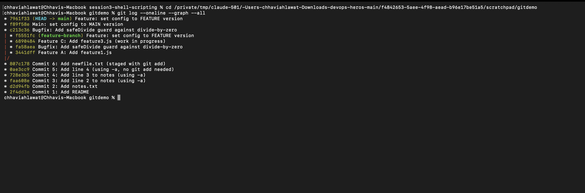

# Session 5 — Git & GitHub (Homework)

**Name:** Chhavi Ahlawat
**Enrollment Number:** 24BCS10201
**Email:** chhavi.24bcs10201@sst.scaler.com

---

## Homework Tasks

**Task 1** — Practice `git commit -a -m "message"` and understand how it differs from
`git commit -m "message"`. Test both and observe the difference. ✅

**Task 2** — Create 2–4 commits on `main`, view them with `git log`, create a new branch,
make 2–3 commits there, identify a specific commit, cherry-pick it into `main`, and verify
the change is now on `main`. ✅

All output below is **real terminal output** from a demo repository created for this homework.

---

# Task 1 — `git commit -a -m` vs `git commit -m`

## The difference in one sentence

**`-a` automatically stages every *tracked* file that has been modified or deleted, so you
can skip `git add`. It does NOT stage new, untracked files.**

| | `git commit -m "msg"` | `git commit -a -m "msg"` |
|---|---|---|
| What gets committed | **Only what is already staged** with `git add` | Staged changes **+ all modified tracked files** |
| Modified tracked file | ❌ ignored unless you `git add` it | ✅ committed automatically |
| Deleted tracked file | ❌ ignored unless you `git rm` / `git add` it | ✅ recorded automatically |
| **New untracked file** | ❌ **never** | ❌ **never** — you must `git add` it |
| Needs `git add` first? | Yes | Only for brand-new files |
| Equivalent to | — | `git add -u && git commit -m "msg"` |
| Control | Precise — you choose exactly what goes in | Convenient — sweeps up everything tracked |

The mental model that made it click: **`-a` is `git add -u`, not `git add .`**
(`-u` = update tracked files only).

---

## The demo — 4 commits on `main`

```bash
git init -b main
git config user.name  "Chhavi07-arch"
git config user.email "chhavi.24bcs10201@sst.scaler.com"
```

```
Initialized empty Git repository in /.../gitdemo/.git/
```

### Commit 1 — with `git add` + `git commit -m`

```bash
echo "# Git Homework Demo" > README.md
git add README.md
git commit -m "Commit 1: Add README"
```

```
[main (root-commit) 2f4dd3e] Commit 1: Add README
 1 file changed, 1 insertion(+)
 create mode 100644 README.md
```

### Commit 2 — a new file, so `git add` is required

```bash
echo "line 1" > notes.txt
git add notes.txt
git commit -m "Commit 2: Add notes.txt"
```

```
[main d2d94fb] Commit 2: Add notes.txt
 1 file changed, 1 insertion(+)
 create mode 100644 notes.txt
```

### Commit 3 — modifying a tracked file, using `-a` (no `git add`!)

```bash
echo "line 2" >> notes.txt
git commit -a -m "Commit 3: Add line 2 to notes (using -a)"
```

```
[main faa608e] Commit 3: Add line 2 to notes (using -a)
 1 file changed, 1 insertion(+)
```

✅ `notes.txt` was already tracked, so `-a` staged and committed it in one step.

### Commit 4 — same thing again

```bash
echo "line 3" >> notes.txt
git commit -a -m "Commit 4: Add line 3 to notes (using -a)"
```

```
[main 728e3b5] Commit 4: Add line 3 to notes (using -a)
 1 file changed, 1 insertion(+)
```

### `git log --oneline`

```bash
git log --oneline
```

```
728e3b5 Commit 4: Add line 3 to notes (using -a)
faa608e Commit 3: Add line 2 to notes (using -a)
d2d94fb Commit 2: Add notes.txt
2f4dd3e Commit 1: Add README
```

---

## ⭐ Side-by-side test: the actual difference

**Setup** — make two *different kinds* of change at the same time:
1. Modify `notes.txt` → a **tracked** file
2. Create `newfile.txt` → an **untracked** file

```bash
echo "line 4 - modified" >> notes.txt      # tracked, modified
echo "brand new file"    > newfile.txt     # untracked, new
git status
```

```
On branch main
Changes not staged for commit:
  (use "git add <file>..." to update what will be committed)
  (use "git restore <file>..." to discard changes in working directory)
	modified:   notes.txt

Untracked files:
  (use "git add <file>..." to include in what will be committed)
	newfile.txt

no changes added to commit (use "git add" and/or "git commit -a")
```

Git is already telling us the answer in that last line: *"use `git add` and/or `git commit -a`"*.

### TEST 1 — `git commit -m` (without `-a`) → **fails**

```bash
git commit -m "Trying to commit without -a"
```

```
On branch main
Changes not staged for commit:
	modified:   notes.txt

Untracked files:
	newfile.txt

no changes added to commit (use "git add" and/or "git commit -a")
```

**Exit code: `1`** — nothing was committed. The staging area was empty, so there was
literally nothing for git to snapshot. **`git commit -m` commits the *index*, not the
working directory.**

### TEST 2 — `git commit -a -m` → **works, but only for the tracked file**

```bash
git commit -a -m "Commit 5: Add line 4 (using -a, no git add needed)"
```

```
[main 0ae3cc9] Commit 5: Add line 4 (using -a, no git add needed)
 1 file changed, 1 insertion(+)
```

Notice: **`1 file changed`**, not 2. Then:

```bash
git status
```

```
On branch main
Untracked files:
  (use "git add <file>..." to include in what will be committed)
	newfile.txt

nothing added to commit but untracked files present (use "git add" to track)
```

🔑 **This is the whole lesson.** `-a` committed the modified `notes.txt` automatically, but
**`newfile.txt` is still untracked**. `-a` will never pick up a file git has never seen before.

```bash
git show --stat --oneline HEAD~1
```

```
0ae3cc9 Commit 5: Add line 4 (using -a, no git add needed)
 notes.txt | 1 +
 1 file changed, 1 insertion(+)
```

Confirmed — only `notes.txt` went into that commit.

### TEST 3 — a new file **must** be staged with `git add`

```bash
git add newfile.txt
git commit -m "Commit 6: Add newfile.txt (staged with git add)"
```

```
[main 807c178] Commit 6: Add newfile.txt (staged with git add)
 1 file changed, 1 insertion(+)
 create mode 100644 newfile.txt
```

```bash
git status
```

```
On branch main
nothing to commit, working tree clean
```

### Final log

```bash
git log --oneline
```

```
807c178 Commit 6: Add newfile.txt (staged with git add)
0ae3cc9 Commit 5: Add line 4 (using -a, no git add needed)
728e3b5 Commit 4: Add line 3 to notes (using -a)
faa608e Commit 3: Add line 2 to notes (using -a)
d2d94fb Commit 2: Add notes.txt
2f4dd3e Commit 1: Add README
```

---

## What I understood from Task 1

**Git has three areas, and this is the only thing you need to understand:**

```
  Working Directory  ──git add──▶  Staging Area (Index)  ──git commit──▶  Repository
  (your edited files)              (what WILL be committed)               (permanent history)
```

- **`git commit -m`** snapshots the **staging area**. If nothing is staged, nothing happens.
- **`git commit -a -m`** first runs the equivalent of `git add -u` (stage all *tracked*
  modifications and deletions), then commits.
- **New files are invisible to `-a`** because git isn't tracking them yet — there's no
  previous version to compare against, so there's no "modification" to detect.

**When to use which:**

| Situation | Use |
|---|---|
| Quick fix to files git already knows about | `git commit -a -m` ✅ |
| You added new files | `git add <files>` then `git commit -m` |
| You want only *some* of your changes in this commit | `git add <specific files>` then `git commit -m` |
| You're not sure what changed | `git status` → `git diff` → then decide |

⚠️ **The risk of `-a`:** it sweeps up **every** modified tracked file, including debug prints
or a temporary config change you didn't mean to commit. **Always run `git status` before
`git commit -a`.**

💡 **Related flags:**

| Command | Effect |
|---|---|
| `git commit -am "msg"` | Same as `-a -m`, just combined |
| `git commit --amend` | Rewrite the last commit (message or content) |
| `git add -u` | Stage tracked modifications only — what `-a` does internally |
| `git add .` | Stage everything, **including** new files |
| `git add -p` | Interactively stage *parts* of a file |

---

# Task 2 — Git Cherry-Pick

## What is cherry-picking?

**`git cherry-pick` copies the changes from one specific commit and applies them as a new
commit on your current branch.**

The name is literal: out of a whole branch of commits, you reach in and pick *one cherry*.

**When you actually need it:**
- A **hotfix** was committed on a feature branch and production needs it *now*, but the rest
  of that branch isn't ready to ship.
- You committed to the **wrong branch** by accident.
- Back-porting a fix from `main` into an older `release-1.x` branch.

| | `git merge` | `git cherry-pick` |
|---|---|---|
| Brings over | **All** commits from the branch | **One** (or a chosen few) |
| History | Creates a merge commit, keeps both lineages | Creates an independent new commit |
| Commit hash | Original hashes preserved | **New hash** — it's a copy |
| Use when | The whole branch is ready | You need one specific change now |

---

## Step 1 — The state of `main` before branching

```bash
git log --oneline
```

```
807c178 Commit 6: Add newfile.txt (staged with git add)
0ae3cc9 Commit 5: Add line 4 (using -a, no git add needed)
728e3b5 Commit 4: Add line 3 to notes (using -a)
faa608e Commit 3: Add line 2 to notes (using -a)
d2d94fb Commit 2: Add notes.txt
2f4dd3e Commit 1: Add README
```

## Step 2 — Create a new branch

```bash
git checkout -b feature-branch
```

```
Switched to a new branch 'feature-branch'
```

`-b` = create the branch **and** switch to it. (Modern equivalent: `git switch -c feature-branch`.)

## Step 3 — Three commits on the feature branch

### Commit A

```bash
echo "console.log('feature 1');" > feature1.js
git add feature1.js
git commit -m "Feature A: Add feature1.js"
```

```
[feature-branch 3441dff] Feature A: Add feature1.js
 1 file changed, 1 insertion(+)
 create mode 100644 feature1.js
```

### Commit B — ⭐ **this is the one we will cherry-pick**

```bash
cat > bugfix.js <<'EOF'
// Critical bug fix - divide by zero guard
function safeDivide(a, b) {
  if (b === 0) return 0;
  return a / b;
}
EOF
git add bugfix.js
git commit -m "Bugfix: Add safeDivide guard against divide-by-zero"
```

```
[feature-branch fa58aea] Bugfix: Add safeDivide guard against divide-by-zero
 1 file changed, 5 insertions(+)
 create mode 100644 bugfix.js
```

*The scenario:* this is a **critical production bug fix**. It happens to live on a feature
branch whose other commits are half-finished. We need this one fix on `main` immediately.

### Commit C

```bash
echo "console.log('feature 3 - not ready yet');" > feature3.js
git add feature3.js
git commit -m "Feature C: Add feature3.js (work in progress)"
```

```
[feature-branch 6890484] Feature C: Add feature3.js (work in progress)
 1 file changed, 1 insertion(+)
 create mode 100644 feature3.js
```

## Step 4 — `git log` to identify the commit

```bash
git log --oneline
```

```
6890484 Feature C: Add feature3.js (work in progress)
fa58aea Bugfix: Add safeDivide guard against divide-by-zero      <-- THIS ONE
3441dff Feature A: Add feature1.js
807c178 Commit 6: Add newfile.txt (staged with git add)
0ae3cc9 Commit 5: Add line 4 (using -a, no git add needed)
728e3b5 Commit 4: Add line 3 to notes (using -a)
faa608e Commit 3: Add line 2 to notes (using -a)
d2d94fb Commit 2: Add notes.txt
2f4dd3e Commit 1: Add README
```

The commit I need is **`fa58aea`**. Full details:

```bash
git log -1 --format='Full hash : %H%nAuthor    : %an%nDate      : %ad%nSubject   : %s' fa58aea
```

```
Full hash : fa58aea9a5dda2588ae97e3c202572502cb02a3c
Author    : Chhavi07-arch
Date      : Tue Sep 1 00:14:46 2026 +0530
Subject   : Bugfix: Add safeDivide guard against divide-by-zero
```

The branch structure so far:

```bash
git log --oneline --graph --all
```

```
* 6890484 Feature C: Add feature3.js (work in progress)
* fa58aea Bugfix: Add safeDivide guard against divide-by-zero
* 3441dff Feature A: Add feature1.js
* 807c178 Commit 6: Add newfile.txt (staged with git add)
* 0ae3cc9 Commit 5: Add line 4 (using -a, no git add needed)
...
```

## Step 5 — Switch back to `main`

```bash
git checkout main
```

```
Switched to branch 'main'
```

```bash
ls
```

```
README.md
newfile.txt
notes.txt
```

**`bugfix.js` is NOT here** — it only exists on `feature-branch`.

## Step 6 — ⭐ Cherry-pick the bugfix into `main`

```bash
git cherry-pick fa58aea
```

```
[main c213c36] Bugfix: Add safeDivide guard against divide-by-zero
 Date: Tue Sep 1 00:14:46 2026 +0530
 1 file changed, 5 insertions(+)
 create mode 100644 bugfix.js
```

## Step 7 — ✅ Verify the change is now on `main`

### The file is here

```bash
ls
```

```
README.md
bugfix.js       <-- ✅ arrived via cherry-pick
newfile.txt
notes.txt
```

```bash
cat bugfix.js
```

```javascript
// Critical bug fix - divide by zero guard
function safeDivide(a, b) {
  if (b === 0) return 0;
  return a / b;
}
```

### The commit is in `main`'s history

```bash
git log --oneline -4
```

```
c213c36 Bugfix: Add safeDivide guard against divide-by-zero      <-- ✅ the cherry-picked commit
807c178 Commit 6: Add newfile.txt (staged with git add)
0ae3cc9 Commit 5: Add line 4 (using -a, no git add needed)
728e3b5 Commit 4: Add line 3 to notes (using -a)
```

### The OTHER commits did **not** come along

```bash
ls | grep -E 'feature1|feature3'
```

```
(feature1.js and feature3.js are absent - exactly what we wanted)
```

**This is the proof that cherry-pick worked as intended.** A `merge` would have brought
`feature1.js` and `feature3.js` too. Cherry-pick took **only** the one commit.

### The hash is different, but the content is identical

```bash
git log -1 --format='  %h  %s' fa58aea      # original on feature-branch
git log -1 --format='  %h  %s' main         # copy on main
```

```
Original on feature-branch:
  fa58aea  Bugfix: Add safeDivide guard against divide-by-zero
Copy on main:
  c213c36  Bugfix: Add safeDivide guard against divide-by-zero
```

**Different hashes — `fa58aea` vs `c213c36`.** A commit hash is a SHA-1 of the content
*plus* the parent, the author, the committer and the timestamp. The parent is different
(`main` vs `feature-branch`), so the hash must be different. **Cherry-pick creates a new
commit, it does not move the old one.**

But the resulting file is byte-for-byte the same:

```bash
git diff fa58aea main -- bugfix.js
```

```
(no output = the file is byte-for-byte identical)
```

### The final graph

```bash
git log --oneline --graph --all
```

```
* c213c36 Bugfix: Add safeDivide guard against divide-by-zero      <-- the COPY on main
| * 6890484 Feature C: Add feature3.js (work in progress)
| * fa58aea Bugfix: Add safeDivide guard against divide-by-zero    <-- the ORIGINAL
| * 3441dff Feature A: Add feature1.js
|/
* 807c178 Commit 6: Add newfile.txt (staged with git add)
* 0ae3cc9 Commit 5: Add line 4 (using -a, no git add needed)
* 728e3b5 Commit 4: Add line 3 to notes (using -a)
* faa608e Commit 3: Add line 2 to notes (using -a)
* d2d94fb Commit 2: Add notes.txt
* 2f4dd3e Commit 1: Add README
```

### 📸 Screenshot — the branch graph in the terminal



In the screenshot, `HEAD -> main` sits at the top and `feature-branch` is the labelled
branch below. Both **`c213c36`** (on `main`) and **`fa58aea`** (on `feature-branch`) carry
the identical message *"Bugfix: Add safeDivide guard against divide-by-zero"* — the same
change, two different commits.

**You can see the duplication directly in this graph.** The same change now exists as two
separate commits on two branches — `c213c36` on `main` and `fa58aea` on `feature-branch`.
That's the defining trade-off of cherry-picking, and the reason for the caution below.

---

## Handling a cherry-pick conflict

Cherry-picking doesn't always apply cleanly. Here's a real conflict and its resolution.

**Setup:** the same file, `config.txt`, was created differently on each branch.

```bash
git cherry-pick f5551fc
```

```
Auto-merging config.txt
CONFLICT (add/add): Merge conflict in config.txt
error: could not apply f5551fc... Feature: set config to FEATURE version
hint: After resolving the conflicts, mark them with
hint: "git add/rm <pathspec>", then run
hint: "git cherry-pick --continue".
hint: You can instead skip this commit with "git cherry-pick --skip".
hint: To abort and get back to the state before "git cherry-pick",
hint: run "git cherry-pick --abort".
```

```bash
git status --short
```

```
AA config.txt
```

`AA` = **added by both sides** — each branch created this file independently.

```bash
cat config.txt
```

```
<<<<<<< HEAD
MAIN version of config
=======
FEATURE version of config
>>>>>>> f5551fc (Feature: set config to FEATURE version)
```

**Reading the conflict markers:**
- Between `<<<<<<< HEAD` and `=======` → what's currently on **your branch** (`main`)
- Between `=======` and `>>>>>>>` → what the **incoming commit** wants
- Your job: edit the file into what it *should* be, and delete all three marker lines

**Resolve** (here, keeping both lines) and continue:

```bash
printf 'MAIN version of config\nFEATURE version of config\n' > config.txt
git add config.txt
git cherry-pick --continue
```

```
[main 7961f33] Feature: set config to FEATURE version
 Date: Tue Sep 1 00:15:17 2026 +0530
 1 file changed, 1 insertion(+)
```

```bash
cat config.txt
```

```
MAIN version of config
FEATURE version of config
```

**Your three options during a conflict:**

| Command | What it does |
|---|---|
| `git cherry-pick --continue` | After `git add`-ing your resolution — finish the cherry-pick |
| `git cherry-pick --skip` | Skip this commit and move on (useful in a multi-commit pick) |
| `git cherry-pick --abort` | Cancel everything, return to the state before you started |

> One real gotcha I hit: if you resolve a conflict by keeping *only* your side, the resulting
> patch is **empty** and git refuses to commit it, saying *"The previous cherry-pick is now
> empty… please use `git cherry-pick --skip`"*. That's correct behaviour — there was genuinely
> nothing left to apply.

---

## Cherry-pick command reference

```bash
git cherry-pick <hash>                  # one commit
git cherry-pick <hash1> <hash2>         # several specific commits
git cherry-pick <hash1>..<hash2>        # a range (EXCLUDING hash1)
git cherry-pick <hash1>^..<hash2>       # a range INCLUDING hash1
git cherry-pick -n <hash>               # apply to the working tree, DON'T commit yet
git cherry-pick -e <hash>               # edit the commit message before committing
git cherry-pick -x <hash>               # add "(cherry picked from commit ...)" to the message ⭐
git cherry-pick --continue              # after resolving conflicts
git cherry-pick --abort                 # cancel and go back
git cherry-pick --skip                  # skip the current commit
```

**`-x` is worth making a habit.** It appends the original hash to the commit message, so six
months later anyone can trace where the change came from:

```
Bugfix: Add safeDivide guard against divide-by-zero

(cherry picked from commit fa58aea9a5dda2588ae97e3c202572502cb02a3c)
```

---

## What I understood from Task 2

1. **Cherry-pick copies a *change*, not a commit.** It takes the diff that commit introduced
   and replays it on top of your current branch as a **brand-new commit with a new hash**.

2. **The proof was in `ls`.** After cherry-picking only the bugfix, `bugfix.js` appeared on
   `main` while `feature1.js` and `feature3.js` did not. A merge would have brought all three.

3. **A commit hash depends on its parent.** That's why the copy has a different hash even
   though the file content is identical — verified with `git diff` returning nothing.

4. **You must be on the *destination* branch when you run it.** `git cherry-pick <hash>` means
   "bring that commit **here**". Getting this backwards is the most common mistake.

5. **⚠️ Cherry-picking duplicates history.** The same change now exists as two commits.
   If `feature-branch` is later merged into `main`, git usually notices the patch is already
   applied and handles it — but it can also produce a confusing conflict. **Prefer `merge`
   or `rebase` when the whole branch is ready; use cherry-pick for genuine one-off cases**
   like hotfixes and back-ports.

6. **`git log --oneline --graph --all` is the command that makes branching make sense.** The
   ASCII graph showed the duplicated commit on two separate lines — far clearer than reading
   hashes.

---

# Git Command Cheat Sheet

## Setup
```bash
git config --global user.name  "Your Name"
git config --global user.email "you@example.com"
git config --list                       # show all current settings
```

## Starting a repository
```bash
git init                                # new repo here
git init -b main                        # …with the initial branch named main
git clone <url>                         # copy a remote repo
```

## Everyday workflow
```bash
git status                              # what changed? ← run this constantly
git status -s                           # short format
git diff                                # unstaged changes
git diff --staged                       # staged changes
git add <file>                          # stage one file
git add .                               # stage everything, including new files
git add -u                              # stage tracked modifications only
git add -p                              # interactively stage parts of a file
git commit -m "message"                 # commit what's staged
git commit -a -m "message"              # stage tracked changes + commit ⭐
git commit --amend                      # rewrite the last commit
```

## History
```bash
git log                                 # full history
git log --oneline                       # one line per commit ⭐
git log --oneline --graph --all         # visual branch graph ⭐
git log -5                              # last 5 commits
git log --author="Chhavi"               # filter by author
git log --since="2 weeks ago"           # filter by date
git log -p <file>                       # history of one file, with diffs
git show <hash>                         # everything about one commit
git show --stat <hash>                  # just which files it touched
git blame <file>                        # who last changed each line
```

## Branching
```bash
git branch                              # list local branches
git branch -a                           # include remote branches
git branch <name>                       # create (without switching)
git checkout -b <name>                  # create AND switch ⭐
git switch -c <name>                    # modern equivalent
git checkout <name>                     # switch branches
git branch -d <name>                    # delete (safe — refuses if unmerged)
git branch -D <name>                    # force delete
git branch -m <old> <new>               # rename
```

## Combining work
```bash
git merge <branch>                      # merge a branch in
git rebase <branch>                      # replay your commits on top of another branch
git cherry-pick <hash>                  # copy ONE commit here ⭐
git cherry-pick -x <hash>               # …and record where it came from
```

## Remotes
```bash
git remote -v                           # list remotes
git remote add origin <url>             # add a remote
git push origin main                    # push
git push -u origin main                 # push and set upstream tracking
git pull origin main                    # fetch + merge
git fetch origin                        # download without merging (safe)
git pull --rebase                       # fetch + rebase instead of merge
```

## Undoing things
```bash
git restore <file>                      # discard unstaged changes to a file
git restore --staged <file>             # unstage (keep the edits)
git reset --soft HEAD~1                 # undo last commit, KEEP changes staged
git reset --mixed HEAD~1                # undo last commit, keep changes unstaged (default)
git reset --hard HEAD~1                 # ⚠️ undo last commit AND destroy the changes
git revert <hash>                       # a NEW commit that undoes an old one (safe for shared branches) ⭐
git stash                               # shelve changes temporarily
git stash pop                           # bring them back
git reflog                              # ⭐ every HEAD movement — how you recover "lost" commits
```

**`reset` vs `revert`:** `reset` **rewrites** history — fine on your own local branch, but it
breaks everyone else's clone if the commits are already pushed. `revert` **adds** a new commit
that undoes the old one — always safe on shared branches. **On `main`, use `revert`.**

**`git reflog` is the undo button for git itself.** Even after a bad `reset --hard`, the old
commit is still in the reflog for ~30 days and can be recovered with
`git reset --hard <hash-from-reflog>`.

---

## Reference Links

- Official Git cheat sheet — https://git-scm.com/cheat-sheet
- GitHub education cheat sheet — https://education.github.com/git-cheat-sheet-education.pdf
- GeeksforGeeks Git cheat sheet — https://www.geeksforgeeks.org/git/git-cheat-sheet/

*(also listed in [`resources.md`](resources.md))*
