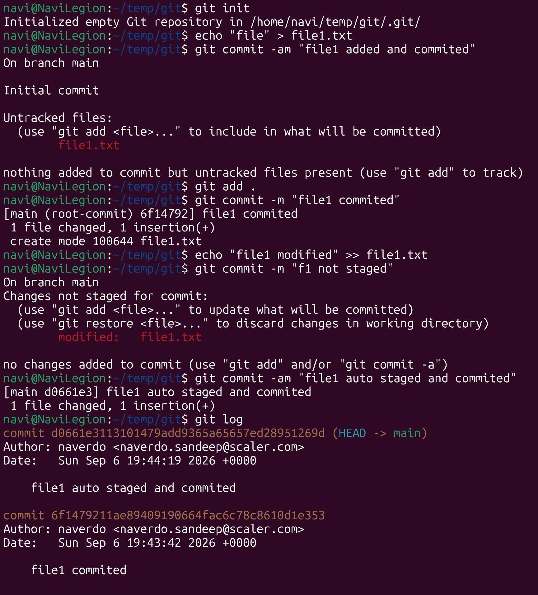
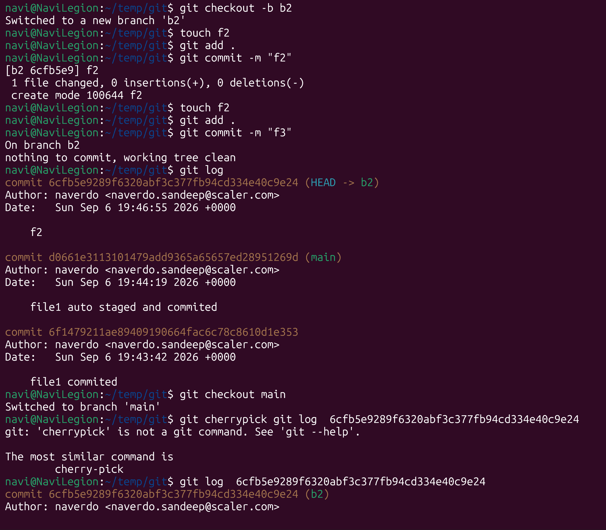
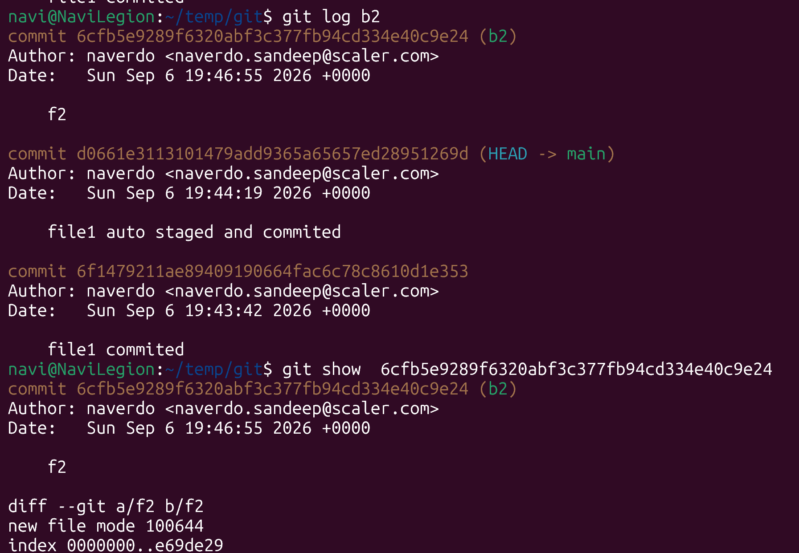
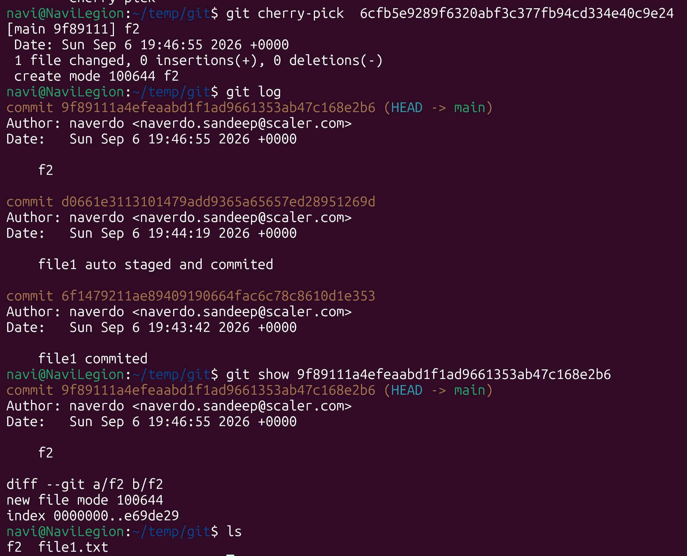

commit -a automatically stages the files that are already tracked by git.  
commit -m just commmits the files which are manually staged (git add)  (-m is to add a commit message)  

`git log` shows the commit history. Writing branch name shows commits on that branch

`git show <commit-hash>` shows details about a specific commit

`git cherry-pick <commit-hash>` Adds a commit from another branch onto the  current branch  
