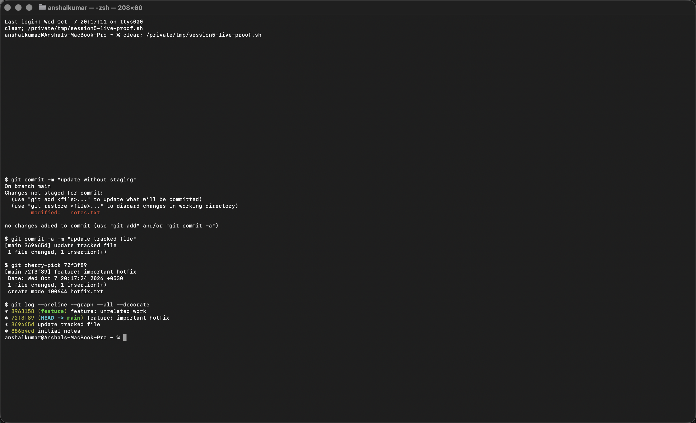

# Session 5 - Git and GitHub

I used temporary repositories for both exercises so I could make and rearrange commits without affecting this course repository. The complete command output is saved alongside this README.

## `git commit -m` compared with `git commit -a -m`

Full transcript: [`commit-a-vs-commit-m.txt`](commit-a-vs-commit-m.txt).

First I modified a tracked file and ran `git commit -m` without staging it:

```text
$ git commit -m "update via commit -m only"
no changes added to commit (use "git add" and/or "git commit -a")
```

It did not commit because `-m` only supplies the message. It does not stage anything.

I then ran:

```text
$ git commit -a -m "update via commit -a -m"
[main 1eb546e] update via commit -a -m
 1 file changed, 1 insertion(+)
```

The `-a` option staged the modified tracked file before committing it. I also tested a new untracked file. It was not included, which confirmed that `-a` only handles files Git already tracks.

| Command | Modified tracked files | New untracked files |
|---|---|---|
| `git commit -m "message"` | Must be staged first | Must be staged first |
| `git commit -a -m "message"` | Staged automatically | Must still use `git add` |

## Cherry-pick exercise

Full transcript: [`cherry-pick-demo.txt`](cherry-pick-demo.txt).

I created three commits on `main`, then made a `feature` branch with three more commits. The commit I wanted was:

```text
1f7d1cb feature: important hotfix
```

After returning to `main`, I ran:

```text
$ git cherry-pick 1f7d1cb
[main 6ea1941] feature: important hotfix
 1 file changed, 1 insertion(+)
 create mode 100644 hotfix.txt
```

The hotfix appeared on `main`, but the other two feature commits did not. The SHA changed from `1f7d1cb` to `6ea1941` because cherry-pick created a new commit with a different parent. This helped me understand that cherry-pick copies one commit's change rather than merging the whole branch.

The Git references I used are listed in [`resources.md`](resources.md).

## Proof of the Git practice

I reran both exercises in a temporary Git repository before submission. The screenshot shows the difference between `git commit -m` and `git commit -a -m`, followed by the single commit copied to `main` with `git cherry-pick`.


