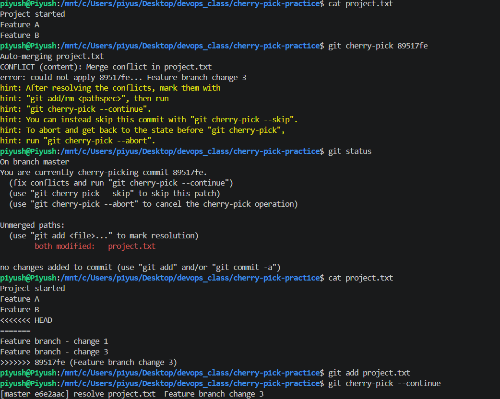
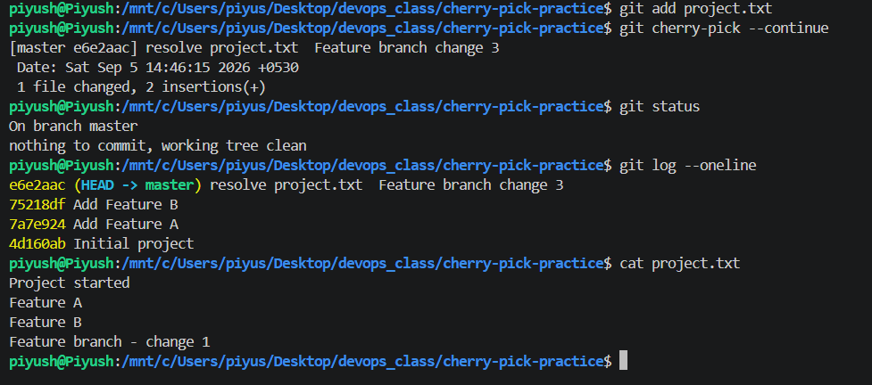

## Name - Piyush Kumar Mahato
## Roll no- 10233

## Task 1
git commit -m commits changes that are already staged, while git commit -a -m automatically stages modifications and deletions to already tracked files before committing. It does not stage new untracked files.

## Task 2

