# Git Homework — `commit -a -m` and Cherry-Pick

Two topics: the difference between `git commit -m` and `git commit -a -m`, and using `git cherry-pick` to move a single commit between branches.

**Environment:** macOS · Repo `devops-heros` · Working directory `session5-git-github/`

---

## Contents

* [Task 1 — `git commit -m` vs `git commit -a -m`](#task-1--git-commit--m-vs-git-commit--a--m)
* [Task 2 — Git Cherry-Pick](#task-2--git-cherry-pick)
* [Key Takeaways](#key-takeaways)

---

# Task 1 — `git commit -m` vs `git commit -a -m`

## The staging area — why these two commands differ

Git has **three** places a file can live, and this is the whole reason the `-a` flag exists:

```text
Working Directory  →  Staging Area (Index)  →  Repository
   (your edits)          (git add)              (git commit)
```

`git commit -m` only commits what is **already staged**. `git commit -a -m` **auto-stages every modified tracked file first**, then commits — combining two steps into one.

The catch is the word *tracked*, demonstrated in Step 5 below.

---

## Step 1 — Create and commit a file

```bash
$ echo "line 1" > demo.txt
$ git add demo.txt
$ git commit -m "Task1: create demo.txt"
```

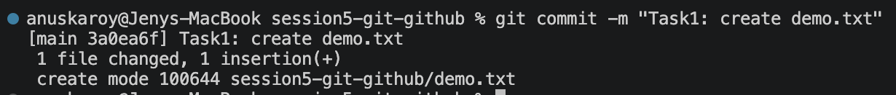

A brand-new file **must** be staged with `git add`. At this point Git starts *tracking* `demo.txt` — which is what makes the rest of the experiment possible.

---

## Step 2 — Modify the file and check status

```bash
$ echo "line 2" >> demo.txt
$ git status
```

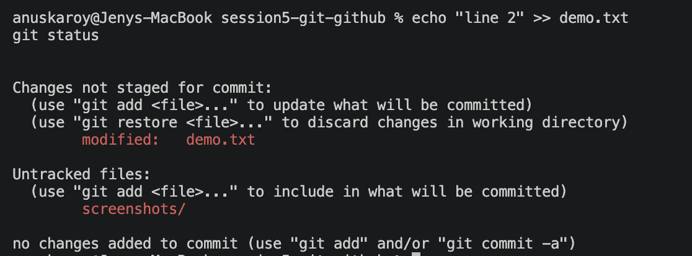

`demo.txt` appears under **"Changes not staged for commit"**. The edit exists in the working directory but has **not** been added to the staging area.

---

## Step 3 — `git commit -m` (fails)

```bash
$ git commit -m "Task1: trying without -a"
On branch main
Your branch is ahead of 'origin/main' by 1 commit.

Changes not staged for commit:
  (use "git add <file>..." to update what will be committed)
  (use "git restore <file>..." to discard changes in working directory)
	modified:   demo.txt

Untracked files:
  (use "git add <file>..." to include in what will be committed)
	screenshots/

no changes added to commit (use "git add" and/or "git commit -a")
```

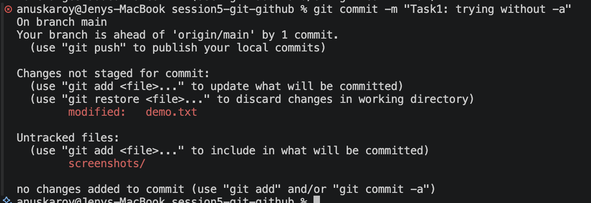

**This failure is the demonstration, not a mistake.**

The commit was refused because the staging area was empty. Git even names both fixes in the final line: `git add`, or `git commit -a`. The modification to `demo.txt` is still sitting in the working directory, uncommitted.

---

## Step 4 — `git commit -a -m` (succeeds)

```bash
$ git commit -a -m "Task1: committed with -a flag"
[main 20353fa] Task1: committed with -a flag
 1 file changed, 1 insertion(+)
```


**Same file, same modification, same repository state — and this time it works.**

The only thing that changed is the `-a` flag, which staged the modified tracked file automatically before committing. Commit `20353fa` was created.

---

## Step 5 — Where `-a` stops: untracked files

```bash
$ echo "new file" > untracked.txt
$ git commit -a -m "Task1: will this catch untracked?"
On branch main
Untracked files:
	screenshots/
	untracked.txt

nothing added to commit but untracked files present (use "git add" to track)

$ git status
# ...untracked.txt still listed as untracked
```

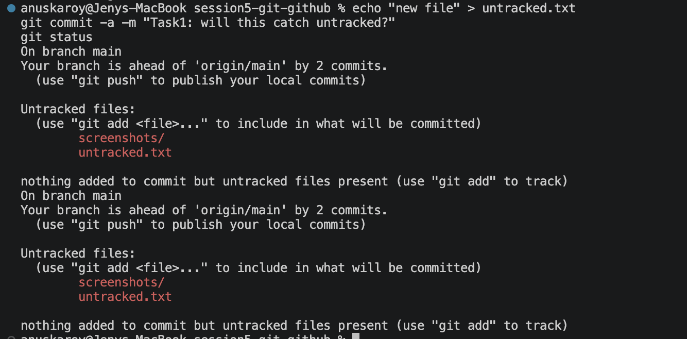

**This is the limit of `-a` that catches people out.**

Even with `-a`, the commit was refused — `untracked.txt` has never been `git add`ed, so Git isn't tracking it, and `-a` skips it entirely. `git status` afterwards confirms it's still untracked.

The rule: **`-a` stages modifications to files Git already knows about. It never picks up new files.**

---

## Step 6 — Resulting history

```bash
$ git log --oneline -4
```

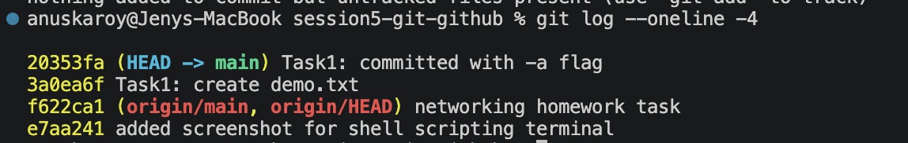

Two commits from this task: `3a0ea6f` (create) and `20353fa` (the `-a` commit). The attempts in Steps 3 and 5 created **no commits at all**, which is exactly the point.

---

## Task 1 — Summary

| | `git commit -m` | `git commit -a -m` |
| --- | --- | --- |
| Commits staged changes | ✅ | ✅ |
| Auto-stages **modified tracked** files | ❌ | ✅ |
| Includes **new/untracked** files | ❌ | ❌ |
| Equivalent to | `git commit` | `git add -u && git commit` |

**When to use which:**

* **`-a`** — quick commits when you want *everything* you've modified. Convenient, but it commits changes you may not have reviewed.
* **`git add` then `-m`** — when you want to commit only *some* of your changes. This is the safer default, and the only way to build a partial commit.

---

# Task 2 — Git Cherry-Pick

**What cherry-pick does:** copies the changes from **one specific commit** onto the current branch, without merging the rest of that branch's history.

**When it's useful:** a bugfix is sitting on a feature branch that isn't ready to merge, but the fix is needed on main *now*.

---

## Step 7 — Three commits on `main`

```bash
$ echo "main change 1" > file1.txt && git add file1.txt && git commit -m "Main commit 1"
$ echo "main change 2" > file2.txt && git add file2.txt && git commit -m "Main commit 2"
$ echo "main change 3" > file3.txt && git add file3.txt && git commit -m "Main commit 3"
$ git log --oneline -5
```

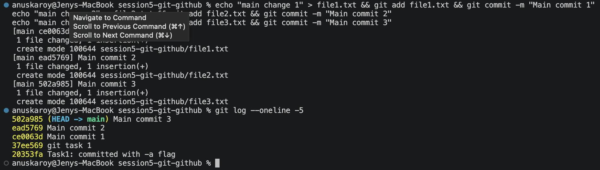

Baseline history: `ce0063d`, `ead5769`, `502a985`.

---

## Step 8 — Create a new branch

```bash
$ git checkout -b feature-branch
Switched to a new branch 'feature-branch'
```

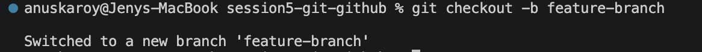

`-b` creates the branch and switches to it in one step. It branches from `502a985`, the current tip of main.

---

## Step 9 — Three commits on the feature branch, and identify one

```bash
$ echo "feature A" > featureA.txt && git add featureA.txt && git commit -m "Feature commit A"
$ echo "IMPORTANT BUGFIX" > bugfix.txt && git add bugfix.txt && git commit -m "Feature commit B - the bugfix to cherry-pick"
$ echo "feature C" > featureC.txt && git add featureC.txt && git commit -m "Feature commit C"

$ git log --oneline -4
bd9a14c (HEAD -> feature-branch) Feature commit C
7253673 Feature commit B - the bugfix to cherry-pick
93548fc Feature commit A
502a985 (main) Main commit 3
```

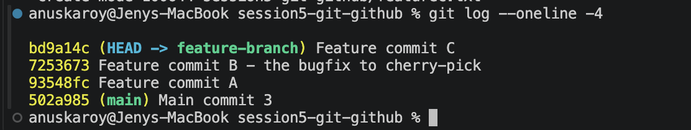

The target is the **middle** commit, `7253673` — chosen deliberately so that cherry-picking it proves commits A and C are left behind.

Two things visible in this output:

* `HEAD -> feature-branch` marks where I am now.
* `(main)` still points at `502a985` — main has not moved while I worked here.

---

## Step 10 — Before the cherry-pick

```bash
$ git checkout main
$ ls
demo.txt   file1.txt   file2.txt   file3.txt   resources.md   screenshots   untracked.txt
```


**The "before" state.** No `bugfix.txt`, no `featureA.txt`, no `featureC.txt` — the feature branch's work does not exist here. Without this shot the next step proves nothing.

---

## Step 11 — Cherry-pick

```bash
$ git cherry-pick 7253673
[main 507d798] Feature commit B - the bugfix to cherry-pick
 Date: Wed Sep 2 23:16:36 2026 +0530
 1 file changed, 1 insertion(+)
 create mode 100644 session5-git-github/bugfix.txt
```

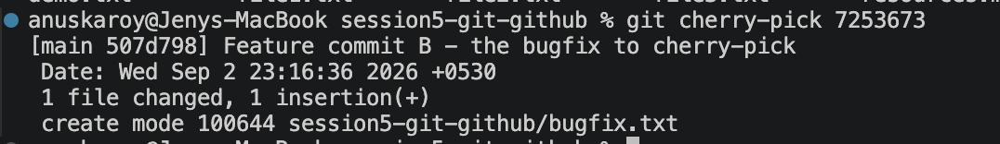

Note the output carefully: the source commit was `7253673`, but the new commit on main is **`507d798`** — a *different* hash. Explained below.

---

## Step 12 — Verify

```bash
$ ls
bugfix.txt   demo.txt   file1.txt   file2.txt   file3.txt   resources.md   screenshots   untracked.txt

$ cat bugfix.txt
IMPORTANT BUGFIX

$ git log --oneline -5
507d798 (HEAD -> main) Feature commit B - the bugfix to cherry-pick
502a985 Main commit 3
ead5769 Main commit 2
ce0063d Main commit 1
37ee569 git task 1
```

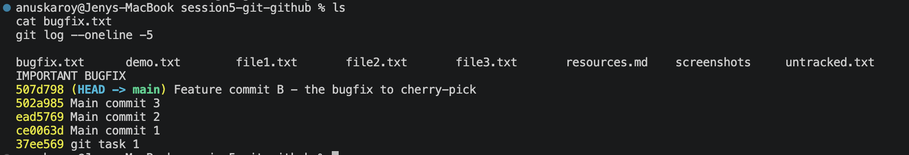

**Three things confirm the cherry-pick worked exactly as intended:**

1. **`bugfix.txt` now exists on main**, and `cat` shows the correct content.
2. **`507d798` sits directly on top of `502a985`** — the commit was applied to main's history.
3. **Commits A and C did not come along.** `featureA.txt` and `featureC.txt` are absent from `ls`, and neither commit appears in the log. This selectivity is the entire purpose of cherry-pick — a merge would have brought all three.

---

## Step 13 — The branch graph

```bash
$ git log --oneline --graph --all -12
* 507d798 (HEAD -> main) Feature commit B - the bugfix to cherry-pick
| * bd9a14c (feature-branch) Feature commit C
| * 7253673 Feature commit B - the bugfix to cherry-pick
| * 93548fc Feature commit A
|/  
* 502a985 Main commit 3
* ead5769 Main commit 2
* ce0063d Main commit 1
```

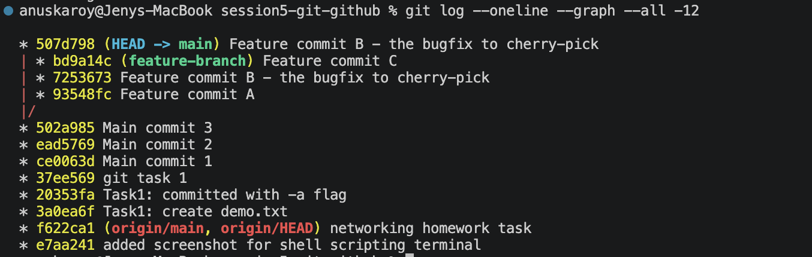

The graph makes the structure obvious. Both branches share history up to `502a985`, then the `|/` marks where they diverge.

**The same change now exists twice** — as `7253673` on `feature-branch` and as `507d798` on `main` — with identical commit messages but different hashes.

### Why the hash changes

This is the detail worth understanding. A commit hash is derived from the commit's **content plus its metadata** — including its **parent commit**. Cherry-picking replays the same *changes* onto a different parent (`502a985` instead of `93548fc`), so the resulting commit is genuinely a different object, even though the diff and message are identical.

**Practical consequence:** cherry-pick **copies**, it does not move. The original commit stays on the feature branch. When that branch is eventually merged into main, Git recognises the duplicated change and normally handles it without conflict.

---

# Key Takeaways

### On `commit -a`

* **`-a` = "stage all modified tracked files, then commit"** — a shortcut for `git add -u && git commit`.
* **`-a` never includes untracked files.** New files always need an explicit `git add` (Step 5).
* **`git commit -m` with nothing staged does nothing** — it fails safely rather than committing a surprise (Step 3).
* Staging exists so you can commit *some* of your changes. `-a` deliberately bypasses that, so it trades review for speed.

### On cherry-pick

* **Cherry-pick copies one commit's changes onto the current branch** — precise, unlike a merge that brings everything.
* **Run it from the branch you want to receive the commit**, not the one that has it.
* **The new commit gets a new hash** because its parent differs; the original is left untouched.
* **The before/after check is what proves it worked** — confirm the file is missing first, then present, with the unrelated commits still absent.
* Its main real-world use is pulling an urgent fix off an unfinished branch. Used heavily it creates duplicate history, so it's a targeted tool rather than a routine one.

### General

* **A failed command is often the clearest lesson.** The refusals in Steps 3 and 5 taught more about staging than the successes did.
* **Git's error messages name the fix** — "use git add and/or git commit -a" was the answer, printed on screen.
* **`git log --oneline --graph --all` is the fastest way to see branch structure**, and worth reaching for whenever branches feel confusing.