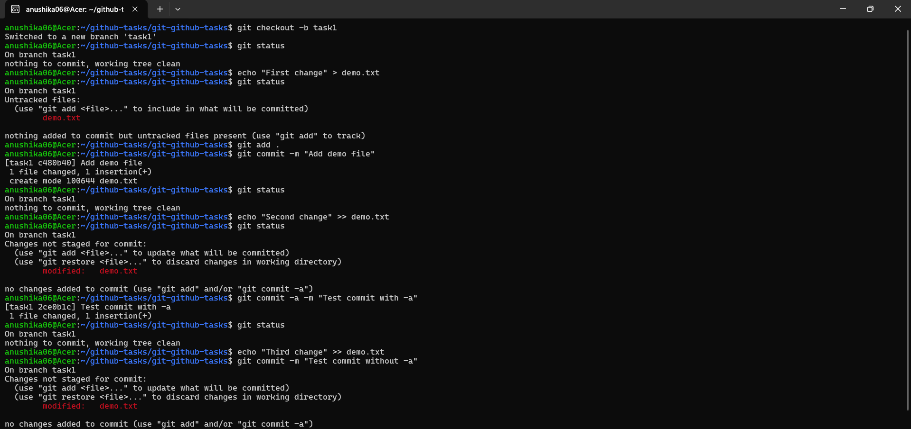
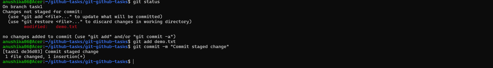
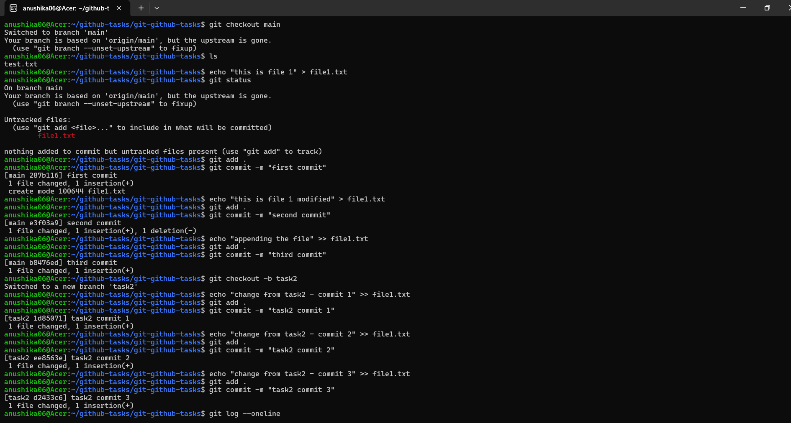
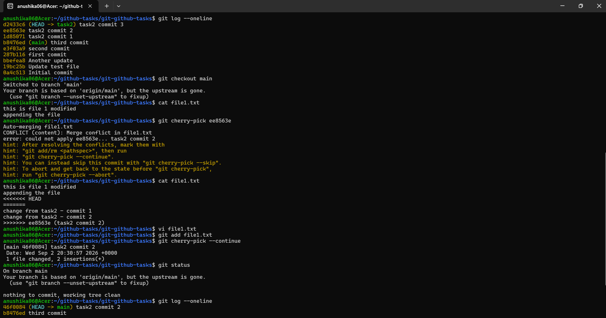
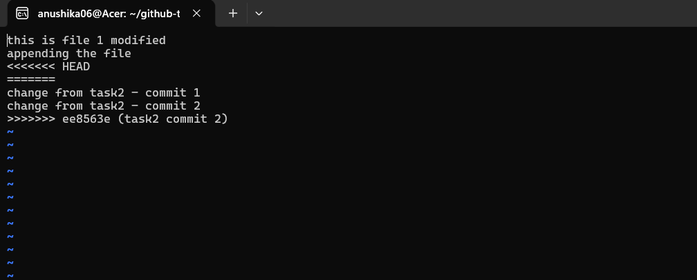
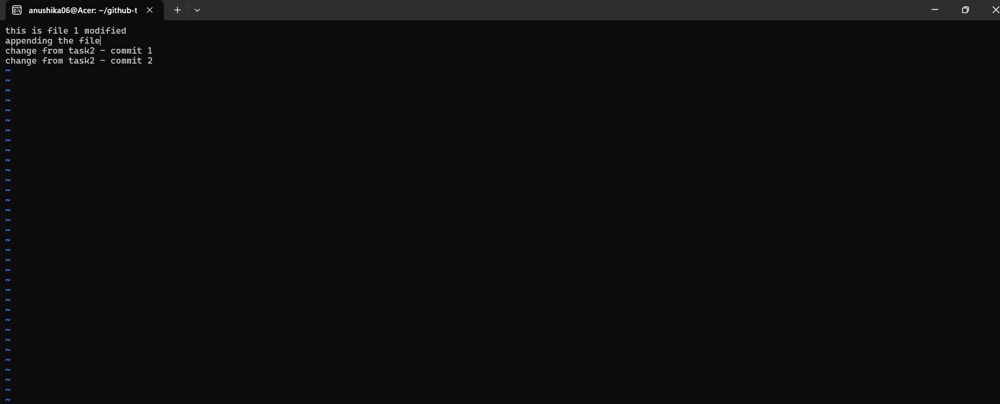
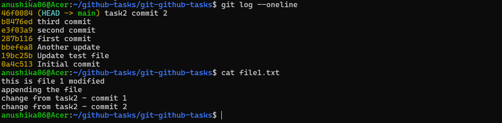

# Git Homework Tasks

## Task 1: `git commit -a -m`

- Practice `git commit -a -m "message"`.
- Understand the difference between `git commit -a -m` and `git commit -m`.
- Test both commands and observe the difference.

## Task 2: Git Cherry-Pick

- Create **2–4 commits** in the `main` branch.
- Use `git log` to view the commits.
- Create a new branch.
- Make **2–3 commits** in the new branch.
- Use `git log` to identify a specific commit.
- Cherry-pick one specific commit from the new branch into the `main` branch.
- Verify that the selected commit/change is now available in the `main` branch.

## Submission

- Take screenshots of your work **or** create an `.md` file showing the commands and output.
- Upload the screenshots or `.md` file to the GitHub repository.

# SOLUTIONS:

## TASK 1

### Observation
git commit -a -m automatically stages changes made to already tracked files before committing. In contrast, git commit -m only commits changes that have already been staged using git add. Therefore, git commit -a -m is convenient for tracked files, while git commit -m gives more control over what is included in the commit.

## TASK 2

Created 3 commits on the main branch and 3 commits on a separate task2 branch. Used git log to identify a specific commit, then cherry-picked that commit into main. A merge conflict occurred because both branches modified the same file, which was manually resolved before completing the cherry-pick.

