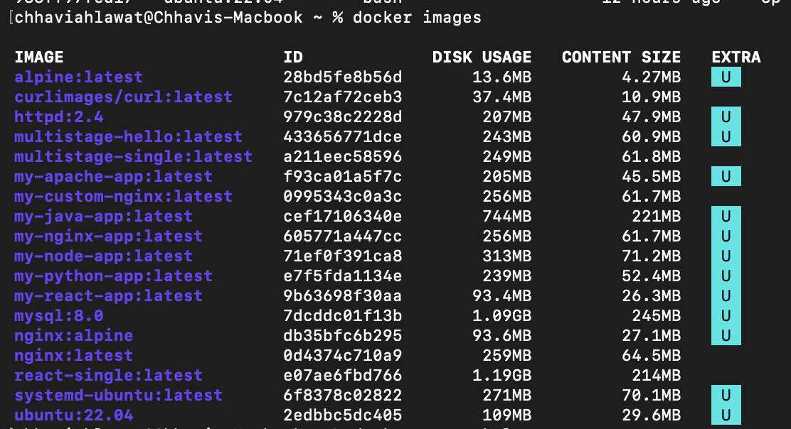
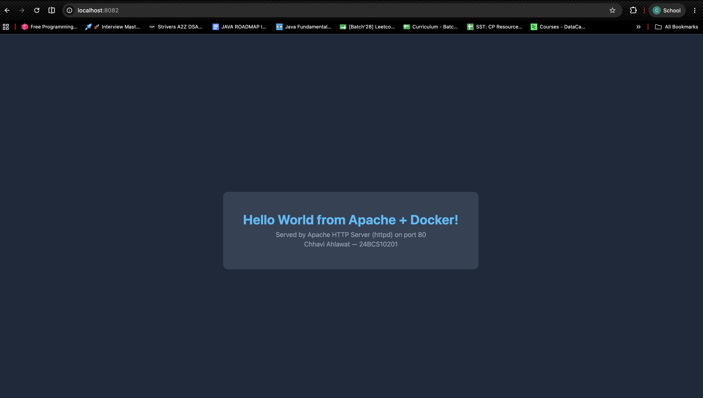
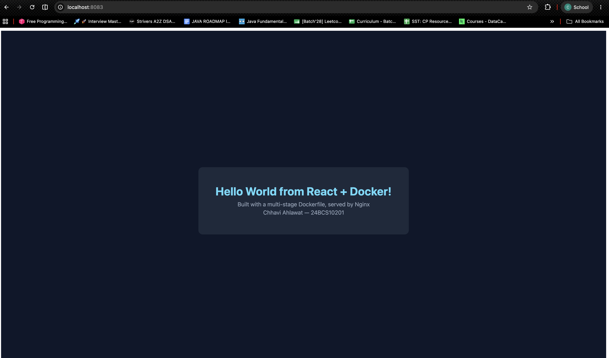

# Session 6 & 7 — Docker Fundamentals (Homework)

**Name:** Chhavi Ahlawat
**Enrollment Number:** 24BCS10201
**Email:** chhavi.24bcs10201@sst.scaler.com

---

## Homework Task: Hello World Applications

Create simple **Hello World web applications** using Docker for Node.js, Python, Java,
Apache, React and Nginx. For each: create a folder, add the application code, write a
Dockerfile, build the image, run the container, and verify Hello World appears on a webpage.

| # | Application | Folder | Base image | Host port | Status |
|---|---|---|---|---|---|
| 1 | **Nginx** | [`nginx-web/`](nginx-web) | `nginx:latest` | 8081 | ✅ |
| 2 | **Apache** | [`apache-app/`](apache-app) | `httpd:2.4` | 8082 | ✅ |
| 3 | **React** | [`react-app/`](react-app) | `node:20-alpine` → `nginx:alpine` | 8083 | ✅ |
| 4 | **Python** | [`python-app/`](python-app) | `python:3.11-slim` | 5001 | ✅ |
| 5 | **Node.js** | [`node-app/`](node-app) | `node:20-slim` | 3000 | ✅ |
| 6 | **Java** | [`java-app/`](java-app) | `eclipse-temurin:21-jdk` | 8085 | ✅ |
| 7 | **Multi-stage** | [`multi-stage-dockerfile/`](multi-stage-dockerfile) | `node:24-alpine` ×2 | 8080 | ✅ |

> 📄 The multi-stage build has its own detailed write-up:
> **[`multi-stage-dockerfile/README.md`](multi-stage-dockerfile/README.md)**

---

# ✅ Proof: all 7 containers running

```bash
docker ps
```

```
NAMES            IMAGE              STATUS         PORTS
multistage-app   multistage-hello   Up 9 minutes   0.0.0.0:8080->3000/tcp, [::]:8080->3000/tcp
java-app         my-java-app        Up 9 minutes   0.0.0.0:8085->8080/tcp, [::]:8085->8080/tcp
node-app         my-node-app        Up 9 minutes   0.0.0.0:3000->3000/tcp, [::]:3000->3000/tcp
python-app       my-python-app      Up 9 minutes   0.0.0.0:5001->5000/tcp, [::]:5001->5000/tcp
react-app        my-react-app       Up 9 minutes   0.0.0.0:8083->80/tcp,   [::]:8083->80/tcp
apache-app       my-apache-app      Up 9 minutes   0.0.0.0:8082->80/tcp,   [::]:8082->80/tcp
nginx-app        my-nginx-app       Up 9 minutes   0.0.0.0:8081->80/tcp,   [::]:8081->80/tcp
```

### 📸 Screenshot — `docker ps`


All seven application containers **Up**, each with its host→container port mapping in the
`PORTS` column. (`backend`, `database`, `frontend`, `apache-host` and `bind-nginx` belong to
the [Session 8](../session8-docker-networking-volume/README.md) exercises; `linux-hw` and
`systemd-hw` are the Ubuntu containers used for the
[Linux](../session2-linux/README.md) homework.)

## Every application verified serving Hello World

```bash
curl http://localhost:8081     # nginx
curl http://localhost:8082     # apache
curl http://localhost:8083     # react
curl http://localhost:5001     # python
curl http://localhost:3000     # node
curl http://localhost:8085     # java
curl http://localhost:8080     # multi-stage
```

```
===== curl http://localhost:8081   (nginx) =====
<h1>Hello World from Nginx + Docker!</h1>
HTTP status: 200

===== curl http://localhost:8082   (apache) =====
<h1>Hello World from Apache + Docker!</h1>
HTTP status: 200

===== curl http://localhost:8083   (react) =====
HTTP status: 200

===== curl http://localhost:5001   (python) =====
<h1>Hello from Python Flask + Docker!</h1>
HTTP status: 200

===== curl http://localhost:3000   (node) =====
<h1>Hello from Node.js + Docker!</h1>
HTTP status: 200

===== curl http://localhost:8085   (java) =====
<h1>Hello from Java + Docker!</h1>
HTTP status: 200

===== curl http://localhost:8080   (multi-stage) =====
<h1>Hello World from Docker Multi-Stage Build!</h1>
HTTP status: 200
```

## All images built

```bash
docker images
```

```
REPOSITORY          TAG       IMAGE ID       SIZE
my-react-app        latest    9b63698f30aa   93.4MB
my-apache-app       latest    f93ca01a5f7c   205MB
my-python-app       latest    e7f5fda1134e   239MB
multistage-hello    latest    433656771dce   243MB
my-nginx-app        latest    605771a447cc   256MB
my-node-app         latest    71ef0f391ca8   313MB
my-java-app         latest    cef17106340e   744MB
```

### 📸 Screenshot — `docker images`



**Worth noticing:** the **React app is the smallest at 93.4 MB** even though it's the most
complex application here — because it's the only one built with a **multi-stage Dockerfile**.
The **Java app is the largest at 744 MB** because it ships a full JDK. More on this in the
[multi-stage write-up](multi-stage-dockerfile/README.md).

---

# 1. Nginx Application

📁 [`nginx-web/`](nginx-web) — serving a custom static page

### `nginx-web/index.html`

```html
<!DOCTYPE html>
<html>
<head>
    <title>Hello Docker</title>
</head>
<body>
    <h1>Hello World from Nginx + Docker!</h1>
</body>
</html>
```

### `nginx-web/Dockerfile`

```dockerfile
FROM nginx:latest
COPY index.html /usr/share/nginx/html/index.html
EXPOSE 80
```

**Line by line:**
- `FROM nginx:latest` — start from the official Nginx image, which already has Nginx
  installed and configured.
- `COPY index.html /usr/share/nginx/html/index.html` — `/usr/share/nginx/html` is Nginx's
  default document root. Dropping a file there is all it takes to replace the welcome page.
- `EXPOSE 80` — **documentation only.** It records that the app listens on 80; it does
  **not** publish the port. Publishing happens at run time with `-p`.
- There's no `CMD` because the base image already has one (`nginx -g "daemon off;"`).

### Build and run

```bash
docker build -t my-nginx-app ./nginx-web
docker run -d -p 8081:80 --name nginx-app my-nginx-app
curl http://localhost:8081
```

```
<!DOCTYPE html>
<html>
<head>
    <title>Hello Docker</title>
</head>
<body>
    <h1>Hello World from Nginx + Docker!</h1>
</body>
</html>
```

### Screenshot


🌐 **Open in a browser:** http://localhost:8081

---

# 2. Apache Application

📁 [`apache-app/`](apache-app)

### `apache-app/Dockerfile`

```dockerfile
# Apache HTTP Server serving a static Hello World page
FROM httpd:2.4

# Apache's default document root inside this image
COPY index.html /usr/local/apache2/htdocs/index.html

EXPOSE 80

# The base image already runs: httpd-foreground
```

**The one thing to remember:** Apache and Nginx use **different document roots**.

| Server | Image | Document root |
|---|---|---|
| Nginx | `nginx` | `/usr/share/nginx/html` |
| Apache | `httpd` | `/usr/local/apache2/htdocs` |

Copying to the wrong path is the classic mistake — the container starts fine and then serves
the default "It works!" page instead of yours.

### Build and run

```bash
docker build -t my-apache-app ./apache-app
docker run -d -p 8082:80 --name apache-app my-apache-app
curl http://localhost:8082
```

```
<h1>Hello World from Apache + Docker!</h1>
```

### Screenshot



🌐 **Open in a browser:** http://localhost:8082

---

# 3. React Application ⭐

📁 [`react-app/`](react-app) — built with a **multi-stage** Dockerfile

### `react-app/src/App.js`

```jsx
import React from "react";

function App() {
  return (
    <div style={styles.page}>
      <div style={styles.card}>
        <h1 style={styles.title}>Hello World from React + Docker!</h1>
        <p style={styles.sub}>Built with a multi-stage Dockerfile, served by Nginx</p>
        <p style={styles.sub}>Chhavi Ahlawat — 24BCS10201</p>
      </div>
    </div>
  );
}

export default App;
```

### `react-app/Dockerfile` — two stages

```dockerfile
# ---------- Stage 1: BUILD ----------
FROM node:20-alpine AS builder

WORKDIR /app

# Copy manifests first so this layer is cached
# unless the dependencies actually change
COPY package.json ./
RUN npm install

# Now copy the source and build the production bundle
COPY public ./public
COPY src ./src
RUN npm run build

# ---------- Stage 2: SERVE ----------
FROM nginx:alpine

# Copy ONLY the compiled static files from the builder stage.
# Node.js, npm and node_modules are all left behind.
COPY --from=builder /app/build /usr/share/nginx/html

EXPOSE 80

CMD ["nginx", "-g", "daemon off;"]
```

**Why React needs two stages:** React source code (JSX) can't run in a browser. It has to be
**compiled** into plain HTML/CSS/JS first — and that compilation needs Node.js, npm and
several hundred megabytes of `node_modules`. But once the build finishes, **none of that is
needed to serve the result**; the output is just static files.

So: **Stage 1** installs Node and builds. **Stage 2** starts from a clean Nginx image and
copies in only the `build/` folder. Everything else is thrown away.

### The measured difference

I built the exact same app both ways to check:

| Build | Image size |
|---|---|
| Single-stage (Node + `serve`) | **1.19 GB** |
| **Multi-stage (Nginx + static files)** | **93.4 MB** |

**92% smaller — a 13× reduction.** The `docker history` of the single-stage image shows
exactly where it went:

```
RUN /bin/sh -c npm install # buildkit          821MB   <-- node_modules
RUN /bin/sh -c npm install -g serve            12.3MB
RUN /bin/sh -c npm run build # buildkit        1.33MB  <-- the part we actually need
```

**The output we ship is 1.33 MB. The toolchain to produce it is 821 MB.** Multi-stage builds
exist precisely to stop shipping that 821 MB.

### 📸 Screenshot — the size comparison measured


Both numbers side by side (`my-react-app` **93.4MB** vs `react-single` **1.19GB**), and
below them the `docker history` output pinpointing **`RUN npm install` = 821MB** as the layer
the multi-stage build leaves behind.

### Build and run

```bash
docker build -t my-react-app ./react-app
docker run -d -p 8083:80 --name react-app my-react-app
curl http://localhost:8083
```

```html
<!doctype html><html lang="en"><head><meta charset="utf-8"/>
<meta name="viewport" content="width=device-width,initial-scale=1"/>
<title>Hello Docker - React</title>
<script defer="defer" src="/static/js/main.49b8dcf4.js"></script></head>
<body><div id="root"></div></body></html>
```

React is a **single-page app**, so the `<h1>` isn't in the HTML — React renders it into
`<div id="root">` when the JavaScript loads. The text lives in the compiled bundle:

```bash
curl -s http://localhost:8083/static/js/main.49b8dcf4.js | grep -o "Hello World from React + Docker!"
```

```
Hello World from React + Docker!
```

### Screenshot



The heading is rendered by React in the browser, which is why it doesn't appear in the raw HTML above.

🌐 **Open in a browser:** http://localhost:8083

---

# 4. Python Application

📁 [`python-app/`](python-app) — Flask web server

### `python-app/app.py`

```python
from flask import Flask

app = Flask(__name__)

@app.route('/')
def hello():
    return '<h1>Hello from Python Flask + Docker!</h1>'

if __name__ == '__main__':
    app.run(host='0.0.0.0', port=5000)
```

⚠️ **`host='0.0.0.0'` is essential.** Flask defaults to `127.0.0.1`, which inside a container
means *the container's own loopback* — completely unreachable from outside, no matter what
`-p` you pass. Binding to `0.0.0.0` makes it listen on all the container's interfaces.
**This is the single most common reason a containerised web app "starts but won't respond".**

### `python-app/requirements.txt`

```
flask
```

### `python-app/Dockerfile`

```dockerfile
FROM python:3.11-slim

WORKDIR /app

COPY requirements.txt .

RUN pip install -r requirements.txt

COPY app.py .

EXPOSE 5000

CMD ["python", "app.py"]
```

**Why `COPY requirements.txt` comes before `COPY app.py`** — this is layer caching, and it's
the most valuable Dockerfile habit there is:

Docker caches each instruction as a layer. If a layer's inputs haven't changed, it's reused.
By copying **only** `requirements.txt` and running `pip install` *before* copying the source
code, the expensive `pip install` layer stays cached whenever you edit `app.py`.

If both files were copied together, **every one-character code change would reinstall every
dependency** — turning a 2-second rebuild into a 2-minute one.

**Rule: order Dockerfile instructions from least-likely-to-change to most-likely-to-change.**

### Build and run

```bash
docker build -t my-python-app ./python-app
docker run -d -p 5001:5000 --name python-app my-python-app
curl http://localhost:5001
```

```
<h1>Hello from Python Flask + Docker!</h1>
```

Note the port mapping is **`5001:5000`** — host 5001 → container 5000. They don't have to
match, which is how you run several containers that all listen on the same internal port.

### Screenshot


🌐 **Open in a browser:** http://localhost:5001

---

# 5. Node.js Application

📁 [`node-app/`](node-app)

### `node-app/app.js`

```javascript
const http = require('http');

const server = http.createServer((req, res) => {
    res.writeHead(200, {'Content-Type': 'text/html'});
    res.end('<h1>Hello from Node.js + Docker!</h1>');
});

server.listen(3000, '0.0.0.0', () => {
    console.log('Server running on port 3000');
});
```

Again — **`'0.0.0.0'`**, for the same reason as Flask.

### `node-app/package.json`

```json
{
  "name": "node-docker-app",
  "version": "1.0.0",
  "main": "app.js",
  "scripts": {
    "start": "node app.js"
  }
}
```

### `node-app/Dockerfile`

```dockerfile
FROM node:20-slim

WORKDIR /app

COPY package.json .

RUN npm install

COPY app.js .

EXPOSE 3000

CMD ["npm", "start"]
```

Same caching pattern: `package.json` → `npm install` → then the source.

### Build and run

```bash
docker build -t my-node-app ./node-app
docker run -d -p 3000:3000 --name node-app my-node-app
curl http://localhost:3000
```

```
<h1>Hello from Node.js + Docker!</h1>
```

### Screenshot


🌐 **Open in a browser:** http://localhost:3000

---

# 6. Java Application

📁 [`java-app/`](java-app)

### `java-app/HelloDocker.java`

```java
import com.sun.net.httpserver.HttpServer;
import java.io.OutputStream;
import java.net.InetSocketAddress;

public class HelloDocker {
    public static void main(String[] args) throws Exception {
        HttpServer server = HttpServer.create(new InetSocketAddress(8080), 0);

        server.createContext("/", exchange -> {
            String response = "<h1>Hello from Java + Docker!</h1>";
            exchange.sendResponseHeaders(200, response.length());
            OutputStream os = exchange.getResponseBody();
            os.write(response.getBytes());
            os.close();
        });

        server.start();
        System.out.println("Server running on port 8080");
    }
}
```

No framework needed — `com.sun.net.httpserver.HttpServer` ships with the JDK.

### `java-app/Dockerfile`

```dockerfile
FROM eclipse-temurin:21-jdk

WORKDIR /app

COPY HelloDocker.java .

RUN javac HelloDocker.java

EXPOSE 8080

CMD ["java", "HelloDocker"]
```

**What's different about Java:** it's a **compiled** language, so there's a `RUN javac` step
at *build* time that produces `HelloDocker.class`. Python and Node interpret their source at
run time and need no such step.

### Build and run

```bash
docker build -t my-java-app ./java-app
docker run -d -p 8085:8080 --name java-app my-java-app
curl http://localhost:8085
```

```
<h1>Hello from Java + Docker!</h1>
```

### Screenshot


🌐 **Open in a browser:** http://localhost:8085

**This image is 744 MB — by far the largest.** Because `eclipse-temurin:21-jdk` contains the
full **JDK** (compiler, debugger, all developer tools) but running the app only needs the
**JRE**. A multi-stage build fixes this too:

```dockerfile
FROM eclipse-temurin:21-jdk AS builder
WORKDIR /app
COPY HelloDocker.java .
RUN javac HelloDocker.java

FROM eclipse-temurin:21-jre     # JRE only - no compiler
WORKDIR /app
COPY --from=builder /app/HelloDocker.class .
EXPOSE 8080
CMD ["java", "HelloDocker"]
```

Compile with the JDK, ship with the JRE.

---

# Docker Concepts I Learned

## Image vs Container

| | **Image** | **Container** |
|---|---|---|
| What it is | A read-only **template** | A running **instance** of an image |
| Analogy | A class in programming | An object created from that class |
| Analogy 2 | A recipe | The actual cooked dish |
| Created by | `docker build` | `docker run` |
| How many | One image… | …can run as many containers as you like |
| Mutable? | No — immutable, made of stacked layers | Yes — has a writable layer on top |
| Listed with | `docker images` | `docker ps` |

**One image → many containers.** I ran seven containers from seven images here, but I could
just as easily run ten `my-nginx-app` containers on ten different ports from the *one* image.

## Layers and caching

Every Dockerfile instruction creates a **layer**. Layers are cached and shared between images.

```
my-react-app
├── Layer 4: COPY --from=builder /app/build ...   ← unique to this image
├── Layer 3: nginx installation                   ┐
├── Layer 2: alpine base                          ├── shared with EVERY nginx:alpine image
└── Layer 1: rootfs                               ┘
```

This is why the second image using `nginx:alpine` downloads almost nothing — the shared
layers are already on disk. It's also why `docker images` sizes add up to more than the disk
actually uses.

**The caching rules that matter:**
1. If an instruction and its inputs are unchanged, the cached layer is reused.
2. **Once one layer's cache is invalidated, every layer after it rebuilds too.**
3. Therefore: **put the things that change least at the top.**

That's the entire reason for the `COPY package.json` → `RUN npm install` → `COPY src` order.

## `EXPOSE` vs `-p`

| | `EXPOSE 80` (Dockerfile) | `-p 8081:80` (run) |
|---|---|---|
| Effect | **Documentation only** | Actually publishes the port |
| Makes it reachable? | ❌ No | ✅ Yes |

`-p HOST:CONTAINER` — **host port first**. `-p 8081:80` means "traffic arriving at port 8081
on my machine goes to port 80 inside the container".

## `CMD` vs `ENTRYPOINT` vs `RUN`

| Instruction | When it runs | Purpose |
|---|---|---|
| `RUN` | At **build** time | Install packages, compile code — creates a new layer |
| `CMD` | At **run** time | The default command; **overridable** by args to `docker run` |
| `ENTRYPOINT` | At **run** time | The fixed command; args to `docker run` are *appended* |

```bash
docker run my-node-app              # runs CMD: npm start
docker run my-node-app ls -la       # CMD is REPLACED - runs ls -la instead
```

Use `CMD` for a default you might want to override; `ENTRYPOINT` when the container should
always run one specific program.

Also prefer the **exec form** `CMD ["npm", "start"]` over the shell form `CMD npm start` —
the exec form makes your process **PID 1**, so it receives `SIGTERM` and can shut down
cleanly on `docker stop`. The shell form wraps it in `/bin/sh -c`, which swallows signals and
gets your container killed after a 10-second timeout instead.

## Choosing a base image

| Tag | Size | When to use |
|---|---|---|
| `node:20` | ~1 GB | Full Debian + build tools. Rarely what you want. |
| `node:20-slim` | ~200 MB | Debian, stripped down. **Good default.** |
| `node:20-alpine` | ~130 MB | Alpine Linux, musl libc. Smallest, but native modules can break. |
| `scratch` | 0 B | Completely empty. Only for static binaries (Go, Rust). |

**Smaller images = faster pulls, faster deploys, less to attack.** Alpine is smallest but uses
**musl** instead of **glibc**, which occasionally breaks native Node/Python modules — worth
knowing before you spend an hour debugging.

---

# Essential Docker Commands

## Images

```bash
docker build -t name .              # build from the Dockerfile in this directory
docker build -t name ./folder       # build from another folder
docker build --no-cache -t name .   # rebuild ignoring the cache
docker images                       # list images
docker rmi <image>                  # remove an image
docker pull nginx:alpine            # download without running
docker history <image>              # show layers and their sizes ⭐
docker tag old new                  # add another tag
```

## Containers

```bash
docker run -d -p 8080:80 --name web nginx   # run detached, publish a port, name it
docker run -it ubuntu bash                  # interactive shell
docker run --rm alpine echo hi              # auto-delete when it exits
docker ps                                   # running containers
docker ps -a                                # including stopped ones
docker stop web  /  docker start web        # stop / start
docker restart web
docker rm web                               # remove (must be stopped, or use -f)
docker logs web                             # view its output ⭐
docker logs -f web                          # follow live
docker exec -it web sh                      # get a shell inside a RUNNING container ⭐
docker inspect web                          # full JSON details
docker stats                                # live CPU/memory usage
docker cp web:/path/file ./file             # copy a file out of a container
```

## Cleanup

```bash
docker stop $(docker ps -q)         # stop every running container
docker rm $(docker ps -aq)          # remove every container
docker rm -f $(docker ps -aq)       # stop AND remove, in one go
docker rmi $(docker images -q)      # remove every image
docker system prune                 # remove stopped containers, unused networks, dangling images
docker system prune -a              # ...and every unused image. Frees a LOT of disk. ⚠️
docker system df                    # how much disk is Docker actually using?
```

*(also noted in [`docker.md`](docker.md))*

---

# Troubleshooting — problems I hit and how to fix them

### The container starts, then immediately exits
```bash
docker ps -a          # confirm it exited, and check the exit code
docker logs <name>    # the error is almost always here
```
A container lives exactly as long as its main process. If `CMD` finishes, the container stops.
That's why `docker run alpine` exits instantly but `docker run nginx` keeps running.

### `bind: address already in use`
```bash
docker ps                            # is another container already on that port?
lsof -i :8080                        # or a normal process on the host?
docker run -d -p 8090:80 ...         # just use a different host port
```

### The page won't load even though the container is running
Three things to check, in order:
1. **Is the app bound to `0.0.0.0`, not `127.0.0.1`?** ← this is the usual culprit
2. Does the container port in `-p 8081:80` match the port the app actually listens on?
3. `docker logs <name>` — did the app crash after starting?

### Changes to my code aren't showing up
Images are **immutable snapshots**. Editing a source file on your machine does nothing to an
already-built image. You must rebuild:
```bash
docker build -t my-app . && docker rm -f my-app && docker run -d -p 8080:80 --name my-app my-app
```
(For live-reload during development, bind-mount the source instead — see
[Session 8](../session8-docker-networking-volume/README.md#task-3--bind-mount).)

### The build is slow every single time
Your `COPY` of the source code is above `RUN npm install` / `RUN pip install`, so the
dependency layer's cache is invalidated on every code change. Reorder it.

---

## Related files in this folder

| File | Contents |
|---|---|
| [`multi-stage-dockerfile/README.md`](multi-stage-dockerfile/README.md) | ⭐ Docker Images / multi-stage build homework |
| [`my-docker-journey.md`](my-docker-journey.md) | Step-by-step notes with browser screenshots |
| [`docker.md`](docker.md) | Docker resources and cleanup commands |
| [`docker-compose-app/`](docker-compose-app) | Docker Compose example |
| [`screenshots/`](screenshots) | Browser screenshots of the running apps |
| `docker-basic-cmd.pdf`, `docker-advance-cmd.pdf`, `docker-interview-qa.pdf` | Class reference PDFs |

## Reference Links

- https://docs.docker.com/get-started/docker-overview/
- https://www.geeksforgeeks.org/devops/architecture-of-docker/
