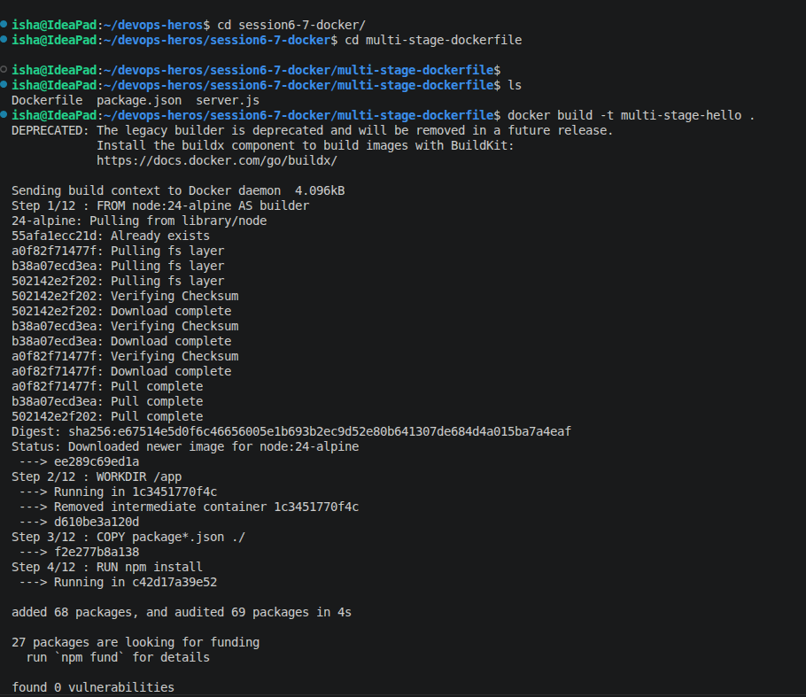
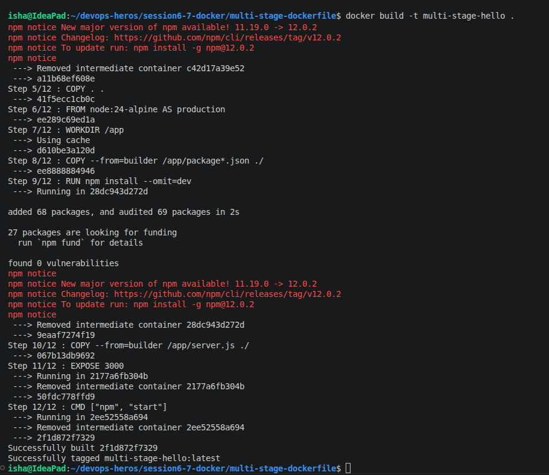
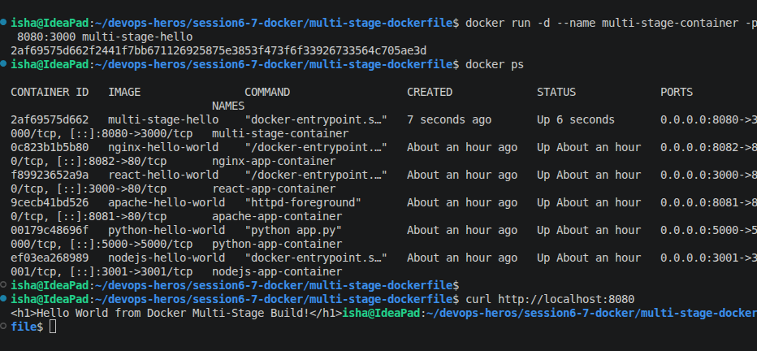
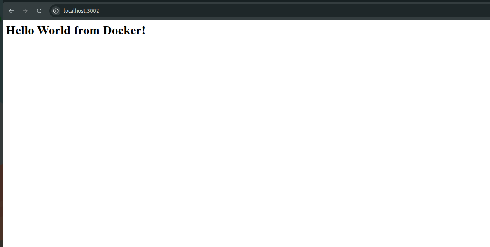
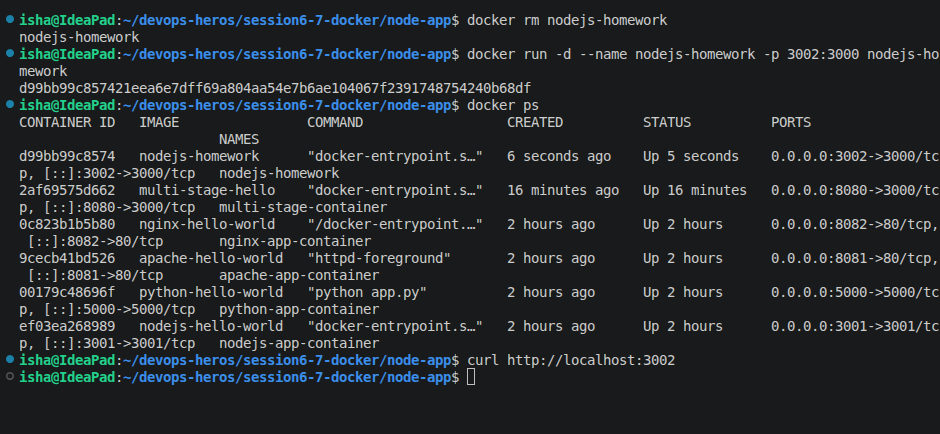
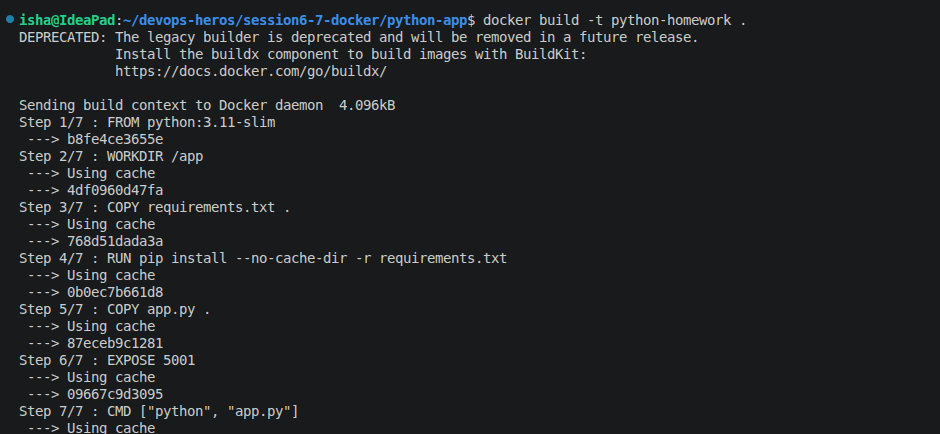
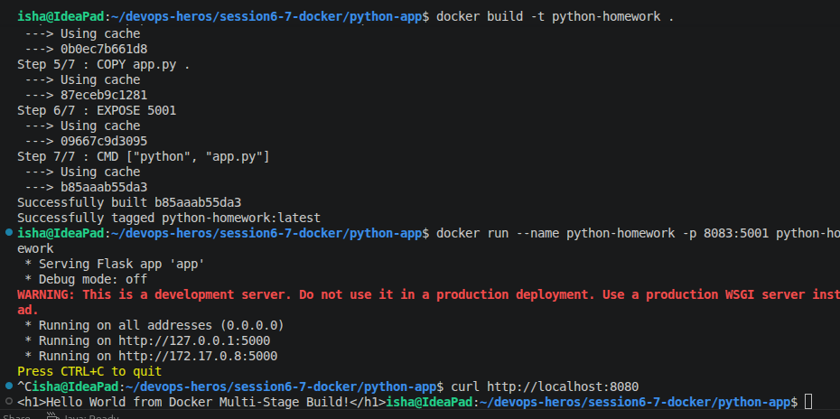
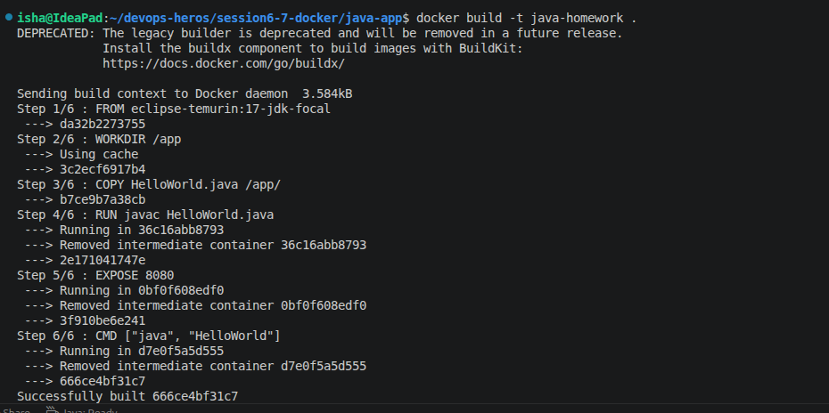
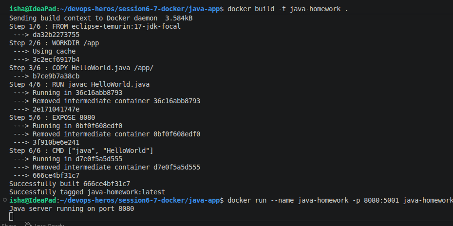

# Docker Multi-Stage Build Homework

**Name:** Isha Patel

**Enrollment Number:** 10455

---

# Task: Run Multi-Stage Dockerfile

## Repository

The multi-stage Dockerfile from:

`multi-stage-dockerfile/`

## Docker Image Build

The Docker image was built using:

```bash
docker build -t multi-stage-hello .









